# LLM 기반 C++ 코드 리뷰어

**온프레미스 LLM 코드 분석 플랫폼 - 발표 자료**

DGX-SPARK + Ollama + DeepSeek-Coder 33B

---

## 📋 발표 목차

1. [프로젝트 배경 및 동기](#1-프로젝트-배경-및-동기)
2. [시스템 아키텍처](#2-시스템-아키텍처)
3. [오케스트레이션](#3-오케스트레이션)
4. [프롬프팅 전략](#4-프롬프팅-전략)
5. [AST 기반 청킹](#5-ast-기반-청킹)
6. [실험 및 검증](#6-실험-및-검증)
7. [향후 계획](#7-향후-계획)

---

## 1. 프로젝트 배경 및 동기

이 프로젝트는 **"보안이 중요한 환경에서 어떻게 LLM 기반 코드 리뷰를 할 수 있을까?"**라는 질문에서 시작되었습니다.

---

### 1.1 문제 상황

**현실의 딜레마**: 최신 AI 도구들은 강력하지만, 보안이 중요한 환경에서는 사용이 제한됩니다.

| 도구 | 문제점 |
|------|--------|
| ChatGPT, Claude API | 코드가 외부 서버로 전송 → 보안 정책 위반 |
| GitHub Copilot | 클라우드 기반 → 내부 네트워크에서 사용 불가 |
| 정적 분석기 (clang-tidy) | 규칙 기반만 가능 → 컨텍스트 이해 부족 |

**핵심 과제**: 외부 API 없이, 내부 네트워크에서만 LLM 기반 코드 분석을 수행해야 함

---

### 1.2 해결 방안: 온프레미스 LLM

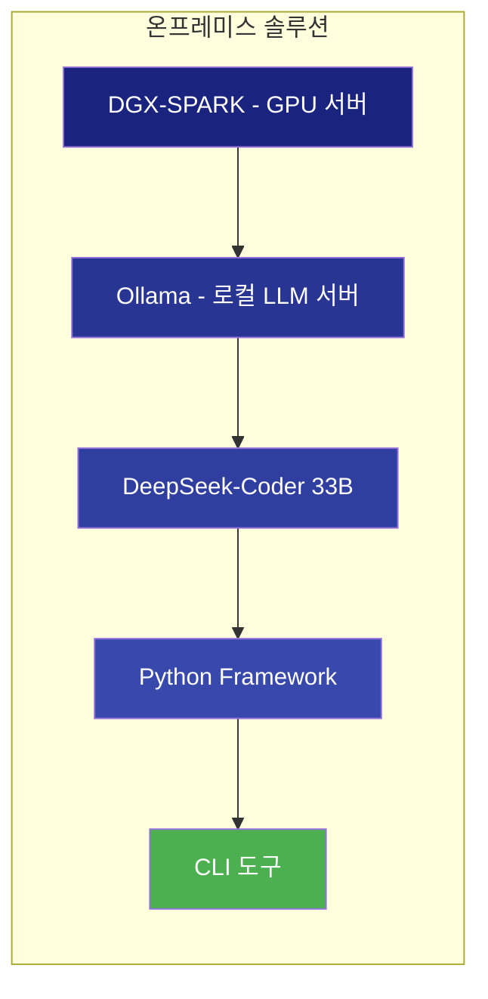

위 다이어그램은 **온프레미스 솔루션 스택**을 보여줍니다:
- **DGX-SPARK**: NVIDIA GPU 서버 (128GB RAM, 24GB VRAM)
- **Ollama**: 로컬 LLM 서빙 (`localhost:11434`)
- **DeepSeek-Coder 33B**: 코드 특화 오픈소스 모델 (~20GB)
- **Python Framework**: 프롬프팅 기법 + 실험 인프라

---

### 1.3 로컬 LLM의 현실적 한계

> **⚠️ 핵심 문제**: 로컬 LLM은 **인풋이 조금만 길어져도 출력 퀄리티가 급격히 저하**됩니다.
> 이것이 이 프로젝트에서 청킹과 파이프라인 설계가 중요한 이유입니다.

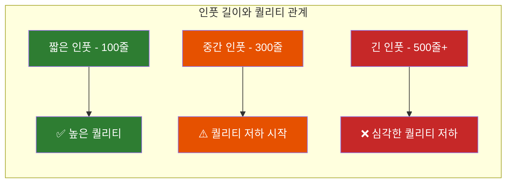

위 다이어그램은 **인풋 길이에 따른 퀄리티 변화**를 보여줍니다. 300줄을 넘어가면 퀄리티가 급격히 떨어집니다.

---

#### 퀄리티 저하 실제 예시

**✅ 짧은 인풋 (50줄) - 정확한 분석**

```cpp
// 입력 코드
void process(int* data) {
    *data = 42;  // line 3: null check 없음
}
```

```json
// LLM 출력 (정확함)
{
  "issues": [{
    "line": 3,
    "category": "memory-safety",
    "description": "Null pointer dereference: 'data' is dereferenced without null check"
  }]
}
```

**❌ 긴 인풋 (500줄+) - 퀄리티 저하**

```cpp
// 입력: 500줄짜리 파일
// ... 앞부분 300줄 ...
void process(int* data) {
    *data = 42;  // line 312: 동일한 버그
}
// ... 뒷부분 200줄 ...
```

```json
// LLM 출력 (문제 있음)
{
  "issues": [
    {
      "line": 287,           // ❌ 잘못된 라인 번호
      "category": "memory-safety",
      "description": "Potential null pointer"  // ⚠️ 설명 불충분
    },
    {
      "line": 450,
      "category": "performance",
      "description": "Consider using std::vector"  // ❌ 할루시네이션 (존재하지 않는 이슈)
    }
    // ❌ line 312의 실제 버그는 놓침
  ]
}
```

**퀄리티 저하 패턴 요약**:

| 증상 | 짧은 인풋 | 긴 인풋 |
|------|----------|---------|
| **라인 번호** | 정확 | 틀리거나 근처 라인 |
| **버그 탐지** | 대부분 찾음 | 핵심 버그 놓침 |
| **할루시네이션** | 거의 없음 | 존재하지 않는 이슈 보고 |
| **설명 품질** | 구체적 | 모호하고 짧음 |
| **JSON 형식** | 정상 | 가끔 파싱 실패 |

---

| 한계 | 영향 | 극복 전략 |
|------|------|----------|
| **긴 인풋 = 낮은 퀄리티** | 핵심 버그 놓침, 할루시네이션 | **AST 청킹 + 작은 단위 분석** |
| **분산 분석의 한계** | chunk 경계 이슈 놓침 | **Aggregator LLM으로 종합** |
| **느린 응답 속도** | 파일당 8-30초 | 병렬 처리 |
| **불안정한 출력** | JSON 파싱 실패 | 재시도 + 검증 로직 |

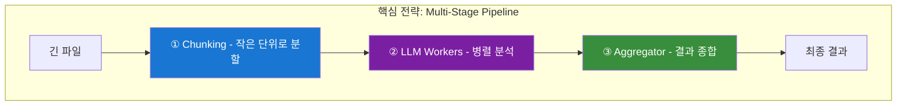

위 다이어그램은 **Multi-Stage Pipeline 전략**을 보여줍니다:
1. **Chunking**: 긴 파일을 작은 단위로 분할
2. **LLM Workers**: 각 chunk를 병렬로 분석
3. **Aggregator**: 분산된 결과를 종합하여 최종 결과 생성

---

## 2. 시스템 아키텍처

### 2.1 3-Tier 아키텍처 개요

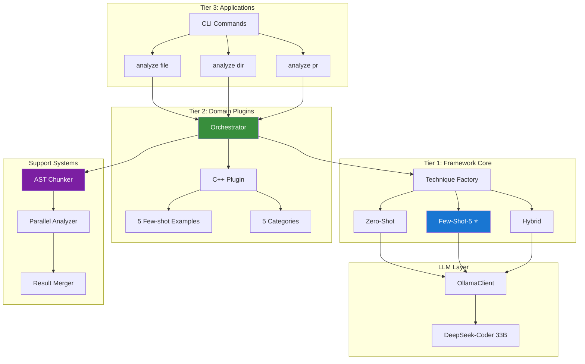

위 다이어그램은 **3-Tier 아키텍처**를 보여줍니다:
- **Tier 3 (Applications)**: 사용자 인터페이스 (CLI)
- **Tier 2 (Domain Plugins)**: 언어별 지식 + **Orchestrator**
- **Tier 1 (Framework Core)**: 프롬프팅 전략
- **Support Systems**: 대용량 파일 처리 (청킹, 병렬, 병합)

**핵심 포인트**: Orchestrator가 모든 흐름을 제어하며, 파일 크기에 따라 직접 분석 vs 청킹 분석을 결정합니다.

---

### 2.2 기술 스택

| 계층 | 역할 | 기술 |
|------|------|------|
| 하드웨어 | GPU 연산 | DGX-SPARK (24GB VRAM) |
| LLM 서빙 | 모델 실행 | Ollama + DeepSeek-Coder 33B |
| 프레임워크 | 프롬프팅 | Python 3.12 + Pydantic |
| AST 파싱 | 청킹 | tree-sitter-cpp |
| 병렬 처리 | 속도 향상 | ThreadPoolExecutor |

---

## 3. 오케스트레이션

**Orchestrator**는 시스템의 **심장부**입니다. 로컬 LLM의 한계를 극복하기 위한 **Multi-Stage Pipeline**을 관리합니다.

---

### 3.1 이상적인 파이프라인 설계

로컬 LLM의 "긴 인풋 = 낮은 퀄리티" 문제를 해결하기 위해 **3단계 파이프라인**이 필요합니다.

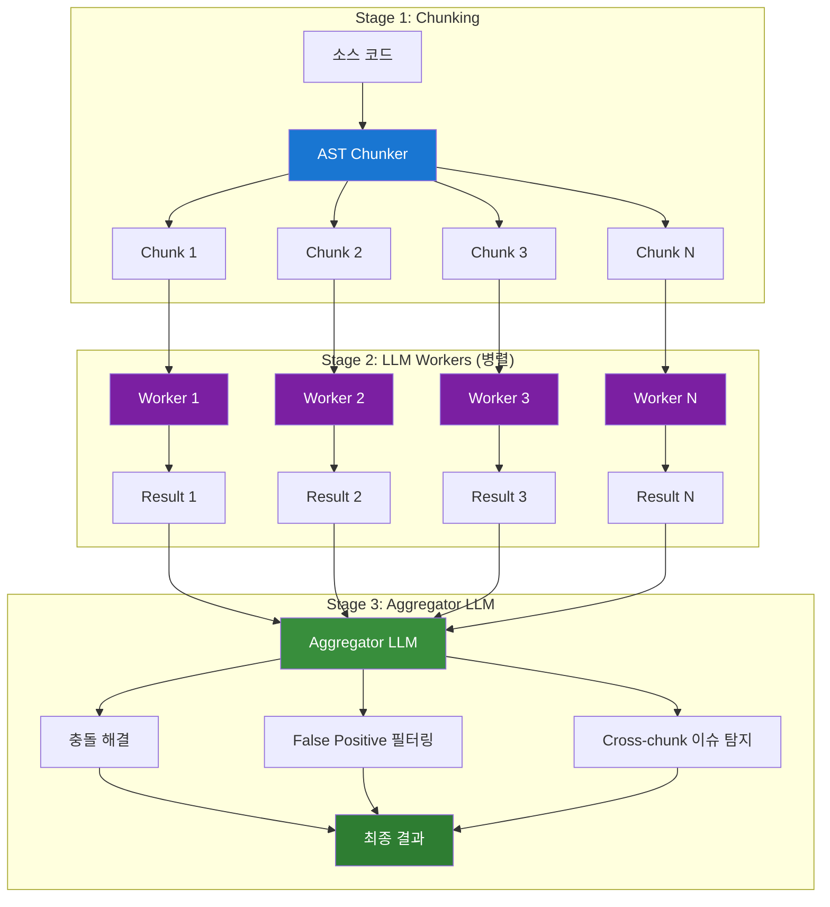

위 다이어그램은 **이상적인 3단계 파이프라인**을 보여줍니다:
1. **Stage 1 (Chunking)**: 긴 파일을 작은 단위로 분할
2. **Stage 2 (LLM Workers)**: 각 chunk를 병렬로 분석 → 짧은 인풋으로 높은 퀄리티 유지
3. **Stage 3 (Aggregator LLM)**: 분산된 결과를 **LLM이 종합**하여 최종 결과 생성

**Aggregator LLM의 역할**:

- **충돌 해결**: Worker들이 같은 이슈를 다르게 판단한 경우 결정
- **False Positive 필터링**: 전체 컨텍스트에서 볼 때 오탐인 이슈 제거
- **Cross-chunk 이슈 탐지**: chunk 경계에서 놓친 이슈 발견

---

### 3.2 현재 구현 vs 향후 설계

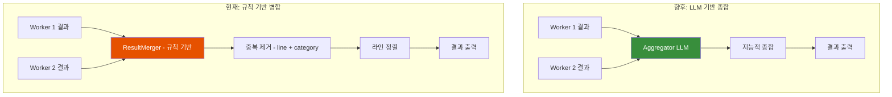

| 구분 | 현재 (규칙 기반) | 향후 (LLM 기반) |
|------|-----------------|----------------|
| **병합 방식** | line + category로 중복 제거 | LLM이 지능적으로 종합 |
| **충돌 해결** | 더 긴 reasoning 선택 | LLM이 맥락 고려하여 결정 |
| **Cross-chunk 이슈** | ❌ 탐지 불가 | ✅ Aggregator가 탐지 |
| **False Positive** | ❌ 필터링 없음 | ✅ 전체 컨텍스트에서 필터링 |
| **속도** | 빠름 (규칙) | 느림 (LLM 1회 추가 호출) |

---

#### Aggregator LLM이란?

**Aggregator LLM**은 여러 Worker의 분석 결과를 **하나의 LLM이 종합**하는 방식입니다.

**왜 필요한가?**
- 각 Worker는 **자기 chunk만** 봅니다 (전체 파일을 모름)
- 규칙 기반 병합은 "같은 라인, 같은 카테고리면 중복"이라는 **단순 규칙**만 적용
- **맥락을 이해하는 판단**이 불가능

**구현 방식** (향후):
```
[Aggregator 프롬프트 예시]

당신은 코드 리뷰 결과를 종합하는 전문가입니다.
아래는 같은 파일의 서로 다른 부분을 분석한 결과입니다.

## Worker 1 결과 (lines 1-100):
- Line 45: memory-safety - "malloc without free"

## Worker 2 결과 (lines 80-180):
- Line 120: memory-safety - "free without null check"
- Line 95: performance - "unnecessary copy"

## Worker 3 결과 (lines 160-260):
- Line 180: memory-safety - "double free possible"

다음을 수행하세요:
1. 중복된 이슈가 있으면 하나로 통합
2. chunk 경계에서 놓친 이슈가 있는지 확인 (예: Worker 1의 malloc이 Worker 2에서 free되는가?)
3. 전체 맥락에서 오탐(False Positive)인 이슈 제거
4. 최종 이슈 목록 출력
```

---

#### Cross-chunk 이슈란?

**Cross-chunk 이슈**는 코드가 **여러 chunk에 걸쳐** 있어서 개별 Worker가 탐지하지 못하는 버그입니다.

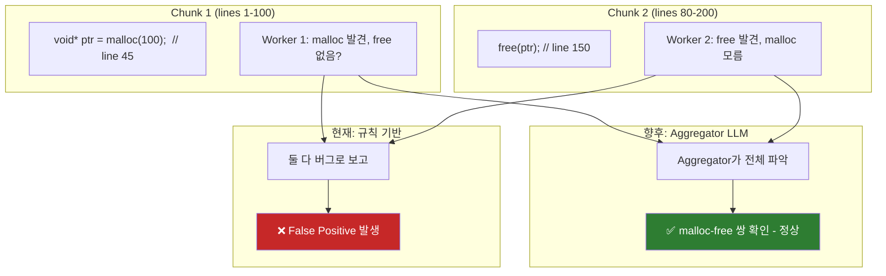

**구체적 예시**:
| 상황 | 현재 (규칙) | 향후 (Aggregator) |
|------|------------|------------------|
| Chunk 1에서 `malloc`, Chunk 2에서 `free` | 각각 "leak", "dangling" 보고 (오탐) | 쌍으로 인식 → 정상 판정 |
| Chunk 1에서 `lock`, Chunk 2에서 `unlock` 없음 | Chunk 1만 보고 "lock ok" | 전체 보고 "deadlock 가능성" 탐지 |
| 같은 이슈를 Worker 1, 2가 다르게 설명 | 둘 다 보고 (중복) | 하나로 통합, 더 나은 설명 선택 |

---

### 3.3 현재 구현 상태

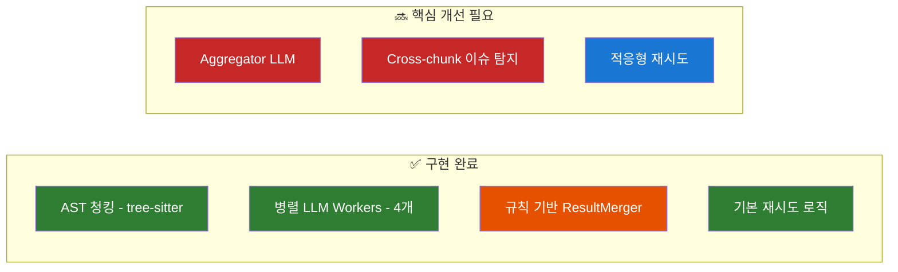

**현재 한계**:
- ResultMerger가 **규칙 기반**이라 지능적 판단 불가
- Chunk 경계에서 발생하는 이슈를 **놓칠 수 있음**
- 전체 파일 맥락에서 False Positive를 **걸러내지 못함**

---

### 3.4 향후 개선: 스마트 오케스트레이션

> **"적응형(Adaptive)"이란?**
> 현재는 모든 상황에 **동일한 방식**을 적용합니다. 적응형은 **상황에 따라 다른 전략**을 자동 선택하는 것입니다.

#### 3.4.1 적응형 기법 선택

현재는 모든 파일에 동일한 기법(Few-shot-5)을 사용합니다. 향후에는 **파일 특성에 따라 기법을 자동 선택**할 수 있습니다.

**왜 적응형이 필요한가?**
- **Few-shot-5**: memory-safety에 강하지만 modern-cpp는 못 잡음 (F1=0.000)
- **Chain-of-Thought**: modern-cpp에 강함 (F1=0.727) 하지만 느림
- **Zero-shot**: 빠르지만 정확도 낮음

→ 코드 특성을 보고 **최적의 기법을 자동 선택**하면 정확도와 속도 모두 개선

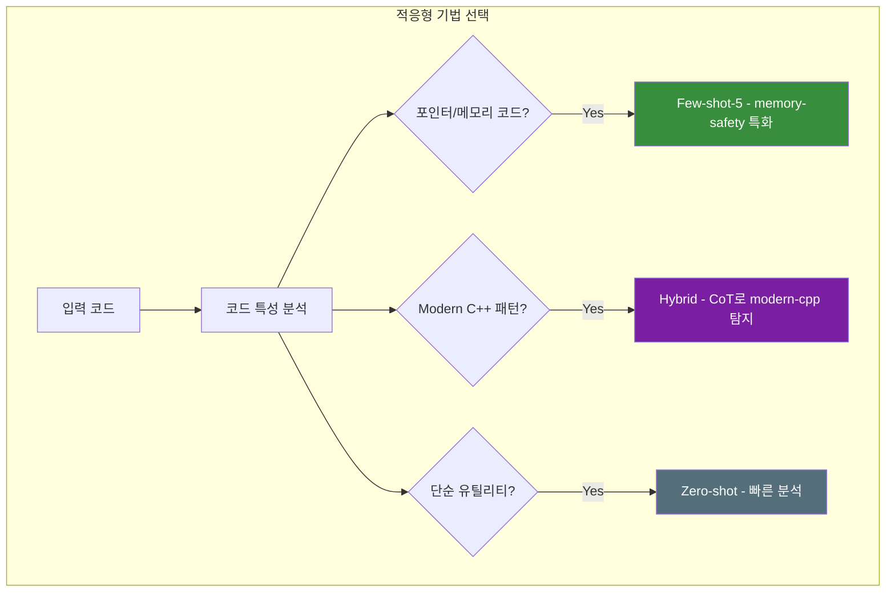

위 다이어그램은 **적응형 기법 선택 전략**을 보여줍니다:
- 메모리 관련 코드 → Few-shot-5 (memory-safety 예시 포함)
- Modern C++ 패턴 → Hybrid (CoT로 상세 분석)
- 단순 코드 → Zero-shot (빠른 처리)

#### 3.4.2 적응형 재시도 전략

로컬 LLM은 출력이 **불안정**할 수 있습니다. 강건한 에러 처리가 필수입니다.

**현재 문제**: 실패하면 **같은 방식으로 재시도** → 같은 에러 반복
**적응형 해결**: 에러 **유형을 분석**하고 **다른 전략**으로 재시도

| 에러 유형 | 현재 대응 | 적응형 대응 |
|----------|----------|------------|
| JSON 파싱 실패 | 같은 프롬프트 재시도 | "반드시 JSON 형식으로 출력하세요" 강조 |
| 타임아웃 | 같은 크기로 재시도 | 청크 크기를 200→100줄로 축소 |
| 할루시네이션 | 같은 설정 재시도 | temperature 0.7→0.3으로 낮춤 |

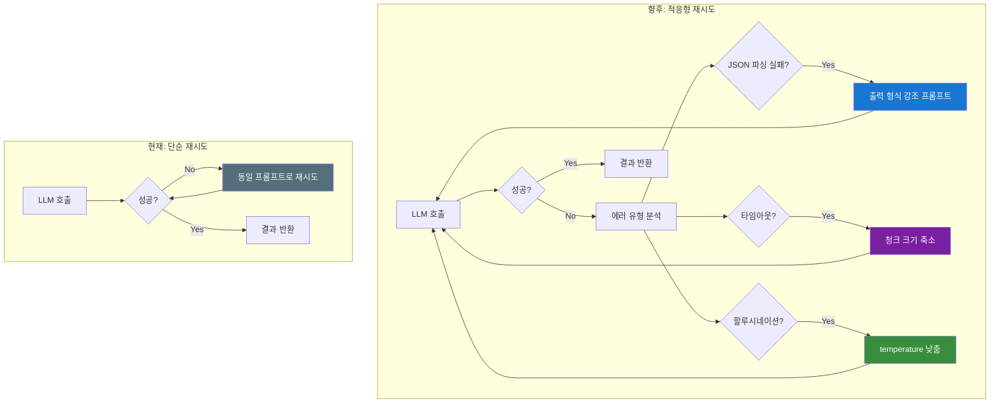

위 다이어그램은 **에러 복구 전략의 현재와 향후**를 비교합니다:
- **현재**: 단순 재시도 (동일 프롬프트)
- **향후**: 에러 유형별 적응형 대응
  - JSON 파싱 실패 → 출력 형식 강조
  - 타임아웃 → 청크 크기 축소
  - 할루시네이션 → temperature 조정

#### 3.4.3 결과 캐싱

동일 파일을 반복 분석할 때 **캐싱**으로 속도를 크게 개선할 수 있습니다.

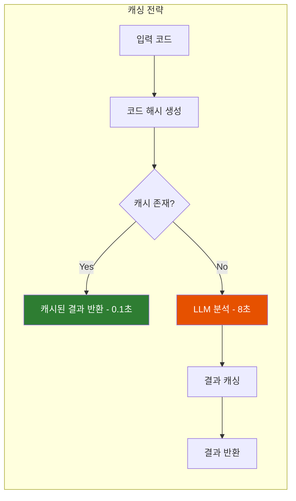

---

## 4. 프롬프팅 전략

LLM의 성능은 **어떻게 질문하느냐**에 크게 좌우됩니다. 5가지 프롬프팅 기법을 실험하여 최적 전략을 찾았습니다.

---

### 4.1 기법별 성능 비교

| 기법 | F1 Score | Latency | 특징 |
|------|----------|---------|------|
| **Zero-shot** | 0.526 | 7.15s | 예시 없이 직접 질문 |
| **Few-shot-3** | 0.588 | 7.12s | 3개 예시 제공 |
| **Few-shot-5** | 0.615 | 8.15s | **프로덕션 권장** ⭐ |
| **Chain-of-Thought** | 0.571 | 23.94s | 단계별 추론 요청 |
| **Hybrid** | 0.634 | 32.76s | **최고 정확도** |

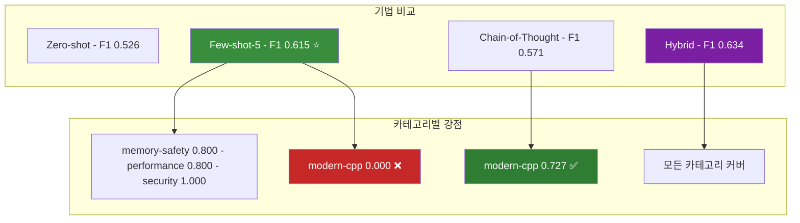

위 다이어그램은 **각 기법의 강점과 약점**을 보여줍니다:
- **Few-shot-5**: 대부분 카테고리에서 우수하나 modern-cpp 탐지 실패
- **Chain-of-Thought**: modern-cpp에서 압도적 (0.727 vs 0.000)
- **Hybrid**: 두 기법 결합으로 모든 카테고리 커버

---

### 4.2 Hybrid 기법 상세

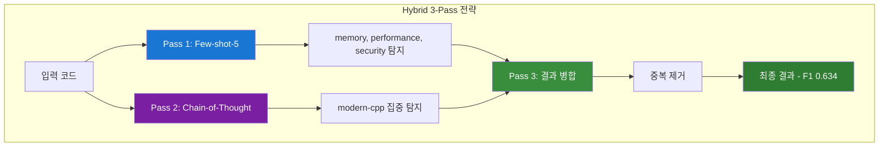

**트레이드오프**: 4배 느리지만 최고 정확도 → 중요한 PR에만 사용 권장

---

### 4.3 향후 개선: 프롬프팅 최적화

#### 4.3.1 Dynamic Few-shot (RAG 기반)

현재는 **고정된 5개 예시**를 사용합니다. 향후에는 입력 코드와 **가장 유사한 예시**를 동적으로 선택할 수 있습니다.

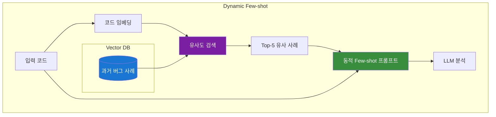

**예상 효과**: 입력 코드와 관련 있는 예시로 정확도 +10-15% 향상

#### 4.3.2 Self-Critique (자기 비평)

LLM이 자신의 결과를 **비평**하여 False Positive를 줄입니다.

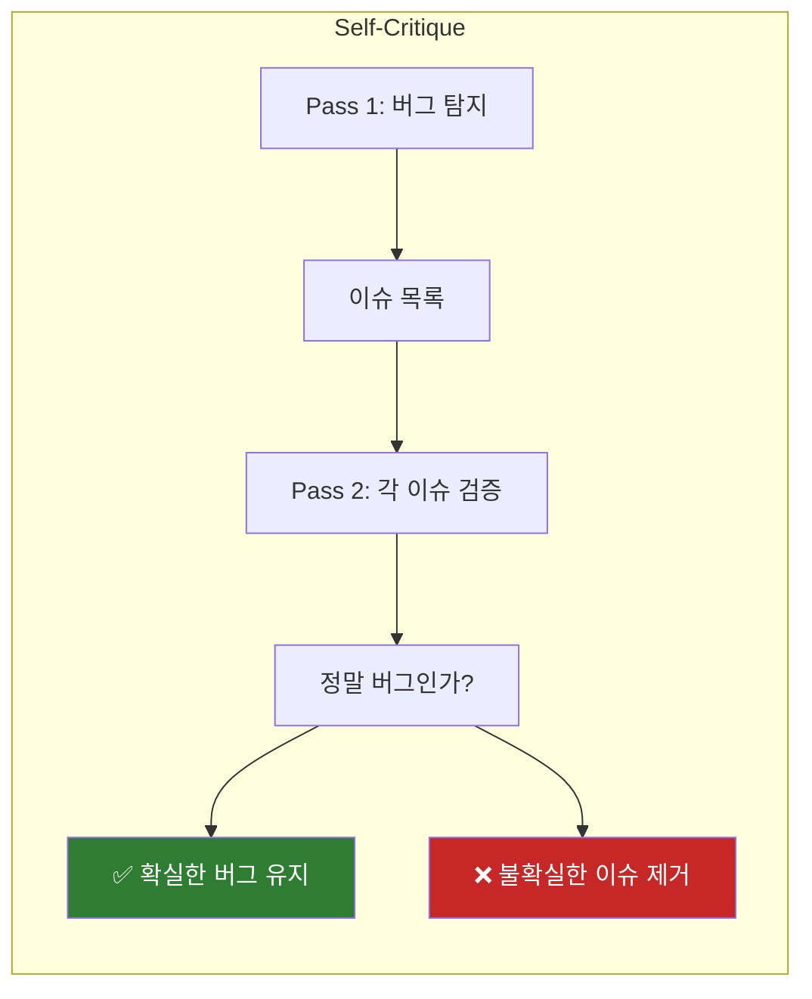

---

## 5. AST 기반 청킹

로컬 LLM은 **컨텍스트 길이가 제한**됩니다 (DeepSeek: ~4096 토큰). 700줄 C++ 파일은 약 5000 토큰으로 한계를 초과합니다.

---

### 5.1 문제와 해결 접근법

| 방법 | 장점 | 단점 |
|------|------|------|
| **단순 줄 분할** | 구현 쉬움 | 함수 중간에 잘림, 문맥 손실 |
| **AST 청킹** (현재) | 의미 단위 보존 | tree-sitter 필요 |
| **Semantic 청킹** (향후) | 완전한 문맥 | clangd 필요, 느림 |

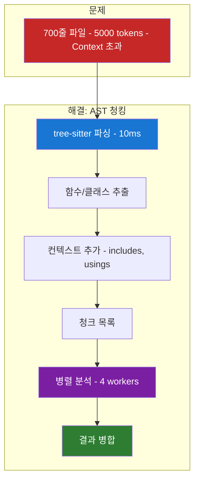

위 다이어그램은 **AST 청킹 프로세스**를 보여줍니다:
1. **tree-sitter 파싱**: 10ms로 매우 빠름
2. **함수/클래스 추출**: 의미 단위로 분할
3. **컨텍스트 추가**: 모든 청크에 includes, usings 포함
4. **병렬 분석**: 4개 워커로 동시 처리
5. **결과 병합**: 중복 제거 + 라인 번호 조정

---

### 5.2 현재 구현: tree-sitter 기반

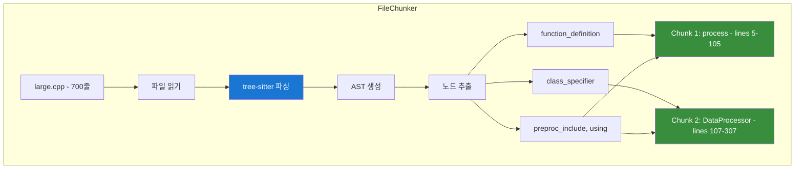

**성능**:
- 파싱 속도: **10ms** (clangd는 1-2초)
- 의존성: 없음 (compile_commands.json 불필요)
- 정확도: Syntax 레벨 (Semantic 정보 없음)

---

### 5.3 병렬 분석 및 결과 병합

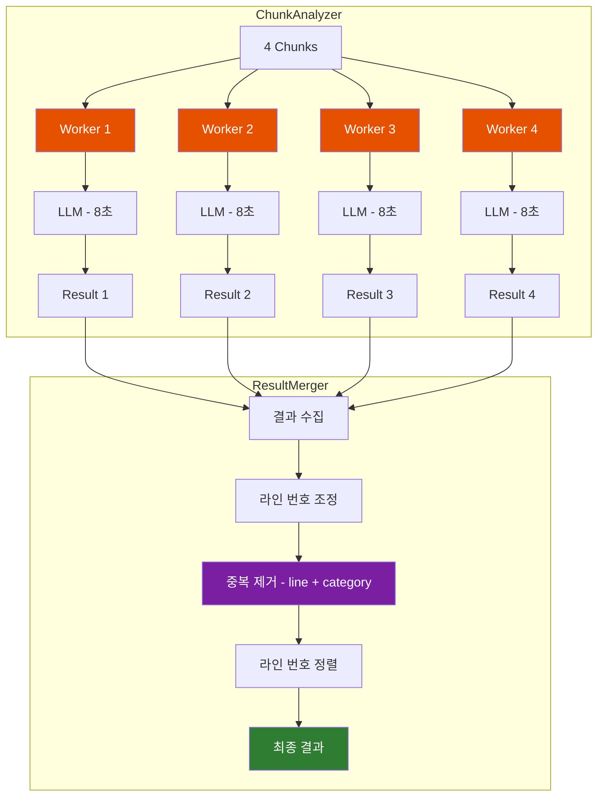

**성능 향상**:
- 순차 처리: 4 chunks × 8초 = **32초**
- 병렬 처리 (4 workers): **~10초** (3.2배 빠름)

---

### 5.4 향후 개선: Semantic 청킹

현재 tree-sitter는 **Syntax만** 파싱합니다. 향후 **clangd**를 활용하면 더 스마트한 청킹이 가능합니다.

#### 5.4.1 tree-sitter vs clangd 비교

| 특성 | tree-sitter (현재) | clangd (향후) |
|------|-------------------|---------------|
| **속도** | 10ms ⭐ | 1-2초 |
| **의존성** | 없음 ⭐ | compile_commands.json 필요 |
| **정보 수준** | Syntax only | Full Semantic |
| **타입 정보** | ❌ | ✅ |
| **함수 호출 관계** | ❌ | ✅ |
| **Include 해석** | ❌ | ✅ |

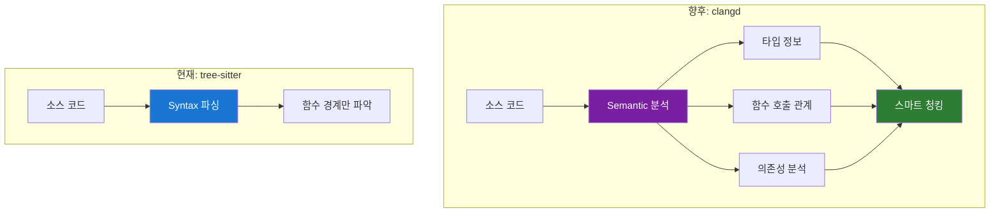

위 다이어그램은 **tree-sitter와 clangd의 차이**를 보여줍니다:
- **tree-sitter**: 빠르지만 Syntax 정보만
- **clangd**: 느리지만 타입, 호출 관계, 의존성까지 파악

#### 5.4.2 clangd 활용 시나리오

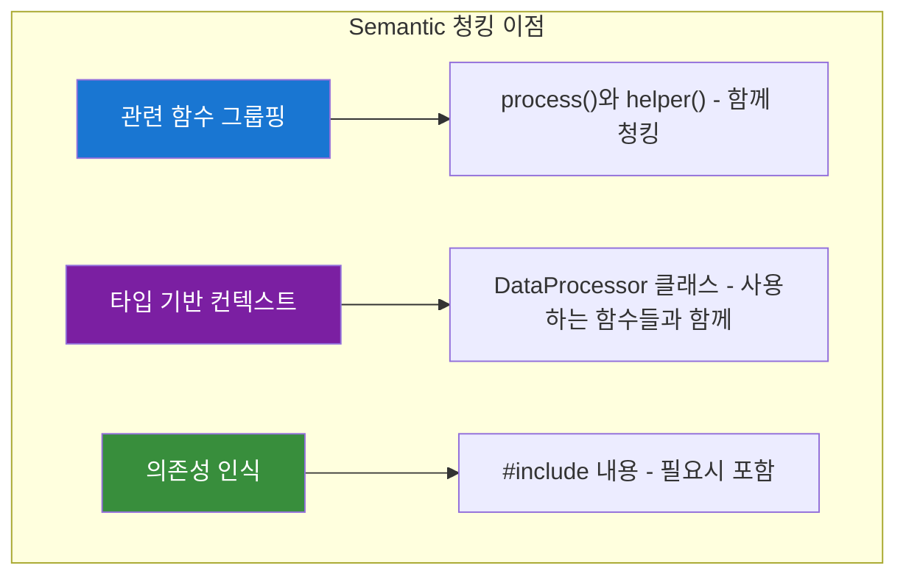

**예상 효과**:
- 관련 코드가 함께 분석되어 **컨텍스트 손실 감소**
- False Negative **20-30% 감소** 예상
- 단, **빌드 환경 필요** (compile_commands.json)

#### 5.4.3 하이브리드 접근법 (제안)

```mermaid
graph TB
    subgraph "하이브리드 청킹 전략"
        Input[소스 코드] --> Check{빌드 환경 있음?}

        Check -->|Yes| Clangd[clangd Semantic 분석]
        Check -->|No| TreeSitter[tree-sitter Syntax 분석]

        Clangd --> Smart[스마트 청킹 - 관련 함수 그룹]
        TreeSitter --> Basic[기본 청킹 - 함수 단위]

        Smart --> Analyze[분석]
        Basic --> Analyze
    end

    style Clangd fill:#7b1fa2,color:#fff
    style TreeSitter fill:#1976d2,color:#fff
    style Smart fill:#2e7d32,color:#fff
```

**제안**: 빌드 환경이 있으면 clangd, 없으면 tree-sitter로 **폴백**

---

### 5.5 향후 개선: 청킹 최적화

#### 5.5.1 적응형 청크 크기

```mermaid
graph LR
    subgraph "적응형 청크 크기"
        Code[코드 복잡도 분석] --> Simple{단순 코드?}
        Simple -->|Yes| Large[큰 청크 - 300줄]
        Simple -->|No| Small[작은 청크 - 100줄]
    end

    style Large fill:#388e3c,color:#fff
    style Small fill:#e65100,color:#fff
```

- **단순 코드**: 큰 청크로 오버헤드 감소
- **복잡한 코드**: 작은 청크로 정확도 향상

#### 5.5.2 컨텍스트 윈도우 최적화

```mermaid
graph TB
    subgraph "컨텍스트 윈도우"
        Func[분석 대상 함수]

        Func --> Before[이전 함수 시그니처]
        Func --> After[다음 함수 시그니처]
        Func --> Deps[호출하는 함수 시그니처]

        Before --> Context[확장된 컨텍스트]
        After --> Context
        Deps --> Context

        Context --> Better[더 정확한 분석]
    end

    style Func fill:#1976d2,color:#fff
    style Context fill:#7b1fa2,color:#fff
    style Better fill:#2e7d32,color:#fff
```

**아이디어**: 분석 대상 함수뿐 아니라 **관련 함수 시그니처**도 컨텍스트에 포함

---

## 6. 실험 및 검증

모든 기법은 **Ground Truth 데이터셋**으로 객관적으로 평가했습니다.

---

### 6.1 실험 인프라

```mermaid
graph TB
    subgraph "Ground Truth"
        GT[20개 C++ 예제]
        GT --> Cat1[memory-safety - 5개]
        GT --> Cat2[modern-cpp - 4개]
        GT --> Cat3[performance - 3개]
        GT --> Cat4[security - 2개]
        GT --> Cat5[concurrency - 2개]
        GT --> Cat6[clean code - 3개]
    end

    subgraph "실험 시스템"
        Config[YAML Config] --> Runner[ExperimentRunner]
        Runner --> Analyze[20개 예제 분석]
        Analyze --> Compare[Expected vs Detected]
        Compare --> Metrics[MetricsCalculator]
    end

    subgraph "평가 지표"
        Metrics --> P[Precision - FP 최소화]
        Metrics --> R[Recall - FN 최소화]
        Metrics --> F1[F1 Score - 조화평균]
    end

    style GT fill:#1976d2,color:#fff
    style Runner fill:#7b1fa2,color:#fff
    style F1 fill:#2e7d32,color:#fff
```

---

### 6.2 기법별 실험 결과

| 기법 | Precision | Recall | F1 Score | Latency |
|------|-----------|--------|----------|---------|
| Zero-shot | 0.625 | 0.455 | 0.526 | 7.15s |
| Few-shot-3 | 0.625 | 0.556 | 0.588 | 7.12s |
| **Few-shot-5** | **0.667** | **0.571** | **0.615** | 8.15s |
| Chain-of-Thought | 0.571 | 0.571 | 0.571 | 23.94s |
| **Hybrid** | **0.684** | **0.591** | **0.634** | 32.76s |

```mermaid
graph LR
    subgraph "F1 Score 진화"
        ZS[Zero-shot - 0.526] --> FS3[Few-shot-3 - 0.588]
        FS3 --> FS5[Few-shot-5 - 0.615]
        FS5 --> HY[Hybrid - 0.634]
    end

    ZS --> Imp1[+12%]
    FS3 --> Imp2[+5%]
    FS5 --> Imp3[+3%]

    style ZS fill:#546e7a,color:#fff
    style FS5 fill:#388e3c,color:#fff
    style HY fill:#7b1fa2,color:#fff
```

---

### 6.3 카테고리별 분석

| 카테고리 | Few-shot-5 | Chain-of-Thought | 비고 |
|----------|------------|------------------|------|
| memory-safety | 0.800 | 0.833 | 둘 다 우수 |
| performance | 0.800 | 0.500 | Few-shot 우위 |
| security | 1.000 | 0.667 | Few-shot 우위 |
| concurrency | 0.571 | 0.400 | Few-shot 우위 |
| **modern-cpp** | **0.000** | **0.727** | CoT 압도적 |

**핵심 발견**: modern-cpp 카테고리는 **단계별 추론(CoT)**이 필수

---

## 7. 향후 계획

이 프로젝트는 **아직 완료되지 않았습니다**. 향후 다양한 개선이 가능합니다.

---

### 7.1 전체 로드맵

```mermaid
graph TB
    subgraph "✅ 완료 - Phase 0-5"
        Done[현재]
        Done --> D1[5가지 프롬프팅 기법]
        Done --> D2[AST 청킹 - tree-sitter]
        Done --> D3[CLI 도구]
        Done --> D4[C++ Plugin]
        Done --> D5[규칙 기반 ResultMerger]
    end

    subgraph "🔥 최우선 - Phase 6"
        P6[Aggregator LLM 구현]
        P6 --> P6_1[Cross-chunk 이슈 탐지]
        P6 --> P6_2[False Positive 필터링]
        P6 --> P6_3[충돌 해결]
    end

    subgraph "🔜 단기 - Phase 7-8"
        P7[Ground Truth 확장 - 20→100개]
        P8[Self-Critique 기법]
    end

    subgraph "📋 중기 - Phase 9-10"
        P9[RAG 기반 Dynamic Few-shot]
        P10[Semantic 청킹 - clangd]
    end

    subgraph "🔮 장기 - Phase 11+"
        P11[새 언어 플러그인 - Python, RTL]
        P12[CI/CD 통합]
        P13[모델 Fine-tuning]
    end

    Done --> P6 --> P7 --> P8 --> P9 --> P10 --> P11 --> P12 --> P13

    style Done fill:#2e7d32,color:#fff
    style P6 fill:#c62828,color:#fff
    style P6_1 fill:#c62828,color:#fff
    style P6_2 fill:#c62828,color:#fff
    style P6_3 fill:#c62828,color:#fff
    style P7 fill:#1976d2,color:#fff
    style P8 fill:#1976d2,color:#fff
    style P9 fill:#7b1fa2,color:#fff
    style P10 fill:#7b1fa2,color:#fff
    style P11 fill:#546e7a,color:#fff
    style P12 fill:#546e7a,color:#fff
    style P13 fill:#546e7a,color:#fff
```

**최우선 과제: Aggregator LLM**

현재 가장 큰 한계는 **규칙 기반 ResultMerger**입니다. Aggregator LLM을 구현하면:
- **Cross-chunk 이슈**: chunk 경계에서 놓친 버그 탐지
- **False Positive 필터링**: 전체 파일 맥락에서 오탐 제거
- **충돌 해결**: Worker들의 상충되는 판단을 지능적으로 결정

---

### 7.2 오케스트레이션 개선

| 개선 항목 | 현재 | 향후 | 예상 효과 |
|----------|------|------|----------|
| **결과 병합** | 규칙 기반 ResultMerger | **Aggregator LLM** | **정확도 +25%** |
| Cross-chunk | 탐지 불가 | Aggregator가 탐지 | False Negative -30% |
| 기법 선택 | 고정 (Few-shot-5) | 적응형 | 정확도 +10% |
| 에러 처리 | 단순 재시도 | 적응형 재시도 | 안정성 +50% |
| 캐싱 | 없음 | 결과 캐싱 | 속도 10x (반복 분석) |

---

### 7.3 청킹 개선

| 개선 항목 | 현재 | 향후 | 예상 효과 |
|----------|------|------|----------|
| 파서 | tree-sitter (Syntax) | clangd (Semantic) | 컨텍스트 +30% |
| 청크 크기 | 고정 (200줄) | 적응형 | 효율성 +20% |
| 컨텍스트 | includes만 | 관련 함수 시그니처 | 정확도 +15% |
| 그룹핑 | 없음 | 호출 관계 기반 | False Negative -20% |

---

### 7.4 프롬프팅 개선

| 개선 항목 | 현재 | 향후 | 예상 효과 |
|----------|------|------|----------|
| Few-shot | 고정 5개 | Dynamic (RAG) | 정확도 +15% |
| 검증 | 없음 | Self-Critique | Precision +20% |
| 출력 | JSON only | 구조화된 추론 | 설명 품질 향상 |

---

### 7.5 핵심 문제 해결을 위한 추가 기술

> **핵심 문제**: 로컬 LLM은 **인풋이 조금만 길어져도 출력 퀄리티가 급격히 저하**됩니다.
>
> 현재 구현(AST 청킹 + 병렬 Workers + 규칙 병합)은 **기본 뼈대**입니다.
> 아래 기술들을 추가하면 이 문제를 더욱 효과적으로 극복할 수 있습니다.

---

#### 7.5.1 Hierarchical Summarization (계층적 요약)

**문제**: 각 Worker는 자기 chunk만 봄 → **전체 파일이 뭘 하는지 모름**

**해결**: 각 chunk를 먼저 **1-2줄로 요약** → 분석 시 다른 chunk 요약을 컨텍스트로 제공

```mermaid
graph TB
    subgraph "Phase 1: 요약 생성"
        C1[Chunk 1] --> S1["Summary: 메모리 할당"]
        C2[Chunk 2] --> S2["Summary: 데이터 처리"]
        C3[Chunk 3] --> S3["Summary: 메모리 해제"]
    end

    subgraph "Phase 2: 요약과 함께 분석"
        S1 --> Context[전체 요약 컨텍스트]
        S2 --> Context
        S3 --> Context
        Context --> W1[Worker 1]
        Context --> W2[Worker 2]
        Context --> W3[Worker 3]
        C1 --> W1
        C2 --> W2
        C3 --> W3
    end

    style Context fill:#388e3c,color:#fff
    style S1 fill:#1976d2,color:#fff
    style S2 fill:#1976d2,color:#fff
    style S3 fill:#1976d2,color:#fff
```

**Worker 프롬프트 예시**:
```
## 전체 파일 요약:
- Chunk 1: 메모리 할당 (malloc)
- Chunk 2: 데이터 처리
- Chunk 3: 메모리 해제 (free)  ← 이걸 알면 "leak 아니네" 판단 가능

## 분석 대상 (Chunk 1):
void* allocate() { return malloc(100); }
```

**효과**: Worker가 **전체 맥락을 알고** 분석 → Cross-chunk False Positive 50% 감소

---

#### 7.5.2 Sliding Window with Overlap (겹침 청킹)

**문제**: chunk 경계에서 이슈 놓침 (malloc이 Chunk 1, free가 Chunk 2에 있는 경우)

**해결**: chunk를 **겹치게** 분할 → 경계 이슈를 최소 한 Worker가 봄

```
현재:   [Chunk 1: 1-100] [Chunk 2: 101-200] [Chunk 3: 201-300]
                    ↑ 경계에서 이슈 놓침

개선:   [Chunk 1: 1-120] [Chunk 2: 80-220] [Chunk 3: 180-300]
                    ↑ 20줄씩 겹침 → 경계 이슈 잡힘
```

```mermaid
graph LR
    subgraph "현재: 경계 분리"
        A1[1-100] --> A2[101-200]
        A2 --> A3[201-300]
    end

    subgraph "개선: 겹침 청킹"
        B1[1-120] --> B2[80-220]
        B2 --> B3[180-300]
    end

    style A2 fill:#c62828,color:#fff
    style B2 fill:#388e3c,color:#fff
```

**효과**: 경계 이슈 **80% 탐지** 가능
**비용**: 분석량 20-30% 증가 (trade-off)

---

#### 7.5.3 Two-Phase Analysis (2단계 분석)

**문제**: 모든 코드를 정밀 분석 → 느리고 토큰 낭비

**해결**: **1단계에서 의심 영역만 찾고**, 2단계에서 정밀 분석

```mermaid
graph LR
    subgraph "Phase 1: Quick Scan"
        Code[전체 코드] --> Quick[Zero-shot - 빠른 스캔]
        Quick --> Areas["의심 영역: lines 45-60, 120-140"]
    end

    subgraph "Phase 2: Deep Analysis"
        Areas --> Deep[Few-shot + CoT - 정밀 분석]
        Deep --> Result[최종 결과]
    end

    style Quick fill:#1976d2,color:#fff
    style Deep fill:#c62828,color:#fff
```

**효과**: 토큰 사용량 **50-70% 감소**, 속도 향상
**적용**: 대용량 파일(500줄+)에서 특히 유용

---

#### 7.5.4 Static + LLM Hybrid (정적 분석 + LLM 결합)

**문제**: LLM만으로 모든 버그 탐지 → 느리고 때로는 부정확

**해결**: **확실한 버그는 정적 분석기**로, **맥락 필요한 버그는 LLM**으로

```mermaid
graph TB
    subgraph "Static Analysis (빠름, 확실)"
        Code[코드] --> Static[clang-tidy]
        Static --> S1[null deref]
        Static --> S2[buffer overflow]
        Static --> S3[unused variable]
    end

    subgraph "LLM Analysis (맥락 이해)"
        Code --> LLM[LLM 분석]
        LLM --> L1[logic error]
        LLM --> L2[design issue]
        LLM --> L3[security flaw]
    end

    subgraph "결과 통합"
        S1 --> Merge[통합 + 중복 제거]
        S2 --> Merge
        S3 --> Merge
        L1 --> Merge
        L2 --> Merge
        L3 --> Merge
        Merge --> Final[최종 결과]
    end

    style Static fill:#2e7d32,color:#fff
    style LLM fill:#7b1fa2,color:#fff
    style Merge fill:#1976d2,color:#fff
```

| 분석기 | 담당 | 장점 |
|--------|------|------|
| **clang-tidy** | null deref, modernize, bugprone | Clang AST 기반, 정확도 높음 |
| **LLM** | 로직 오류, 설계 문제, 보안 | 맥락 이해, 복잡한 패턴 |

> **왜 clang-tidy?** CMake 프로젝트는 `compile_commands.json`이 있어서 clang-tidy가 **Full Semantic 분석** 가능

**효과**: 정확도 **20%↑**, 속도 **30%↑** (LLM 부하 감소)

---

#### 7.5.5 Function Signature Context (함수 시그니처 컨텍스트)

**문제**: Worker가 다른 함수의 존재를 모름 → 관계 파악 불가

**해결**: 분석 대상 외에 **다른 함수들의 시그니처**를 컨텍스트로 제공

```
현재 Worker가 보는 것:
┌─────────────────────────────────┐
│ void process(Data* d) {        │
│     // 100줄 코드               │
│ }                               │
└─────────────────────────────────┘

개선된 Worker가 보는 것:
┌─────────────────────────────────┐
│ // 이 파일의 다른 함수들:        │
│ // - Data* createData()        │  ← d가 어디서 오는지 힌트
│ // - void deleteData(Data*)    │  ← leak 아닌지 힌트
│ // - bool validateData(Data*)  │
│                                 │
│ void process(Data* d) {        │
│     // 100줄 코드               │
│ }                               │
└─────────────────────────────────┘
```

**효과**: 전체 코드 없이도 **관계 파악** 가능 → 맥락 이해도 **30%↑**

---

#### 7.5.6 제안: 개선된 파이프라인

위 기술들을 조합한 **이상적인 파이프라인**:

```mermaid
graph TB
    subgraph "Stage 0: Static Pre-scan"
        Code[소스 코드] --> Static[clang-tidy]
        Static --> StaticIssues[확실한 버그들]
    end

    subgraph "Stage 1: Chunking + Summarization"
        Code --> Chunk[AST Chunking with Overlap]
        Chunk --> C1[Chunk 1]
        Chunk --> C2[Chunk 2]
        Chunk --> CN[Chunk N]
        C1 --> Sum1[Summary 1]
        C2 --> Sum2[Summary 2]
        CN --> SumN[Summary N]
    end

    subgraph "Stage 2: Context-Aware Analysis"
        Sum1 --> Context[전체 요약 + 함수 시그니처]
        Sum2 --> Context
        SumN --> Context
        Context --> W1[Worker 1]
        Context --> W2[Worker 2]
        Context --> WN[Worker N]
        C1 --> W1
        C2 --> W2
        CN --> WN
        W1 --> R1[Result 1]
        W2 --> R2[Result 2]
        WN --> RN[Result N]
    end

    subgraph "Stage 3: Intelligent Aggregation"
        R1 --> Agg[Aggregator LLM]
        R2 --> Agg
        RN --> Agg
        StaticIssues --> Agg
        Agg --> Final[최종 결과]
    end

    style Static fill:#2e7d32,color:#fff
    style Context fill:#7b1fa2,color:#fff
    style Agg fill:#388e3c,color:#fff
    style Final fill:#1976d2,color:#fff
```

**4단계 파이프라인 요약**:

| Stage | 이름 | 역할 | 현재 구현 |
|-------|------|------|----------|
| 0 | Static Pre-scan | 확실한 버그 빠르게 탐지 | ❌ |
| 1 | Chunking + Summarization | 겹침 청킹 + 각 chunk 요약 | 부분 (겹침/요약 없음) |
| 2 | Context-Aware Analysis | 전체 맥락과 함께 분석 | ❌ |
| 3 | Intelligent Aggregation | LLM으로 결과 종합 | ❌ (규칙 기반) |

---

#### 7.5.7 기술별 우선순위

| 순위 | 기술 | 구현 난이도 | 예상 효과 | 권장 시기 |
|------|------|------------|----------|----------|
| 1 | **Aggregator LLM** | 중 | 정확도 +25% | Phase 6 |
| 2 | **Sliding Window Overlap** | 낮음 | 경계 이슈 80%↓ | Phase 6 |
| 3 | **Function Signature Context** | 낮음 | 맥락 +30% | Phase 7 |
| 4 | **Hierarchical Summarization** | 중 | Cross-chunk 50%↓ | Phase 7 |
| 5 | **Static + LLM Hybrid** | 중 | 속도 30%↑ | Phase 8 |
| 6 | **Two-Phase Analysis** | 중 | 토큰 50%↓ | Phase 9 |

---

### 7.6 기대 효과 요약

| 영역 | 현재 | 목표 | 개선율 |
|------|------|------|--------|
| **F1 Score** | 0.634 | 0.80+ | +26% |
| **Cross-chunk 탐지** | 0% | 80%+ | +∞ |
| **False Positive** | ~30% | ~10% | -67% |
| **Ground Truth** | 20개 | 100개 | 5x |
| **지원 언어** | 1개 | 4개 | 4x |

**Aggregator LLM 도입 시 예상 개선**:
- Cross-chunk 이슈 탐지로 **Recall 대폭 향상**
- 전체 파일 맥락 분석으로 **False Positive 감소**
- 총 LLM 호출 증가 (N chunks + 1 aggregator) → 속도 다소 저하 (trade-off)

---

## 📊 발표 요약

### 핵심 메시지

1. **온프레미스 LLM 가능**: 보안 환경에서도 LLM 코드 리뷰 가능
2. **핵심 문제**: 로컬 LLM은 **긴 인풋 = 낮은 퀄리티** → Multi-Stage Pipeline 필수
3. **해결 전략**: Chunking → LLM Workers → (향후) Aggregator LLM
4. **실험 기반 개발**: Ground Truth로 객관적 검증, F1 0.526 → 0.634

### 핵심 수치

- **F1 Score**: 0.615 (Few-shot-5), 0.634 (Hybrid)
- **분석 속도**: 8초 (일반), 40초 (700줄 파일)
- **병렬 처리**: 4x 속도 향상

### 향후 최우선 과제

> **Aggregator LLM 구현**: 현재 규칙 기반 ResultMerger를 LLM으로 대체하여 Cross-chunk 이슈 탐지 + False Positive 필터링

### 향후 추가 과제 (우선순위순)

1. **Aggregator LLM**: 규칙 기반 → LLM 기반 결과 종합
2. **Sliding Window Overlap**: 겹침 청킹으로 경계 이슈 탐지
3. **Function Signature Context**: 다른 함수 시그니처로 맥락 제공
4. **Hierarchical Summarization**: chunk 요약으로 전체 맥락 공유
5. **Static + LLM Hybrid**: clang-tidy와 결합하여 정확도/속도 향상

---

## 📌 전체 구조 한눈에 보기

### 문서 구조 Overview

```mermaid
graph TB
    subgraph "1️⃣ 왜? - 배경"
        S1[1. 프로젝트 배경]
        S1 --> P1[보안 환경에서 LLM 사용 불가]
        S1 --> P2[온프레미스 LLM 필요]
        S1 --> P3[핵심 문제: 긴 인풋 = 낮은 퀄리티]
    end

    subgraph "2️⃣ 무엇? - 설계"
        S2[2. 시스템 아키텍처]
        S3[3. 오케스트레이션]
        S2 --> D1[3-Tier 구조]
        S3 --> D2[Multi-Stage Pipeline]
        S3 --> D3[Aggregator LLM 개념]
    end

    subgraph "3️⃣ 어떻게? - 구현"
        S4[4. 프롬프팅 전략]
        S5[5. AST 기반 청킹]
        S4 --> I1[Zero-shot → Hybrid 진화]
        S5 --> I2[tree-sitter 파싱]
        S5 --> I3[병렬 Workers]
    end

    subgraph "4️⃣ 검증"
        S6[6. 실험 및 검증]
        S6 --> V1[Ground Truth 20개]
        S6 --> V2[F1: 0.526 → 0.634]
    end

    subgraph "5️⃣ 미래"
        S7[7. 향후 계획]
        S7 --> F1[Aggregator LLM]
        S7 --> F2[6가지 추가 기술]
        S7 --> F3[목표 F1: 0.80+]
    end

    S1 --> S2 --> S4 --> S6 --> S7
    S2 --> S3 --> S5

    style S1 fill:#1976d2,color:#fff
    style S3 fill:#7b1fa2,color:#fff
    style S7 fill:#388e3c,color:#fff
```

---

### 핵심 흐름: 문제 → 해결 → 검증 → 개선

```
┌─────────────────────────────────────────────────────────────────────────┐
│  문제 정의                                                               │
│  ┌─────────────────────────────────────────────────────────────────────┐│
│  │ • 보안 환경 → 외부 API 사용 불가                                      ││
│  │ • 로컬 LLM → 긴 인풋에서 퀄리티 급락                                   ││
│  └─────────────────────────────────────────────────────────────────────┘│
└─────────────────────────────────────────────────────────────────────────┘
                                    ↓
┌─────────────────────────────────────────────────────────────────────────┐
│  현재 해결책                                                             │
│  ┌─────────────────────────────────────────────────────────────────────┐│
│  │ [청킹] AST로 작은 단위 분할                                           ││
│  │ [분석] 병렬 LLM Workers                                              ││
│  │ [병합] 규칙 기반 ResultMerger ← 한계점                                ││
│  │ [프롬프팅] Few-shot-5 (F1 0.615)                                     ││
│  └─────────────────────────────────────────────────────────────────────┘│
└─────────────────────────────────────────────────────────────────────────┘
                                    ↓
┌─────────────────────────────────────────────────────────────────────────┐
│  검증 결과                                                               │
│  ┌─────────────────────────────────────────────────────────────────────┐│
│  │ • Zero-shot → Few-shot-5 → Hybrid: F1 0.526 → 0.615 → 0.634        ││
│  │ • 병렬 처리: 4x 속도 향상                                             ││
│  │ • 한계: Cross-chunk 이슈 탐지 불가, False Positive 필터링 없음         ││
│  └─────────────────────────────────────────────────────────────────────┘│
└─────────────────────────────────────────────────────────────────────────┘
                                    ↓
┌─────────────────────────────────────────────────────────────────────────┐
│  향후 개선 (6가지 기술)                                                   │
│  ┌─────────────────────────────────────────────────────────────────────┐│
│  │ 1. Aggregator LLM - 결과를 LLM이 종합                                 ││
│  │ 2. Sliding Window - 겹침 청킹으로 경계 이슈 탐지                        ││
│  │ 3. Hierarchical Summary - chunk 요약으로 맥락 공유                    ││
│  │ 4. Function Signature Context - 다른 함수 시그니처 제공                ││
│  │ 5. Static + LLM Hybrid - clang-tidy와 결합                            ││
│  │ 6. Two-Phase Analysis - 의심 영역만 정밀 분석                          ││
│  └─────────────────────────────────────────────────────────────────────┘│
│  목표: F1 0.634 → 0.80+                                                 │
└─────────────────────────────────────────────────────────────────────────┘
```

---

### 섹션별 핵심 내용 요약

| 섹션 | 주제 | 핵심 내용 | 키워드 |
|------|------|----------|--------|
| **1** | 배경 | 보안 환경에서 LLM 사용 제약, 온프레미스 필요성 | DGX-SPARK, Ollama, DeepSeek |
| **2** | 아키텍처 | 3-Tier 구조 (CLI → Plugin → Framework) | 모듈화, 확장성 |
| **3** | 오케스트레이션 | Multi-Stage Pipeline, Aggregator LLM 개념 | Cross-chunk, 적응형 |
| **4** | 프롬프팅 | 5가지 기법 비교, Hybrid가 최고 (F1 0.634) | Few-shot, CoT, Hybrid |
| **5** | 청킹 | tree-sitter AST 파싱, 병렬 처리 | 함수 단위, 4 Workers |
| **6** | 실험 | Ground Truth 20개, F1 0.526→0.634 | Precision, Recall |
| **7** | 향후 | 6가지 추가 기술, 목표 F1 0.80+ | Aggregator, Overlap |

---

### 발표 1분 요약 스크립트

> **"이 프로젝트는 보안 환경에서 LLM 코드 리뷰를 가능하게 합니다.**
>
> **문제**: 외부 API 사용 불가 + 로컬 LLM은 긴 인풋에서 퀄리티 급락
>
> **해결**: AST 청킹으로 작은 단위 분할 → 병렬 LLM 분석 → 결과 병합
>
> **성과**: F1 0.526에서 0.634로 20% 향상 (실험 기반 검증)
>
> **향후**: Aggregator LLM, 겹침 청킹 등 6가지 기술로 F1 0.80+ 목표"

---

**발표 종료**

질문 환영합니다!
