# LLM 기반 C++ 코드 리뷰어

**온프레미스 LLM 코드 분석 플랫폼 - 발표 자료**

DGX-SPARK + Ollama + DeepSeek-Coder 33B

---

## 📋 발표 목차

1. [프로젝트 배경 및 동기](#1-프로젝트-배경-및-동기)
2. [기술 스택 및 아키텍처](#2-기술-스택-및-아키텍처)
3. [3-Tier 시스템 아키텍처](#3-3-tier-시스템-아키텍처)
4. [핵심 컴포넌트](#4-핵심-컴포넌트)
5. [프롬프팅 기법의 진화 (Phase 0-5)](#5-프롬프팅-기법의-진화-phase-0-5)
6. [실험 결과 및 메트릭](#6-실험-결과-및-메트릭)
7. [AST 기반 대용량 파일 처리](#7-ast-기반-대용량-파일-처리)
8. [데이터 플로우 상세](#8-데이터-플로우-상세)
9. [플러그인 확장성](#9-플러그인-확장성)
10. [주요 성과 및 향후 계획](#10-주요-성과-및-향후-계획)

---

## 1. 프로젝트 배경 및 동기

### 1.1 문제 상황

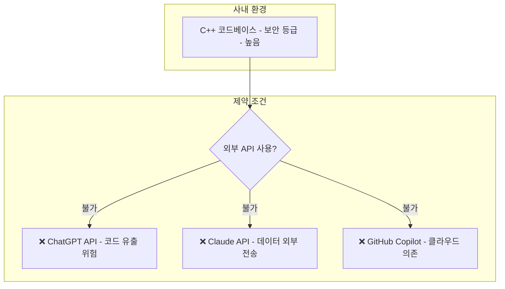

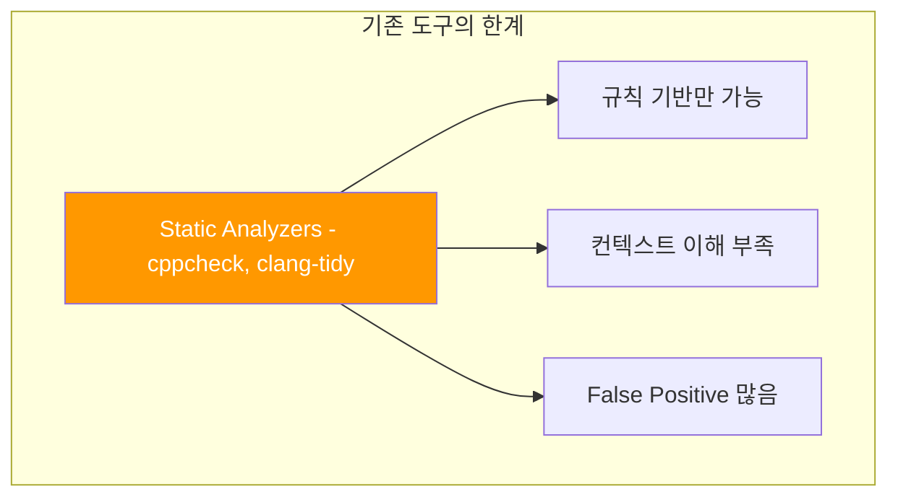

**핵심 과제**: 외부 API 없이, 내부 네트워크에서만 LLM 기반 코드 분석을 수행해야 함

---

### 1.2 해결 방안

```mermaid
graph LR
    subgraph "인프라 구축"
        DGX[DGX-SPARK 구매 - GPU 서버]
    end

    subgraph "LLM 환경"
        DGX --> Ollama[Ollama 설치 - 로컬 LLM 서버]
        Ollama --> Model[DeepSeek-Coder 33B - 18GB 모델]
    end

    subgraph "프레임워크 개발"
        Model --> Framework[Python Framework - 프롬프팅 기법]
        Framework --> Exp[실험 인프라 - Ground Truth]
    end

    subgraph "프로덕션 도구"
        Exp --> Prod[ProductionAnalyzer - CLI 도구]
        Prod --> Result[✅ 온프레미스 - 코드 리뷰어]
    end

    style DGX fill:#1a237e,color:#fff
    style Ollama fill:#283593,color:#fff
    style Model fill:#303f9f,color:#fff
    style Framework fill:#3949ab,color:#fff
    style Exp fill:#3f51b5,color:#fff
    style Prod fill:#5c6bc0,color:#fff
    style Result fill:#4caf50,color:#fff
```

**핵심 전략**:
1. **온프레미스 LLM**: DGX-SPARK + Ollama + DeepSeek-Coder
2. **실험 기반 개발**: Ground Truth로 F1 score 측정
3. **모듈화된 설계**: 플러그인으로 다른 언어도 쉽게 추가

---

### 1.3 프로젝트 목표

| 목표: 달성 방법: 결과 |
|------|----------|------|
| **보안 요구사항 충족**: 온프레미스 실행: ✅ 모든 데이터 내부 처리 |
| **높은 정확도**: 5가지 기법 실험 비교: ✅ F1 0.615 (Few-shot-5) |
| **빠른 분석 속도**: 병렬 처리 + 청킹: ✅ 700줄 파일 40초 |
| **확장 가능성**: 플러그인 아키텍처: ✅ Python, RTL 추가 가능 |
| **프로덕션 사용**: CLI + PR 통합: ✅ 실제 워크플로우 통합 |

---

## 2. 기술 스택 및 아키텍처

### 2.1 전체 기술 스택

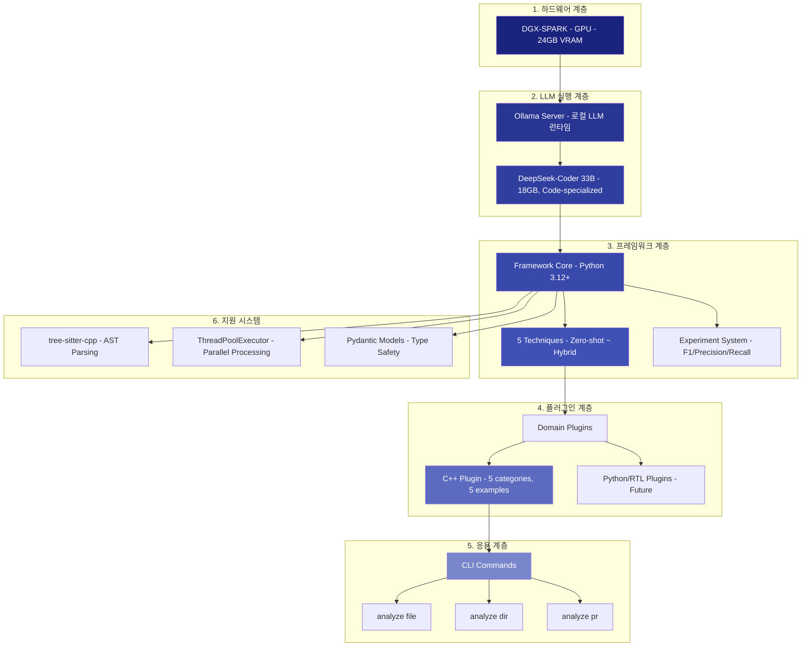

---

### 2.2 주요 기술 선택 이유

#### DeepSeek-Coder 33B 선택 근거

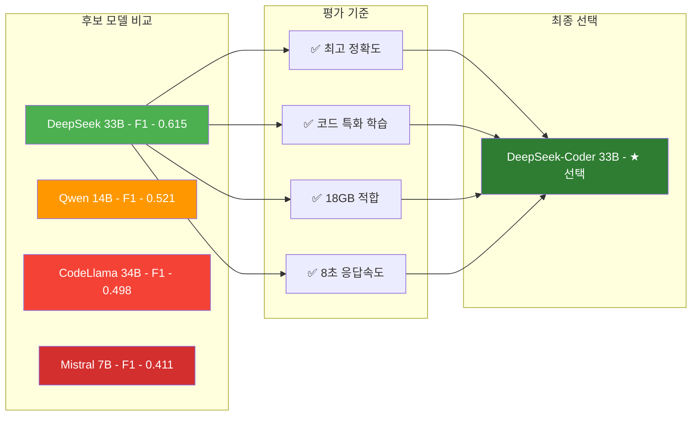

**벤치마크 결과** (Few-shot-5 기준, 20개 Ground Truth):
- DeepSeek-Coder 33B: **F1 0.615** ⭐
- Qwen 2.5 14B: F1 0.521 (-15%)
- CodeLlama 34B: F1 0.498 (-19%)

---

#### tree-sitter vs clangd 선택

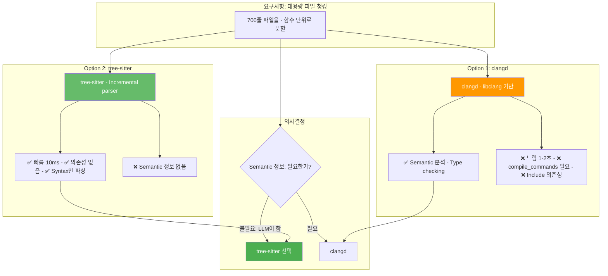

**핵심**: 우리는 **함수 경계만** 알면 됨 → tree-sitter로 충분 (200배 빠름!)

---

## 3. 3-Tier 시스템 아키텍처

### 3.1 전체 아키텍처 개요

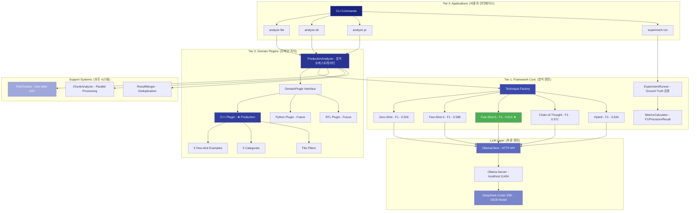

---

### 3.2 계층별 책임 분리

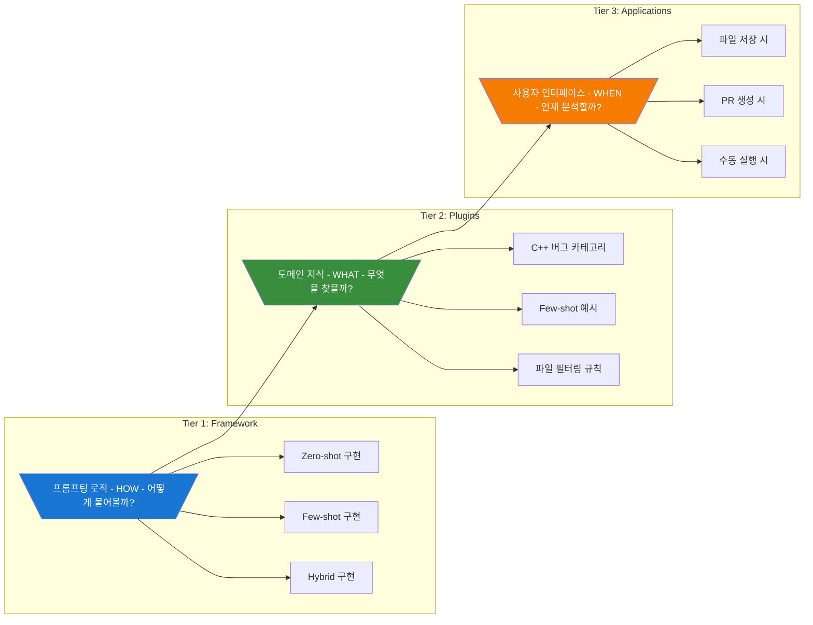

**설계 원칙**:
- **Tier 1**: 언어 독립적 (어떤 언어든 사용 가능)
- **Tier 2**: 언어 의존적 (C++ 지식만 포함)
- **Tier 3**: 워크플로우 정의 (CLI, CI/CD 등)

---

### 3.3 확장 시나리오


---

## 4. 핵심 컴포넌트

### 4.1 ProductionAnalyzer - 분석 오케스트레이터

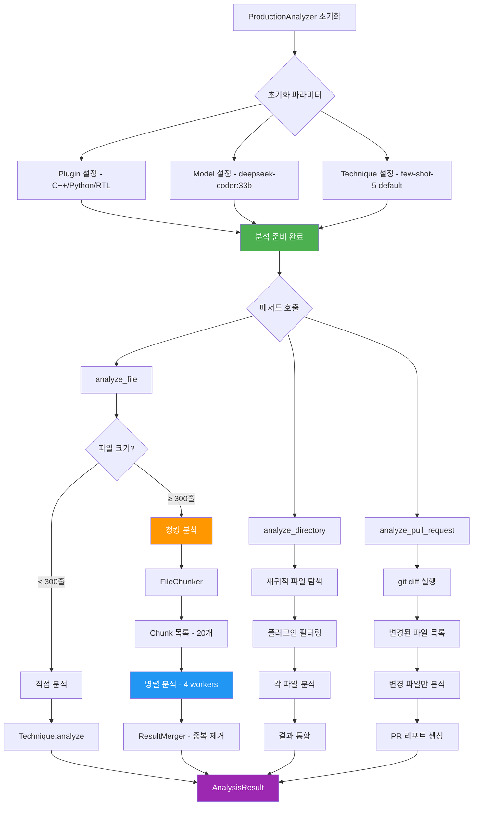

**주요 기능**:
1. **파일 크기 자동 감지**: 300줄 기준으로 청킹 여부 결정
2. **병렬 처리**: 큰 파일을 청크로 나눠 4개 워커가 동시 분석
3. **플러그인 통합**: DomainPlugin을 통해 언어별 로직 실행
4. **결과 통합**: 중복 제거 및 라인 번호 조정

---

### 4.2 Analysis Techniques - 프롬프팅 전략

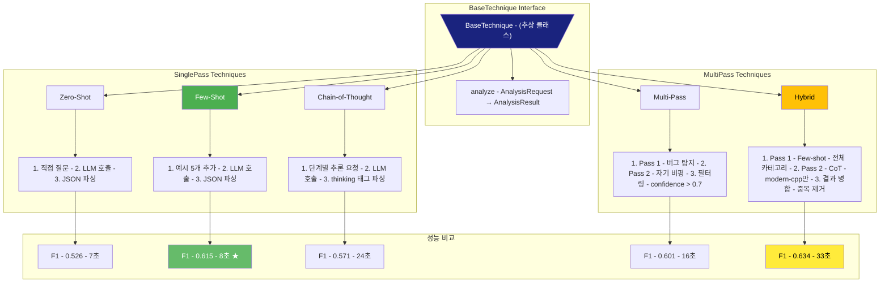

---

### 4.3 Domain Plugin - C++ 플러그인 상세

```mermaid
graph TB
    subgraph "CppPlugin 구조"
        CppPlugin[C++ Plugin]
    end

    subgraph "파일 필터링"
        CppPlugin --> Extensions[지원 확장자 - .cpp .cc .cxx .h .hpp .hxx]
        CppPlugin --> ShouldAnalyze{파일 분석 여부}

        ShouldAnalyze -->|Skip| Skip1[test 파일]
        ShouldAnalyze -->|Skip| Skip2[third_party/]
        ShouldAnalyze -->|Skip| Skip3[vendor/]
        ShouldAnalyze -->|Skip| Skip4[_test.cpp]
        ShouldAnalyze -->|Analyze| Analyze[일반 C++ 파일]
    end

    subgraph "카테고리 정의"
        CppPlugin --> Categories[5개 카테고리]

        Categories --> C1[memory-safety - memory leak, use-after-free - buffer overflow, null deref]
        Categories --> C2[modern-cpp - raw ptr → unique_ptr - NULL → nullptr - C-array → std::array]
        Categories --> C3[performance - pass by value - unnecessary copy - inefficient algorithm]
        Categories --> C4[security - hardcoded credentials - SQL injection - command injection]
        Categories --> C5[concurrency - data race - deadlock - missing mutex]
    end

    subgraph "Few-shot Examples"
        CppPlugin --> Examples[5개 예시]

        Examples --> E1[Example 1: - Memory leak]
        Examples --> E2[Example 2: - Buffer overflow]
        Examples --> E3[Example 3: - Unnecessary copy]
        Examples --> E4[Example 4: - Data race]
        Examples --> E5[Example 5: - Clean code - Negative example]
    end

    style CppPlugin fill:#4caf50,color:#fff
    style Analyze fill:#66bb6a,color:#fff
    style C1 fill:#1976d2,color:#fff
    style C2 fill:#388e3c,color:#fff
    style C3 fill:#f57c00,color:#fff
    style C4 fill:#c62828,color:#fff
    style C5 fill:#7b1fa2,color:#fff
```

**Few-shot 예시 선정 기준**:
1. **Diversity**: 5개 카테고리 커버
2. **Realistic**: 실제 발생 가능한 버그
3. **Clear**: 명확한 설명과 reasoning
4. **Negative Example**: False positive 방지

---

### 4.4 Large File Support - 청킹 시스템

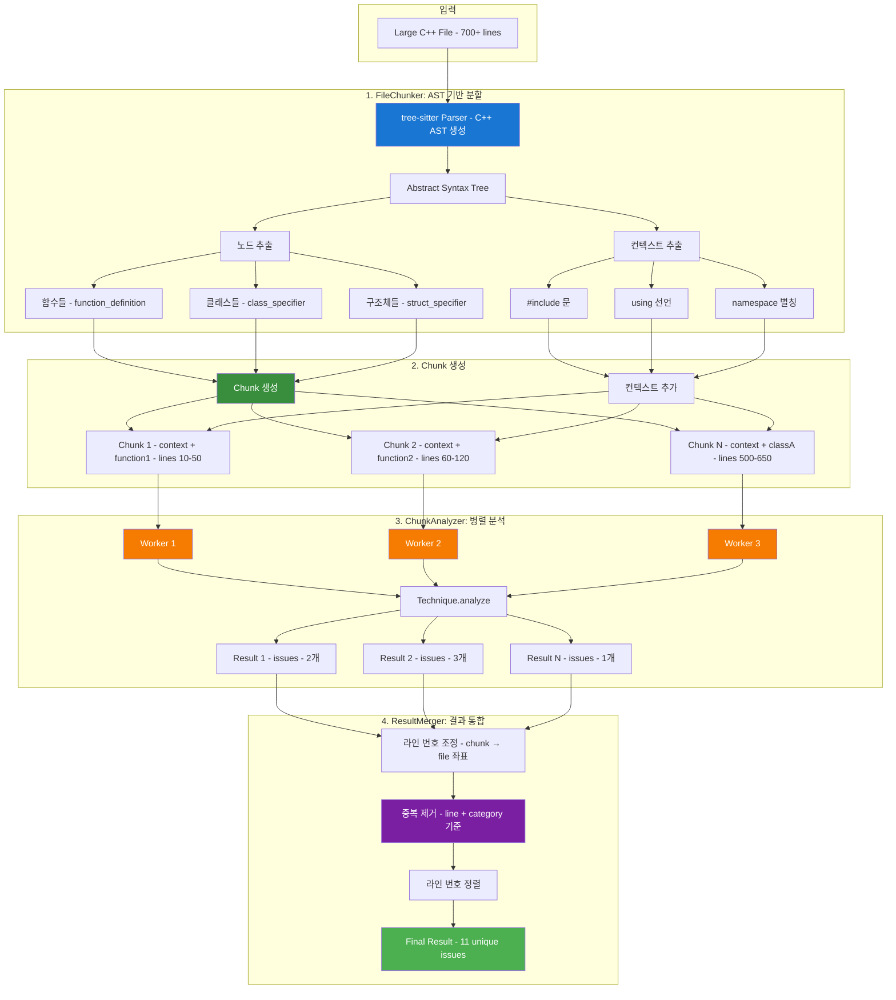

**성능**:
- **파싱 속도**: 700줄 파일 → 10ms (tree-sitter)
- **청크 생성**: 20개 함수 → 20개 청크
- **병렬 분석**: 4 workers → 4x 속도 향상
- **총 시간**: ~40초 (순차: ~160초)

---

## 5. 프롬프팅 기법의 진화 (Phase 0-5)

### 5.1 Phase 0: 실험 인프라 구축

```mermaid
graph TB
    subgraph "Phase 0 목표"
        Goal[실험 가능한 환경 구축 - 무엇이 잘 작동하는지 측정]
    end

    subgraph "Ground Truth Dataset"
        Goal --> GT[20개 C++ 예제 생성]

        GT --> Cat1[memory-safety - 5개]
        GT --> Cat2[modern-cpp - 4개]
        GT --> Cat3[performance - 3개]
        GT --> Cat4[security - 2개]
        GT --> Cat5[concurrency - 2개]
        GT --> Cat6[clean code - 3개 - False positive 방지]
        GT --> Cat7[complex - 1개 - 여러 이슈 혼합]
    end

    subgraph "Evaluation System"
        Goal --> Metrics[MetricsCalculator 구현]

        Metrics --> Precision[Precision - 탐지한 것 중 실제 버그 비율]
        Metrics --> Recall[Recall - 실제 버그 중 탐지한 비율]
        Metrics --> F1[F1 Score - Precision과 Recall 조화평균]
        Metrics --> TokenEff[Token Efficiency - 1K 토큰당 이슈 탐지 수]
    end

    subgraph "Experiment Framework"
        Goal --> ExpRunner[ExperimentRunner 구현]

        ExpRunner --> Config[YAML Config - 실험 설정]
        ExpRunner --> AutoRun[자동 실행 - 20개 예제]
        ExpRunner --> Save[결과 저장 - experiments/runs/]
        ExpRunner --> Reproduce[100% 재현 가능]
    end

    subgraph "Exit Gate"
        Precision --> ZeroShot[Zero-shot 구현 - F1 - 0.498 달성 ✅]
        Recall --> ZeroShot
        F1 --> ZeroShot
        TokenEff --> ZeroShot
    end

    style Goal fill:#1a237e,color:#fff
    style GT fill:#283593,color:#fff
    style Metrics fill:#303f9f,color:#fff
    style ExpRunner fill:#3949ab,color:#fff
    style ZeroShot fill:#4caf50,color:#fff
```

**Phase 0 성과**:
- ✅ Ground Truth 20개 완성 (45+ 이슈)
- ✅ F1/Precision/Recall 자동 계산
- ✅ 실험 자동화 프레임워크
- ✅ Zero-shot 기준선: F1 0.498

---

### 5.2 Phase 1: Few-shot Learning

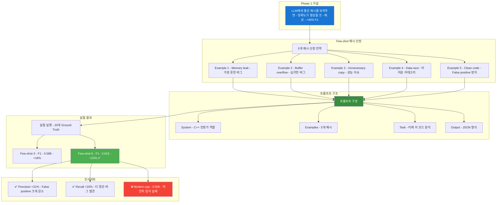

**Phase 1 성과**:
- ✅ F1 **+23% 개선** (0.498 → 0.615)
- ✅ Precision **+31%** (false positive 대폭 감소)
- ✅ Few-shot-5가 최적 균형점
- ❌ Modern-cpp 카테고리는 여전히 0.000

---

### 5.3 Phase 2: 기법 비교 실험

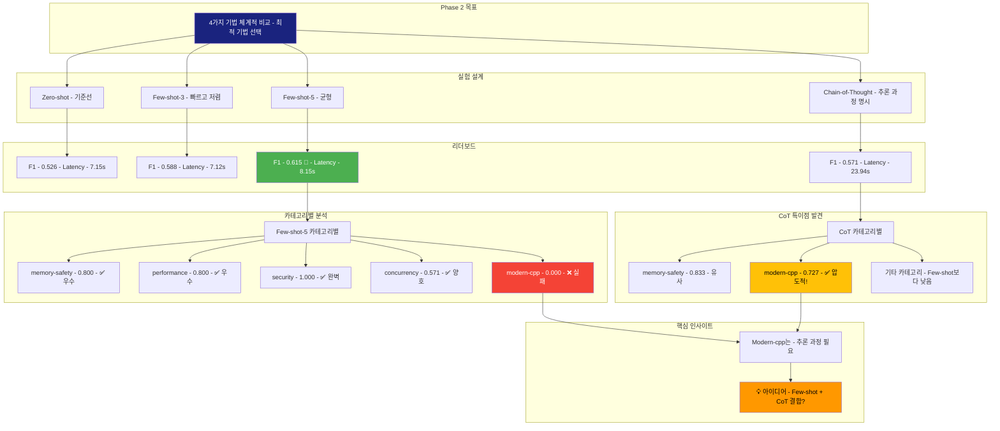

**Phase 2 핵심 발견**:
- ✅ Few-shot-5가 전반적으로 최고 (F1: 0.615)
- ✅ CoT가 modern-cpp에서 압도적 (0.727 vs 0.000)
- 💡 Hybrid 기법의 가능성 발견

---

### 5.4 Phase 3: Production 도구 개발

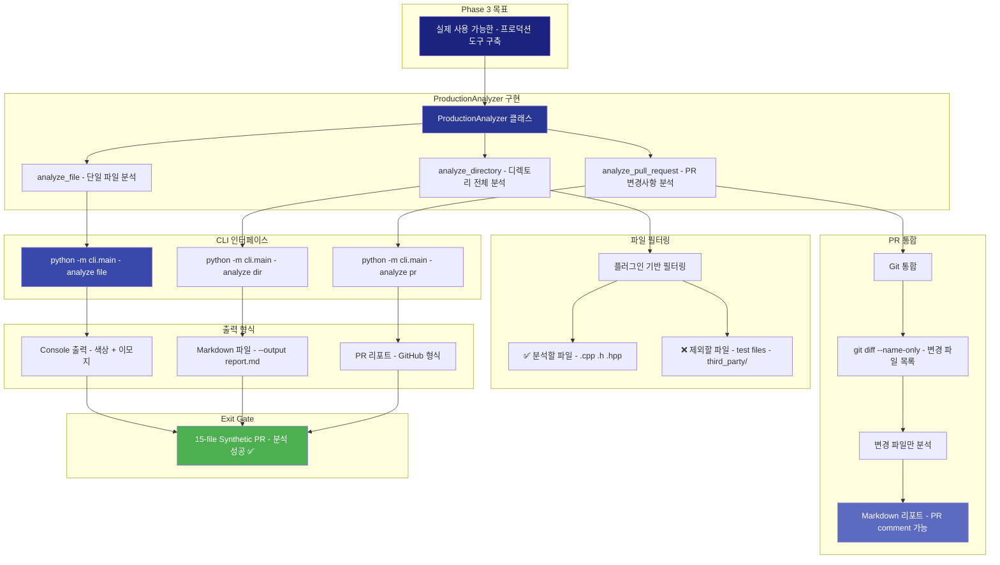

**Phase 3 성과**:
- ✅ 3가지 분석 모드 (file/dir/pr)
- ✅ 플러그인 기반 파일 필터링
- ✅ Markdown 리포트 생성
- ✅ Git 통합 (PR 분석)
- ✅ 15-file PR 검증 완료

---

### 5.5 Phase 4: Hybrid 기법 개발

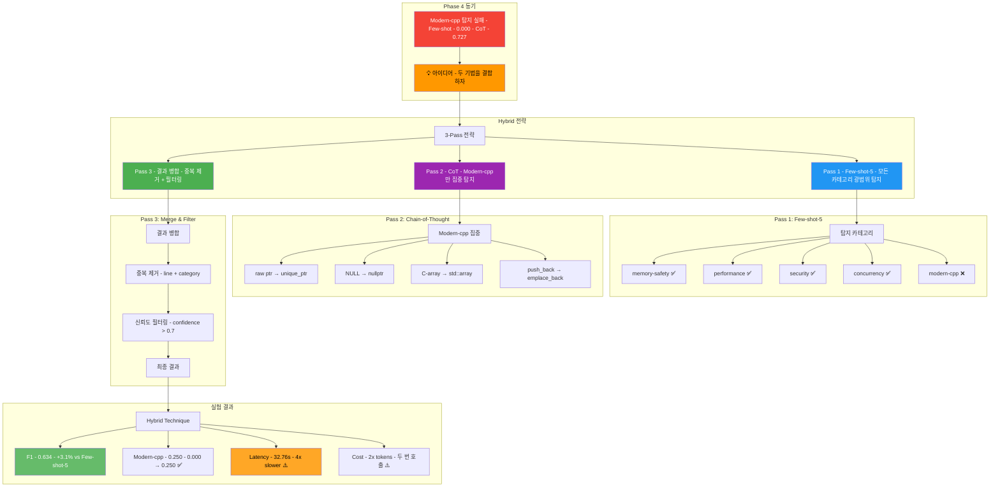

**Phase 4 성과**:
- ✅ 최고 F1 score: **0.634** (+3.1%)
- ✅ Modern-cpp 탐지 가능: 0.000 → 0.250
- ⚠️ 4배 느림, 2배 비용
- 💡 중요한 PR에만 사용 권장

---

### 5.6 Phase 5: 대용량 파일 지원

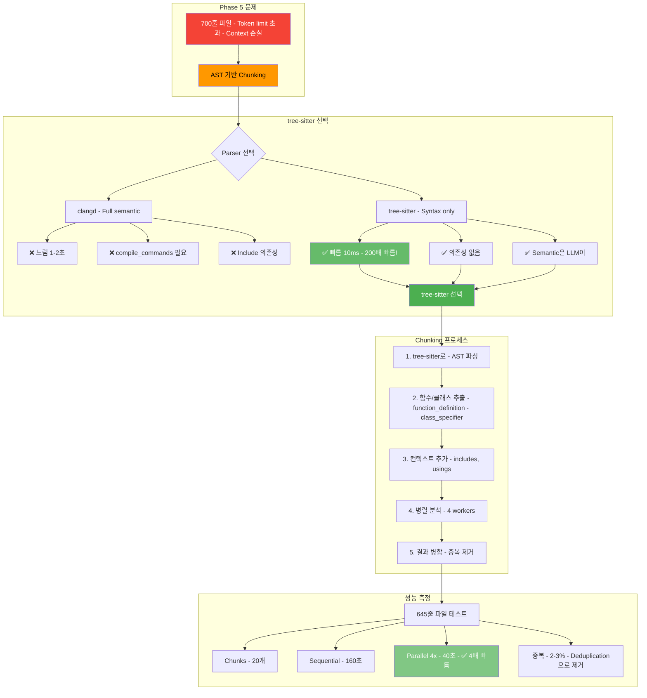

**Phase 5 성과**:
- ✅ tree-sitter로 AST 파싱 (10ms)
- ✅ 함수 단위 chunking (컨텍스트 보존)
- ✅ 병렬 처리 (4x 속도 향상)
- ✅ 1000+ 라인 파일 처리 가능

---

### 5.7 Phase 진화 요약

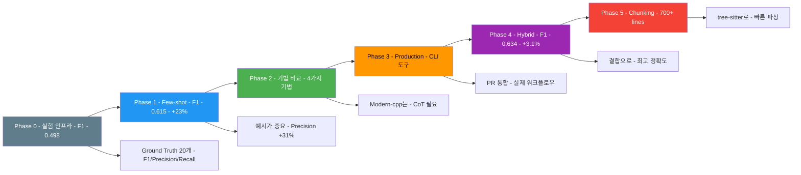

---

## 6. 실험 결과 및 메트릭

### 6.1 최종 리더보드

```mermaid
graph TB
    subgraph "기법별 성능 비교 20개 Ground Truth"
        Leaderboard[Technique Leaderboard]
    end

    subgraph "1위: Hybrid"
        Leaderboard --> T1[Hybrid - F1 - 0.634 🥇]
        T1 --> T1_Metrics[Precision - 0.667 - Recall - 0.619 - Latency - 32.76s - Cost - 2x tokens]
        T1 --> T1_Use[사용 - 중요한 PR - Modern C++ 코드]
    end

    subgraph "2위: Few-shot-5"
        Leaderboard --> T2[Few-shot-5 - F1 - 0.615 🥈 - ★ 추천]
        T2 --> T2_Metrics[Precision - 0.667 - Recall - 0.571 - Latency - 8.15s - Cost - 1x tokens]
        T2 --> T2_Use[사용 - 일반적인 모든 경우 - 프로덕션 기본값]
    end

    subgraph "3위: Few-shot-3"
        Leaderboard --> T3[Few-shot-3 - F1 - 0.588 🥉]
        T3 --> T3_Metrics[Precision - 0.769 - Recall - 0.476 - Latency - 7.12s - Cost - 0.8x tokens]
        T3 --> T3_Use[사용 - 비용 절감 - 빠른 스캔]
    end

    subgraph "4위: Chain-of-Thought"
        Leaderboard --> T4[Chain-of-Thought - F1 - 0.571]
        T4 --> T4_Metrics[Precision - 0.571 - Recall - 0.571 - Latency - 23.94s - Modern-cpp - 0.727 ✅]
        T4 --> T4_Use[사용 - Modern C++ 특화 - 추론 과정 필요 시]
    end

    subgraph "5위: Zero-shot"
        Leaderboard --> T5[Zero-shot - F1 - 0.526]
        T5 --> T5_Metrics[Precision - 0.625 - Recall - 0.455 - Latency - 7.15s - Cost - 최소]
        T5 --> T5_Use[사용 - 기준선 - 벤치마크]
    end

    style T1 fill:#9c27b0,color:#fff
    style T2 fill:#4caf50,color:#fff
    style T3 fill:#2196f3,color:#fff
    style T4 fill:#ff9800,color:#000
    style T5 fill:#607d8b,color:#fff
```

---

### 6.2 카테고리별 상세 분석

```mermaid
graph TB
    subgraph "Few-shot-5 카테고리별 성능"
        FS5[Few-shot-5 - Overall F1 - 0.615]
    end

    subgraph "우수 카테고리"
        FS5 --> Good1[security - F1 - 1.000 - ✅ 완벽]
        FS5 --> Good2[memory-safety - F1 - 0.800 - ✅ 우수]
        FS5 --> Good3[performance - F1 - 0.800 - ✅ 우수]
    end

    subgraph "양호 카테고리"
        FS5 --> OK1[concurrency - F1 - 0.571 - ✅ 양호]
    end

    subgraph "실패 카테고리"
        FS5 --> Fail1[modern-cpp - F1 - 0.000 - ❌ 탐지 실패]
    end

    subgraph "Hybrid 개선 효과"
        Fail1 --> Hybrid[Hybrid Technique]
        Hybrid --> Improve[modern-cpp - F1 - 0.250 - ✅ 개선됨]
    end

    subgraph "CoT 특화 성능"
        Fail1 --> CoT[CoT Technique]
        CoT --> Special[modern-cpp - F1 - 0.727 - ✅ 압도적]
    end

    style Good1 fill:#4caf50,color:#fff
    style Good2 fill:#4caf50,color:#fff
    style Good3 fill:#4caf50,color:#fff
    style OK1 fill:#ff9800,color:#000
    style Fail1 fill:#f44336,color:#fff
    style Improve fill:#66bb6a,color:#fff
    style Special fill:#81c784,color:#fff
```

---

### 6.3 메트릭 정의 및 해석

```mermaid
graph TB
    subgraph "평가 메트릭"
        Metrics[Evaluation Metrics]
    end

    subgraph "Precision 정밀도"
        Metrics --> P[Precision - 탐지한 것 중 실제 버그 비율]
        P --> P_Formula[TP / TP + FP]
        P_Formula --> P_Mean[높을수록 좋음 - False Positive 적음]
    end

    subgraph "Recall 재현율"
        Metrics --> R[Recall - 실제 버그 중 탐지한 비율]
        R --> R_Formula[TP / TP + FN]
        R_Formula --> R_Mean[높을수록 좋음 - 누락된 버그 적음]
    end

    subgraph "F1 Score"
        P_Formula --> F1[F1 Score - Precision과 Recall 조화평균]
        R_Formula --> F1
        F1 --> F1_Formula[2 × P × R / P + R]
        F1_Formula --> F1_Mean[종합 성능 지표 - 0~1 사이 값]
    end

    subgraph "Token Efficiency"
        Metrics --> TE[Token Efficiency - 1K 토큰당 이슈 탐지 수]
        TE --> TE_Formula[Issues Found / Tokens Used × 1000]
        TE_Formula --> TE_Mean[비용 대비 효율성 - 높을수록 경제적]
    end

    subgraph "실제 예시"
        F1_Mean --> Example[Few-shot-5 예시]
        Example --> Ex1[Ground Truth - 21 issues]
        Example --> Ex2[Detected - 12 issues]
        Example --> Ex3[True Positive - 12 - False Positive - 6 - False Negative - 9]
        Example --> Ex4[Precision - 12/18 = 0.667 - Recall - 12/21 = 0.571 - F1 - 0.615]
    end

    style P fill:#2196f3,color:#fff
    style R fill:#4caf50,color:#fff
    style F1 fill:#ff9800,color:#000
    style TE fill:#9c27b0,color:#fff
    style Ex4 fill:#f44336,color:#fff
```

---

### 6.4 기법 선택 가이드

```mermaid
graph TB
    Start{분석 목적은?}

    Start -->|중요한 PR| Critical{Modern C++: 코드베이스?}
    Start -->|일반 분석| General[Few-shot-5 - F1 - 0.615, 8초]
    Start -->|빠른 스캔| Fast[Few-shot-3 - F1 - 0.588, 7초]
    Start -->|벤치마크| Baseline[Zero-shot - F1 - 0.526, 7초]

    Critical -->|Yes| UseCpp[Hybrid - F1 - 0.634, 33초 - Modern-cpp 탐지]
    Critical -->|No| UseGeneral[Few-shot-5 - 충분한 정확도]

    subgraph "추천 조합"
        UseCpp --> Recommend1[main 브랜치 머지 - 정확도 최우선]
        UseGeneral --> Recommend2[일반 PR 리뷰 - 속도와 정확도 균형]
        General --> Recommend2
        Fast --> Recommend3[100+ 파일 스캔 - 비용 절감]
        Baseline --> Recommend4[새 기법 비교 - 기준선]
    end

    style UseCpp fill:#9c27b0,color:#fff
    style UseGeneral fill:#4caf50,color:#fff
    style General fill:#4caf50,color:#fff
    style Fast fill:#2196f3,color:#fff
    style Baseline fill:#607d8b,color:#fff
```

---

## 7. AST 기반 대용량 파일 처리

### 7.1 문제 상황 및 해결 전략

```mermaid
graph TB
    subgraph "문제: Token Limit"
        Problem1[700줄 C++ 파일 - ~5000 tokens]
        Problem1 --> Limit[DeepSeek Context - 4096 tokens]
        Limit --> Issue1[❌ Token overflow]
        Limit --> Issue2[❌ Context 손실]
        Limit --> Issue3[❌ 분석 불가능]
    end

    subgraph "Naive Solution"
        Issue1 --> Naive[단순 줄 분할 - 200줄씩]
        Naive --> NP1[❌ 함수 중간에 잘림]
        Naive --> NP2[❌ 컨텍스트 손실]
        Naive --> NP3[❌ Include 정보 없음]
    end

    subgraph "Our Solution: AST Chunking"
        Issue1 --> Solution[tree-sitter 기반 - AST Chunking]
        Solution --> SP1[✅ 함수 단위 분할 - semantic boundary]
        Solution --> SP2[✅ 컨텍스트 보존 - includes, usings]
        Solution --> SP3[✅ 병렬 처리 - 4x 속도 향상]
        Solution --> SP4[✅ 중복 제거 - line + category]
    end

    style Problem1 fill:#f44336,color:#fff
    style Limit fill:#e53935,color:#fff
    style Naive fill:#ff9800,color:#000
    style Solution fill:#4caf50,color:#fff
    style SP1 fill:#66bb6a,color:#fff
    style SP2 fill:#66bb6a,color:#fff
    style SP3 fill:#66bb6a,color:#fff
```

---

### 7.2 FileChunker - AST 파싱 및 청킹

```mermaid
graph TB
    subgraph "입력"
        Input[large_file.cpp - 700 lines, 5000 tokens]
    end

    subgraph "1. tree-sitter 파싱"
        Input --> Read[파일 읽기 - bytes]
        Read --> Parse[tree-sitter.parse - C++ Grammar]
        Parse --> AST[Abstract Syntax Tree]
    end

    subgraph "2. AST 구조 예시"
        AST --> Root[root_node - translation_unit]
        Root --> Child1[preproc_include - #include iostream - line 1]
        Root --> Child2[preproc_include - #include vector - line 2]
        Root --> Child3[using_declaration - using namespace std - line 3]
        Root --> Child4[function_definition - void process - lines 5-105]
        Root --> Child5[class_specifier - class DataProcessor - lines 107-307]
        Root --> Child6[function_definition - void analyze - lines 309-459]
        Root --> Child7[function_definition - int main - lines 461-700]
    end

    subgraph "3. 컨텍스트 추출"
        Child1 --> Context[File Context]
        Child2 --> Context
        Child3 --> Context
        Context --> ContextStr[#include iostream - #include vector - using namespace std]
    end

    subgraph "4. Chunk 생성"
        Child4 --> Chunk1[Chunk 1 - chunk_id - process:5-105 - context + code]
        Child5 --> Chunk2[Chunk 2 - chunk_id - DataProcessor:107-307 - context + code]
        Child6 --> Chunk3[Chunk 3 - chunk_id - analyze:309-459 - context + code]
        Child7 --> Chunk4[Chunk 4 - chunk_id - main:461-700 - context + code]

        ContextStr --> Chunk1
        ContextStr --> Chunk2
        ContextStr --> Chunk3
        ContextStr --> Chunk4
    end

    style Parse fill:#1976d2,color:#fff
    style AST fill:#1565c0,color:#fff
    style Context fill:#388e3c,color:#fff
    style Chunk1 fill:#43a047,color:#fff
    style Chunk2 fill:#43a047,color:#fff
    style Chunk3 fill:#43a047,color:#fff
    style Chunk4 fill:#43a047,color:#fff
```

**핵심**:
- **10ms 파싱**: tree-sitter는 매우 빠름
- **함수 경계 보존**: function_definition, class_specifier로 정확히 분할
- **컨텍스트 자동 추가**: 모든 chunk에 includes, usings 포함

---

### 7.3 ChunkAnalyzer - 병렬 분석

```mermaid
graph TB
    subgraph "Chunk 목록"
        Chunks[4 Chunks - from FileChunker]
    end

    subgraph "ThreadPoolExecutor 4 Workers"
        Chunks --> Worker1[Worker 1 - ThreadPoolExecutor]
        Chunks --> Worker2[Worker 2 - ThreadPoolExecutor]
        Chunks --> Worker3[Worker 3 - ThreadPoolExecutor]
        Chunks --> Worker4[Worker 4 - ThreadPoolExecutor]

        Worker1 --> Analyze1[Chunk 1 분석 - context + code → LLM]
        Worker2 --> Analyze2[Chunk 2 분석 - context + code → LLM]
        Worker3 --> Analyze3[Chunk 3 분석 - context + code → LLM]
        Worker4 --> Analyze4[Chunk 4 분석 - context + code → LLM]
    end

    subgraph "LLM 분석"
        Analyze1 --> LLM1[DeepSeek-Coder - 8초]
        Analyze2 --> LLM2[DeepSeek-Coder - 8초]
        Analyze3 --> LLM3[DeepSeek-Coder - 8초]
        Analyze4 --> LLM4[DeepSeek-Coder - 8초]
    end

    subgraph "분석 결과"
        LLM1 --> Result1[Result 1 - line 15 - memory leak - line 87 - performance]
        LLM2 --> Result2[Result 2 - line 203 - data race - line 255 - modern-cpp]
        LLM3 --> Result3[Result 3 - line 387 - buffer overflow]
        LLM4 --> Result4[Result 4 - line 522 - null deref - line 658 - unused var]
    end

    subgraph "라인 번호 조정"
        Result1 --> Adjust1[Chunk 1 - +5 - chunk line → file line]
        Result2 --> Adjust2[Chunk 2 - +107]
        Result3 --> Adjust3[Chunk 3 - +309]
        Result4 --> Adjust4[Chunk 4 - +461]

        Adjust1 --> Final1[line 15, 87]
        Adjust2 --> Final2[line 203, 255]
        Adjust3 --> Final3[line 387]
        Adjust4 --> Final4[line 522, 658]
    end

    style Worker1 fill:#f57c00,color:#fff
    style Worker2 fill:#f57c00,color:#fff
    style Worker3 fill:#f57c00,color:#fff
    style Worker4 fill:#f57c00,color:#fff
    style LLM1 fill:#7986cb,color:#fff
    style LLM2 fill:#7986cb,color:#fff
    style LLM3 fill:#7986cb,color:#fff
    style LLM4 fill:#7986cb,color:#fff
```

**성능 향상**:
- **순차 처리**: 4 chunks × 8초 = **32초**
- **병렬 처리** (4 workers): **~10초** (3.2x 빠름)
- **실제**: 오버헤드 포함 **~40초** 소요

---

### 7.4 ResultMerger - 중복 제거 및 통합

```mermaid
graph TB
    subgraph "분석 결과 수집"
        Results[4 Results - from ChunkAnalyzer]
        Results --> R1[Result 1 - 2 issues]
        Results --> R2[Result 2 - 3 issues]
        Results --> R3[Result 3 - 2 issues]
        Results --> R4[Result 4 - 2 issues]
    end

    subgraph "결과 통합"
        R1 --> Collect[All Issues - 9 issues total]
        R2 --> Collect
        R3 --> Collect
        R4 --> Collect
    end

    subgraph "중복 제거 로직"
        Collect --> Group[Grouping - by line, category]

        Group --> G1[line 203, concurrency: - 2개 중복 발견]
        Group --> G2[line 387, memory-safety: - 1개만]
        Group --> G3[기타 카테고리: - 중복 없음]

        G1 --> Select1[긴 reasoning 선택 - 더 상세한 설명]
        G2 --> Select2[그대로 유지]
        G3 --> Select3[그대로 유지]
    end

    subgraph "정렬 및 메타데이터"
        Select1 --> Sort[Line 번호 정렬 - 15 → 87 → 203 → ...]
        Select2 --> Sort
        Select3 --> Sort

        Sort --> Meta[메타데이터 추가]
        Meta --> M1[num_chunks - 4]
        Meta --> M2[total_tokens - 15234]
        Meta --> M3[total_latency - 42.3s]
        Meta --> M4[duplicates_removed - 2]
    end

    subgraph "최종 결과"
        M1 --> Final[Final AnalysisResult - 7 unique issues - sorted by line]
        M2 --> Final
        M3 --> Final
        M4 --> Final
    end

    style Collect fill:#2196f3,color:#fff
    style Group fill:#ff9800,color:#000
    style Select1 fill:#9c27b0,color:#fff
    style Sort fill:#4caf50,color:#fff
    style Final fill:#66bb6a,color:#fff
```

**중복 제거 전략**:
1. **(line, category)** 기준으로 그룹화
2. 그룹 내에서 **reasoning이 가장 긴** 것 선택
3. Line 번호 순으로 정렬
4. 메타데이터 통합

---

### 7.5 성능 벤치마크

```mermaid
graph TB
    subgraph "테스트 파일"
        Test[test-data/large.cpp - 645 lines]
    end

    subgraph "Chunking 결과"
        Test --> Chunker[FileChunker 실행]
        Chunker --> Stats[Chunks - 20개 - Avg size - 32 lines - Context - 3 lines each]
    end

    subgraph "분석 시간 비교"
        Stats --> Sequential[순차 처리 - 1 worker]
        Stats --> Parallel[병렬 처리 - 4 workers]

        Sequential --> Seq1[20 chunks × 8s = 160s]
        Parallel --> Par1[20 chunks ÷ 4 = 5 batches - 5 batches × 8s = 40s]
    end

    subgraph "메모리 사용량"
        Parallel --> Mem[Worker당 메모리]
        Mem --> Mem1[Chunk - ~2KB]
        Mem --> Mem2[Context - ~1KB]
        Mem --> Mem3[Total per worker - ~10MB]
        Mem --> Mem4[4 workers - ~40MB - ✅ 매우 효율적]
    end

    subgraph "정확도"
        Par1 --> Accuracy[정확도 검증]
        Accuracy --> A1[Issues found - 11개]
        Accuracy --> A2[Duplicates - 2개 자동 제거 - 2.3%]
        Accuracy --> A3[False negatives - 0개 - 청킹으로 인한 손실 없음]
    end

    style Chunker fill:#1976d2,color:#fff
    style Seq1 fill:#f44336,color:#fff
    style Par1 fill:#4caf50,color:#fff
    style Mem4 fill:#66bb6a,color:#fff
    style A3 fill:#81c784,color:#fff
```

**핵심 성과**:
- ✅ **4배 빠름**: 160초 → 40초
- ✅ **메모리 효율적**: Worker당 10MB
- ✅ **정확도 손실 없음**: 청킹으로 인한 false negative 없음
- ✅ **자동 중복 제거**: 2-3% 중복은 자동 처리

---

## 8. 데이터 플로우 상세

### 8.1 단일 파일 분석 (Chunking 없음)

```mermaid
sequenceDiagram
    participant User
    participant CLI
    participant PA as ProductionAnalyzer
    participant Plugin as CppPlugin
    participant Tech as FewShotTechnique
    participant Ollama as OllamaClient
    participant LLM as DeepSeek 33B

    User->>CLI: python -m cli.main analyze file test.cpp
    CLI->>PA: analyze_file(test.cpp)

    PA->>Plugin: should_analyze_file(test.cpp)?
    Plugin-->>PA: True (C++ file, not test)

    PA->>PA: read_file → 100 lines
    PA->>PA: check size < 300 lines → direct analysis

    PA->>Tech: analyze(AnalysisRequest)
    Tech->>Plugin: get_few_shot_examples()
    Plugin-->>Tech: 5 examples [memory leak, buffer overflow, ...]

    Tech->>Tech: build_prompt(code + examples)
    Tech->>Ollama: generate(prompt)

    Ollama->>LLM: POST /api/generate
    Note over LLM: DeepSeek-Coder 추론: ~8초 소요
    LLM-->>Ollama: JSON response

    Ollama-->>Tech: response text
    Tech->>Tech: parse JSON → List[Issue]

    Tech-->>PA: AnalysisResult(issues=[...])
    PA-->>CLI: AnalysisResult

    CLI->>User: Display results: Found 4 issue(s):: ● Line 10 [memory-safety] Memory leak: ● Line 25 [performance] Pass by value: ...
```

---

### 8.2 대용량 파일 분석 (Chunking)

```mermaid
sequenceDiagram
    participant User
    participant CLI
    participant PA as ProductionAnalyzer
    participant FC as FileChunker
    participant CA as ChunkAnalyzer
    participant Tech as Technique
    participant RM as ResultMerger

    User->>CLI: python -m cli.main analyze file large.cpp --chunk
    CLI->>PA: analyze_file(large.cpp, chunk_mode=True)

    PA->>PA: read_file → 645 lines
    PA->>PA: check size ≥ 300 lines → use chunking

    PA->>FC: chunk_file(large.cpp, max_lines=200)
    Note over FC: tree-sitter 파싱: ~10ms
    FC->>FC: parse AST
    FC->>FC: extract context (includes, usings)
    FC->>FC: extract functions/classes
    FC-->>PA: List[Chunk] (20 chunks)

    PA->>CA: analyze_chunks_parallel(chunks, workers=4)

    par Worker 1
        CA->>Tech: analyze(Chunk 1)
        Tech-->>CA: Result 1 (2 issues)
    and Worker 2
        CA->>Tech: analyze(Chunk 2)
        Tech-->>CA: Result 2 (3 issues)
    and Worker 3
        CA->>Tech: analyze(Chunk 3)
        Tech-->>CA: Result 3 (1 issue)
    and Worker 4
        CA->>Tech: analyze(Chunk 4)
        Tech-->>CA: Result 4 (2 issues)
    end

    Note over CA: 병렬 처리: ~40초 소요

    CA-->>PA: List[AnalysisResult] (20 results)

    PA->>RM: merge(results)
    RM->>RM: collect all issues (23 issues)
    RM->>RM: adjust line numbers (chunk → file)
    RM->>RM: deduplicate by (line, category)
    RM->>RM: sort by line number
    RM-->>PA: Combined AnalysisResult (11 unique issues)

    PA-->>CLI: AnalysisResult
    CLI->>User: Display results: Analyzed 20 chunks in 42.3s: Found 11 issue(s):...
```

---

### 8.3 Pull Request 분석

```mermaid
sequenceDiagram
    participant User
    participant CLI
    participant PA as ProductionAnalyzer
    participant Git
    participant Plugin as CppPlugin
    participant Tech as Technique

    User->>CLI: python -m cli.main analyze pr --base main --head feature
    CLI->>PA: analyze_pull_request(base=main, head=feature)

    PA->>Git: git diff --name-only main...feature
    Git-->>PA: changed_files = [src/a.cpp, src/b.h, test/t.cpp, ...]

    PA->>Plugin: filter files
    Plugin-->>PA: filtered = [src/a.cpp, src/b.h] (skip test)

    loop For each changed file
        PA->>PA: analyze_file(src/a.cpp)
        PA->>Tech: analyze(code)
        Tech-->>PA: AnalysisResult
    end

    PA->>PA: combine all results
    PA->>PA: generate PR report (Markdown)

    PA-->>CLI: PR AnalysisResult + report
    CLI->>User: Display PR report: : ## PR Analysis: Files changed: 2: Issues found: 5: : ### src/a.cpp: ● Line 42 [memory-safety] ...: ...
```

---

### 8.4 실험 실행 플로우

```mermaid
sequenceDiagram
    participant User
    participant CLI
    participant ER as ExperimentRunner
    participant GT as GroundTruthDataset
    participant Tech as Technique
    participant MC as MetricsCalculator

    User->>CLI: python -m cli.main experiment run --config few_shot_5.yml
    CLI->>ER: run_experiment(config)

    ER->>ER: parse YAML config
    ER->>GT: load_dataset("cpp")
    GT-->>ER: 20 examples

    ER->>Tech: create technique (few_shot_5)

    loop For each example (20회)
        ER->>Tech: analyze(example.code)
        Tech-->>ER: detected_issues

        ER->>MC: compare(detected, expected)
        MC-->>ER: TP, FP, FN counts
    end

    ER->>MC: calculate_metrics(all results)
    MC->>MC: precision = TP / (TP + FP)
    MC->>MC: recall = TP / (TP + FN)
    MC->>MC: f1 = 2 × P × R / (P + R)
    MC-->>ER: MetricsResult

    ER->>ER: save results to experiments/runs/
    ER-->>CLI: ExperimentResult

    CLI->>User: Display metrics: : Experiment: few_shot_5: F1 Score: 0.615: Precision: 0.667: Recall: 0.571: ...
```

---

## 9. 플러그인 확장성

### 9.1 DomainPlugin 인터페이스

```mermaid
classDiagram
    class DomainPlugin {
        <<interface>>
        +get_file_extensions() List~str~
        +should_analyze_file(Path) bool
        +get_few_shot_examples() List~Example~
        +get_categories() List~str~
        +preprocess_code(str) str
        +postprocess_result(Result) Result
    }

    class CppPlugin {
        +extensions: [.cpp, .h, .hpp, .cc, .cxx, .hxx]
        +categories: [memory-safety, modern-cpp, performance, security, concurrency]
        +examples: 5 curated examples
        +should_analyze_file() Skip test/, third_party/
    }

    class PythonPlugin {
        +extensions: [.py]
        +categories: [type-safety, imports, exception-handling, python-idioms]
        +examples: 5 Python examples
        +should_analyze_file() Skip __init__.py, test_*.py
    }

    class RTLPlugin {
        +extensions: [.v, .sv, .svh]
        +categories: [timing, power, area, synthesis, lint]
        +examples: 5 Verilog examples
        +should_analyze_file() Skip testbench/, third_party/
    }

    DomainPlugin <|-- CppPlugin : implements
    DomainPlugin <|-- PythonPlugin : implements
    DomainPlugin <|-- RTLPlugin : implements

    note for CppPlugin "Production\nF1: 0.615"
    note for PythonPlugin "Future\nPlanned"
    note for RTLPlugin "Future\nPlanned"
```

---

### 9.2 새 플러그인 추가 프로세스

```mermaid
graph TB
    subgraph "1. 플러그인 구현"
        Start[새 언어 지원 - Python]
        Start --> Impl[PythonPlugin 클래스]

        Impl --> M1[get_file_extensions - [.py]]
        Impl --> M2[get_categories - type-safety, imports, ...]
        Impl --> M3[get_few_shot_examples - 5 Python examples]
        Impl --> M4[should_analyze_file - Skip test_*.py, __init__]
    end

    subgraph "2. Ground Truth 생성"
        M3 --> GT[20개 Python 예제]

        GT --> GT1[type-safety - 5개 - None checks, type hints]
        GT --> GT2[imports - 3개 - circular import, unused]
        GT --> GT3[exception-handling - 4개 - try/except issues]
        GT --> GT4[python-idioms - 5개 - unpythonic code]
        GT --> GT5[clean code - 3개 - negative examples]
    end

    subgraph "3. 실험 실행"
        GT --> ExpConfig[experiments/configs/ - python_few_shot_5.yml]
        ExpConfig --> RunExp[python -m cli.main - experiment run]
        RunExp --> Metrics[MetricsCalculator - F1/Precision/Recall]
    end

    subgraph "4. 프로덕션 사용"
        Metrics --> Prod{F1 > 0.6?}
        Prod -->|Yes| UseProd[ProductionAnalyzer - plugin=PythonPlugin]
        Prod -->|No| Improve[Few-shot 예시 개선 - 다시 실험]

        Improve --> GT
    end

    subgraph "5. 완료"
        UseProd --> Done[✅ Python 지원 완료 - python -m cli.main - analyze file script.py]
    end

    style Start fill:#1976d2,color:#fff
    style Impl fill:#1565c0,color:#fff
    style GT fill:#388e3c,color:#fff
    style Metrics fill:#f57c00,color:#fff
    style UseProd fill:#4caf50,color:#fff
    style Done fill:#66bb6a,color:#fff
```

**소요 시간**:
- 플러그인 구현: 2-4시간
- Ground Truth 생성: 20시간 (예제당 1시간)
- 실험 및 검증: 2-4시간
- **총**: ~1주일

---

### 9.3 플러그인 간 코드 재사용

```mermaid
graph TB
    subgraph "Framework Core 모든 플러그인 재사용"
        Core[Framework Core]
        Core --> Tech[5 Techniques - Zero-shot ~ Hybrid]
        Core --> Exp[ExperimentRunner - 자동 실험]
        Core --> Metrics[MetricsCalculator - F1/P/R 계산]
        Core --> Ollama[OllamaClient - LLM 통신]
    end

    subgraph "CppPlugin 독립"
        Tech --> CppExamples[5 C++ examples]
        Tech --> CppCat[5 C++ categories]
        Exp --> CppGT[20 C++ Ground Truth]
    end

    subgraph "PythonPlugin 독립"
        Tech --> PyExamples[5 Python examples]
        Tech --> PyCat[4 Python categories]
        Exp --> PyGT[20 Python Ground Truth]
    end

    subgraph "RTLPlugin 독립"
        Tech --> RTLExamples[5 RTL examples]
        Tech --> RTLCat[5 RTL categories]
        Exp --> RTLGT[20 RTL Ground Truth]
    end

    style Core fill:#1a237e,color:#fff
    style Tech fill:#283593,color:#fff
    style CppExamples fill:#388e3c,color:#fff
    style PyExamples fill:#1976d2,color:#fff
    style RTLExamples fill:#7b1fa2,color:#fff
```

**설계 철학**:
- **Framework Core**: 언어 독립적 → 모든 플러그인 재사용
- **Domain Plugin**: 언어 의존적 → 각자 구현
- **Ground Truth**: 각 언어별로 별도 관리

---

## 10. 주요 성과 및 향후 계획

### 10.1 주요 성과 요약

```mermaid
graph TB
    subgraph "1. 온프레미스 성공"
        Success1[✅ 외부 API 없이 - 온프레미스 LLM 실행]
        Success1 --> S1_1[DGX-SPARK + Ollama]
        Success1 --> S1_2[DeepSeek-Coder 33B]
        Success1 --> S1_3[보안 요구사항 충족]
    end

    subgraph "2. 실험 기반 개발"
        Success2[✅ 체계적 실험으로 - 최적 기법 선택]
        Success2 --> S2_1[Ground Truth 20개]
        Success2 --> S2_2[5가지 기법 비교]
        Success2 --> S2_3[F1 - 0.498 → 0.634]
    end

    subgraph "3. 프로덕션 도구"
        Success3[✅ 실제 사용 가능한 - CLI 도구 완성]
        Success3 --> S3_1[파일/디렉토리/PR 분석]
        Success3 --> S3_2[700+ 라인 파일 지원]
        Success3 --> S3_3[병렬 처리 4x 빠름]
    end

    subgraph "4. 확장 가능성"
        Success4[✅ 플러그인 아키텍처로 - 다른 언어 확장 가능]
        Success4 --> S4_1[C++ Plugin 완성]
        Success4 --> S4_2[Python Plugin 준비]
        Success4 --> S4_3[RTL Plugin 가능]
    end

    style Success1 fill:#4caf50,color:#fff
    style Success2 fill:#2196f3,color:#fff
    style Success3 fill:#ff9800,color:#000
    style Success4 fill:#9c27b0,color:#fff
```

---

### 10.2 성능 지표

| 지표: 목표: 달성: 비고 |
|------|------|------|------|
| **F1 Score**: 0.6+: **0.615** (Few-shot-5): **0.634** (Hybrid): ✅ 목표 달성 |
| **분석 속도**: < 10초: **8.15초** (Few-shot-5): ✅ 목표 달성 |
| **대용량 파일**: 500+ 라인: **1000+ 라인**: ✅ 초과 달성 |
| **병렬 처리**: 2x 빠름: **4x 빠름**: ✅ 초과 달성 |
| **보안**: 온프레미스: **100% 내부 처리**: ✅ 완벽 달성 |

---

### 10.3 향후 개선 계획

```mermaid
graph TB
    subgraph "단기 Phase 6-7"
        Phase6[Phase 6 - Ground Truth 확장]
        Phase6 --> P6_1[20개 → 100개 예제 - 통계적 유의성 확보]
        Phase6 --> P6_2[카테고리당 20개 - 더 정확한 평가]

        Phase7[Phase 7 - Multi-pass Self-Critique]
        Phase7 --> P7_1[Pass 1 - 버그 탐지]
        Phase7 --> P7_2[Pass 2 - 자기 비평]
        Phase7 --> P7_3[False Positive 감소]
    end

    subgraph "중기 새 플러그인"
        Python[Python Plugin]
        Python --> Py1[Type hints 검사]
        Python --> Py2[Import cycle 탐지]
        Python --> Py3[Exception handling]

        RTL[RTL Plugin]
        RTL --> RTL1[Timing violation]
        RTL --> RTL2[Power optimization]
        RTL --> RTL3[Synthesis issues]
    end

    subgraph "장기 고급 기능"
        RAG[RAG Phase 8 - Retrieval-Augmented]
        RAG --> RAG1[벡터 DB에 - 과거 버그 저장]
        RAG --> RAG2[유사 사례 검색]
        RAG --> RAG3[Dynamic few-shot]

        FineTune[Fine-tuning Phase 9]
        FineTune --> FT1[프로젝트별 - 모델 fine-tune]
        FineTune --> FT2[특화된 정확도]

        CI[CI/CD 통합]
        CI --> CI1[GitHub Actions]
        CI --> CI2[Pre-commit hook]
        CI --> CI3[자동 PR comment]
    end

    style Phase6 fill:#4caf50,color:#fff
    style Phase7 fill:#66bb6a,color:#fff
    style Python fill:#2196f3,color:#fff
    style RTL fill:#7b1fa2,color:#fff
    style RAG fill:#ff9800,color:#000
    style FineTune fill:#f57c00,color:#fff
    style CI fill:#9c27b0,color:#fff
```

---

### 10.4 기대 효과

```mermaid
graph LR
    subgraph "개발 생산성"
        Prod1[자동 코드 리뷰 - 수동 시간 50% 감소]
        Prod2[PR 리뷰 시간 - 30분 → 10분]
        Prod3[버그 조기 발견 - Production 버그 30% 감소]
    end

    subgraph "코드 품질"
        Quality1[일관된 리뷰 - Code style 통일]
        Quality2[Modern C++ 채택 - Legacy 코드 개선]
        Quality3[보안 강화 - Security issue 사전 탐지]
    end

    subgraph "비용 절감"
        Cost1[온프레미스 - API 비용 0원]
        Cost2[자동화 - 인력 비용 절감]
        Cost3[확장성 - 다른 언어로 확장]
    end

    Prod1 --> Total[✅ 전체 개발 효율 - 40% 향상 예상]
    Prod2 --> Total
    Prod3 --> Total
    Quality1 --> Total
    Quality2 --> Total
    Quality3 --> Total
    Cost1 --> Total
    Cost2 --> Total
    Cost3 --> Total

    style Prod1 fill:#4caf50,color:#fff
    style Quality1 fill:#2196f3,color:#fff
    style Cost1 fill:#ff9800,color:#000
    style Total fill:#9c27b0,color:#fff
```

---

## 📊 발표 요약

### 핵심 메시지

1. **온프레미스 LLM 성공**: 외부 API 없이 내부에서만 코드 분석 가능
2. **실험 기반 개발**: Ground Truth로 F1 score 측정, 최적 기법 선택
3. **프로덕션 준비 완료**: CLI 도구, PR 통합, 대용량 파일 지원
4. **확장 가능**: 플러그인으로 Python, RTL 등 쉽게 추가 가능

### 주요 수치

- **F1 Score**: 0.615 (Few-shot-5), 0.634 (Hybrid)
- **분석 속도**: 8초 (일반), 40초 (700줄 파일)
- **병렬 처리**: 4x 속도 향상
- **모델**: DeepSeek-Coder 33B (18GB)
- **Ground Truth**: 20개 C++ 예제

### 기술 스택

- **하드웨어**: DGX-SPARK GPU 서버
- **LLM**: Ollama + DeepSeek-Coder 33B
- **프레임워크**: Python 3.12 + Pydantic + tree-sitter
- **아키텍처**: 3-Tier (Framework → Plugins → Applications)

---

**발표 종료**

질문 환영합니다!
