# LLM 기반 C++ 코드 리뷰어

**온프레미스 LLM 코드 분석 플랫폼 - 발표 자료**

DGX-SPARK + Ollama + DeepSeek-Coder 33B

---

## 📋 발표 목차

1. [프로젝트 배경 및 동기](#1-프로젝트-배경-및-동기)
2. [기술 스택 및 아키텍처](#2-기술-스택-및-아키텍처)
3. [3-Tier 시스템 아키텍처](#3-3-tier-시스템-아키텍처)
4. [핵심 컴포넌트](#4-핵심-컴포넌트)
5. [프롬프팅 기법의 진화 (Phase 0-5)](#5-프롬프팅-기법의-진화-phase-0-5)
6. [실험 결과 및 메트릭](#6-실험-결과-및-메트릭)
7. [AST 기반 대용량 파일 처리](#7-ast-기반-대용량-파일-처리)
8. [데이터 플로우 상세](#8-데이터-플로우-상세)
9. [플러그인 확장성](#9-플러그인-확장성)
10. [주요 성과 및 향후 계획](#10-주요-성과-및-향후-계획)

---

## 1. 프로젝트 배경 및 동기

이 프로젝트는 **"보안이 중요한 환경에서 어떻게 LLM 기반 코드 리뷰를 할 수 있을까?"**라는 질문에서 시작되었습니다.

---

### 1.1 문제 상황

**현실의 딜레마**: 최신 AI 도구들은 강력하지만, 보안이 중요한 환경에서는 사용이 제한됩니다.

- **ChatGPT, Claude API**: 코드가 외부 서버로 전송됨 → 보안 정책 위반
- **GitHub Copilot**: 클라우드 기반 → 내부 네트워크에서 사용 불가
- **기존 정적 분석기** (cppcheck, clang-tidy): 규칙 기반으로 한계가 있음

```mermaid
graph TB
    subgraph "사내 환경"
        Code[C++ 코드베이스 - 보안 등급 - 높음]
    end

    subgraph "제약 조건"
        Code --> API{외부 API 사용?}
        API -->|불가| ChatGPT[❌ ChatGPT API - 코드 유출 위험]
        API -->|불가| Claude[❌ Claude API - 데이터 외부 전송]
        API -->|불가| Copilot[❌ GitHub Copilot - 클라우드 의존]
    end
    
```

```mermaid
graph TB

    subgraph "기존 도구의 한계"
        Static[Static Analyzers - cppcheck, clang-tidy]
        Static --> Limit1[규칙 기반만 가능]
        Static --> Limit2[컨텍스트 이해 부족]
        Static --> Limit3[False Positive 많음]
    end

    style Static fill:#ff9800,color:#fff
```

**핵심 과제**: 외부 API 없이, 내부 네트워크에서만 LLM 기반 코드 분석을 수행해야 함

---

### 1.2 해결 방안

**해결책**: **On-Premises LLM** 환경을 구축하여 모든 데이터가 내부에서만 처리되도록 합니다.

**3가지 핵심 결정**:
1. **인프라**: DGX-SPARK (NVIDIA GPU 서버) 도입 - 128GB RAM, 24GB VRAM
2. **LLM 서버**: Ollama를 사용한 로컬 LLM 서빙 - `localhost:11434`에서만 접근
3. **모델 선정**: DeepSeek-Coder 33B - 코드 특화 오픈소스 모델

> **💡 왜 DeepSeek-Coder 33B인가?**
>
> - **오픈소스**: 내부 배포 가능, 라이선스 문제 없음
> - **코드 특화**: 일반 LLM보다 코드 이해력 우수
> - **적절한 크기**: 33B 파라미터로 24GB VRAM에서 구동 가능
> - **성능**: GPT-3.5 수준의 코드 분석 능력

```mermaid
graph LR
    subgraph "인프라 구축"
        DGX[DGX-SPARK 구매 - GPU 서버]
    end

    subgraph "LLM 환경"
        DGX --> Ollama[Ollama 설치 - 로컬 LLM 서버]
        Ollama --> Model[DeepSeek-Coder 33B - 실사용 ~20GB]
    end

    subgraph "프레임워크 개발"
        Model --> Framework[Python Framework - 프롬프팅 기법]
        Framework --> Exp[실험 인프라 - Ground Truth]
    end

    subgraph "프로덕션 도구"
        Exp --> Prod[ProductionAnalyzer - CLI 도구]
        Prod --> Result[✅ 온프레미스 - 코드 리뷰어]
    end

    style DGX fill:#1a237e,color:#fff
    style Ollama fill:#283593,color:#fff
    style Model fill:#303f9f,color:#fff
    style Framework fill:#3949ab,color:#fff
    style Exp fill:#3f51b5,color:#fff
    style Prod fill:#5c6bc0,color:#fff
    style Result fill:#4caf50,color:#fff
```

**핵심 전략**:
1. **온프레미스 LLM**: DGX-SPARK + Ollama + DeepSeek-Coder
2. **실험 기반 개발**: Ground Truth로 F1 score 측정
3. **모듈화된 설계**: 플러그인으로 다른 언어도 쉽게 추가

---

### 1.3 프로젝트 목표

| 목표 | 달성 방법 | 결과 |
|------|----------|------|
| **보안 요구사항 충족** | 온프레미스 실행 | ✅ 모든 데이터 내부 처리 |
| **높은 정확도** | 5가지 기법 실험 비교 | ✅ F1 0.615 (Few-shot-5) |
| **빠른 분석 속도** | 병렬 처리 + 청킹 | ✅ 700줄 파일 40초 |
| **확장 가능성** | 플러그인 아키텍처 | ✅ Python, RTL 추가 가능 |
| **프로덕션 사용** | CLI + PR 통합 | ✅ 실제 워크플로우 통합 |

> **💡 F1 Score란?**
>
> F1 점수는 **정밀도(Precision)**와 **재현율(Recall)**의 조화 평균으로, 모델의 정확도를 평가하는 지표입니다.
> - **Precision**: 모델이 발견한 이슈 중 실제 이슈의 비율 (False Positive 최소화)
> - **Recall**: 실제 이슈 중 모델이 찾아낸 비율 (False Negative 최소화)
> - **F1 = 2 × (Precision × Recall) / (Precision + Recall)**
> - F1 점수가 **0.615**라는 것은 Ground Truth 대비 61.5%의 균형잡힌 정확도를 달성했다는 의미입니다.

---

## 2. 기술 스택 및 아키텍처

이 프로젝트는 **6개 계층**으로 구성됩니다. 각 계층은 명확한 책임을 가지며, 아래에서 위로 의존합니다.

---

### 2.1 전체 기술 스택

**기술 스택 다이어그램**은 시스템의 전체 구조를 보여줍니다:

| 계층 | 역할 | 핵심 기술 |
|------|------|----------|
| **(1) 하드웨어** | GPU 연산 | DGX-SPARK (24GB VRAM) |
| **(2) LLM 실행** | 모델 서빙 | Ollama + DeepSeek-Coder 33B |
| **(3) 프레임워크** | 프롬프팅 로직 | 5가지 기법 + 실험 시스템 |
| **(4) 플러그인** | 언어별 지식 | C++ Plugin (5 카테고리) |
| **(5) 응용** | 사용자 인터페이스 | CLI (analyze file/dir/pr) |
| **(6) 지원** | 보조 기능 | tree-sitter (AST), 병렬 처리 |

```mermaid
graph TB
    subgraph "(1) 하드웨어 계층"
        HW[DGX-SPARK - RAM 128GB, GPU 24GB VRAM]
    end

    subgraph "(2) LLM 실행 계층"
        HW --> Ollama[Ollama Server - 로컬 LLM 런타임]
        Ollama --> Model[DeepSeek-Coder 33B - 실사용 ~20GB]
    end

    subgraph "(3) 프레임워크 계층"
        Model --> Core[Framework Core - Python 3.12+]
        Core --> Tech[5 Techniques - Zero-shot ~ Hybrid]
        Core --> Eval[Experiment System - F1/Precision/Recall]
    end

    subgraph "(4) 플러그인 계층"
        Tech --> Plugin[Domain Plugins]
        Plugin --> Cpp[C++ Plugin - 5 categories, 5 examples]
        Plugin --> Future[Python/RTL Plugins - Future]
    end

    subgraph "(5) 응용 계층"
        Cpp --> CLI[CLI Commands]
        CLI --> File[analyze file]
        CLI --> Dir[analyze dir]
        CLI --> PR[analyze pr]
    end

    subgraph "(6) 지원 시스템"
        Core --> TreeSitter[tree-sitter-cpp - AST Parsing]
        Core --> Parallel[ThreadPoolExecutor - Parallel Processing]
        Core --> Pydantic[Pydantic Models - Type Safety]
    end

    style HW fill:#1a237e,color:#fff
    style Ollama fill:#283593,color:#fff
    style Model fill:#303f9f,color:#fff
    style Core fill:#3949ab,color:#fff
    style Tech fill:#3f51b5,color:#fff
    style Cpp fill:#5c6bc0,color:#fff
    style CLI fill:#7986cb,color:#fff
```

---

### 2.2 주요 기술 선택 이유

핵심 기술 선택 시 **실제 벤치마크**를 통해 최적의 조합을 찾았습니다.

---

#### DeepSeek-Coder 33B 선택 근거

**질문**: 어떤 LLM 모델을 사용해야 할까?

여러 오픈소스 모델을 **동일한 조건**에서 테스트하여 비교했습니다. Few-shot-5 기법, 20개 Ground Truth로 평가했습니다.

```mermaid
graph LR
    subgraph "후보 모델 비교"
        M1[DeepSeek 33B - F1 - 0.615]
        M2[Qwen 14B - F1 - 0.521]
        M3[CodeLlama 34B - F1 - 0.498]
        M4[Mistral 7B - F1 - 0.411]
    end

    subgraph "평가 기준"
        M1 --> C1[✅ 최고 정확도]
        M1 --> C2[✅ 코드 특화 학습]
        M1 --> C3[✅ ~20GB VRAM에 적합]
        M1 --> C4[✅ 8초 응답속도]
    end

    subgraph "최종 선택"
        C1 --> Winner[DeepSeek-Coder 33B - ★ 선택]
        C2 --> Winner
        C3 --> Winner
        C4 --> Winner
    end

    style M1 fill:#4caf50,color:#fff
    style Winner fill:#2e7d32,color:#fff
    style M2 fill:#ff9800,color:#fff
    style M3 fill:#f44336,color:#fff
    style M4 fill:#d32f2f,color:#fff
```

**벤치마크 결과** (Few-shot-5 기준, 20개 Ground Truth):
- DeepSeek-Coder 33B: **F1 0.615** ⭐
- Qwen 2.5 14B: F1 0.521 (-15%)
- CodeLlama 34B: F1 0.498 (-19%)

---

#### tree-sitter vs clangd 선택

**질문**: 대용량 C++ 파일을 파싱할 때 어떤 도구를 사용해야 할까?

두 가지 옵션이 있습니다:
- **clangd**: LLVM 기반, 완전한 semantic 분석 가능
- **tree-sitter**: 경량 파서, syntax만 분석

```mermaid
graph TB
    subgraph "요구사항: 대용량 파일 청킹"
        Req[700줄 파일을 - 함수 단위로 분할]
    end

    subgraph "Option 1: clangd"
        Clangd[clangd - libclang 기반]
        Clangd --> ClangPro[✅ Semantic 분석 - Type checking]
        Clangd --> ClangCon[❌ 느림 1-2초 - ❌ compile_commands 필요 - ❌ Include 의존성]
    end

    subgraph "Option 2: tree-sitter"
        TS[tree-sitter - Incremental parser]
        TS --> TSPro[✅ 빠름 10ms - ✅ 의존성 없음 - ✅ Syntax만 파싱]
        TS --> TSCon[❌ Semantic 정보 없음]
    end

    subgraph "의사결정"
        Req --> Question{Semantic 정보: 필요한가?}
        Question -->|불필요: LLM이 함| Choice[tree-sitter 선택]
        Question -->|필요| ClangChoice[clangd]
    end

    Req --> Clangd
    Req --> TS
    TSPro --> Choice
    ClangPro --> ClangChoice

    style Choice fill:#4caf50,color:#fff
    style TS fill:#66bb6a,color:#fff
    style Clangd fill:#ff9800,color:#fff
```

**핵심**: 우리는 **함수 경계만** 알면 됨 → tree-sitter로 충분 (200배 빠름!)

---

## 3. 3-Tier 시스템 아키텍처

### 3.1 전체 아키텍처 개요

이 프로젝트는 **3-Tier 아키텍처**로 설계되어 **확장성**과 **유지보수성**을 극대화했습니다. 각 계층은 명확한 책임을 가지며, 새로운 언어나 기법을 쉽게 추가할 수 있습니다.

#### 3.1.0 전체 구조 (한눈에 보기)

**Tier 구분 범례**:
- 🟠 **Tier 3**: Applications (사용자 인터페이스)
- 🟢 **Tier 2**: Domain Plugins (언어별 지식)
- 🔵 **Tier 1**: Framework Core (프롬프팅 엔진)
- 🟣 **LLM Layer**: 추론 실행
- ⚙️ **Support**: 보조 시스템

```mermaid
graph TB
    subgraph T3["🟠 Tier 3: Applications"]
        User[사용자]
        CLI[CLI Commands]
        File[analyze file]
        Dir[analyze dir]
        PR[analyze pr]
        Exp[experiment run]

        User --> CLI
        CLI --> File
        CLI --> Dir
        CLI --> PR
        CLI --> Exp
    end

    subgraph T2["🟢 Tier 2: Domain Plugins"]
        PA[ProductionAnalyzer<br/>오케스트레이터]
        Plugin[DomainPlugin Interface]
        Cpp[C++ Plugin<br/>✅ Production]
        Py[Python Plugin<br/>Future]
        RTL[RTL Plugin<br/>Future]
        CppEx[5 Examples]
        CppCat[5 Categories]

        File --> PA
        Dir --> PA
        PR --> PA
        PA --> Plugin
        Plugin --> Cpp
        Plugin --> Py
        Plugin --> RTL
        Cpp --> CppEx
        Cpp --> CppCat
    end

    subgraph T1["🔵 Tier 1: Framework Core"]
        Tech[Technique Factory]
        ZS[Zero-Shot<br/>F1: 0.526]
        FS3[Few-Shot-3<br/>F1: 0.588]
        FS5[Few-Shot-5<br/>F1: 0.615 ⭐]
        CoT[Chain-of-Thought<br/>F1: 0.571]
        Hybrid[Hybrid<br/>F1: 0.634 ⭐⭐]

        PA --> Tech
        Tech --> ZS
        Tech --> FS3
        Tech --> FS5
        Tech --> CoT
        Tech --> Hybrid
    end

    subgraph LLM["🟣 LLM Layer"]
        Client[OllamaClient]
        Ollama[Ollama Server<br/>localhost:11434]
        Model[DeepSeek-Coder 33B<br/>실사용 ~20GB]

        ZS --> Client
        FS3 --> Client
        FS5 --> Client
        CoT --> Client
        Hybrid --> Client
        Client --> Ollama
        Ollama --> Model
    end

    subgraph Support["⚙️ Support Systems"]
        Chunker[FileChunker<br/>tree-sitter AST]
        Analyzer[ChunkAnalyzer<br/>4 Workers Parallel]
        Merger[ResultMerger<br/>Dedup + Line Fix]

        PA --> Chunker
        Chunker --> Analyzer
        Analyzer --> Merger
    end

    Exp --> Runner[ExperimentRunner<br/>Ground Truth 검증]

    style Support fill:#616161,stroke:#757575,stroke-width:2px,color:#fff

    style PA fill:#66bb6a,color:#fff
    style Cpp fill:#81c784,color:#fff
    style FS5 fill:#4caf50,color:#fff
    style Hybrid fill:#66bb6a,color:#fff
    style Model fill:#9575cd,color:#fff
```

이 다이어그램에서 **각 Tier의 경계**를 명확히 볼 수 있습니다:
- 사용자 요청은 🟠 Tier 3에서 시작
- 🟢 Tier 2가 언어별 지식 제공
- 🔵 Tier 1이 프롬프팅 전략 결정
- 🟣 LLM Layer가 실제 추론 수행
- ⚙️ Support가 대용량 파일 처리

---

#### 3.1.1 3-Tier 아키텍처 (개념)

```mermaid
graph TB
    User[사용자] --> T3[Tier 3: Applications<br/>CLI Commands]

    T3 --> T2[Tier 2: Domain Plugins<br/>C++ / Python / RTL]

    T2 --> T1[Tier 1: Framework Core<br/>5가지 프롬프팅 기법]

    T1 --> LLM[LLM Layer<br/>Ollama + DeepSeek-Coder 33B]

    style T3 fill:#f57c00,color:#fff
    style T2 fill:#388e3c,color:#fff
    style T1 fill:#1976d2,color:#fff
    style LLM fill:#7986cb,color:#fff
```

**계층별 역할**:

- **Tier 3 (Applications)**: 사용자 인터페이스
  - **역할**: "언제 분석할까?"
  - **책임**: CLI 명령어 제공 (`analyze file`, `analyze pr` 등)
  - **예**: 개발자가 `./analyze.sh file.cpp` 실행

- **Tier 2 (Domain Plugins)**: 언어별 도메인 지식
  - **역할**: "무엇을 찾을까?"
  - **책임**: 언어별 버그 카테고리, Few-shot 예시, 파일 필터링
  - **예**: C++ 플러그인은 "memory leak", "buffer overflow" 같은 C++ 특화 이슈 정의

- **Tier 1 (Framework Core)**: 프롬프팅 로직
  - **역할**: "어떻게 물어볼까?"
  - **책임**: Zero-shot, Few-shot, Hybrid 같은 프롬프팅 기법 구현
  - **예**: Few-shot-5는 5개 예시를 프롬프트에 포함해서 LLM에게 전달

- **LLM Layer**: 실제 추론 엔진
  - **역할**: 코드 분석 및 이슈 탐지
  - **책임**: Ollama를 통해 DeepSeek-Coder 33B 모델 호출
  - **예**: 프롬프트를 받아서 JSON 형식으로 이슈 목록 반환

**왜 3-Tier인가?**
1. **확장성**: 새 언어 추가 시 Tier 2만 추가하면 됨 (Python Plugin, RTL Plugin)
2. **재사용성**: 모든 언어가 같은 Framework Core 사용 (Zero-shot, Few-shot 등)
3. **유지보수**: 각 계층이 독립적이라 수정이 쉬움

---

#### 3.1.2 Tier 3 (Applications) + Tier 2 (Plugins)

```mermaid
graph TB
    CLI[CLI Commands]
    CLI --> File[analyze file]
    CLI --> Dir[analyze dir]
    CLI --> PR[analyze pr]
    CLI --> Exp[experiment run]

    File --> PA[ProductionAnalyzer<br/>분석 오케스트레이터]
    Dir --> PA
    PR --> PA

    PA --> Plugin[DomainPlugin<br/>Interface]

    Plugin --> Cpp[✅ C++ Plugin<br/>Production]
    Plugin --> Py[Python Plugin<br/>Future]
    Plugin --> RTL[RTL Plugin<br/>Future]

    Cpp --> Ex[5 Examples]
    Cpp --> Cat[5 Categories]

    Exp --> Runner[ExperimentRunner<br/>Ground Truth 검증]

    style CLI fill:#f57c00,color:#fff
    style PA fill:#388e3c,color:#fff
    style Cpp fill:#66bb6a,color:#fff
    style Runner fill:#9fa8da,color:#fff
```

**상세 설명**:

**Tier 3: Applications (사용자 접점)**
- `analyze file`: 단일 C++ 파일 분석
- `analyze dir`: 디렉토리 내 모든 파일 분석
- `analyze pr`: Git PR의 변경된 파일만 분석
- `experiment run`: Ground Truth로 실험 실행 (F1 score 측정)

**Tier 2: Domain Plugins (언어 지식)**
- **ProductionAnalyzer**: 실제 분석을 수행하는 오케스트레이터
  - 파일 읽기 → 플러그인 선택 → Technique 호출 → 결과 반환
- **DomainPlugin Interface**: 모든 플러그인이 구현해야 할 인터페이스
  - `get_categories()`: 버그 카테고리 반환
  - `get_examples()`: Few-shot 예시 반환
  - `should_analyze(file)`: 파일 분석 여부 결정
- **C++ Plugin** (현재 유일한 프로덕션 플러그인):
  - 5개 카테고리: memory-safety, modern-cpp, performance, security, concurrency
  - 5개 Few-shot 예시 (각 카테고리당 1개 + negative example 1개)
  - 파일 필터: test 파일, third_party 제외

**데이터 흐름 예시**:
```
사용자: ./analyze.sh src/main.cpp
  ↓
CLI: analyze file 명령 실행
  ↓
ProductionAnalyzer: main.cpp 읽기
  ↓
C++ Plugin: "분석 대상입니다" (test 파일 아님)
  ↓
Technique (Few-shot-5): 5개 예시와 함께 LLM에게 질문
  ↓
결과: 3개 이슈 발견
```

---

#### 3.1.3 Tier 1 (Framework) + LLM Layer + Support

```mermaid
graph TB
    PA[ProductionAnalyzer]

    PA --> Tech[Technique Factory]

    Tech --> ZS[Zero-Shot<br/>F1: 0.526]
    Tech --> FS3[Few-Shot-3<br/>F1: 0.588]
    Tech --> FS5[✅ Few-Shot-5<br/>F1: 0.615]
    Tech --> CoT[Chain-of-Thought<br/>F1: 0.571]
    Tech --> Hybrid[Hybrid<br/>F1: 0.634 ⭐]

    ZS --> Client[OllamaClient]
    FS3 --> Client
    FS5 --> Client
    CoT --> Client
    Hybrid --> Client

    Client --> Ollama[Ollama Server<br/>localhost:11434]
    Ollama --> LLM[DeepSeek-Coder 33B<br/>실사용 ~20GB]

    PA --> Support[Support Systems]
    Support --> Chunker[FileChunker<br/>tree-sitter]
    Support --> Analyzer[ChunkAnalyzer<br/>Parallel]
    Support --> Merger[ResultMerger<br/>Dedup]

    style PA fill:#388e3c,color:#fff
    style FS5 fill:#4caf50,color:#fff
    style Hybrid fill:#66bb6a,color:#fff
    style Client fill:#5c6bc0,color:#fff
    style LLM fill:#7986cb,color:#fff
```

**상세 설명**:

**Tier 1: Framework Core (프롬프팅 엔진)**

ProductionAnalyzer가 **Technique Factory**를 통해 5가지 프롬프팅 기법 중 하나를 선택합니다:

1. **Zero-Shot** (F1: 0.526)
   - 예시 없이 바로 질문
   - 가장 빠르지만 정확도 낮음

2. **Few-Shot-3** (F1: 0.588)
   - 3개 예시 제공
   - 균형잡힌 성능

3. **Few-Shot-5** (F1: 0.615) ⭐ **추천**
   - 5개 예시 제공 (각 카테고리 1개씩)
   - **프로덕션 기본값**
   - 높은 정확도 + 적절한 속도

4. **Chain-of-Thought** (F1: 0.571)
   - 단계별 추론 요구
   - 설명력은 좋지만 느림

5. **Hybrid** (F1: 0.634) ⭐⭐ **최고 성능**
   - Few-shot + CoT 결합
   - 가장 높은 정확도

**LLM Layer (추론 실행)**
- **OllamaClient**: HTTP API로 Ollama 서버 호출
- **Ollama Server**: localhost:11434에서 실행 중
- **DeepSeek-Coder 33B**: 실제 코드 분석 수행 (메모리 ~20GB 사용)

**Support Systems (보조 기능)**

대용량 파일(700줄 이상)을 처리하기 위한 시스템:

1. **FileChunker**: tree-sitter로 AST 파싱 → 함수/클래스 단위로 분할
2. **ChunkAnalyzer**: 4개 worker로 병렬 분석 (4x 속도 향상)
3. **ResultMerger**: 결과 통합 + 중복 제거 + 라인 번호 보정

**실제 분석 과정**:
```
1. ProductionAnalyzer: 파일 받음 (700줄)
   ↓
2. 파일 크기 체크: 700줄 > 임계값 → Chunking 필요
   ↓
3. FileChunker: AST 파싱 → 20개 함수로 분할
   ↓
4. Technique 선택: Few-shot-5
   ↓
5. ChunkAnalyzer: 20개 청크를 4개 worker로 병렬 분석
   ↓
6. OllamaClient → Ollama → DeepSeek-Coder 33B
   ↓
7. ResultMerger: 11개 unique 이슈 (중복 제거 후)
   ↓
8. 사용자에게 결과 반환
```

---

### 3.2 계층별 책임 분리


**설계 원칙**:
- **Tier 1**: 언어 독립적 (어떤 언어든 사용 가능)
- **Tier 2**: 언어 의존적 (C++ 지식만 포함)
- **Tier 3**: 워크플로우 정의 (CLI, CI/CD 등)

---

### 3.3 확장 시나리오

3-Tier 아키텍처 덕분에 **각 계층을 독립적으로 확장**할 수 있습니다.

#### 3.3.1 새 언어 추가 (Tier 2 확장)

**예시**: Python 지원 추가

```mermaid
graph TB
    Start[Python 지원 추가]
    Start --> Step1["(1) PythonPlugin 구현<br/>- Tier 2만 수정<br/>- DomainPlugin 인터페이스 구현"]
    Step1 --> Step2["(2) Ground Truth 생성<br/>- 20개 Python 예제<br/>- 5개 카테고리별 샘플"]
    Step2 --> Step3["(3) 실험 실행<br/>- Tier 1 재사용<br/>- Few-shot, Hybrid 등 모든 기법 사용 가능"]
    Step3 --> Done[✅ Python 지원 완료]

    style Start fill:#4caf50,color:#fff
    style Done fill:#66bb6a,color:#fff
```

**핵심**: Tier 1 (Framework)과 Tier 3 (CLI)는 수정 불필요! Tier 2만 추가하면 됩니다.

---

#### 3.3.2 새 프롬프팅 기법 추가 (Tier 1 확장)

**예시**: RAG (Retrieval-Augmented Generation) 기법 추가

```mermaid
graph TB
    Start[RAG 기법 추가]
    Start --> Step1["(1) RAGTechnique 구현<br/>- Tier 1만 수정<br/>- BaseTechnique 상속"]
    Step1 --> Step2["(2) 실험 config 작성<br/>- experiment.yaml에 추가<br/>- 벡터 DB 설정"]
    Step2 --> Step3["(3) F1 score 측정<br/>- Tier 2,3 재사용<br/>- Ground Truth로 평가"]
    Step3 --> Done[✅ RAG 기법 완료]

    style Start fill:#2196f3,color:#fff
    style Done fill:#42a5f5,color:#fff
```

**핵심**: Tier 2 (Plugin)와 Tier 3 (CLI)는 수정 불필요! Tier 1만 추가하면 됩니다.

---

#### 3.3.3 새 CLI 명령 추가 (Tier 3 확장)

**예시**: Watch mode 추가 (파일 변경 감지 자동 분석)

```mermaid
graph TB
    Start[watch mode 추가]
    Start --> Step1["(1) Click 명령 추가<br/>- Tier 3만 수정<br/>- cli.py에 @click.command 추가"]
    Step1 --> Step2["(2) ProductionAnalyzer 호출<br/>- Tier 1,2 재사용<br/>- 파일 변경 감지 시 analyze_file 호출"]
    Step2 --> Done[✅ watch mode 완료]

    style Start fill:#ff9800,color:#fff
    style Done fill:#ffa726,color:#fff
```

**핵심**: Tier 1 (Framework)과 Tier 2 (Plugin)는 수정 불필요! Tier 3만 추가하면 됩니다.

---

**확장성 요약**:
- **새 언어**: Tier 2만 수정 (PythonPlugin, RTLPlugin 등)
- **새 기법**: Tier 1만 수정 (RAG, Self-Consistency 등)
- **새 명령**: Tier 3만 수정 (watch, daemon 등)
- **기존 코드 재사용**: 나머지 계층은 그대로 사용

---

## 4. 핵심 컴포넌트

3-Tier 아키텍처에서 **Tier 2 (Plugins)**와 **Tier 1 (Framework)**를 연결하는 핵심 컴포넌트들을 상세히 설명합니다.

---

### 4.1 ProductionAnalyzer - 분석 오케스트레이터

**ProductionAnalyzer**는 시스템의 **심장부**입니다. 모든 분석 요청을 받아서 적절한 플러그인과 기법을 선택하고, 결과를 통합하는 역할을 합니다.

**핵심 역할**:
1. **초기화**: Plugin (C++), Model (DeepSeek-Coder 33B), Technique (Few-shot-5) 설정
2. **라우팅**: 파일 크기에 따라 직접 분석 vs 청킹 분석 결정
3. **오케스트레이션**: 플러그인 → 기법 → LLM → 결과 반환까지 전체 흐름 관리
4. **3가지 분석 모드**:
   - `analyze_file`: 단일 파일 분석
   - `analyze_directory`: 디렉토리 전체 재귀 분석 (필터링 포함)
   - `analyze_pull_request`: Git PR의 변경사항만 분석

**자동 최적화**:
- **작은 파일 (<300줄)**: 직접 LLM 호출 (~7초)
- **큰 파일 (≥300줄)**: AST 기반 청킹 → 병렬 분석 → 결과 병합 (~40초)

```mermaid
graph TD
    Start[ProductionAnalyzer 초기화] --> Init{초기화 파라미터}

    Init --> InitPlugin[Plugin 설정 - C++/Python/RTL]
    Init --> InitModel[Model 설정 - deepseek-coder:33b]
    Init --> InitTech[Technique 설정 - few-shot-5 default]

    InitPlugin --> Ready[분석 준비 완료]
    InitModel --> Ready
    InitTech --> Ready

    Ready --> Method{메서드 호출}

    Method --> FileMethod[analyze_file]
    Method --> DirMethod[analyze_directory]
    Method --> PRMethod[analyze_pull_request]

    FileMethod --> FileFlow{파일 크기?}
    FileFlow -->|< 300줄| Direct[직접 분석]
    FileFlow -->|≥ 300줄| Chunked[청킹 분석]

    Direct --> TechAnalyze[Technique.analyze]
    Chunked --> ChunkerFlow[FileChunker]

    ChunkerFlow --> ChunkList[Chunk 목록 - 20개]
    ChunkList --> ParallelAnalyze[병렬 분석 - 4 workers]
    ParallelAnalyze --> MergeResults[ResultMerger - 중복 제거]

    TechAnalyze --> FinalResult[AnalysisResult]
    MergeResults --> FinalResult

    DirMethod --> RecursiveFiles[재귀적 파일 탐색]
    RecursiveFiles --> FilterFiles[플러그인 필터링]
    FilterFiles --> MultipleFiles[각 파일 분석]
    MultipleFiles --> CombineResults[결과 통합]
    CombineResults --> FinalResult

    PRMethod --> GitDiff[git diff 실행]
    GitDiff --> ChangedFiles[변경된 파일 목록]
    ChangedFiles --> AnalyzeChanged[변경 파일만 분석]
    AnalyzeChanged --> PRReport[PR 리포트 생성]
    PRReport --> FinalResult

    style Ready fill:#4caf50,color:#fff
    style Chunked fill:#ff9800,color:#fff
    style ParallelAnalyze fill:#2196f3,color:#fff
    style FinalResult fill:#9c27b0,color:#fff
```

**주요 기능**:
1. **파일 크기 자동 감지**: 300줄 기준으로 청킹 여부 결정
2. **병렬 처리**: 큰 파일을 청크로 나눠 4개 워커가 동시 분석
3. **플러그인 통합**: DomainPlugin을 통해 언어별 로직 실행
4. **결과 통합**: 중복 제거 및 라인 번호 조정

---

### 4.2 Analysis Techniques - 프롬프팅 전략

**Technique**은 **"어떻게 LLM에게 질문할 것인가?"**를 정의하는 전략입니다.

모든 Technique은 **BaseTechnique** 추상 클래스를 상속받아 `analyze()` 메서드를 구현합니다. 이렇게 하면 ProductionAnalyzer는 어떤 기법이든 동일한 방식으로 호출할 수 있습니다 (Strategy Pattern).

**2가지 카테고리**:

1. **Single-Pass Techniques** (1회 LLM 호출):
   - **Zero-Shot**: 예시 없이 바로 질문 (F1: 0.526, ~7초)
   - **Few-Shot**: 5개 예시 포함 (F1: 0.615, ~8초) ⭐ 프로덕션 기본값
   - **Chain-of-Thought**: 단계별 추론 요청 (F1: 0.571, ~24초)

2. **Multi-Pass Techniques** (2회 이상 LLM 호출):
   - **Multi-Pass**: 1차 탐지 → 2차 자기비평 (F1: 미측정, 실험 중단)
   - **Hybrid**: Few-shot + CoT 결합 (F1: 0.634, ~23초) ⭐⭐ 최고 성능

**다이어그램 설명**: 각 기법의 내부 처리 흐름과 성능 메트릭 (F1 점수, 레이턴시)을 비교합니다.

```mermaid
graph TB
    subgraph "BaseTechnique Interface"
        Base[\"BaseTechnique - (추상 클래스)"/]
        Base --> Method[analyze - AnalysisRequest → AnalysisResult]
    end

    subgraph "SinglePass Techniques"
        Base --> ZS[Zero-Shot]
        Base --> FS[Few-Shot]
        Base --> CoT[Chain-of-Thought]

        ZS --> ZSFlow["① 직접 질문 - ② LLM 호출 - ③ JSON 파싱"]
        FS --> FSFlow["① 예시 5개 추가 - ② LLM 호출 - ③ JSON 파싱"]
        CoT --> CoTFlow["① 단계별 추론 요청 - ② LLM 호출 - ③ thinking 태그 파싱"]
    end

    subgraph "MultiPass Techniques"
        Base --> MP[Multi-Pass]
        Base --> Hybrid[Hybrid]

        MP --> MPFlow["① Pass 1 - 버그 탐지 - ② Pass 2 - 자기 비평 - ③ 필터링 - confidence > 0.7"]
        Hybrid --> HybridFlow["① Pass 1 - Few-shot - 전체 카테고리 - ② Pass 2 - CoT - modern-cpp만 - ③ 결과 병합 - 중복 제거"]
    end

    subgraph "성능 비교"
        ZSFlow --> ZSMetric[F1 - 0.526 - 7초]
        FSFlow --> FSMetric[F1 - 0.615 - 8초 ★]
        CoTFlow --> CoTMetric[F1 - 0.571 - 24초]
        MPFlow --> MPMetric[F1 - 0.601 - 16초]
        HybridFlow --> HybridMetric[F1 - 0.634 - 33초]
    end

    style Base fill:#1a237e,color:#fff
    style FS fill:#4caf50,color:#fff
    style FSMetric fill:#66bb6a,color:#fff
    style Hybrid fill:#ffc107,color:#000
    style HybridMetric fill:#ffeb3b,color:#000
```

---

### 4.3 Domain Plugin - C++ 플러그인 상세

**Domain Plugin**은 **"무엇을 찾을 것인가?"**를 정의합니다. 언어별 전문 지식을 캡슐화하여, Framework Core가 언어에 독립적으로 동작할 수 있게 합니다.

현재는 **C++ Plugin만** 프로덕션에 사용되며, Python/RTL Plugin은 향후 확장 예정입니다.

**C++ Plugin의 역할**:
1. **파일 필터링**: 어떤 파일을 분석할지 결정 (test 파일, third_party 제외)
2. **카테고리 정의**: 어떤 종류의 버그를 찾을지 (5가지 카테고리)
3. **Few-shot 예시 제공**: LLM에게 보여줄 예시 코드

---

#### 4.3.1 플러그인 구조 및 파일 필터링

**파일 필터링**은 불필요한 분석을 방지합니다. 테스트 파일이나 외부 라이브러리는 분석 대상에서 제외합니다.

```mermaid
graph TB
    CppPlugin[C++ Plugin]

    CppPlugin --> Extensions[지원 확장자]
    Extensions --> Ext1[.cpp, .cc, .cxx]
    Extensions --> Ext2[.h, .hpp, .hxx]

    CppPlugin --> Filter{파일 분석 여부}

    Filter -->|Skip| Skip1[test 파일]
    Filter -->|Skip| Skip2[third_party/]
    Filter -->|Skip| Skip3[vendor/]
    Filter -->|Skip| Skip4[*_test.cpp]
    Filter -->|Analyze| Analyze[✅ 일반 C++ 파일]

    style CppPlugin fill:#4caf50,color:#fff
    style Analyze fill:#66bb6a,color:#fff
    style Filter fill:#ffa726,color:#fff
```

#### 4.3.2 분석 카테고리 (5개)

C++ 코드에서 탐지할 **5가지 버그/개선점 카테고리**입니다. 각 카테고리는 색상으로 구분됩니다.

| 카테고리 | 설명 | 심각도 | 예시 |
|---------|------|-------|------|
| **memory-safety** | 메모리 관련 버그 | 🔴 Critical | memory leak, use-after-free, buffer overflow |
| **modern-cpp** | C++11/14/17 개선점 | 🟢 Enhancement | `new/delete` → `unique_ptr`, `NULL` → `nullptr` |
| **performance** | 성능 최적화 | 🟡 Medium | 불필요한 복사, 비효율적 알고리즘 |
| **security** | 보안 취약점 | 🔴 Critical | 하드코딩된 자격증명, 인젝션 취약점 |
| **concurrency** | 동시성 버그 | 🟣 High | 데이터 레이스, 데드락, 뮤텍스 누락 |

```mermaid
graph LR
    Categories[C++ 분석 카테고리]

    Categories --> C1[🔴 memory-safety<br/>memory leak<br/>use-after-free<br/>buffer overflow]
    Categories --> C2[🟢 modern-cpp<br/>raw ptr → unique_ptr<br/>NULL → nullptr<br/>C-array → vector]
    Categories --> C3[🟡 performance<br/>pass by value<br/>unnecessary copy<br/>inefficient algorithm]
    Categories --> C4[🔴 security<br/>hardcoded credentials<br/>SQL injection<br/>command injection]
    Categories --> C5[🟣 concurrency<br/>data race<br/>deadlock<br/>missing mutex]

    style Categories fill:#4caf50,color:#fff
    style C1 fill:#1976d2,color:#fff
    style C2 fill:#388e3c,color:#fff
    style C3 fill:#f57c00,color:#fff
    style C4 fill:#c62828,color:#fff
    style C5 fill:#7b1fa2,color:#fff
```

#### 4.3.3 Few-shot 예시 (각 카테고리당 1개)

**Few-shot Learning의 핵심**은 좋은 예시 선정입니다. Ground Truth 20개 예제 중 5개를 선정하여 LLM에게 "이런 버그를 찾으세요"라고 보여줍니다.

**예시 선정 전략**:
- **Example 1**: Memory leak - 가장 흔한 C++ 버그
- **Example 2**: Buffer overflow - 가장 심각한 보안 취약점
- **Example 3**: Unnecessary copy - 성능 최적화 기회
- **Example 4**: Data race - 찾기 어려운 동시성 버그
- **Example 5**: Clean code (버그 없음) - **Negative Example**로 false positive 방지

**Negative Example의 중요성**: Example 5는 버그가 없는 깨끗한 코드입니다. 이를 포함하면 LLM이 "버그가 없을 수도 있다"는 것을 학습하여 **false positive가 31% 감소**합니다.

```mermaid
graph TB
    Examples[Ground Truth Examples<br/>20개 중 5개 사용]

    Examples --> E1[Example 1<br/>Memory leak]
    Examples --> E2[Example 2<br/>Buffer overflow]
    Examples --> E3[Example 3<br/>Unnecessary copy]
    Examples --> E4[Example 4<br/>Data race]
    Examples --> E5[Example 5<br/>✅ Clean code<br/>Negative example]

    E1 --> Use1[Few-shot 프롬프트에 포함]
    E2 --> Use1
    E3 --> Use1
    E4 --> Use1
    E5 --> Use1

    style Examples fill:#4caf50,color:#fff
    style E5 fill:#66bb6a,color:#fff
    style Use1 fill:#1976d2,color:#fff
```

**Few-shot 예시 선정 기준**:
1. **Diversity**: 5개 카테고리 커버
2. **Realistic**: 실제 발생 가능한 버그
3. **Clear**: 명확한 설명과 reasoning
4. **Negative Example**: False positive 방지

---

### 4.4 Large File Support - 청킹 시스템

**문제**: LLM의 컨텍스트 창에는 한계가 있습니다. DeepSeek-Coder 33B는 약 8K 토큰을 처리할 수 있는데, 700줄 이상의 C++ 파일은 이를 초과합니다.

**해결책**: **AST 기반 청킹**으로 파일을 **의미 있는 단위** (함수, 클래스)로 분할합니다.

> **💡 왜 단순히 줄 수로 나누지 않나요?**
>
> 줄 수 기준으로 나누면 함수 중간에서 잘릴 수 있습니다:
> ```cpp
> void processData() {
>     // ... 100줄 ...
> --- 여기서 잘림 ---
>     // ... 50줄 ...
> }
> ```
> 이렇게 되면 LLM이 문맥을 이해할 수 없습니다.
>
> **AST 기반 청킹**은 함수/클래스 **경계를 존중**하여 분할합니다:
> - 각 청크는 완전한 함수 또는 클래스
> - 컨텍스트 (include, using, namespace) 자동 포함
> - LLM이 독립적으로 분석 가능

---

#### 4.4.1 AST 파싱 및 Chunk 생성

**tree-sitter**를 사용하여 C++ 코드를 파싱하고, 함수/클래스 단위로 청크를 생성합니다.

```mermaid
graph TB
    File[Large C++ File<br/>700+ lines]

    File --> Parser[tree-sitter Parser]
    Parser --> AST[Abstract Syntax Tree]

    AST --> Context[컨텍스트 추출]
    Context --> Inc[#include 문]
    Context --> Use[using 선언]
    Context --> NS[namespace]

    AST --> Nodes[노드 추출]
    Nodes --> Func[함수들]
    Nodes --> Class[클래스들]
    Nodes --> Struct[구조체들]

    Func --> Chunks[Chunk 생성]
    Class --> Chunks
    Struct --> Chunks

    Inc --> Chunks
    Use --> Chunks
    NS --> Chunks

    Chunks --> C1[Chunk 1<br/>context + function1<br/>lines 10-50]
    Chunks --> C2[Chunk 2<br/>context + function2<br/>lines 60-120]
    Chunks --> CN[Chunk N<br/>context + classA<br/>lines 500-650]

    style Parser fill:#1976d2,color:#fff
    style Chunks fill:#388e3c,color:#fff
    style C1 fill:#66bb6a,color:#fff
    style C2 fill:#66bb6a,color:#fff
    style CN fill:#66bb6a,color:#fff
```

#### 4.4.2 병렬 분석 (ChunkAnalyzer)

```mermaid
graph LR
    C1[Chunk 1] --> W1[Worker 1]
    C2[Chunk 2] --> W2[Worker 2]
    CN[Chunk N] --> W3[Worker 3]

    W1 --> Tech[Technique.analyze<br/>Few-shot-5 / Hybrid]
    W2 --> Tech
    W3 --> Tech

    Tech --> R1[Result 1<br/>2 issues]
    Tech --> R2[Result 2<br/>3 issues]
    Tech --> RN[Result N<br/>1 issue]

    style W1 fill:#f57c00,color:#fff
    style W2 fill:#f57c00,color:#fff
    style W3 fill:#f57c00,color:#fff
    style Tech fill:#1976d2,color:#fff
```

**병렬 처리 효과**: 4 workers → **4x 속도 향상**

#### 4.4.3 결과 통합 (ResultMerger)

```mermaid
graph TB
    R1[Result 1<br/>chunk 좌표] --> Adjust[라인 번호 조정]
    R2[Result 2<br/>chunk 좌표] --> Adjust
    RN[Result N<br/>chunk 좌표] --> Adjust

    Adjust --> File[파일 좌표로 변환<br/>chunk.start_line + offset]

    File --> Dedup[중복 제거<br/>line + category 기준]
    Dedup --> Sort[라인 번호 정렬]
    Sort --> Final[✅ Final Result<br/>11 unique issues]

    style Adjust fill:#7b1fa2,color:#fff
    style Dedup fill:#c62828,color:#fff
    style Final fill:#4caf50,color:#fff
```

**성능**:
- **파싱 속도**: 700줄 파일 → 10ms (tree-sitter)
- **청크 생성**: 20개 함수 → 20개 청크
- **병렬 분석**: 4 workers → 4x 속도 향상
- **총 시간**: ~40초 (순차: ~160초)

---

## 5. 프롬프팅 기법의 진화 (Phase 0-5)

이 프로젝트의 핵심은 **어떻게 LLM에게 질문하느냐**입니다. Phase 0부터 Phase 5까지, F1 점수를 **0.498 → 0.634**로 개선한 여정을 소개합니다.

---

### 5.1 Phase 0: 실험 인프라 구축

**Phase 0의 목표**: 실험을 반복할 수 있는 **재현 가능한 환경** 구축

무엇이 잘 작동하는지 객관적으로 측정하려면:
1. **Ground Truth Dataset**: 정답을 아는 테스트 케이스 (20개 C++ 예제)
2. **평가 지표**: Precision, Recall, F1 Score 자동 계산
3. **실험 자동화**: 설정 → 실행 → 결과 저장까지 자동화

이 인프라 위에서 **Zero-shot 기준선*을 먼저 측정합니다.

> **💡 Zero-shot이란?**
>
> LLM에게 **예시 없이** 바로 질문하는 방식입니다.
> ```
> 시스템: 당신은 C++ 전문가입니다.
> 작업: 이 코드에서 버그를 찾으세요.
> 코드: [실제 코드]
> ```
>
> **장점**: 빠르고 간단
> **단점**: 정확도 낮음 (F1: 0.498)

```mermaid
graph TB
    subgraph "Phase 0 목표"
        Goal[실험 가능한 환경 구축 - 무엇이 잘 작동하는지 측정]
    end

    subgraph "Ground Truth Dataset"
        Goal --> GT[20개 C++ 예제 생성]

        GT --> Cat1[memory-safety - 5개]
        GT --> Cat2[modern-cpp - 4개]
        GT --> Cat3[performance - 3개]
        GT --> Cat4[security - 2개]
        GT --> Cat5[concurrency - 2개]
        GT --> Cat6[clean code - 3개 - False positive 방지]
        GT --> Cat7[complex - 1개 - 여러 이슈 혼합]
    end

    subgraph "Evaluation System"
        Goal --> Metrics[MetricsCalculator 구현]

        Metrics --> Precision[Precision - 탐지한 것 중 실제 버그 비율]
        Metrics --> Recall[Recall - 실제 버그 중 탐지한 비율]
        Metrics --> F1[F1 Score - Precision과 Recall 조화평균]
        Metrics --> TokenEff[Token Efficiency - 1K 토큰당 이슈 탐지 수]
    end

    subgraph "Experiment Framework"
        Goal --> ExpRunner[ExperimentRunner 구현]

        ExpRunner --> Config[YAML Config - 실험 설정]
        ExpRunner --> AutoRun[자동 실행 - 20개 예제]
        ExpRunner --> Save[결과 저장 - experiments/runs/]
        ExpRunner --> Reproduce[100% 재현 가능]
    end

    subgraph "Exit Gate"
        Precision --> ZeroShot[Zero-shot 구현 - F1 - 0.498 달성 ✅]
        Recall --> ZeroShot
        F1 --> ZeroShot
        TokenEff --> ZeroShot
    end

    style Goal fill:#1a237e,color:#fff
    style GT fill:#283593,color:#fff
    style Metrics fill:#303f9f,color:#fff
    style ExpRunner fill:#3949ab,color:#fff
    style ZeroShot fill:#4caf50,color:#fff
```

**Phase 0 성과**:
- ✅ Ground Truth 20개 완성 (45+ 이슈)
- ✅ F1/Precision/Recall 자동 계산
- ✅ 실험 자동화 프레임워크
- ✅ Zero-shot 기준선: F1 0.498

---

### 5.2 Phase 1: Few-shot Learning

**Phase 1의 가설**: LLM에게 **좋은 예시**를 보여주면 정확도가 향상될 것이다.

Zero-shot으로 F1: 0.498을 달성했지만, 이는 충분하지 않습니다. 사람도 예시를 보면 더 잘 이해하듯이, LLM에게도 **"이런 버그를 찾으세요"** 라고 구체적 예시를 보여주면 어떨까요?

> **💡 Few-shot이란?**
>
> LLM에게 **몇 개의 예시**를 먼저 보여주고 질문하는 방식입니다.
> ```
> 시스템: 당신은 C++ 전문가입니다.
>
> 예시 1: [Memory leak 버그 코드] → [이슈 설명]
> 예시 2: [Buffer overflow 버그 코드] → [이슈 설명]
> 예시 3: [Unnecessary copy 버그 코드] → [이슈 설명]
> 예시 4: [Data race 버그 코드] → [이슈 설명]
> 예시 5: [Clean code (버그 없음)] → [이슈 없음]
>
> 작업: 이제 이 코드를 분석하세요.
> 코드: [실제 코드]
> ```
>
> **장점**: 정확도 대폭 향상 (F1: 0.498 → 0.615, +23%)
> **단점**: 프롬프트가 길어짐 (토큰 사용량 증가)
>
> **핵심 질문**: 몇 개의 예시를 보여줘야 할까?
> - **Few-shot-3**: 3개 예시 → F1: 0.588
> - **Few-shot-5**: 5개 예시 → F1: 0.615 ⭐ (최적 균형점)

```mermaid
graph TB
    subgraph "Phase 1 가설"
        Hypothesis[LLM에게 좋은 예시를 보여주면 - 정확도가 향상될 것 - 예상 - +40% F1]
    end

    subgraph "Few-shot 예시 선정"
        Hypothesis --> Select[5개 예시 선정 전략]

        Select --> S1[Example 1 - Memory leak - 가장 흔한 버그]
        Select --> S2[Example 2 - Buffer overflow - 심각한 버그]
        Select --> S3[Example 3 - Unnecessary copy - 성능 이슈]
        Select --> S4[Example 4 - Data race - 어려운 카테고리]
        Select --> S5[Example 5 - Clean code - False positive 방지]
    end

    subgraph "프롬프트 구조"
        S1 --> Prompt[프롬프트 구성]
        S2 --> Prompt
        S3 --> Prompt
        S4 --> Prompt
        S5 --> Prompt

        Prompt --> P1[System - C++ 전문가 역할]
        Prompt --> P2[Examples - 5개 예시]
        Prompt --> P3[Task - 이제 이 코드 분석]
        Prompt --> P4[Output - JSON 형식]
    end

    subgraph "실험 결과"
        Prompt --> Exp[실험 실행 - 20개 Ground Truth]

        Exp --> R1[Few-shot-3 - F1 - 0.588 - +18%]
        Exp --> R2[Few-shot-5 - F1 - 0.615 - +23% ✅]
    end

    subgraph "인사이트"
        R2 --> Insight1[✅ Precision +31% - False positive 크게 감소]
        R2 --> Insight2[✅ Recall +20% - 더 많은 버그 발견]
        R2 --> Insight3[❌ Modern-cpp - 0.000 - 여전히 탐지 실패]
    end

    style Hypothesis fill:#1976d2,color:#fff
    style Prompt fill:#388e3c,color:#fff
    style R2 fill:#4caf50,color:#fff
    style Insight3 fill:#f44336,color:#fff
```

**Phase 1 성과**:
- ✅ F1 **+23% 개선** (0.498 → 0.615)
- ✅ Precision **+31%** (false positive 대폭 감소)
- ✅ Few-shot-5가 최적 균형점
- ❌ Modern-cpp 카테고리는 여전히 0.000

---

### 5.3 Phase 2: 기법 비교 실험

**Phase 2의 목표**: 4가지 기법을 **공정하게 비교**하여 최적 기법 선택

Few-shot이 좋다는 걸 알았지만, 다른 기법은 어떨까요? 특히 **Chain-of-Thought (CoT)**라는 기법이 추론 과제에서 효과적이라는 연구 결과가 있습니다.

> **💡 Chain-of-Thought (CoT)란?**
>
> LLM에게 **단계별로 생각하라고** 요청하는 방식입니다.
> ```
> 시스템: 당신은 C++ 전문가입니다.
>
> 작업: 이 코드를 분석하되, 생각 과정을 <thinking> 태그 안에 작성하세요.
>
> 코드: [실제 코드]
>
> 출력 형식:
> <thinking>
> 1. 먼저 메모리 할당을 확인한다...
> 2. 다음으로 포인터 사용을 본다...
> 3. Modern C++ 관점에서 개선점은...
> </thinking>
> <issues>
> [JSON 이슈 목록]
> </issues>
> ```
>
> **장점**: 복잡한 추론이 필요한 카테고리에서 강력 (modern-cpp: 0.727)
> **단점**: 매우 느림 (23.94초 vs 7-8초), 전반적 F1은 Few-shot보다 낮음 (0.571)

**핵심 발견**:
- **Few-shot-5**가 전반적으로 최고 (F1: 0.615)
- **CoT**가 modern-cpp에서 압도적 (0.727 vs 0.000)
- 💡 **아이디어**: 두 기법을 결합하면? → Phase 4 Hybrid로 이어짐

```mermaid
graph TB
    subgraph "Phase 2 목표"
        Goal[4가지 기법 체계적 비교 - 최적 기법 선택]
    end

    subgraph "실험 설계"
        Goal --> Exp1[Zero-shot - 기준선]
        Goal --> Exp2[Few-shot-3 - 빠르고 저렴]
        Goal --> Exp3[Few-shot-5 - 균형]
        Goal --> Exp4[Chain-of-Thought - 추론 과정 명시]
    end

    subgraph "리더보드"
        Exp1 --> R1[F1 - 0.526 - Latency - 7.15s]
        Exp2 --> R2[F1 - 0.588 - Latency - 7.12s]
        Exp3 --> R3[F1 - 0.615 🥇 - Latency - 8.15s]
        Exp4 --> R4[F1 - 0.571 - Latency - 23.94s]
    end

    subgraph "카테고리별 분석"
        R3 --> Cat[Few-shot-5 카테고리별]

        Cat --> C1[memory-safety - 0.800 - ✅ 우수]
        Cat --> C2[performance - 0.800 - ✅ 우수]
        Cat --> C3[security - 1.000 - ✅ 완벽]
        Cat --> C4[concurrency - 0.571 - ✅ 양호]
        Cat --> C5[modern-cpp - 0.000 - ❌ 실패]
    end

    subgraph "CoT 특이점 발견"
        R4 --> CoTCat[CoT 카테고리별]

        CoTCat --> CoT1[memory-safety - 0.833 - 유사]
        CoTCat --> CoT2[modern-cpp - 0.727 - ✅ 압도적!]
        CoTCat --> CoT3[기타 카테고리 - Few-shot보다 낮음]
    end

    subgraph "핵심 인사이트"
        C5 --> Insight[Modern-cpp는 - 추론 과정 필요]
        CoT2 --> Insight

        Insight --> Next[💡 아이디어 - Few-shot + CoT 결합?]
    end

    style Goal fill:#1a237e,color:#fff
    style R3 fill:#4caf50,color:#fff
    style C5 fill:#f44336,color:#fff
    style CoT2 fill:#ffc107,color:#000
    style Next fill:#ff9800,color:#000
```

**Phase 2 핵심 발견**:
- ✅ Few-shot-5가 전반적으로 최고 (F1: 0.615)
- ✅ CoT가 modern-cpp에서 압도적 (0.727 vs 0.000)
- 💡 Hybrid 기법의 가능성 발견

---

### 5.4 Phase 3: Production 도구 개발

```mermaid
graph TB
    subgraph "Phase 3 목표"
        Goal[실제 사용 가능한 - 프로덕션 도구 구축]
    end

    subgraph "ProductionAnalyzer 구현"
        Goal --> PA[ProductionAnalyzer 클래스]

        PA --> Method1[analyze_file - 단일 파일 분석]
        PA --> Method2[analyze_directory - 디렉토리 전체 분석]
        PA --> Method3[analyze_pull_request - PR 변경사항 분석]
    end

    subgraph "CLI 인터페이스"
        Method1 --> CLI1[python -m cli.main - analyze file]
        Method2 --> CLI2[python -m cli.main - analyze dir]
        Method3 --> CLI3[python -m cli.main - analyze pr]
    end

    subgraph "파일 필터링"
        Method2 --> Filter[플러그인 기반 필터링]

        Filter --> Accept[✅ 분석할 파일 - .cpp .h .hpp]
        Filter --> Skip[❌ 제외할 파일 - test files - third_party/]
    end

    subgraph "PR 통합"
        Method3 --> GitFlow[Git 통합]

        GitFlow --> Diff[git diff --name-only - 변경 파일 목록]
        Diff --> Analyze[변경 파일만 분석]
        Analyze --> Report[Markdown 리포트 - PR comment 가능]
    end

    subgraph "출력 형식"
        CLI1 --> Output1[Console 출력 - 색상 + 이모지]
        CLI2 --> Output2[Markdown 파일 - --output report.md]
        CLI3 --> Output3[PR 리포트 - GitHub 형식]
    end

    subgraph "Exit Gate"
        Output1 --> Test[15-file Synthetic PR - 분석 성공 ✅]
        Output2 --> Test
        Output3 --> Test
    end

    style Goal fill:#1a237e,color:#fff
    style PA fill:#283593,color:#fff
    style CLI1 fill:#3949ab,color:#fff
    style Report fill:#5c6bc0,color:#fff
    style Test fill:#4caf50,color:#fff
```

**Phase 3 성과**:
- ✅ 3가지 분석 모드 (file/dir/pr)
- ✅ 플러그인 기반 파일 필터링
- ✅ Markdown 리포트 생성
- ✅ Git 통합 (PR 분석)
- ✅ 15-file PR 검증 완료

---

### 5.5 Phase 4: Hybrid 기법 개발

**Phase 4의 목표**: **두 기법의 장점을 결합**하여 최고 성능 달성

Phase 2에서 발견한 인사이트:
- **Few-shot-5**: 전반적으로 우수하지만 modern-cpp 탐지 실패 (0.000)
- **Chain-of-Thought**: modern-cpp에서 압도적 (0.727)이지만 느리고 다른 카테고리에서 약함

**💡 핵심 아이디어**: "각 기법을 **강점이 있는 카테고리**에만 사용하면 어떨까?"

> **💡 Hybrid 기법이란?**
>
> **2-Pass 전략**으로 두 기법을 결합합니다:
>
> **Pass 1 - Few-shot-5 (광범위 탐지)**:
> - 모든 카테고리를 빠르게 스캔 (~8초)
> - memory-safety, performance, security, concurrency 탐지
> - Modern-cpp는 건너뜀 (어차피 못 찾음)
>
> **Pass 2 - Chain-of-Thought (집중 탐지)**:
> - Modern-cpp만 집중 분석 (~15초)
> - `raw ptr → unique_ptr`, `NULL → nullptr` 같은 개선점 탐지
> - 단계별 추론으로 높은 정확도
>
> **Pass 3 - 결과 병합**:
> - 두 결과를 합침
> - 중복 제거 (같은 줄 + 같은 카테고리)
> - 신뢰도 필터링 (confidence > 0.7)
>
> **결과**:
> - **F1: 0.634** (이전 최고 0.615 대비 +3%)
> - Modern-cpp: 0.000 → 0.727 🎉
> - 총 시간: ~23초 (Few-shot만: 8초, CoT만: 24초)
>
> **트레이드오프**: 속도를 희생하고 정확도를 얻음

```mermaid
graph TB
    subgraph "Phase 4 동기"
        Problem[Modern-cpp 탐지 실패 - Few-shot - 0.000 - CoT - 0.727]
        Problem --> Idea[💡 아이디어 - 두 기법을 결합하자]
    end

    subgraph "Hybrid 전략"
        Idea --> Strategy[3-Pass 전략]

        Strategy --> Pass1[Pass 1 - Few-shot-5 - 모든 카테고리 광범위 탐지]
        Strategy --> Pass2[Pass 2 - CoT - Modern-cpp만 집중 탐지]
        Strategy --> Pass3[Pass 3 - 결과 병합 - 중복 제거 + 필터링]
    end

    subgraph "Pass 1: Few-shot-5"
        Pass1 --> FS_Cat[탐지 카테고리]

        FS_Cat --> FSC1[memory-safety ✅]
        FS_Cat --> FSC2[performance ✅]
        FS_Cat --> FSC3[security ✅]
        FS_Cat --> FSC4[concurrency ✅]
        FS_Cat --> FSC5[modern-cpp ❌]
    end

    subgraph "Pass 2: Chain-of-Thought"
        Pass2 --> CoT_Focus[Modern-cpp 집중]

        CoT_Focus --> CoTC1[raw ptr → unique_ptr]
        CoT_Focus --> CoTC2[NULL → nullptr]
        CoT_Focus --> CoTC3[C-array → std::array]
        CoT_Focus --> CoTC4[push_back → emplace_back]
    end

    subgraph "Pass 3: Merge & Filter"
        Pass3 --> Merge[결과 병합]

        Merge --> Dedup[중복 제거 - line + category]
        Dedup --> Confidence[신뢰도 필터링 - confidence > 0.7]
        Confidence --> Final[최종 결과]
    end

    subgraph "실험 결과"
        Final --> Result[Hybrid Technique]

        Result --> Metric1[F1 - 0.634 - +3.1% vs Few-shot-5]
        Result --> Metric2[Modern-cpp - 0.250 - 0.000 → 0.250 ✅]
        Result --> Metric3[Latency - 32.76s - 4x slower ⚠️]
        Result --> Metric4[Cost - 2x tokens - 두 번 호출 ⚠️]
    end

    style Problem fill:#f44336,color:#fff
    style Idea fill:#ff9800,color:#000
    style Pass1 fill:#2196f3,color:#fff
    style Pass2 fill:#9c27b0,color:#fff
    style Pass3 fill:#4caf50,color:#fff
    style Metric1 fill:#66bb6a,color:#fff
    style Metric3 fill:#ffa726,color:#000
```

**Phase 4 성과**:
- ✅ 최고 F1 score: **0.634** (+3.1%)
- ✅ Modern-cpp 탐지 가능: 0.000 → 0.250
- ⚠️ 4배 느림, 2배 비용
- 💡 중요한 PR에만 사용 권장

---

### 5.6 Phase 5: 대용량 파일 지원

```mermaid
graph TB
    subgraph "Phase 5 문제"
        Problem[700줄 파일 - Token limit 초과 - Context 손실]
        Problem --> Solution[AST 기반 Chunking]
    end

    subgraph "tree-sitter 선택"
        Solution --> Compare{Parser 선택}

        Compare --> Option1[clangd - Full semantic]
        Compare --> Option2[tree-sitter - Syntax only]

        Option1 --> Clang1[❌ 느림 1-2초]
        Option1 --> Clang2[❌ compile_commands 필요]
        Option1 --> Clang3[❌ Include 의존성]

        Option2 --> TS1[✅ 빠름 10ms - 200배 빠름!]
        Option2 --> TS2[✅ 의존성 없음]
        Option2 --> TS3[✅ Semantic은 LLM이]

        TS1 --> Choice[tree-sitter 선택]
        TS2 --> Choice
        TS3 --> Choice
    end

    subgraph "Chunking 프로세스"
        Choice --> Step1["① tree-sitter로 - AST 파싱"]
        Step1 --> Step2["② 함수/클래스 추출 - function_definition - class_specifier"]
        Step2 --> Step3["③ 컨텍스트 추가 - includes, usings"]
        Step3 --> Step4["④ 병렬 분석 - 4 workers"]
        Step4 --> Step5["⑤ 결과 병합 - 중복 제거"]
    end

    subgraph "성능 측정"
        Step5 --> Perf[645줄 파일 테스트]

        Perf --> P1[Chunks - 20개]
        Perf --> P2[Sequential - 160초]
        Perf --> P3[Parallel 4x - 40초 - ✅ 4배 빠름]
        Perf --> P4[중복 - 2-3% - Deduplication으로 제거]
    end

    style Problem fill:#f44336,color:#fff
    style Solution fill:#ff9800,color:#000
    style Choice fill:#4caf50,color:#fff
    style TS1 fill:#66bb6a,color:#fff
    style P3 fill:#81c784,color:#fff
```

**Phase 5 성과**:
- ✅ tree-sitter로 AST 파싱 (10ms)
- ✅ 함수 단위 chunking (컨텍스트 보존)
- ✅ 병렬 처리 (4x 속도 향상)
- ✅ 1000+ 라인 파일 처리 가능

---

### 5.7 Phase 진화 요약

```mermaid
graph LR
    Phase0[Phase 0 - 실험 인프라 - F1 - 0.498] --> Phase1[Phase 1 - Few-shot - F1 - 0.615 - +23%]

    Phase1 --> Phase2[Phase 2 - 기법 비교 - 4가지 기법]

    Phase2 --> Phase3[Phase 3 - Production - CLI 도구]

    Phase3 --> Phase4[Phase 4 - Hybrid - F1 - 0.634 - +3.1%]

    Phase4 --> Phase5[Phase 5 - Chunking - 700+ lines]

    Phase0 --> Insight0[Ground Truth 20개 - F1/Precision/Recall]
    Phase1 --> Insight1[예시가 중요 - Precision +31%]
    Phase2 --> Insight2[Modern-cpp는 - CoT 필요]
    Phase3 --> Insight3[PR 통합 - 실제 워크플로우]
    Phase4 --> Insight4[결합으로 - 최고 정확도]
    Phase5 --> Insight5[tree-sitter로 - 빠른 파싱]

    style Phase0 fill:#607d8b,color:#fff
    style Phase1 fill:#2196f3,color:#fff
    style Phase2 fill:#4caf50,color:#fff
    style Phase3 fill:#ff9800,color:#000
    style Phase4 fill:#9c27b0,color:#fff
    style Phase5 fill:#f44336,color:#fff
```

---

## 6. 실험 결과 및 메트릭

이 섹션에서는 **모든 기법의 실험 결과**를 정리합니다. 20개 Ground Truth 예제를 사용하여 각 기법의 F1, Precision, Recall, Latency를 측정했습니다.

---

### 6.1 최종 리더보드

**5가지 기법을 동일 조건에서 비교한 결과**입니다. F1 점수 기준으로 순위를 매겼습니다.

**권장 사항**:
- **일반적인 경우**: Few-shot-5 (F1: 0.615, 8초) - 최적의 균형점
- **중요한 PR**: Hybrid (F1: 0.634, 33초) - 최고 정확도
- **빠른 스캔**: Few-shot-3 (F1: 0.588, 7초) - 비용 효율적

```mermaid
graph TB
    subgraph "기법별 성능 비교 20개 Ground Truth"
        Leaderboard[Technique Leaderboard]
    end

    subgraph "1위: Hybrid"
        Leaderboard --> T1[Hybrid - F1 - 0.634 🥇]
        T1 --> T1_Metrics[Precision - 0.667 - Recall - 0.619 - Latency - 32.76s - Cost - 2x tokens]
        T1 --> T1_Use[사용 - 중요한 PR - Modern C++ 코드]
    end

    subgraph "2위: Few-shot-5"
        Leaderboard --> T2[Few-shot-5 - F1 - 0.615 🥈 - ★ 추천]
        T2 --> T2_Metrics[Precision - 0.667 - Recall - 0.571 - Latency - 8.15s - Cost - 1x tokens]
        T2 --> T2_Use[사용 - 일반적인 모든 경우 - 프로덕션 기본값]
    end

    subgraph "3위: Few-shot-3"
        Leaderboard --> T3[Few-shot-3 - F1 - 0.588 🥉]
        T3 --> T3_Metrics[Precision - 0.769 - Recall - 0.476 - Latency - 7.12s - Cost - 0.8x tokens]
        T3 --> T3_Use[사용 - 비용 절감 - 빠른 스캔]
    end

    subgraph "4위: Chain-of-Thought"
        Leaderboard --> T4[Chain-of-Thought - F1 - 0.571]
        T4 --> T4_Metrics[Precision - 0.571 - Recall - 0.571 - Latency - 23.94s - Modern-cpp - 0.727 ✅]
        T4 --> T4_Use[사용 - Modern C++ 특화 - 추론 과정 필요 시]
    end

    subgraph "5위: Zero-shot"
        Leaderboard --> T5[Zero-shot - F1 - 0.526]
        T5 --> T5_Metrics[Precision - 0.625 - Recall - 0.455 - Latency - 7.15s - Cost - 최소]
        T5 --> T5_Use[사용 - 기준선 - 벤치마크]
    end

    style T1 fill:#9c27b0,color:#fff
    style T2 fill:#4caf50,color:#fff
    style T3 fill:#2196f3,color:#fff
    style T4 fill:#ff9800,color:#000
    style T5 fill:#607d8b,color:#fff
```

---

### 6.2 카테고리별 상세 분석

```mermaid
graph TB
    subgraph "Few-shot-5 카테고리별 성능"
        FS5[Few-shot-5 - Overall F1 - 0.615]
    end

    subgraph "우수 카테고리"
        FS5 --> Good1[security - F1 - 1.000 - ✅ 완벽]
        FS5 --> Good2[memory-safety - F1 - 0.800 - ✅ 우수]
        FS5 --> Good3[performance - F1 - 0.800 - ✅ 우수]
    end

    subgraph "양호 카테고리"
        FS5 --> OK1[concurrency - F1 - 0.571 - ✅ 양호]
    end

    subgraph "실패 카테고리"
        FS5 --> Fail1[modern-cpp - F1 - 0.000 - ❌ 탐지 실패]
    end

    subgraph "Hybrid 개선 효과"
        Fail1 --> Hybrid[Hybrid Technique]
        Hybrid --> Improve[modern-cpp - F1 - 0.250 - ✅ 개선됨]
    end

    subgraph "CoT 특화 성능"
        Fail1 --> CoT[CoT Technique]
        CoT --> Special[modern-cpp - F1 - 0.727 - ✅ 압도적]
    end

    style Good1 fill:#4caf50,color:#fff
    style Good2 fill:#4caf50,color:#fff
    style Good3 fill:#4caf50,color:#fff
    style OK1 fill:#ff9800,color:#000
    style Fail1 fill:#f44336,color:#fff
    style Improve fill:#66bb6a,color:#fff
    style Special fill:#81c784,color:#fff
```

---

### 6.3 메트릭 정의 및 해석

```mermaid
graph TB
    subgraph "평가 메트릭"
        Metrics[Evaluation Metrics]
    end

    subgraph "Precision 정밀도"
        Metrics --> P[Precision - 탐지한 것 중 실제 버그 비율]
        P --> P_Formula[TP / TP + FP]
        P_Formula --> P_Mean[높을수록 좋음 - False Positive 적음]
    end

    subgraph "Recall 재현율"
        Metrics --> R[Recall - 실제 버그 중 탐지한 비율]
        R --> R_Formula[TP / TP + FN]
        R_Formula --> R_Mean[높을수록 좋음 - 누락된 버그 적음]
    end

    subgraph "F1 Score"
        P_Formula --> F1[F1 Score - Precision과 Recall 조화평균]
        R_Formula --> F1
        F1 --> F1_Formula[2 × P × R / P + R]
        F1_Formula --> F1_Mean[종합 성능 지표 - 0~1 사이 값]
    end

    subgraph "Token Efficiency"
        Metrics --> TE[Token Efficiency - 1K 토큰당 이슈 탐지 수]
        TE --> TE_Formula[Issues Found / Tokens Used × 1000]
        TE_Formula --> TE_Mean[비용 대비 효율성 - 높을수록 경제적]
    end

    subgraph "실제 예시"
        F1_Mean --> Example[Few-shot-5 예시]
        Example --> Ex1[Ground Truth - 21 issues]
        Example --> Ex2[Detected - 12 issues]
        Example --> Ex3[True Positive - 12 - False Positive - 6 - False Negative - 9]
        Example --> Ex4[Precision - 12/18 = 0.667 - Recall - 12/21 = 0.571 - F1 - 0.615]
    end

    style P fill:#2196f3,color:#fff
    style R fill:#4caf50,color:#fff
    style F1 fill:#ff9800,color:#000
    style TE fill:#9c27b0,color:#fff
    style Ex4 fill:#f44336,color:#fff
```

---

### 6.4 기법 선택 가이드

```mermaid
graph TB
    Start{분석 목적은?}

    Start -->|중요한 PR| Critical{Modern C++: 코드베이스?}
    Start -->|일반 분석| General[Few-shot-5 - F1 - 0.615, 8초]
    Start -->|빠른 스캔| Fast[Few-shot-3 - F1 - 0.588, 7초]
    Start -->|벤치마크| Baseline[Zero-shot - F1 - 0.526, 7초]

    Critical -->|Yes| UseCpp[Hybrid - F1 - 0.634, 33초 - Modern-cpp 탐지]
    Critical -->|No| UseGeneral[Few-shot-5 - 충분한 정확도]

    subgraph "추천 조합"
        UseCpp --> Recommend1[main 브랜치 머지 - 정확도 최우선]
        UseGeneral --> Recommend2[일반 PR 리뷰 - 속도와 정확도 균형]
        General --> Recommend2
        Fast --> Recommend3[100+ 파일 스캔 - 비용 절감]
        Baseline --> Recommend4[새 기법 비교 - 기준선]
    end

    style UseCpp fill:#9c27b0,color:#fff
    style UseGeneral fill:#4caf50,color:#fff
    style General fill:#4caf50,color:#fff
    style Fast fill:#2196f3,color:#fff
    style Baseline fill:#607d8b,color:#fff
```

---

## 7. AST 기반 대용량 파일 처리

이 섹션은 **대용량 C++ 파일 (700줄 이상)**을 어떻게 처리하는지 상세히 설명합니다. LLM의 토큰 제한을 극복하기 위한 **AST 기반 청킹 전략**입니다.

---

### 7.1 문제 상황 및 해결 전략

**핵심 문제**: LLM은 한 번에 처리할 수 있는 토큰 수가 제한되어 있습니다 (DeepSeek: ~4096 토큰). 700줄 C++ 파일은 약 5000 토큰으로, 이 한계를 초과합니다.

**해결 접근법 비교**:
| 방법 | 장점 | 단점 |
|------|------|------|
| **단순 줄 분할** | 구현 쉬움 | 함수 중간에 잘림, 문맥 손실 |
| **AST 청킹** (우리 방식) | 의미 단위 보존 | 구현 복잡 (tree-sitter 필요) |

```mermaid
graph TB
    subgraph "문제: Token Limit"
        Problem1[700줄 C++ 파일 - ~5000 tokens]
        Problem1 --> Limit[DeepSeek Context - 4096 tokens]
        Limit --> Issue1[❌ Token overflow]
        Limit --> Issue2[❌ Context 손실]
        Limit --> Issue3[❌ 분석 불가능]
    end

    subgraph "Naive Solution"
        Issue1 --> Naive[단순 줄 분할 - 200줄씩]
        Naive --> NP1[❌ 함수 중간에 잘림]
        Naive --> NP2[❌ 컨텍스트 손실]
        Naive --> NP3[❌ Include 정보 없음]
    end

    subgraph "Our Solution: AST Chunking"
        Issue1 --> Solution[tree-sitter 기반 - AST Chunking]
        Solution --> SP1[✅ 함수 단위 분할 - semantic boundary]
        Solution --> SP2[✅ 컨텍스트 보존 - includes, usings]
        Solution --> SP3[✅ 병렬 처리 - 4x 속도 향상]
        Solution --> SP4[✅ 중복 제거 - line + category]
    end

    style Problem1 fill:#f44336,color:#fff
    style Limit fill:#e53935,color:#fff
    style Naive fill:#ff9800,color:#000
    style Solution fill:#4caf50,color:#fff
    style SP1 fill:#66bb6a,color:#fff
    style SP2 fill:#66bb6a,color:#fff
    style SP3 fill:#66bb6a,color:#fff
```

---

### 7.2 FileChunker - AST 파싱 및 청킹

```mermaid
graph TB
    subgraph "입력"
        Input[large_file.cpp - 700 lines, 5000 tokens]
    end

    subgraph "(1) tree-sitter 파싱"
        Input --> Read[파일 읽기 - bytes]
        Read --> Parse[tree-sitter.parse - C++ Grammar]
        Parse --> AST[Abstract Syntax Tree]
    end

    subgraph "(2) AST 구조 예시"
        AST --> Root[root_node - translation_unit]
        Root --> Child1[preproc_include - #include iostream - line 1]
        Root --> Child2[preproc_include - #include vector - line 2]
        Root --> Child3[using_declaration - using namespace std - line 3]
        Root --> Child4[function_definition - void process - lines 5-105]
        Root --> Child5[class_specifier - class DataProcessor - lines 107-307]
        Root --> Child6[function_definition - void analyze - lines 309-459]
        Root --> Child7[function_definition - int main - lines 461-700]
    end

    subgraph "(3) 컨텍스트 추출"
        Child1 --> Context[File Context]
        Child2 --> Context
        Child3 --> Context
        Context --> ContextStr[#include iostream - #include vector - using namespace std]
    end

    subgraph "(4) Chunk 생성"
        Child4 --> Chunk1[Chunk 1 - chunk_id - process:5-105 - context + code]
        Child5 --> Chunk2[Chunk 2 - chunk_id - DataProcessor:107-307 - context + code]
        Child6 --> Chunk3[Chunk 3 - chunk_id - analyze:309-459 - context + code]
        Child7 --> Chunk4[Chunk 4 - chunk_id - main:461-700 - context + code]

        ContextStr --> Chunk1
        ContextStr --> Chunk2
        ContextStr --> Chunk3
        ContextStr --> Chunk4
    end

    style Parse fill:#1976d2,color:#fff
    style AST fill:#1565c0,color:#fff
    style Context fill:#388e3c,color:#fff
    style Chunk1 fill:#43a047,color:#fff
    style Chunk2 fill:#43a047,color:#fff
    style Chunk3 fill:#43a047,color:#fff
    style Chunk4 fill:#43a047,color:#fff
```

**핵심**:
- **10ms 파싱**: tree-sitter는 매우 빠름
- **함수 경계 보존**: function_definition, class_specifier로 정확히 분할
- **컨텍스트 자동 추가**: 모든 chunk에 includes, usings 포함

---

### 7.3 ChunkAnalyzer - 병렬 분석

```mermaid
graph TB
    subgraph "Chunk 목록"
        Chunks[4 Chunks - from FileChunker]
    end

    subgraph "ThreadPoolExecutor 4 Workers"
        Chunks --> Worker1[Worker 1 - ThreadPoolExecutor]
        Chunks --> Worker2[Worker 2 - ThreadPoolExecutor]
        Chunks --> Worker3[Worker 3 - ThreadPoolExecutor]
        Chunks --> Worker4[Worker 4 - ThreadPoolExecutor]

        Worker1 --> Analyze1[Chunk 1 분석 - context + code → LLM]
        Worker2 --> Analyze2[Chunk 2 분석 - context + code → LLM]
        Worker3 --> Analyze3[Chunk 3 분석 - context + code → LLM]
        Worker4 --> Analyze4[Chunk 4 분석 - context + code → LLM]
    end

    subgraph "LLM 분석"
        Analyze1 --> LLM1[DeepSeek-Coder - 8초]
        Analyze2 --> LLM2[DeepSeek-Coder - 8초]
        Analyze3 --> LLM3[DeepSeek-Coder - 8초]
        Analyze4 --> LLM4[DeepSeek-Coder - 8초]
    end

    subgraph "분석 결과"
        LLM1 --> Result1[Result 1 - line 15 - memory leak - line 87 - performance]
        LLM2 --> Result2[Result 2 - line 203 - data race - line 255 - modern-cpp]
        LLM3 --> Result3[Result 3 - line 387 - buffer overflow]
        LLM4 --> Result4[Result 4 - line 522 - null deref - line 658 - unused var]
    end

    subgraph "라인 번호 조정"
        Result1 --> Adjust1[Chunk 1 - +5 - chunk line → file line]
        Result2 --> Adjust2[Chunk 2 - +107]
        Result3 --> Adjust3[Chunk 3 - +309]
        Result4 --> Adjust4[Chunk 4 - +461]

        Adjust1 --> Final1[line 15, 87]
        Adjust2 --> Final2[line 203, 255]
        Adjust3 --> Final3[line 387]
        Adjust4 --> Final4[line 522, 658]
    end

    style Worker1 fill:#f57c00,color:#fff
    style Worker2 fill:#f57c00,color:#fff
    style Worker3 fill:#f57c00,color:#fff
    style Worker4 fill:#f57c00,color:#fff
    style LLM1 fill:#7986cb,color:#fff
    style LLM2 fill:#7986cb,color:#fff
    style LLM3 fill:#7986cb,color:#fff
    style LLM4 fill:#7986cb,color:#fff
```

**성능 향상**:
- **순차 처리**: 4 chunks × 8초 = **32초**
- **병렬 처리** (4 workers): **~10초** (3.2x 빠름)
- **실제**: 오버헤드 포함 **~40초** 소요

---

### 7.4 ResultMerger - 중복 제거 및 통합

```mermaid
graph TB
    subgraph "분석 결과 수집"
        Results[4 Results - from ChunkAnalyzer]
        Results --> R1[Result 1 - 2 issues]
        Results --> R2[Result 2 - 3 issues]
        Results --> R3[Result 3 - 2 issues]
        Results --> R4[Result 4 - 2 issues]
    end

    subgraph "결과 통합"
        R1 --> Collect[All Issues - 9 issues total]
        R2 --> Collect
        R3 --> Collect
        R4 --> Collect
    end

    subgraph "중복 제거 로직"
        Collect --> Group[Grouping - by line, category]

        Group --> G1[line 203, concurrency: - 2개 중복 발견]
        Group --> G2[line 387, memory-safety: - 1개만]
        Group --> G3[기타 카테고리: - 중복 없음]

        G1 --> Select1[긴 reasoning 선택 - 더 상세한 설명]
        G2 --> Select2[그대로 유지]
        G3 --> Select3[그대로 유지]
    end

    subgraph "정렬 및 메타데이터"
        Select1 --> Sort[Line 번호 정렬 - 15 → 87 → 203 → ...]
        Select2 --> Sort
        Select3 --> Sort

        Sort --> Meta[메타데이터 추가]
        Meta --> M1[num_chunks - 4]
        Meta --> M2[total_tokens - 15234]
        Meta --> M3[total_latency - 42.3s]
        Meta --> M4[duplicates_removed - 2]
    end

    subgraph "최종 결과"
        M1 --> Final[Final AnalysisResult - 7 unique issues - sorted by line]
        M2 --> Final
        M3 --> Final
        M4 --> Final
    end

    style Collect fill:#2196f3,color:#fff
    style Group fill:#ff9800,color:#000
    style Select1 fill:#9c27b0,color:#fff
    style Sort fill:#4caf50,color:#fff
    style Final fill:#66bb6a,color:#fff
```

**중복 제거 전략**:
1. **(line, category)** 기준으로 그룹화
2. 그룹 내에서 **reasoning이 가장 긴** 것 선택
3. Line 번호 순으로 정렬
4. 메타데이터 통합

---

### 7.5 성능 벤치마크

```mermaid
graph TB
    subgraph "테스트 파일"
        Test[test-data/large.cpp - 645 lines]
    end

    subgraph "Chunking 결과"
        Test --> Chunker[FileChunker 실행]
        Chunker --> Stats[Chunks - 20개 - Avg size - 32 lines - Context - 3 lines each]
    end

    subgraph "분석 시간 비교"
        Stats --> Sequential[순차 처리 - 1 worker]
        Stats --> Parallel[병렬 처리 - 4 workers]

        Sequential --> Seq1[20 chunks × 8s = 160s]
        Parallel --> Par1[20 chunks ÷ 4 = 5 batches - 5 batches × 8s = 40s]
    end

    subgraph "메모리 사용량"
        Parallel --> Mem[Worker당 메모리]
        Mem --> Mem1[Chunk - ~2KB]
        Mem --> Mem2[Context - ~1KB]
        Mem --> Mem3[Total per worker - ~10MB]
        Mem --> Mem4[4 workers - ~40MB - ✅ 매우 효율적]
    end

    subgraph "정확도"
        Par1 --> Accuracy[정확도 검증]
        Accuracy --> A1[Issues found - 11개]
        Accuracy --> A2[Duplicates - 2개 자동 제거 - 2.3%]
        Accuracy --> A3[False negatives - 0개 - 청킹으로 인한 손실 없음]
    end

    style Chunker fill:#1976d2,color:#fff
    style Seq1 fill:#f44336,color:#fff
    style Par1 fill:#4caf50,color:#fff
    style Mem4 fill:#66bb6a,color:#fff
    style A3 fill:#81c784,color:#fff
```

**핵심 성과**:
- ✅ **4배 빠름**: 160초 → 40초
- ✅ **메모리 효율적**: Worker당 10MB
- ✅ **정확도 손실 없음**: 청킹으로 인한 false negative 없음
- ✅ **자동 중복 제거**: 2-3% 중복은 자동 처리

---

## 8. 데이터 플로우 상세

이 섹션은 **데이터가 시스템을 통해 어떻게 흐르는지** 시퀀스 다이어그램으로 보여줍니다. 사용자 요청부터 결과 반환까지의 전체 과정을 추적할 수 있습니다.

---

### 8.1 단일 파일 분석 (Chunking 없음)

**가장 단순한 케이스**: 300줄 미만의 작은 파일을 분석하는 경우입니다. 파일 전체를 한 번에 LLM에게 전달합니다.

**처리 시간**: ~7-8초

```mermaid
sequenceDiagram
    participant User
    participant CLI
    participant PA as ProductionAnalyzer
    participant Plugin as CppPlugin
    participant Tech as FewShotTechnique
    participant Ollama as OllamaClient
    participant LLM as DeepSeek 33B

    User->>CLI: python -m cli.main analyze file test.cpp
    CLI->>PA: analyze_file(test.cpp)

    PA->>Plugin: should_analyze_file(test.cpp)?
    Plugin-->>PA: True (C++ file, not test)

    PA->>PA: read_file → 100 lines
    PA->>PA: check size < 300 lines → direct analysis

    PA->>Tech: analyze(AnalysisRequest)
    Tech->>Plugin: get_few_shot_examples()
    Plugin-->>Tech: 5 examples [memory leak, buffer overflow, ...]

    Tech->>Tech: build_prompt(code + examples)
    Tech->>Ollama: generate(prompt)

    Ollama->>LLM: POST /api/generate
    Note over LLM: DeepSeek-Coder 추론: ~8초 소요
    LLM-->>Ollama: JSON response

    Ollama-->>Tech: response text
    Tech->>Tech: parse JSON → List[Issue]

    Tech-->>PA: AnalysisResult(issues=[...])
    PA-->>CLI: AnalysisResult

    CLI->>User: Display results: Found 4 issue(s):: ● Line 10 [memory-safety] Memory leak: ● Line 25 [performance] Pass by value: ...
```

---

### 8.2 대용량 파일 분석 (Chunking)

```mermaid
sequenceDiagram
    participant User
    participant CLI
    participant PA as ProductionAnalyzer
    participant FC as FileChunker
    participant CA as ChunkAnalyzer
    participant Tech as Technique
    participant RM as ResultMerger

    User->>CLI: python -m cli.main analyze file large.cpp --chunk
    CLI->>PA: analyze_file(large.cpp, chunk_mode=True)

    PA->>PA: read_file → 645 lines
    PA->>PA: check size ≥ 300 lines → use chunking

    PA->>FC: chunk_file(large.cpp, max_lines=200)
    Note over FC: tree-sitter 파싱: ~10ms
    FC->>FC: parse AST
    FC->>FC: extract context (includes, usings)
    FC->>FC: extract functions/classes
    FC-->>PA: List[Chunk] (20 chunks)

    PA->>CA: analyze_chunks_parallel(chunks, workers=4)

    par Worker 1
        CA->>Tech: analyze(Chunk 1)
        Tech-->>CA: Result 1 (2 issues)
    and Worker 2
        CA->>Tech: analyze(Chunk 2)
        Tech-->>CA: Result 2 (3 issues)
    and Worker 3
        CA->>Tech: analyze(Chunk 3)
        Tech-->>CA: Result 3 (1 issue)
    and Worker 4
        CA->>Tech: analyze(Chunk 4)
        Tech-->>CA: Result 4 (2 issues)
    end

    Note over CA: 병렬 처리: ~40초 소요

    CA-->>PA: List[AnalysisResult] (20 results)

    PA->>RM: merge(results)
    RM->>RM: collect all issues (23 issues)
    RM->>RM: adjust line numbers (chunk → file)
    RM->>RM: deduplicate by (line, category)
    RM->>RM: sort by line number
    RM-->>PA: Combined AnalysisResult (11 unique issues)

    PA-->>CLI: AnalysisResult
    CLI->>User: Display results: Analyzed 20 chunks in 42.3s: Found 11 issue(s):...
```

---

### 8.3 Pull Request 분석

```mermaid
sequenceDiagram
    participant User
    participant CLI
    participant PA as ProductionAnalyzer
    participant Git
    participant Plugin as CppPlugin
    participant Tech as Technique

    User->>CLI: python -m cli.main analyze pr --base main --head feature
    CLI->>PA: analyze_pull_request(base=main, head=feature)

    PA->>Git: git diff --name-only main...feature
    Git-->>PA: changed_files = [src/a.cpp, src/b.h, test/t.cpp, ...]

    PA->>Plugin: filter files
    Plugin-->>PA: filtered = [src/a.cpp, src/b.h] (skip test)

    loop For each changed file
        PA->>PA: analyze_file(src/a.cpp)
        PA->>Tech: analyze(code)
        Tech-->>PA: AnalysisResult
    end

    PA->>PA: combine all results
    PA->>PA: generate PR report (Markdown)

    PA-->>CLI: PR AnalysisResult + report
    CLI->>User: Display PR report: : ## PR Analysis: Files changed: 2: Issues found: 5: : ### src/a.cpp: ● Line 42 [memory-safety] ...: ...
```

---

### 8.4 실험 실행 플로우

```mermaid
sequenceDiagram
    participant User
    participant CLI
    participant ER as ExperimentRunner
    participant GT as GroundTruthDataset
    participant Tech as Technique
    participant MC as MetricsCalculator

    User->>CLI: python -m cli.main experiment run --config few_shot_5.yml
    CLI->>ER: run_experiment(config)

    ER->>ER: parse YAML config
    ER->>GT: load_dataset("cpp")
    GT-->>ER: 20 examples

    ER->>Tech: create technique (few_shot_5)

    loop For each example (20회)
        ER->>Tech: analyze(example.code)
        Tech-->>ER: detected_issues

        ER->>MC: compare(detected, expected)
        MC-->>ER: TP, FP, FN counts
    end

    ER->>MC: calculate_metrics(all results)
    MC->>MC: precision = TP / (TP + FP)
    MC->>MC: recall = TP / (TP + FN)
    MC->>MC: f1 = 2 × P × R / (P + R)
    MC-->>ER: MetricsResult

    ER->>ER: save results to experiments/runs/
    ER-->>CLI: ExperimentResult

    CLI->>User: Display metrics: : Experiment: few_shot_5: F1 Score: 0.615: Precision: 0.667: Recall: 0.571: ...
```

---

## 9. 플러그인 확장성

이 섹션은 **새로운 언어를 어떻게 지원하는지** 설명합니다. 플러그인 아키텍처 덕분에 Framework Core 수정 없이 새 언어를 추가할 수 있습니다.

---

### 9.1 DomainPlugin 인터페이스

**DomainPlugin**은 모든 언어 플러그인이 구현해야 하는 인터페이스입니다.

**핵심 메서드**:
| 메서드 | 역할 | 예시 (C++) |
|--------|------|-----------|
| `get_file_extensions()` | 지원 확장자 | [.cpp, .h, .hpp] |
| `should_analyze_file()` | 파일 필터링 | test 파일 제외 |
| `get_few_shot_examples()` | 예시 반환 | 5개 예시 |
| `get_categories()` | 버그 카테고리 | 5개 카테고리 |
| `preprocess_code()` | 코드 전처리 | 주석 제거 등 |
| `postprocess_result()` | 결과 후처리 | 라인 번호 조정 |

```mermaid
classDiagram
    class DomainPlugin {
        <<interface>>
        +get_file_extensions() List~str~
        +should_analyze_file(Path) bool
        +get_few_shot_examples() List~Example~
        +get_categories() List~str~
        +preprocess_code(str) str
        +postprocess_result(Result) Result
    }

    class CppPlugin {
        +extensions: [.cpp, .h, .hpp, .cc, .cxx, .hxx]
        +categories: [memory-safety, modern-cpp, performance, security, concurrency]
        +examples: 5 curated examples
        +should_analyze_file() Skip test/, third_party/
    }

    class PythonPlugin {
        +extensions: [.py]
        +categories: [type-safety, imports, exception-handling, python-idioms]
        +examples: 5 Python examples
        +should_analyze_file() Skip __init__.py, test_*.py
    }

    class RTLPlugin {
        +extensions: [.v, .sv, .svh]
        +categories: [timing, power, area, synthesis, lint]
        +examples: 5 Verilog examples
        +should_analyze_file() Skip testbench/, third_party/
    }

    DomainPlugin <|-- CppPlugin : implements
    DomainPlugin <|-- PythonPlugin : implements
    DomainPlugin <|-- RTLPlugin : implements

    note for CppPlugin "Production\nF1: 0.615"
    note for PythonPlugin "Future\nPlanned"
    note for RTLPlugin "Future\nPlanned"
```

---

### 9.2 새 플러그인 추가 프로세스

```mermaid
graph TB
    subgraph "(1) 플러그인 구현"
        Start[새 언어 지원 - Python]
        Start --> Impl[PythonPlugin 클래스]

        Impl --> M1[get_file_extensions - python]
        Impl --> M2[get_categories - type-safety, imports, ...]
        Impl --> M3[get_few_shot_examples - 5 Python examples]
        Impl --> M4[should_analyze_file - Skip test_*.py, __init__]
    end

    subgraph "(2) Ground Truth 생성"
        M3 --> GT[20개 Python 예제]

        GT --> GT1[type-safety - 5개 - None checks, type hints]
        GT --> GT2[imports - 3개 - circular import, unused]
        GT --> GT3[exception-handling - 4개 - try/except issues]
        GT --> GT4[python-idioms - 5개 - unpythonic code]
        GT --> GT5[clean code - 3개 - negative examples]
    end

    subgraph "(3) 실험 실행"
        GT --> ExpConfig[experiments/configs/ - python_few_shot_5.yml]
        ExpConfig --> RunExp[python -m cli.main - experiment run]
        RunExp --> Metrics[MetricsCalculator - F1/Precision/Recall]
    end

    subgraph "(4) 프로덕션 사용"
        Metrics --> Prod{F1 > 0.6?}
        Prod -->|Yes| UseProd[ProductionAnalyzer - plugin=PythonPlugin]
        Prod -->|No| Improve[Few-shot 예시 개선 - 다시 실험]

        Improve --> GT
    end

    subgraph "(5) 완료"
        UseProd --> Done[✅ Python 지원 완료 - python -m cli.main - analyze file script.py]
    end

    style Start fill:#1976d2,color:#fff
    style Impl fill:#1565c0,color:#fff
    style GT fill:#388e3c,color:#fff
    style Metrics fill:#f57c00,color:#fff
    style UseProd fill:#4caf50,color:#fff
    style Done fill:#66bb6a,color:#fff
```

**소요 시간**:

- 플러그인 구현: 2-4시간
- Ground Truth 생성: 20시간 (예제당 1시간)
- 실험 및 검증: 2-4시간
- **총**: ~1주일

---

### 9.3 플러그인 간 코드 재사용

```mermaid
graph TB
    subgraph "Framework Core 모든 플러그인 재사용"
        Core[Framework Core]
        Core --> Tech[5 Techniques - Zero-shot ~ Hybrid]
        Core --> Exp[ExperimentRunner - 자동 실험]
        Core --> Metrics[MetricsCalculator - F1/P/R 계산]
        Core --> Ollama[OllamaClient - LLM 통신]
    end

    subgraph "CppPlugin 독립"
        Tech --> CppExamples[5 C++ examples]
        Tech --> CppCat[5 C++ categories]
        Exp --> CppGT[20 C++ Ground Truth]
    end

    subgraph "PythonPlugin 독립"
        Tech --> PyExamples[5 Python examples]
        Tech --> PyCat[4 Python categories]
        Exp --> PyGT[20 Python Ground Truth]
    end

    subgraph "RTLPlugin 독립"
        Tech --> RTLExamples[5 RTL examples]
        Tech --> RTLCat[5 RTL categories]
        Exp --> RTLGT[20 RTL Ground Truth]
    end

    style Core fill:#1a237e,color:#fff
    style Tech fill:#283593,color:#fff
    style CppExamples fill:#388e3c,color:#fff
    style PyExamples fill:#1976d2,color:#fff
    style RTLExamples fill:#7b1fa2,color:#fff
```

**설계 철학**:
- **Framework Core**: 언어 독립적 → 모든 플러그인 재사용
- **Domain Plugin**: 언어 의존적 → 각자 구현
- **Ground Truth**: 각 언어별로 별도 관리

---

## 10. 주요 성과 및 향후 계획

마지막으로 이 프로젝트의 **주요 성과**와 **향후 개선 계획**을 정리합니다.

---

### 10.1 주요 성과 요약

**4가지 핵심 성과**를 달성했습니다:
1. **온프레미스 성공**: 외부 API 없이 보안 요구사항 충족
2. **정확도 검증**: F1 0.615 (프로덕션), F1 0.634 (Hybrid)
3. **프로덕션 사용**: CLI + PR 통합 가능
4. **확장 가능성**: 플러그인 아키텍처로 새 언어 추가 용이

```mermaid
graph TB
    subgraph "(1) 온프레미스 성공"
        Success1[✅ 외부 API 없이 - 온프레미스 LLM 실행]
        Success1 --> S1_1[DGX-SPARK + Ollama]
        Success1 --> S1_2[DeepSeek-Coder 33B]
        Success1 --> S1_3[보안 요구사항 충족]
    end

    subgraph "(2) 실험 기반 개발"
        Success2[✅ 체계적 실험으로 - 최적 기법 선택]
        Success2 --> S2_1[Ground Truth 20개]
        Success2 --> S2_2[5가지 기법 비교]
        Success2 --> S2_3[F1 - 0.498 → 0.634]
    end

    subgraph "(3) 프로덕션 도구"
        Success3[✅ 실제 사용 가능한 - CLI 도구 완성]
        Success3 --> S3_1[파일/디렉토리/PR 분석]
        Success3 --> S3_2[700+ 라인 파일 지원]
        Success3 --> S3_3[병렬 처리 4x 빠름]
    end

    subgraph "(4) 확장 가능성"
        Success4[✅ 플러그인 아키텍처로 - 다른 언어 확장 가능]
        Success4 --> S4_1[C++ Plugin 완성]
        Success4 --> S4_2[Python Plugin 준비]
        Success4 --> S4_3[RTL Plugin 가능]
    end

    style Success1 fill:#4caf50,color:#fff
    style Success2 fill:#2196f3,color:#fff
    style Success3 fill:#ff9800,color:#000
    style Success4 fill:#9c27b0,color:#fff
```

---

### 10.2 성능 지표

| 지표 | 목표 | 달성 | 비고 |
|------|------|------|------|
| **F1 Score** | 0.6+ | **0.615** (Few-shot-5), **0.634** (Hybrid) | ✅ 목표 달성 |
| **분석 속도** | < 10초 | **8.15초** (Few-shot-5) | ✅ 목표 달성 |
| **대용량 파일** | 500+ 라인 | **1000+ 라인** | ✅ 초과 달성 |
| **병렬 처리** | 2x 빠름 | **4x 빠름** | ✅ 초과 달성 |
| **보안** | 온프레미스 | **100% 내부 처리** | ✅ 완벽 달성 |

---

### 10.3 향후 개선 계획

```mermaid
graph TB
    subgraph "단기 Phase 6-7"
        Phase6[Phase 6 - Ground Truth 확장]
        Phase6 --> P6_1[20개 → 100개 예제 - 통계적 유의성 확보]
        Phase6 --> P6_2[카테고리당 20개 - 더 정확한 평가]

        Phase7[Phase 7 - Multi-pass Self-Critique]
        Phase7 --> P7_1[Pass 1 - 버그 탐지]
        Phase7 --> P7_2[Pass 2 - 자기 비평]
        Phase7 --> P7_3[False Positive 감소]
    end

    subgraph "중기 새 플러그인"
        Python[Python Plugin]
        Python --> Py1[Type hints 검사]
        Python --> Py2[Import cycle 탐지]
        Python --> Py3[Exception handling]

        RTL[RTL Plugin]
        RTL --> RTL1[Timing violation]
        RTL --> RTL2[Power optimization]
        RTL --> RTL3[Synthesis issues]
    end

    subgraph "장기 고급 기능"
        RAG[RAG Phase 8 - Retrieval-Augmented]
        RAG --> RAG1[벡터 DB에 - 과거 버그 저장]
        RAG --> RAG2[유사 사례 검색]
        RAG --> RAG3[Dynamic few-shot]

        FineTune[Fine-tuning Phase 9]
        FineTune --> FT1[프로젝트별 - 모델 fine-tune]
        FineTune --> FT2[특화된 정확도]

        CI[CI/CD 통합]
        CI --> CI1[GitHub Actions]
        CI --> CI2[Pre-commit hook]
        CI --> CI3[자동 PR comment]
    end

    style Phase6 fill:#4caf50,color:#fff
    style Phase7 fill:#66bb6a,color:#fff
    style Python fill:#2196f3,color:#fff
    style RTL fill:#7b1fa2,color:#fff
    style RAG fill:#ff9800,color:#000
    style FineTune fill:#f57c00,color:#fff
    style CI fill:#9c27b0,color:#fff
```

---

### 10.4 기대 효과

```mermaid
graph LR
    subgraph "개발 생산성"
        Prod1[자동 코드 리뷰 - 수동 시간 50% 감소]
        Prod2[PR 리뷰 시간 - 30분 → 10분]
        Prod3[버그 조기 발견 - Production 버그 30% 감소]
    end

    subgraph "코드 품질"
        Quality1[일관된 리뷰 - Code style 통일]
        Quality2[Modern C++ 채택 - Legacy 코드 개선]
        Quality3[보안 강화 - Security issue 사전 탐지]
    end

    subgraph "비용 절감"
        Cost1[온프레미스 - API 비용 0원]
        Cost2[자동화 - 인력 비용 절감]
        Cost3[확장성 - 다른 언어로 확장]
    end

    Prod1 --> Total[✅ 전체 개발 효율 - 40% 향상 예상]
    Prod2 --> Total
    Prod3 --> Total
    Quality1 --> Total
    Quality2 --> Total
    Quality3 --> Total
    Cost1 --> Total
    Cost2 --> Total
    Cost3 --> Total

    style Prod1 fill:#4caf50,color:#fff
    style Quality1 fill:#2196f3,color:#fff
    style Cost1 fill:#ff9800,color:#000
    style Total fill:#9c27b0,color:#fff
```

---

## 📊 발표 요약

### 핵심 메시지

1. **온프레미스 LLM 성공**: 외부 API 없이 내부에서만 코드 분석 가능
2. **실험 기반 개발**: Ground Truth로 F1 score 측정, 최적 기법 선택
3. **프로덕션 준비 완료**: CLI 도구, PR 통합, 대용량 파일 지원
4. **확장 가능**: 플러그인으로 Python, RTL 등 쉽게 추가 가능

### 주요 수치

- **F1 Score**: 0.615 (Few-shot-5), 0.634 (Hybrid)
- **분석 속도**: 8초 (일반), 40초 (700줄 파일)
- **병렬 처리**: 4x 속도 향상
- **모델**: DeepSeek-Coder 33B (실사용 ~20GB)
- **Ground Truth**: 20개 C++ 예제

### 기술 스택

- **하드웨어**: DGX-SPARK (RAM 128GB, GPU 24GB VRAM)
- **LLM**: Ollama + DeepSeek-Coder 33B
- **프레임워크**: Python 3.12 + Pydantic + tree-sitter
- **아키텍처**: 3-Tier (Framework → Plugins → Applications)

---

**발표 종료**

질문 환영합니다!
