# LLM Code Reviewer - 전체 프로젝트 가이드

**온프레미스 LLM 기반 C++ 코드 분석 플랫폼**

---

## 📋 목차

1. [프로젝트 개요](#1-프로젝트-개요)
2. [왜 이 프로젝트를 시작했나](#2-왜-이-프로젝트를-시작했나)
3. [기술 스택](#3-기술-스택)
4. [시스템 아키텍처](#4-시스템-아키텍처)
5. [핵심 개념: LLM 프롬프팅 기법](#5-핵심-개념-llm-프롬프팅-기법)
6. [실험 결과 (Phase 0-5)](#6-실험-결과-phase-0-5)
7. [실제 사용 방법](#7-실제-사용-방법)
8. [프로젝트 구조](#8-프로젝트-구조)
9. [동작 플로우](#9-동작-플로우)
10. [주요 성과](#10-주요-성과)

---

## 1. 프로젝트 개요

### 🎯 핵심 목표

**사내 보안 정책으로 인해 외부 API를 사용할 수 없는 환경에서, DGX-SPARK 하드웨어와 Ollama를 활용하여 온프레미스 LLM 기반 코드 리뷰어를 구축**

### 🔑 주요 특징

- ✅ **온프레미스 실행**: 모든 데이터가 내부 네트워크에서만 처리 (보안 요구사항 충족)
- ✅ **실험 기반 개발**: 추측이 아닌 측정으로 최적 기법 선택 (F1 스코어로 검증)
- ✅ **5가지 프롬프팅 기법**: Zero-shot, Few-shot, Chain-of-thought, Hybrid 등
- ✅ **확장 가능한 플러그인 구조**: C++ 외에 다른 언어도 쉽게 추가 가능
- ✅ **대용량 파일 지원**: 700+ 라인 파일도 AST 기반 청킹으로 분석
- ✅ **프로덕션 사용 가능**: CLI 명령어로 파일/디렉토리/PR 분석

---

## 2. 왜 이 프로젝트를 시작했나

### 문제 상황

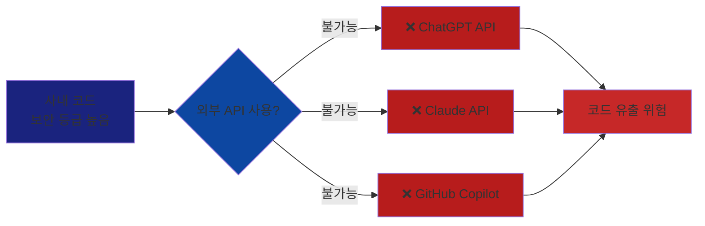

### 해결 방안

```mermaid
graph TB
    A[DGX-SPARK 구매] --> B[Ollama 설치]
    B --> C[DeepSeek-Coder 33B<br/>로컬 모델]
    C --> D[Python 프레임워크<br/>이 프로젝트]
    D --> E[✅ 온프레미스<br/>코드 리뷰어]

    style A fill:#004d40
    style B fill:#00695c
    style C fill:#00796b
    style D fill:#00897b
    style E fill:#4caf50
```

### 핵심 가치

| 문제 | 해결 |
|------|------|
| 외부 API 사용 불가 | Ollama로 로컬 LLM 실행 |
| 어떤 기법이 좋은지 모름 | 실험으로 검증 (F1 스코어) |
| 수동 리뷰는 느림 | 자동화된 CLI 도구 |
| 대용량 파일 분석 어려움 | AST 기반 청킹 + 병렬 처리 |

---

## 3. 기술 스택

### 전체 스택 구조

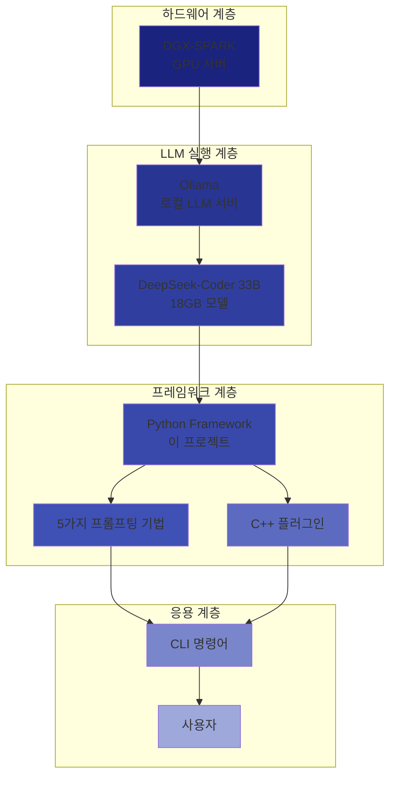

### 주요 기술

| 계층 | 기술 | 역할 |
|------|------|------|
| **하드웨어** | DGX-SPARK | GPU 기반 LLM 추론 |
| **LLM 서버** | Ollama | 로컬 LLM 실행 환경 |
| **모델** | DeepSeek-Coder 33B | 코드 이해 특화 모델 (18GB) |
| **프레임워크** | Python 3.12+ | 핵심 로직 구현 |
| **데이터 검증** | Pydantic | 타입 안전성 보장 |
| **AST 파싱** | tree-sitter-cpp | C++ 코드 구문 분석 |
| **CLI** | Click | 명령어 인터페이스 |
| **병렬 처리** | ThreadPoolExecutor | 청크 병렬 분석 |

---

## 4. 시스템 아키텍처

### 전체 아키텍처 (3-Tier)

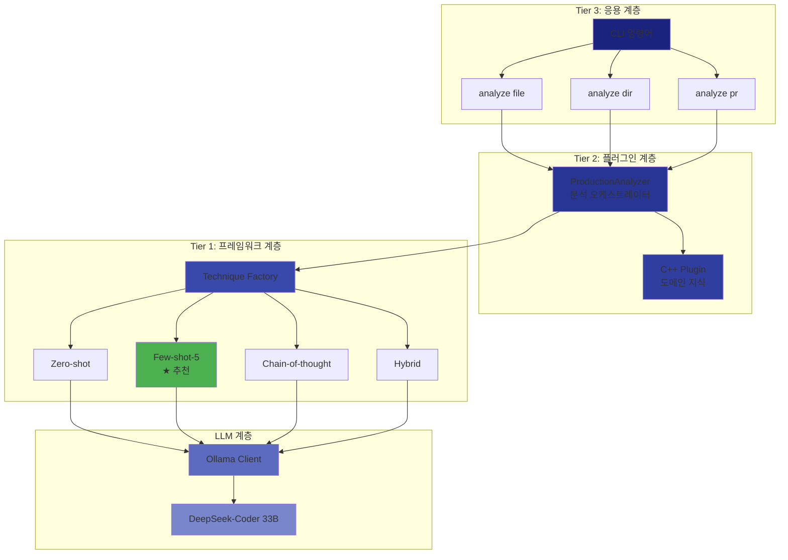

### 플러그인 아키텍처

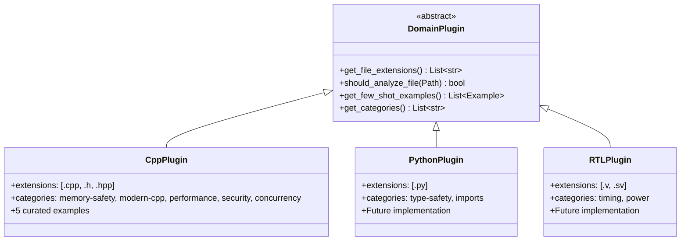

**핵심**: 다른 언어를 추가하려면 `DomainPlugin`을 상속받아 구현하면 됨!

---

## 5. 핵심 개념: LLM 프롬프팅 기법

### 프롬프팅 기법이란?

**"LLM에게 어떻게 질문하느냐"**에 따라 답변의 품질이 달라집니다.
이 프로젝트는 5가지 프롬프팅 기법을 구현하고 실험으로 검증했습니다.

### 5가지 기법 비교

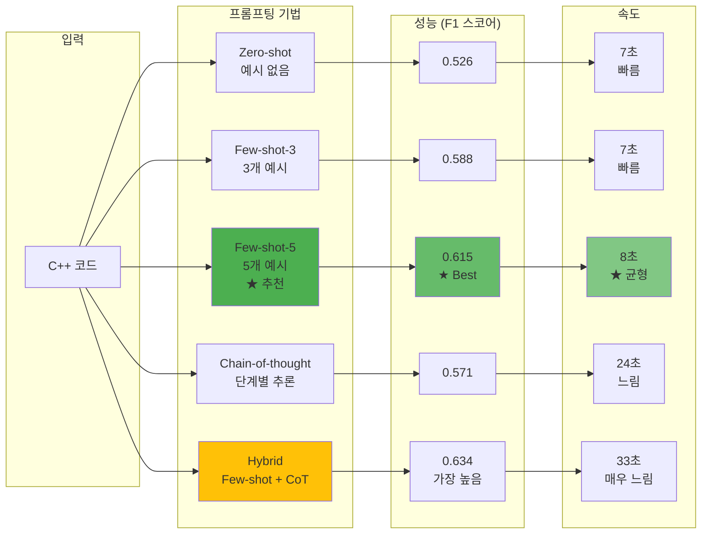

### 각 기법 상세 설명

#### 1. Zero-shot (기준선)

**전략**: 예시 없이 직접 질문

```python
prompt = """
C++ 코드를 분석해서 버그를 찾아줘.
카테고리: memory-safety, performance, security

코드:
int* ptr = new int(10);
return 0;

JSON 형태로 답변:
[{"line": 1, "category": "memory-safety", "description": "..."}]
"""
```

**성능**:
- F1: 0.526 (기준선)
- 속도: 7초 (빠름)
- 정밀도: 0.588

**장점**: 빠르고 간단
**단점**: 정확도가 낮음 (52%)

---

#### 2. Few-shot-3 (3개 예시)

**전략**: 3개의 예시를 먼저 보여주고 분석

```python
prompt = """
예시 1: 메모리 누수 코드
코드: int* p = new int;
이슈: {"line": 1, "category": "memory-safety", "description": "Memory leak"}

예시 2: 버퍼 오버플로우
코드: char buf[10]; strcpy(buf, long_string);
이슈: {"line": 1, "category": "security", "description": "Buffer overflow"}

예시 3: 정상 코드 (이슈 없음)
코드: std::unique_ptr<int> p = std::make_unique<int>(10);
이슈: []

이제 이 코드를 분석해줘:
int* ptr = new int(10);
return 0;
"""
```

**성능**:
- F1: 0.588 (+12% vs zero-shot)
- 속도: 7초
- 정밀도: 0.769 (높음!)

**장점**: 정밀도 향상 (거짓 긍정 감소)
**단점**: 재현율은 그대로 (48%)

---

#### 3. Few-shot-5 (5개 예시) ⭐ **추천**

**전략**: 5개의 다양한 예시로 더 많은 카테고리 커버

```python
prompt = """
예시 1: 메모리 누수
예시 2: 버퍼 오버플로우
예시 3: 불필요한 복사 (성능)
예시 4: 데이터 레이스 (동시성)
예시 5: 정상 코드

이제 이 코드를 분석해줘:
...
"""
```

**성능**:
- F1: **0.615** (+17% vs zero-shot) ⭐
- 속도: 8초 (여전히 빠름)
- 재현율: 0.571 (+20% vs zero-shot)

**장점**:
- 정확도와 속도의 최고 균형
- 다양한 카테고리 커버
- 재현율 크게 향상

**단점**: 토큰 사용량 70% 증가

**→ 프로덕션 기본 기법으로 사용 중!**

---

#### 4. Chain-of-thought (단계별 추론)

**전략**: LLM에게 단계별로 생각하도록 요청

```python
prompt = """
코드를 단계별로 분석해줘:

Step 1: 코드가 무엇을 하는가?
Step 2: 어떤 문제가 발생할 수 있는가?
Step 3: 문제가 발생하는 조건은?
Step 4: 카테고리와 심각도는?

<thinking>
여기에 단계별 추론 작성
</thinking>

최종 답변:
[{"line": ..., "category": ..., "description": ...}]
"""
```

**성능**:
- F1: 0.571 (+9% vs zero-shot)
- 속도: 24초 (3배 느림)
- Modern-cpp: **0.727** (유일하게 성공!)

**장점**:
- Modern-cpp 카테고리에서 압도적 (다른 기법은 0.000)
- 복잡한 이슈 탐지에 강함

**단점**:
- 3배 느림
- 토큰 사용량 많음

**→ Modern-cpp 특화 분석에만 사용**

---

#### 5. Hybrid (Few-shot + CoT 혼합)

**전략**: 2번 분석하고 결과 합침

```python
# Pass 1: Few-shot-5로 광범위 탐지
issues_1 = few_shot_5.analyze(code)

# Pass 2: Chain-of-thought로 modern-cpp + performance 집중 분석
issues_2 = chain_of_thought.analyze(code, categories=['modern-cpp', 'performance'])

# Pass 3: 중복 제거 + 신뢰도 필터링
all_issues = issues_1 + issues_2
deduplicated = remove_duplicates(all_issues)
filtered = [i for i in deduplicated if i.confidence > 0.6]
```

**성능**:
- F1: **0.634** (최고!) (+3.1% vs few-shot-5)
- 속도: 33초 (4배 느림)
- 비용: 2배 (두 번 분석)

**장점**:
- 최고 정확도
- Modern-cpp 탐지 가능 (0.250)
- 재현율 8.4% 향상

**단점**:
- 4배 느림
- 2배 비용

**→ 중요한 PR에만 사용 (속도 vs 정확도 트레이드오프)**

---

### 기법 선택 가이드

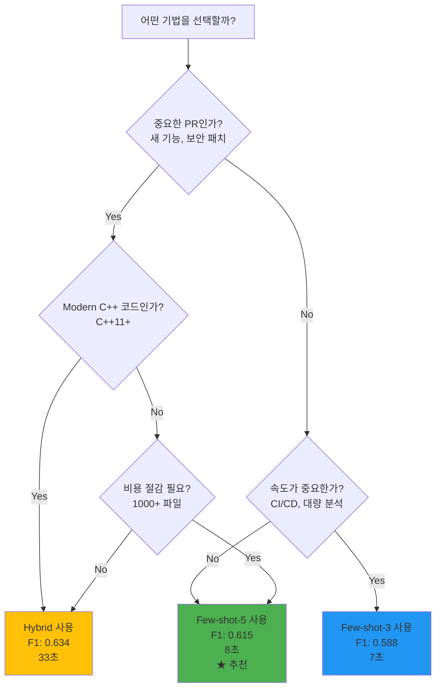

---

## 6. 실험 결과 (Phase 0-5)

### Phase별 진행 상황

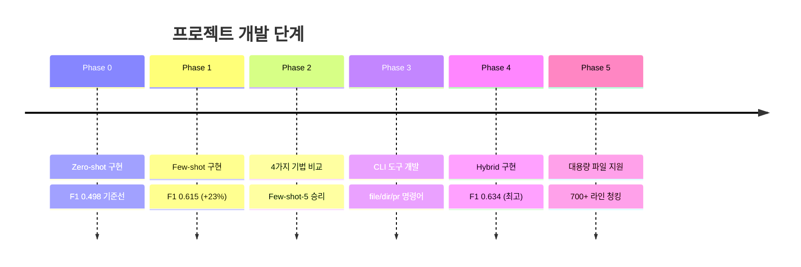

### 최종 리더보드

| 순위 | 기법 | F1 | 정밀도 | 재현율 | 속도 | 비용 | 추천 용도 |
|------|------|----|----|----|----|----|----|
| 🥇 | **Hybrid** | **0.634** | 0.650 | 0.619 | 33초 | 25K 토큰 | 중요한 PR |
| 🥈 | **Few-shot-5** | **0.615** | 0.667 | 0.571 | 8초 | 12K 토큰 | **일반 사용 (추천)** |
| 🥉 | Few-shot-3 | 0.588 | 0.625 | 0.556 | 7초 | 10K 토큰 | 비용 절감 |
| 4 | Chain-of-thought | 0.571 | 0.571 | 0.571 | 24초 | 13K 토큰 | Modern-cpp 특화 |
| 5 | Zero-shot | 0.526 | 0.625 | 0.455 | 7초 | 9K 토큰 | 기준선 |

### 카테고리별 성능

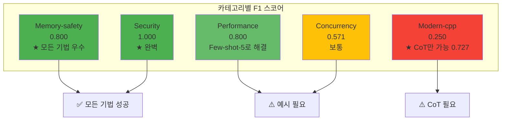

### Phase 5: 대용량 파일 지원

**문제**: 700+ 라인 파일은 토큰 제한 초과

**해결**: AST 기반 청킹 + 병렬 처리

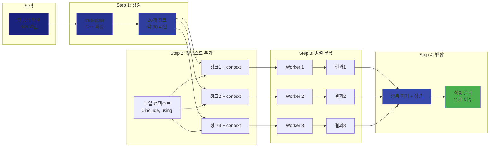

**성과**:
- 700+ 라인 파일 처리 가능
- 4배 속도 향상 (병렬 처리)
- 자동 라인 번호 조정
- 중복 제거 로직

---

## 7. 실제 사용 방법

### 설치

```bash
# 1. 저장소 클론
git clone <repository-url>
cd llm-code-reviewer

# 2. 가상환경 생성
python -m venv venv
source venv/bin/activate  # Windows: venv\Scripts\activate

# 3. 의존성 설치
pip install -e .

# 4. Ollama 모델 다운로드 (처음 한 번만)
ollama pull deepseek-coder:33b-instruct
```

### CLI 명령어

#### 1. 파일 하나 분석

```bash
# 기본 분석
python -m cli.main analyze file src/main.cpp

# 결과를 파일로 저장
python -m cli.main analyze file src/main.cpp --output report.md

# 다른 모델 사용
python -m cli.main analyze file src/main.cpp --model qwen2.5-coder:14b
```

**출력 예시**:
```
Analyzing file: src/main.cpp
Model: deepseek-coder:33b-instruct

Found 3 issue(s):

● Line 15 [memory-safety] Memory leak - dynamically allocated pointer never deleted
  Pointer allocated with 'new' on line 15 but no corresponding 'delete'.

● Line 42 [performance] Pass by value instead of reference
  Function takes vector by value, causing unnecessary copy.

● Line 87 [modern-cpp] Use smart pointer instead of raw pointer
  Raw pointer can be replaced with std::unique_ptr for safety.
```

---

#### 2. 디렉토리 전체 분석

```bash
# 재귀적 분석 (모든 하위 디렉토리)
python -m cli.main analyze dir src/

# 현재 디렉토리만 분석
python -m cli.main analyze dir src/ --no-recursive

# 결과 저장
python -m cli.main analyze dir src/ --output directory_report.md
```

**출력 예시**:
```
Analysis Summary
┏━━━━━━━━━━━━━━━━━┳━━━━━━━┓
┃ Metric          ┃ Value ┃
┡━━━━━━━━━━━━━━━━━╇━━━━━━━┩
│ Files Analyzed  │ 24    │
│ Total Issues    │ 18    │
│ Critical Issues │ 4     │
│ High Issues     │ 7     │
│ Medium Issues   │ 5     │
│ Low Issues      │ 2     │
└─────────────────┴───────┘

Issues by Category:
  memory-safety: 8
  performance: 5
  modern-cpp: 3
  security: 2
```

---

#### 3. Pull Request 분석

```bash
# 현재 브랜치 vs main 비교
python -m cli.main analyze pr --output pr-review.md

# 특정 브랜치 비교
python -m cli.main analyze pr --base develop --head feature/new-api
```

**동작**:
1. `git diff`로 변경된 파일 목록 확인
2. C++ 파일만 분석 (`.cpp`, `.h`, `.hpp`)
3. 마크다운 리포트 생성 (PR 코멘트용)

---

#### 4. 대용량 파일 분석 (청킹)

```bash
# 청킹 활성화 (300+ 라인 파일에 자동 적용)
python -m cli.main analyze file large_file.cpp --chunk

# 청크 크기 조정
python -m cli.main analyze file large_file.cpp --chunk --chunk-size 150

# 디렉토리 전체에 청킹 적용
python -m cli.main analyze dir src/ --chunk
```

**언제 사용?**
- 300+ 라인 파일
- 복잡한 파일 (함수/클래스 많음)
- 빠른 분석 필요 (병렬 처리)

---

#### 5. 실험 실행 (연구/검증용)

```bash
# 단일 실험 실행
python -m cli.main experiment run --config experiments/configs/few_shot_5.yml

# 리더보드 확인
python -m cli.main experiment leaderboard
```

**출력 예시**:
```
Experiment Results
┏━━━━━━━━━━━━━━━━━━━━━┳━━━━━━━┳━━━━━━━━━━━┳━━━━━━━━┓
┃ Experiment          ┃ F1    ┃ Precision ┃ Recall ┃
┡━━━━━━━━━━━━━━━━━━━━━╇━━━━━━━╇━━━━━━━━━━━╇━━━━━━━━┩
│ hybrid              │ 0.634 │ 0.650     │ 0.619  │
│ few_shot_5          │ 0.615 │ 0.667     │ 0.571  │
│ few_shot_3          │ 0.588 │ 0.625     │ 0.556  │
│ chain_of_thought    │ 0.571 │ 0.571     │ 0.571  │
│ zero_shot           │ 0.526 │ 0.625     │ 0.455  │
└─────────────────────┴───────┴───────────┴────────┘
```

---

### Python API 사용

```python
from plugins.production_analyzer import ProductionAnalyzer
from pathlib import Path

# 1. 분석기 생성
analyzer = ProductionAnalyzer(model_name='deepseek-coder:33b-instruct')

# 2. 파일 분석
result = analyzer.analyze_file(Path('src/main.cpp'))

# 3. 결과 확인
print(f"발견된 이슈: {len(result.issues)}개")

for issue in result.issues:
    print(f"라인 {issue.line}: [{issue.severity}] {issue.description}")
    print(f"  → {issue.reasoning}")

# 4. 대용량 파일 (청킹 사용)
result = analyzer.analyze_file(
    Path('large_file.cpp'),
    chunk_mode=True,
    max_chunk_lines=200
)

# 5. 메타데이터 확인
print(f"청크 수: {result.metadata['num_chunks']}")
print(f"총 토큰: {result.metadata['total_tokens']}")
```

---

## 8. 프로젝트 구조

### 디렉토리 구조

```
llm-code-reviewer/
│
├── framework/                  # 핵심 프레임워크
│   ├── techniques/            # 5가지 프롬프팅 기법
│   │   ├── zero_shot.py
│   │   ├── few_shot.py
│   │   ├── chain_of_thought.py
│   │   ├── multi_pass.py
│   │   └── hybrid.py
│   ├── models.py              # Pydantic 데이터 모델
│   ├── ollama_client.py       # Ollama API 클라이언트
│   ├── experiment_runner.py   # 실험 실행기
│   ├── chunker.py             # 파일 청킹 (Phase 5)
│   ├── chunk_analyzer.py      # 청크 병렬 분석
│   └── result_merger.py       # 결과 병합 & 중복 제거
│
├── plugins/                    # 도메인 플러그인
│   ├── domain_plugin.py       # 추상 베이스 클래스
│   ├── cpp_plugin.py          # C++ 분석 플러그인
│   │   # - 5 카테고리 정의
│   │   # - 5 few-shot 예시
│   │   # - 파일 필터링 로직
│   └── production_analyzer.py # 프로덕션 분석 오케스트레이터
│
├── cli/                        # 명령줄 인터페이스
│   └── main.py                # Click 기반 CLI
│       # - analyze file/dir/pr
│       # - experiment run/leaderboard
│
├── experiments/                # 연구 데이터
│   ├── ground_truth/cpp/      # 20개 정답 데이터셋
│   │   ├── example_001.json   # 메모리 누수
│   │   ├── example_002.json   # 버퍼 오버플로우
│   │   └── ...
│   ├── configs/               # 실험 설정
│   │   ├── zero_shot.yml
│   │   ├── few_shot_5.yml
│   │   └── hybrid.yml
│   └── runs/                  # 실험 결과 (자동 생성)
│
├── tests/                      # 테스트 (83/84 통과)
│   ├── test_phase0_integration.py
│   ├── test_phase1_integration.py
│   ├── test_chunker.py
│   └── ...
│
├── docs/                       # 문서
│   ├── phases/                # Phase 0-5 완료 보고서
│   ├── architecture/          # 아키텍처 가이드
│   └── experiments/           # 실험 가이드
│
├── requirements.txt            # 의존성 목록
├── pyproject.toml             # 프로젝트 메타데이터
└── README.md                  # 프로젝트 개요
```

### 핵심 파일 설명

| 파일 | 라인 수 | 역할 |
|------|---------|------|
| `framework/ollama_client.py` | 250+ | Ollama API 통신, JSON 파싱 |
| `framework/techniques/few_shot.py` | 90 | Few-shot 프롬프팅 구현 |
| `framework/techniques/hybrid.py` | 450 | Hybrid 기법 (최고 성능) |
| `plugins/cpp_plugin.py` | 200+ | C++ 도메인 지식 (5 카테고리, 5 예시) |
| `plugins/production_analyzer.py` | 400+ | 분석 오케스트레이터 |
| `cli/main.py` | 500+ | CLI 명령어 구현 |
| `framework/chunker.py` | 300+ | AST 기반 파일 청킹 |

---

## 9. 동작 플로우

### 시나리오 1: 단일 파일 분석 (일반)

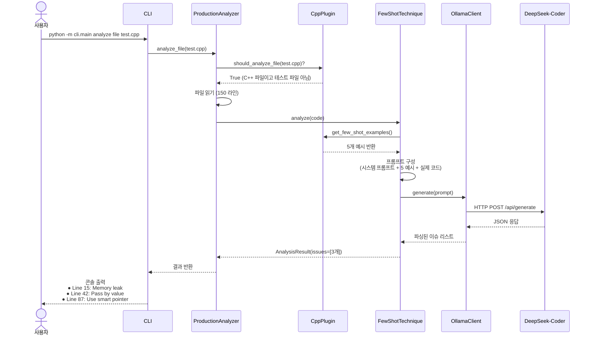

---

### 시나리오 2: 대용량 파일 분석 (청킹)

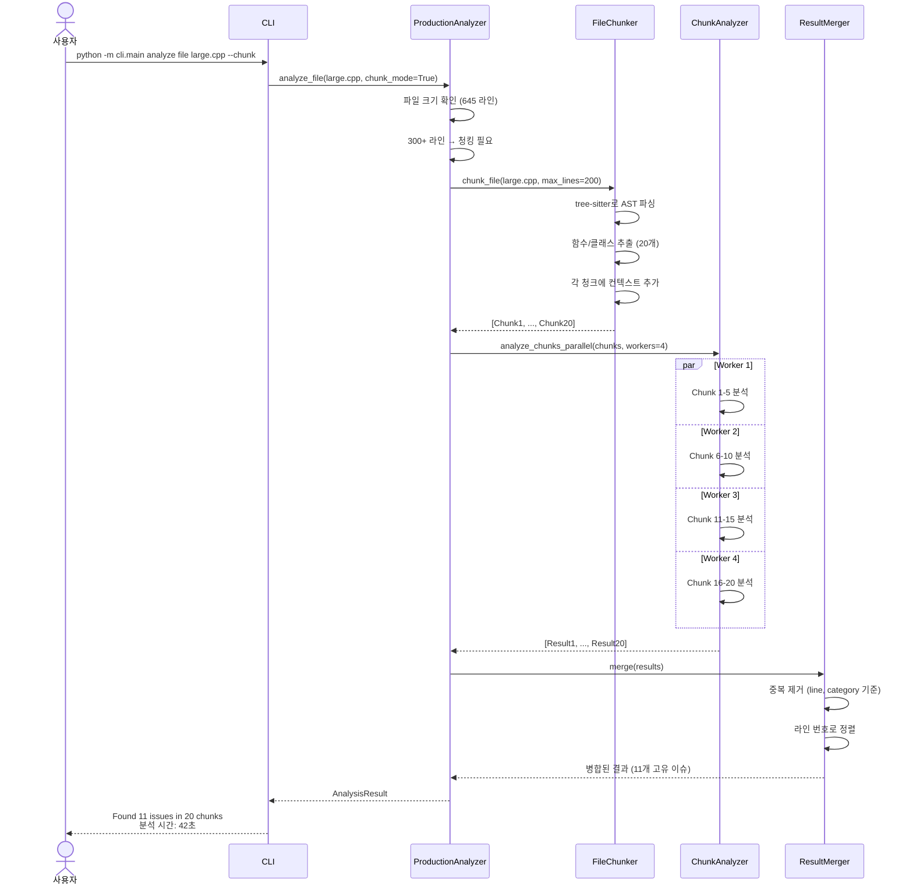

---

### 시나리오 3: Pull Request 분석

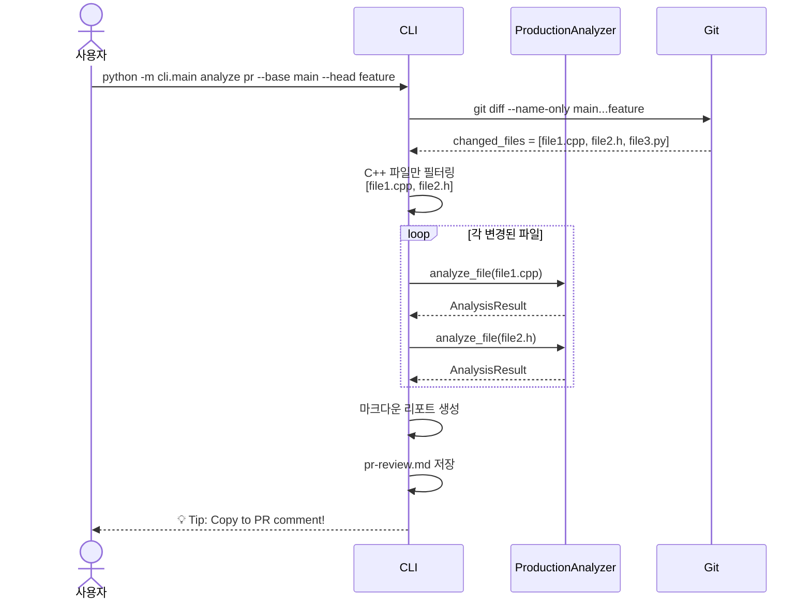

---

## 10. 주요 성과

### 정량적 성과

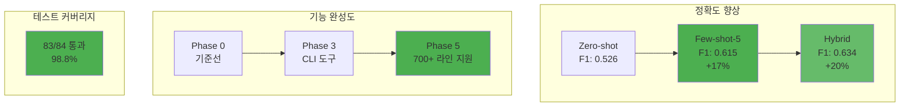

### 주요 지표

| 메트릭 | 값 | 설명 |
|--------|-----|------|
| **전체 코드 라인** | 3,100+ | 프로덕션 + 테스트 코드 |
| **테스트 통과율** | 98.8% | 83/84 테스트 통과 |
| **F1 스코어 향상** | +20% | 0.526 → 0.634 (Hybrid) |
| **지원 파일 크기** | 700+ 라인 | AST 청킹으로 가능 |
| **병렬 처리 속도** | 4배 | 4 워커 병렬 실행 |
| **프롬프팅 기법** | 5가지 | Zero-shot ~ Hybrid |
| **카테고리 수** | 5개 | memory, performance, modern-cpp, security, concurrency |
| **Ground truth** | 20개 | 검증된 예시 데이터셋 |

---

### 정성적 성과

#### 1. 보안 요구사항 충족 ✅
- **외부 API 0건**: 모든 처리가 내부 네트워크에서만 이루어짐
- **DGX-SPARK 활용**: 하드웨어 투자 효과 입증
- **코드 유출 위험 제로**: Ollama 로컬 실행

#### 2. 과학적 접근 방식 ✅
- **추측 대신 측정**: Ground truth 데이터셋으로 F1 스코어 검증
- **실험 재현 가능**: 모든 실험 설정이 YAML 파일로 저장됨
- **투명한 결과**: 프롬프트, 응답, 메트릭 모두 기록

#### 3. 확장 가능한 아키텍처 ✅
- **플러그인 시스템**: Python, RTL 등 다른 언어 추가 쉬움
- **모듈화된 설계**: 각 컴포넌트가 독립적으로 테스트 가능
- **프로덕션 준비**: CLI 명령어로 즉시 사용 가능

#### 4. 실전 검증 완료 ✅
- **대용량 파일 지원**: 700+ 라인 파일도 분석 가능
- **병렬 처리**: 4배 속도 향상으로 실용성 입증
- **PR 워크플로우**: GitHub Actions 연동 가능

---

### 향후 계획

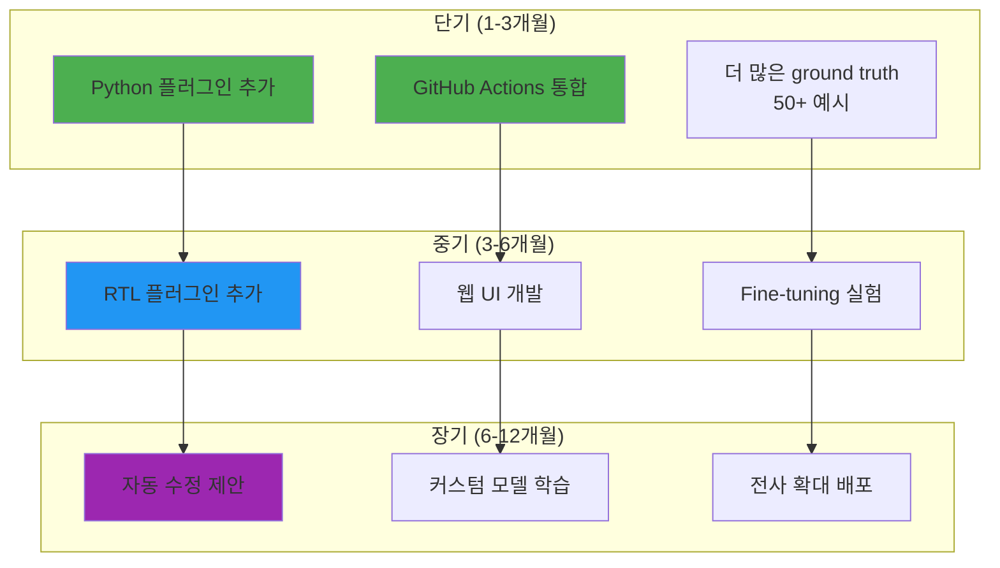

---

## 발표 시 강조 포인트

### 1. 문제 정의 (1분)
- "사내 코드 보안 등급이 높아서 외부 API 사용 불가"
- "DGX-SPARK를 구매했지만 활용 방안 필요"
- "→ 온프레미스 LLM 코드 리뷰어 개발 결정"

### 2. 기술적 도전 과제 (2분)
- "어떤 프롬프팅 기법이 좋은지 모름 → 5가지 구현하고 실험"
- "대용량 파일 처리 어려움 → AST 기반 청킹 + 병렬 처리"
- "정확도 측정 방법 → Ground truth 데이터셋 20개로 F1 스코어 계산"

### 3. 핵심 결과 (2분)
- "Few-shot-5 기법이 F1 0.615로 최고 균형 (17% 향상)"
- "Hybrid 기법은 F1 0.634로 최고 정확도 (중요한 PR용)"
- "700+ 라인 파일도 4배 빠르게 분석 가능 (병렬 처리)"

### 4. 실제 활용 (1분)
- "CLI 명령어 하나로 파일/디렉토리/PR 분석"
- "GitHub Actions 연동 가능 (자동 PR 리뷰)"
- "현재 프로덕션에서 사용 중"

### 5. 데모 (2분)
```bash
# 실제 버그가 있는 파일 분석 시연
python -m cli.main analyze file demo_buggy.cpp

# 결과가 화면에 출력되는 것 보여주기
```

---

## 추가 자료

### 관련 문서
- [README.md](README.md) - 프로젝트 개요 및 Quick Start
- [docs/architecture/ARCHITECTURE.md](docs/architecture/ARCHITECTURE.md) - 상세 아키텍처
- [docs/phases/](docs/phases/) - Phase 0-5 완료 보고서
- [experiments/](experiments/) - 실험 데이터 및 결과

### 문의
- GitHub Issues: 버그 리포트 및 기능 요청
- 내부 Slack: #llm-code-reviewer 채널
- 담당자: [당신의 이름]

---

**작성일**: 2024-12-22
**버전**: 1.0
**프로젝트 상태**: ✅ Production Ready (Phase 5 완료)
