# Architecture Guide

**C++ LLM Code Reviewer - Complete Architecture Documentation**

This document explains how the entire system works, from high-level concepts to implementation details.

---

## Table of Contents

1. [Overview](#overview)
2. [System Architecture](#system-architecture)
3. [Core Components](#core-components)
4. [Data Flow](#data-flow)
5. [Technique System](#technique-system)
6. [Plugin Architecture](#plugin-architecture)
7. [Large File Support](#large-file-support)
8. [Example Walkthrough](#example-walkthrough)

---

## Overview

### What is this project?

A **domain-agnostic LLM code analysis platform** that uses Large Language Models (Ollama) to review code and find bugs. While it currently supports C++, the architecture is designed to support any programming language through plugins.

### Key Features

- 🎯 **Multiple Analysis Techniques**: Zero-shot, Few-shot, Chain-of-Thought, Hybrid
- 🔌 **Plugin Architecture**: Easy to add new languages (C++, Python, RTL, etc.)
- 📊 **Experiment Framework**: Compare techniques with F1 scores
- 🚀 **Production Ready**: CLI for file/directory/PR analysis
- 📦 **Large File Support**: Handles 700+ line files via chunking
- 🤖 **Local LLMs**: Uses Ollama (no API keys needed)

---

## System Architecture

### High-Level Overview


### Three-Layer Architecture


**Layer 1**: Domain-agnostic analysis techniques
**Layer 2**: Language-specific plugins (C++, Python, etc.)
**Layer 3**: User-facing applications (CLI, API, etc.)

---

## Core Components

### 1. ProductionAnalyzer

**Location**: `plugins/production_analyzer.py`

**Purpose**: Main orchestrator for code analysis.

```mermaid
graph TD
    PA[ProductionAnalyzer]
    PA --> Init[Initialize with Plugin & Model]
    Init --> File[analyze_file]
    Init --> Dir[analyze_directory]
    Init --> PR[analyze_pull_request]

    File --> Check{File Size?}
    Check -->|< 300 lines| Direct[Direct Analysis]
    Check -->|≥ 300 lines| Chunk[Chunked Analysis]

    Direct --> Technique[Analysis Technique]
    Chunk --> Chunker[FileChunker]
    Chunker --> Multiple[Multiple Chunks]
    Multiple --> Parallel[Parallel Analysis]
    Parallel --> Merge[ResultMerger]

    Technique --> Result[AnalysisResult]
    Merge --> Result

    style PA fill:#e65100,color:#fff
    style Check fill:#f9a825,color:#fff
    style Result fill:#2e7d32,color:#fff
```



**Key Methods**:

```python
class ProductionAnalyzer:
    def analyze_file(self, file_path: Path, chunk_mode: bool = False) -> AnalysisResult:
        """
        Analyze a single file.

        Flow:
        1. Check if file should be analyzed (plugin filter)
        2. Read file content
        3. If chunking enabled and file > threshold:
           a. FileChunker splits into chunks
           b. ChunkAnalyzer analyzes each chunk in parallel
           c. ResultMerger combines results
        4. Otherwise: Direct analysis with technique
        5. Return AnalysisResult with issues
        """
```

### 2. Analysis Techniques

**Location**: `framework/techniques/`

All techniques implement `BaseTechnique` interface:

```python
class BaseTechnique(ABC):
    @abstractmethod
    def analyze(self, request: AnalysisRequest) -> AnalysisResult:
        """Analyze code and return issues."""
        pass
```

#### Available Techniques


**Winner**: Few-Shot-5 (F1=0.615) for production, Hybrid (F1=0.634) for best performance.

### 3. Domain Plugins

**Location**: `plugins/`

Plugins provide language-specific knowledge:

```python
class DomainPlugin(ABC):
    @abstractmethod
    def get_file_extensions(self) -> List[str]:
        """Return supported file extensions."""

    @abstractmethod
    def should_analyze_file(self, file_path: Path) -> bool:
        """Return True if file should be analyzed."""

    @abstractmethod
    def get_few_shot_examples(self) -> List[Example]:
        """Return few-shot examples for this domain."""

    @abstractmethod
    def get_categories(self) -> List[str]:
        """Return issue categories for this domain."""
```

**C++ Plugin Example**:

```python
class CppPlugin(DomainPlugin):
    def get_file_extensions(self) -> List[str]:
        return ['.cpp', '.cc', '.cxx', '.h', '.hpp']

    def should_analyze_file(self, file_path: Path) -> bool:
        # Skip test files, third-party, etc.
        if 'test' in file_path.name.lower():
            return False
        return True

    def get_categories(self) -> List[str]:
        return [
            'memory-safety',    # malloc/free, new/delete
            'concurrency',      # data races, deadlocks
            'performance',      # unnecessary copies
            'modern-cpp',       # C++11/14/17 features
            'correctness'       # logic errors
        ]
```

### 4. Large File Support (Phase 5)

**Components**: FileChunker, ChunkAnalyzer, ResultMerger


**FileChunker** (`framework/chunker.py`):
- Uses tree-sitter to parse C++ AST
- Extracts functions/classes as chunks (~200 lines each)
- Preserves context (includes, usings, namespaces)
- Fallback to line-based chunking if parse fails

**ChunkAnalyzer** (`framework/chunk_analyzer.py`):
- Analyzes each chunk independently
- Adds file-level context to each chunk
- Adjusts line numbers back to file coordinates
- Supports parallel processing (4 workers)

**ResultMerger** (`framework/result_merger.py`):
- Deduplicates issues by (line, category)
- Prefers issues with longer reasoning
- Combines metadata (tokens, latency, etc.)

---

## Data Flow

### Single File Analysis (No Chunking)


### Large File Analysis (With Chunking)


---

## Technique System

### How Techniques Work

Each technique is a strategy for prompting the LLM:

#### 1. Zero-Shot

```python
prompt = f"""
Analyze this C++ code for bugs:

{code}

Find issues in these categories:
- memory-safety
- concurrency
- performance

Return JSON: [{{"line": X, "category": "...", "description": "..."}}]
"""
```

**Pros**: Simple, no examples needed
**Cons**: Lower accuracy (F1=0.498)

#### 2. Few-Shot (Production Default)

```python
examples = plugin.get_few_shot_examples()  # 5 examples

prompt = f"""
I'll show you examples of C++ bugs, then analyze new code.

Example 1:
Code: int* p = new int; // never deleted
Issue: {{"line": 1, "category": "memory-safety", "description": "Memory leak"}}

Example 2:
... (4 more examples)

Now analyze this code:
{code}
"""
```

**Pros**: Best single technique (F1=0.615)
**Cons**: Requires curated examples

#### 3. Chain-of-Thought

```python
prompt = f"""
Analyze this code step-by-step:

Step 1: Read the code
Step 2: Identify potential issues
Step 3: For each issue:
   a. What is the bug?
   b. Why is it a problem?
   c. How severe is it?
Step 4: Return JSON with issues

Code:
{code}
"""
```

**Pros**: Better reasoning (F1=0.596)
**Cons**: Slower (more tokens)

#### 4. Hybrid (Best Performance)

```python
# Pass 1: Few-shot for broad coverage
few_shot_issues = few_shot_technique.analyze(code)

# Pass 2: Chain-of-thought for specific categories
cot_issues = cot_technique.analyze(code, categories=['memory-safety'])

# Pass 3: Deduplicate and filter by confidence
all_issues = few_shot_issues + cot_issues
deduplicated = deduplicate(all_issues)
filtered = [i for i in deduplicated if i.confidence > 0.7]
```

**Pros**: Best accuracy (F1=0.634)
**Cons**: 2x cost (two LLM calls)

---

## Plugin Architecture

### Why Plugins?

Different programming languages have different:
- **Bug patterns**: C++ has memory leaks, Python has type errors
- **Best practices**: C++17 features, Python 3.10 features
- **Code structure**: Classes, functions, modules
- **Tools**: Compilers, linters, formatters

**Solution**: Plugin system separates language-specific knowledge from core analysis.

### Plugin Interface


### Creating a New Plugin

**Example: Python Plugin** (not yet implemented)

```python
# plugins/python_plugin.py

from plugins.domain_plugin import DomainPlugin, Example

class PythonPlugin(DomainPlugin):
    def get_file_extensions(self) -> List[str]:
        return ['.py']

    def should_analyze_file(self, file_path: Path) -> bool:
        # Skip __init__.py, test files
        if file_path.name == '__init__.py':
            return False
        if 'test_' in file_path.name:
            return False
        return True

    def get_categories(self) -> List[str]:
        return [
            'type-safety',      # None checks, type hints
            'exception-handling',  # try/except
            'imports',          # circular imports
            'python-idioms'     # use list comprehension
        ]

    def get_few_shot_examples(self) -> List[Example]:
        return [
            Example(
                code="x = None\nprint(x.upper())",
                issues=[
                    Issue(
                        line=2,
                        category='type-safety',
                        description='AttributeError: NoneType has no attribute upper'
                    )
                ]
            ),
            # ... more examples
        ]
```

**Usage**:

```python
# Use Python plugin
analyzer = ProductionAnalyzer(plugin=PythonPlugin())
result = analyzer.analyze_file(Path('script.py'))
```

---

## Large File Support

### Problem

Files with 700+ lines:
- **Token limit exceeded**: Few-shot-5 uses ~500 tokens, leaving ~1500 for code. 700 lines = 3000-4000 tokens.
- **Context overload**: LLM forgets issues at the beginning by the end.
- **Slow**: 2-3+ minutes to analyze.

### Solution: Function-Level Chunking


### Key Implementation Details

#### Context Extraction

```python
def _extract_file_context(self, tree, code_text: str) -> str:
    """
    Extract file-level declarations that affect all functions.

    Extracts:
    - #include directives
    - using statements
    - namespace aliases
    """
    context_lines = []
    for node in tree.root_node.children:
        if node.type in ['preproc_include', 'using_declaration']:
            context_lines.append(code_text[node.start_byte:node.end_byte])
    return '\n'.join(context_lines)
```

**Result**: Each chunk gets necessary context without full file.

#### Line Number Adjustment

```python
def _adjust_line_numbers(self, result: AnalysisResult, chunk: Chunk) -> AnalysisResult:
    """
    Adjust line numbers from chunk coordinates to file coordinates.

    Example:
    - Context: 5 lines
    - Chunk starts at file line 100
    - Issue reported at line 8 (in chunk+context)
    - Adjusted: file line = 100 + (8 - 5 - 1) = 102
    """
    context_lines = len(chunk.context.split('\n'))

    for issue in result.issues:
        chunk_line = issue.line
        file_line = chunk.start_line + (chunk_line - context_lines - 2)

        # Clamp to chunk bounds
        file_line = max(chunk.start_line, min(file_line, chunk.end_line))
        issue.line = file_line

    return result
```

**Result**: Issues reference correct line numbers in original file.

#### Deduplication

```python
def _deduplicate_issues(self, issues: List[Issue]) -> List[Issue]:
    """
    Remove duplicate issues across chunks.

    Strategy:
    1. Group by (line, category)
    2. Within group, keep issue with longest reasoning
    """
    groups = {}
    for issue in issues:
        key = (issue.line, issue.category)
        if key not in groups:
            groups[key] = []
        groups[key].append(issue)

    deduplicated = []
    for group in groups.values():
        # Keep most detailed issue
        best = max(group, key=lambda i: len(i.reasoning))
        deduplicated.append(best)

    return sorted(deduplicated, key=lambda i: i.line)
```

**Result**: No duplicate issues at chunk boundaries.

---

## Example Walkthrough

Let's walk through a complete analysis to see how all pieces fit together.

### User Command

```bash
python -m cli.main analyze file example.cpp --chunk
```

### Step-by-Step Execution

#### 1. CLI Entry Point

```python
# cli/main.py

@cli.command()
@click.argument('file_path')
@click.option('--chunk/--no-chunk', default=False)
def file(file_path: str, chunk: bool):
    # Create analyzer
    analyzer = ProductionAnalyzer(
        plugin=CppPlugin(),
        model_name='deepseek-coder:33b-instruct'
    )

    # Analyze file
    result = analyzer.analyze_file(
        Path(file_path),
        chunk_mode=chunk
    )

    # Display results
    console.print(f"Found {len(result.issues)} issue(s)")
    for issue in result.issues:
        console.print(f"Line {issue.line}: {issue.description}")
```

#### 2. ProductionAnalyzer Decision

```python
# plugins/production_analyzer.py

def analyze_file(self, file_path: Path, chunk_mode: bool = False) -> AnalysisResult:
    # Check if file should be analyzed
    if not self.plugin.should_analyze_file(file_path):
        return None  # Skip

    # Read file
    code = file_path.read_text()
    lines = len(code.split('\n'))

    # Decision: chunk or direct?
    if chunk_mode and lines > 300:
        return self._analyze_chunked(file_path, max_chunk_lines=200)
    else:
        return self._analyze_direct(code)
```

**In our example**: File has 645 lines → Use chunking

#### 3. Chunking Process

```python
# framework/chunker.py

def chunk_file(self, file_path: Path) -> List[Chunk]:
    # Parse with tree-sitter
    tree = self.parser.parse(file_path.read_bytes())

    # Extract file context
    context = self._extract_file_context(tree, code_text)
    # context = "#include <iostream>\n#include <vector>\nusing namespace std;"

    # Extract functions/classes
    chunks = []
    for node in tree.root_node.children:
        if node.type == 'function_definition':
            chunk = self._create_chunk_from_node(node, file_path, code_text, context)
            chunks.append(chunk)

    return chunks  # 20 chunks
```

**Result**: 20 chunks, each ~30 lines of code + 3 lines of context

#### 4. Parallel Analysis

```python
# framework/chunk_analyzer.py

def analyze_chunks_parallel(self, chunks: List[Chunk], max_workers: int = 4):
    results = []

    with ThreadPoolExecutor(max_workers=4) as executor:
        # Submit all chunks
        futures = {
            executor.submit(self.analyze_chunk, chunk): chunk
            for chunk in chunks
        }

        # Collect results
        for future in as_completed(futures):
            result = future.result()
            results.append(result)

    return results  # 20 results
```

**Timeline**: 20 chunks × 8 seconds each ÷ 4 workers = **40 seconds total**

#### 5. Individual Chunk Analysis

For each chunk:

```python
# framework/chunk_analyzer.py

def analyze_chunk(self, chunk: Chunk) -> AnalysisResult:
    # Combine context + code
    full_code = f"{chunk.context}\n\n{chunk.code}"
    # full_code = """
    # #include <iostream>
    # using namespace std;
    #
    # void processData(vector<int> data) {
    #     for (int i = 0; i < data.size(); i++) {
    #         cout << data[i] << endl;
    #     }
    # }
    # """

    # Analyze with technique
    request = AnalysisRequest(code=full_code, language='cpp')
    result = self.analyzer.technique.analyze(request)
    # result.issues = [
    #     Issue(line=6, category='performance', description='Pass by value'),
    #     Issue(line=7, category='modern-cpp', description='Use range-for')
    # ]

    # Adjust line numbers
    result = self._adjust_line_numbers(result, chunk)
    # result.issues[0].line = 23  # Adjusted to file coordinates
    # result.issues[1].line = 24

    return result
```

#### 6. Merge Results

```python
# framework/result_merger.py

def merge(self, chunk_results: List[AnalysisResult]) -> AnalysisResult:
    # Collect all issues
    all_issues = []
    for result in chunk_results:
        all_issues.extend(result.issues)
    # all_issues = 23 issues (some duplicates)

    # Deduplicate
    deduplicated = self._deduplicate_issues(all_issues)
    # deduplicated = 11 unique issues

    # Sort by line number
    sorted_issues = sorted(deduplicated, key=lambda i: i.line)

    # Combine metadata
    metadata = {
        'technique': 'chunked_analysis',
        'num_chunks': len(chunk_results),  # 20
        'total_tokens': sum(r.metadata['tokens_used'] for r in chunk_results),
        'total_latency': sum(r.metadata['latency'] for r in chunk_results)
    }

    return AnalysisResult(issues=sorted_issues, metadata=metadata)
```

#### 7. Display to User

```python
# cli/main.py (continued)

console.print(f"\nFound {len(result.issues)} issue(s):\n")

for issue in result.issues:
    severity_emoji = {
        'critical': '🔴',
        'warning': '🟡',
        'info': '🔵'
    }[issue.severity]

    console.print(f"{severity_emoji} Line {issue.line} [{issue.category}] {issue.description}")
    console.print(f"   {issue.reasoning}\n")
```

**Output**:

```
Analyzing file: example.cpp
Model: deepseek-coder:33b-instruct
Chunk mode: Enabled (max 200 lines per chunk)

Found 11 issue(s):

🔴 Line 10 [memory-safety] Memory leak - dynamically allocated array never deleted
   Array 'data' is allocated with 'new[]' but no corresponding 'delete[]'.

🟡 Line 23 [performance] Pass by value instead of reference
   Function takes vector by value, causing unnecessary copy.

🟡 Line 24 [modern-cpp] Use range-based for loop
   Traditional for loop can be replaced with range-for for safety.

... (8 more issues)

Analysis completed in 42.3 seconds (20 chunks, 4 workers)
```

---

## Summary

### Key Takeaways

1. **Three-Layer Architecture**: Framework → Plugins → Applications
2. **Plugin System**: Easy to add new languages (just implement DomainPlugin)
3. **Multiple Techniques**: Zero-shot, Few-shot, CoT, Hybrid (F1: 0.498 → 0.634)
4. **Production Ready**: Few-shot-5 technique (F1=0.615) used by default
5. **Large File Support**: Tree-sitter chunking handles 700+ line files in 40s
6. **Parallel Processing**: 4 workers analyze chunks concurrently

### Architecture Principles

- **Modularity**: Each component has single responsibility
- **Extensibility**: Add languages via plugins, add techniques via BaseTechnique
- **Testability**: 83/84 tests passing (98.8%)
- **Performance**: Parallel chunking for large files
- **Transparency**: F1 scores, ground truth, experiment tracking

### For Developers

- **Adding a language**: Implement `DomainPlugin` (see Python example above)
- **Adding a technique**: Inherit from `BaseTechnique` and implement `analyze()`
- **Modifying analysis**: Override `ProductionAnalyzer` methods
- **Adding commands**: Add Click commands to `cli/main.py`

---

**Next Steps**: See [DEVELOPER_GUIDE.md](./DEVELOPER_GUIDE.md) for hands-on tutorial.
