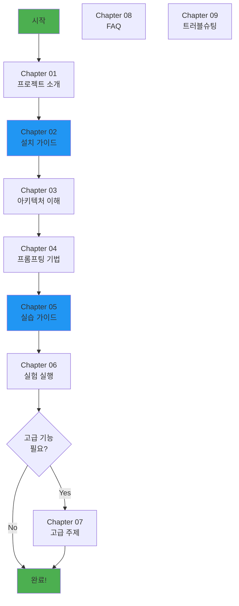

# LLM Code Reviewer - 완전 가이드

**초보자도 쉽게 따라하는 단계별 문서**

---

## 📚 학습 경로

이 문서는 LLM, AI, Python을 처음 접하는 C++ 개발자도 쉽게 따라올 수 있도록 설계되었습니다.

### 🎯 권장 학습 순서



---

## 📖 챕터별 가이드

### [Chapter 01: 프로젝트 소개](01-introduction.md)
**예상 소요 시간**: 10분

**학습 목표**:
- 프로젝트가 왜 필요한지 이해
- 핵심 개념 파악 (온프레미스, LLM, 프롬프팅)
- 전체 구조 개요

**이런 분들께 추천**:
- 처음 프로젝트를 접하는 분
- 발표 자료를 준비하는 분
- 프로젝트 배경을 이해하고 싶은 분

---

### [Chapter 02: 설치 가이드](02-installation.md)
**예상 소요 시간**: 30분

**학습 목표**:
- Ollama 설치 및 모델 다운로드
- Python 환경 구성
- 첫 번째 분석 실행

**이런 분들께 추천**:
- 실제로 프로젝트를 실행하고 싶은 분
- 환경 구성이 필요한 분

**사전 요구사항**:
- Python 3.12+ 설치됨
- 18GB 이상 디스크 공간 (모델 다운로드용)
- GPU 권장 (선택사항)

---

### [Chapter 03: 아키텍처 상세](03-architecture.md)
**예상 소요 시간**: 20분

**학습 목표**:
- 3-Tier 아키텍처 이해
- 각 컴포넌트의 역할 파악
- 코드 흐름 추적

**이런 분들께 추천**:
- 코드를 수정하거나 확장하려는 분
- 플러그인을 만들려는 분
- 아키텍처 설계를 이해하고 싶은 분

**사전 요구사항**:
- Python 기본 문법 이해
- 객체지향 개념 이해

---

### [Chapter 04: 프롬프팅 기법 상세](04-prompting-techniques.md)
**예상 소요 시간**: 30분

**학습 목표**:
- 5가지 프롬프팅 기법 완전 이해
- 각 기법의 장단점 파악
- 상황별 기법 선택 방법

**이런 분들께 추천**:
- 프롬프팅 기법을 깊이 이해하고 싶은 분
- 새로운 기법을 추가하려는 분
- 실험 결과를 해석하려는 분

**사전 요구사항**:
- Chapter 01 완료
- LLM 기본 개념 이해

---

### [Chapter 05: 실습 가이드](05-usage-guide.md)
**예상 소요 시간**: 45분

**학습 목표**:
- CLI 명령어 마스터
- 실제 프로젝트에 적용
- 결과 해석 및 활용

**이런 분들께 추천**:
- 실무에 바로 적용하고 싶은 분
- PR 리뷰 자동화를 원하는 분
- 다양한 사용 사례를 보고 싶은 분

**사전 요구사항**:
- Chapter 02 완료 (설치됨)
- Git 기본 명령어 이해

**포함 내용**:
- ✅ 파일 분석 실습
- ✅ 디렉토리 분석 실습
- ✅ PR 분석 실습
- ✅ 대용량 파일 분석 실습
- ✅ 결과 저장 및 활용

---

### [Chapter 06: 실험 실행 가이드](06-experiments.md)
**예상 소요 시간**: 60분

**학습 목표**:
- Ground truth 데이터셋 이해
- 실험 설정 및 실행
- 결과 분석 및 리더보드 생성

**이런 분들께 추천**:
- 새로운 기법을 평가하고 싶은 분
- Ground truth 데이터를 추가하려는 분
- 다른 모델과 비교하려는 분

**사전 요구사항**:
- Chapter 04 완료
- 통계 기본 개념 (F1 스코어, 정밀도, 재현율)

**포함 내용**:
- ✅ Ground truth 데이터셋 구조
- ✅ 실험 config 작성
- ✅ 실험 실행 및 모니터링
- ✅ 결과 분석 (F1, precision, recall)
- ✅ 리더보드 생성

---

### [Chapter 07: 고급 주제](07-advanced-topics.md)
**예상 소요 시간**: 60분

**학습 목표**:
- 새로운 언어 플러그인 만들기
- 커스텀 기법 구현
- 성능 최적화

**이런 분들께 추천**:
- Python 플러그인을 만들려는 분
- 새로운 프롬프팅 기법을 실험하려는 분
- 성능을 개선하려는 분

**사전 요구사항**:
- Chapter 03 완료
- Python 중급 이상 (상속, 추상 클래스)

**포함 내용**:
- ✅ 플러그인 개발 튜토리얼
- ✅ 커스텀 기법 구현
- ✅ 병렬 처리 최적화
- ✅ 토큰 효율성 개선
- ✅ GitHub Actions 통합

---

### [Chapter 08: 자주 묻는 질문 (FAQ)](08-faq.md)
**예상 소요 시간**: 15분

**학습 목표**:
- 자주 묻는 질문에 대한 답변
- 일반적인 오해 해소

**포함 내용**:
- ✅ 일반 질문 (프로젝트, 성능, 비용)
- ✅ 기술 질문 (Ollama, 모델, 기법)
- ✅ 사용 질문 (CLI, 결과 해석)
- ✅ 확장 질문 (다른 언어, 커스터마이징)

---

### [Chapter 09: 문제 해결 (Troubleshooting)](09-troubleshooting.md)
**예상 소요 시간**: 참고용

**학습 목표**:
- 일반적인 문제 진단 및 해결
- 에러 메시지 해석

**포함 내용**:
- ✅ 설치 문제
- ✅ Ollama 연결 문제
- ✅ 모델 로딩 문제
- ✅ 메모리 부족 문제
- ✅ 성능 문제
- ✅ 결과 품질 문제

---

## 🚀 빠른 시작 (5분)

바쁘신 분들을 위한 초간단 가이드:

```bash
# 1. 저장소 클론
git clone <repository-url>
cd llm-code-reviewer

# 2. 의존성 설치
pip install -e .

# 3. Ollama 모델 다운로드
ollama pull deepseek-coder:33b-instruct

# 4. 첫 분석 실행
python -m cli.main analyze file <your-cpp-file.cpp>
```

더 자세한 내용은 [Chapter 02: 설치 가이드](02-installation.md)를 참고하세요.

---

## 📊 학습 수준별 추천 경로

### 🟢 초급: "일단 써보고 싶어요"
1. ✅ Chapter 01 (소개)
2. ✅ Chapter 02 (설치)
3. ✅ Chapter 05 (실습) - 파일/디렉토리 분석만
4. ✅ Chapter 08 (FAQ)

**예상 소요**: 1시간

---

### 🔵 중급: "프로젝트를 이해하고 싶어요"
1. ✅ Chapter 01-05 (전체 기본 과정)
2. ✅ Chapter 04 (프롬프팅 기법 상세)
3. ✅ Chapter 06 (실험 실행)
4. ✅ Chapter 08-09 (FAQ, 트러블슈팅)

**예상 소요**: 3시간

---

### 🟣 고급: "프로젝트를 확장하고 싶어요"
1. ✅ Chapter 01-06 (전체)
2. ✅ Chapter 07 (고급 주제)
3. ✅ 실제 플러그인 개발 (Python/RTL)
4. ✅ 새로운 기법 실험

**예상 소요**: 1일

---

## 🎓 학습 자료

### 배경 지식 (선택사항)

LLM과 프롬프팅에 대해 더 알고 싶다면:

- **LLM 기초**: [Prompt Engineering Guide](https://www.promptingguide.ai/)
- **Few-shot Learning**: [OpenAI Few-shot Examples](https://platform.openai.com/docs/guides/prompt-engineering)
- **Chain-of-Thought**: [Chain-of-Thought Prompting](https://arxiv.org/abs/2201.11903)
- **Ollama 공식 문서**: https://ollama.ai/

### Python 기초 (필요한 경우)

- **Python 기본 문법**: [Python 공식 튜토리얼](https://docs.python.org/3/tutorial/)
- **Pydantic**: [Pydantic 문서](https://docs.pydantic.dev/)
- **Click (CLI)**: [Click 문서](https://click.palletsprojects.com/)

---

## 💬 도움 받기

### 문서 내에서 찾기
1. 먼저 [Chapter 08: FAQ](08-faq.md) 확인
2. 그 다음 [Chapter 09: Troubleshooting](09-troubleshooting.md) 확인

### 커뮤니티
- GitHub Issues: 버그 리포트 및 기능 요청
- 내부 Slack: #llm-code-reviewer

### 직접 연락
- 프로젝트 담당자: [당신의 이름]
- 이메일: [이메일 주소]

---

## 📝 문서 기여

이 문서에서 개선이 필요한 부분을 발견하셨나요?

1. GitHub에서 이슈 생성
2. Pull Request 제출
3. Slack에서 피드백 공유

**좋은 문서는 함께 만들어갑니다!**

---

## 🗺️ 다음 단계

준비되셨나요? [Chapter 01: 프로젝트 소개](01-introduction.md)부터 시작하세요!

---

**최종 업데이트**: 2024-12-22
**문서 버전**: 1.0
