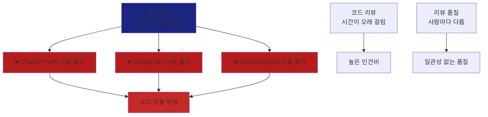
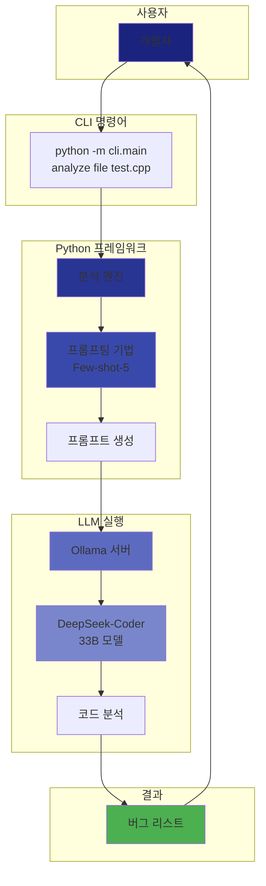
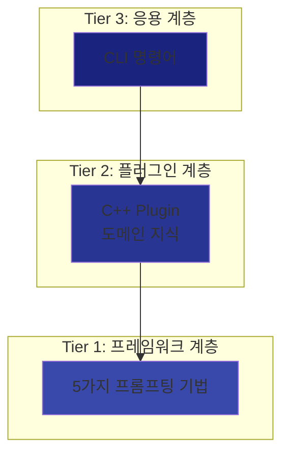
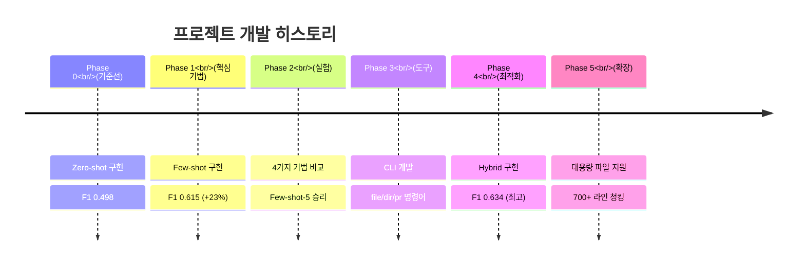
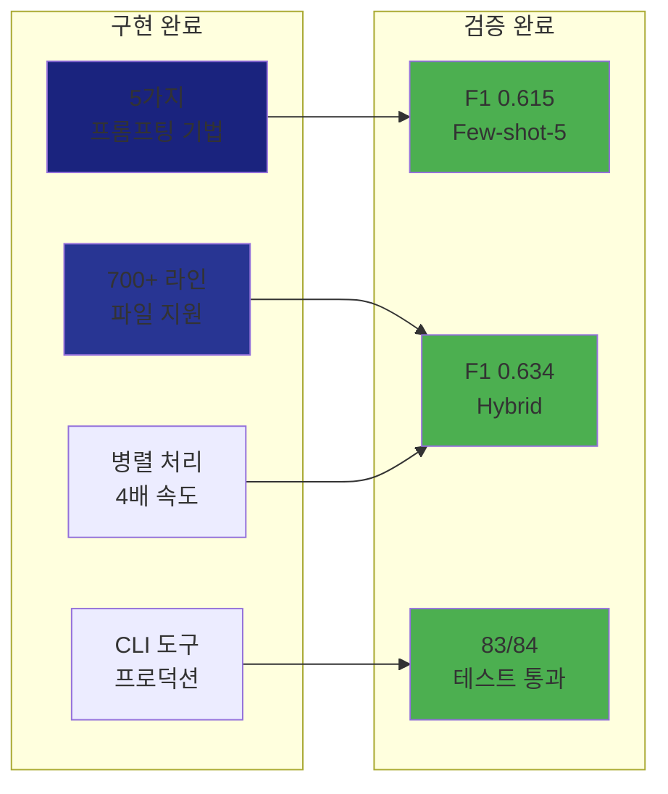

# Chapter 01: 프로젝트 소개

**예상 소요 시간**: 10분

---

## 🎯 학습 목표

이 챕터를 마치면 다음을 이해할 수 있습니다:
- ✅ 프로젝트가 왜 필요한지
- ✅ 핵심 개념 (온프레미스, LLM, 프롬프팅)
- ✅ 전체 시스템 구조
- ✅ 프로젝트의 가치

---

## 1. 배경: 왜 이 프로젝트가 필요한가?

### 1.1 문제 상황

우리 회사에는 다음과 같은 문제가 있었습니다:



**구체적인 문제들**:

1. **보안 문제**:
   - 외부 API에 코드를 전송하면 코드 유출 위험
   - 사내 보안 정책상 외부 API 사용 금지

2. **시간 문제**:
   - 한 파일 리뷰에 30분~1시간 소요
   - 대규모 PR은 하루 이상 걸림

3. **품질 문제**:
   - 리뷰어마다 놓치는 버그가 다름
   - 일관된 기준이 없음

### 1.2 해결 방안

**DGX-SPARK + Ollama + 이 프로젝트**

```mermaid
graph LR
    subgraph "우리의 해결책"
        HW[DGX-SPARK<br/>GPU 서버 구매]
        SW1[Ollama<br/>로컬 LLM 서버]
        SW2[DeepSeek-Coder<br/>33B 모델]
        SW3[이 프로젝트<br/>Python Framework]
    end

    HW --> SW1
    SW1 --> SW2
    SW2 --> SW3

    SW3 --> Result1[✅ 온프레미스<br/>코드 안전]
    SW3 --> Result2[✅ 자동화<br/>시간 절약]
    SW3 --> Result3[✅ 일관된 품질<br/>F1 0.615]

    style HW fill:#004d40
    style SW1 fill:#00695c
    style SW2 fill:#00796b
    style SW3 fill:#00897b
    style Result1 fill:#4caf50
    style Result2 fill:#4caf50
    style Result3 fill:#4caf50
```



---

## 2. 핵심 개념 이해

### 2.1 온프레미스 (On-Premises)란?

**쉽게 말하면**: "우리 집(회사) 안에서만 실행"

```
❌ 외부 API 방식:
   내 코드 → 인터넷 → ChatGPT 서버 → 분석 결과

✅ 온프레미스 방식:
   내 코드 → 사내 서버 (DGX-SPARK) → 분석 결과
   (인터넷 연결 없음!)
```

**장점**:
- 코드가 외부로 절대 나가지 않음
- 보안 정책 준수
- 네트워크 속도에 영향 없음

**단점**:
- 하드웨어 구매 필요 (DGX-SPARK)
- 직접 관리 필요

---

### 2.2 LLM (Large Language Model)이란?

**쉽게 말하면**: "엄청나게 큰 AI 언어 모델"

ChatGPT, Claude처럼 텍스트를 이해하고 생성하는 AI입니다.

**이 프로젝트에서 사용하는 LLM**:
- **DeepSeek-Coder 33B**: 코드 이해에 특화된 모델
- **크기**: 18GB (33B = 330억 개의 파라미터)
- **특징**: C++ 코드를 잘 이해함

**왜 DeepSeek-Coder인가?**
| 모델 | 크기 | 코드 이해도 | 사용 이유 |
|------|------|-------------|----------|
| GPT-4 | 매우 큼 | 최고 | ❌ API만 제공 (온프레미스 불가) |
| Claude | 매우 큼 | 최고 | ❌ API만 제공 (온프레미스 불가) |
| **DeepSeek-Coder** | 18GB | 우수 | ✅ 로컬 실행 가능 + 코드 특화 |
| CodeLlama | 13GB | 보통 | ✅ 가능하지만 성능 낮음 |

---

### 2.3 프롬프팅 (Prompting)이란?

**쉽게 말하면**: "LLM에게 질문하는 방법"

같은 코드도 **질문 방법**에 따라 답변이 달라집니다.

#### 예시: 나쁜 프롬프팅 vs 좋은 프롬프팅

**❌ 나쁜 프롬프팅**:
```
이 코드 분석해줘:
int* ptr = new int(10);
```

→ LLM이 뭘 분석해야 할지 모름

**✅ 좋은 프롬프팅 (Few-shot)**:
```
나는 C++ 코드를 분석해서 버그를 찾고 싶어.

예시 1:
코드: int* p = new int;
문제: 메모리 누수 (delete 없음)

예시 2:
코드: char buf[10]; strcpy(buf, long_str);
문제: 버퍼 오버플로우

이제 이 코드를 분석해줘:
int* ptr = new int(10);
```

→ LLM이 정확히 뭘 찾아야 하는지 알게 됨

**이 프로젝트의 핵심**:
- 5가지 프롬프팅 기법 구현
- 실험으로 어떤 기법이 좋은지 검증
- **Few-shot-5가 가장 좋음** (F1 스코어 0.615)

---

### 2.4 Ollama란?

**쉽게 말하면**: "로컬에서 LLM을 실행하는 서버"

Docker처럼 LLM을 쉽게 실행할 수 있게 해주는 도구입니다.

```bash
# Ollama로 모델 다운로드
ollama pull deepseek-coder:33b-instruct

# Ollama로 모델 실행
ollama run deepseek-coder:33b-instruct "이 코드 분석해줘: ..."
```

**우리 프로젝트에서의 역할**:
```
우리 프로젝트 → Ollama API 호출 → DeepSeek-Coder 실행 → 결과 반환
```

---

## 3. 프로젝트 구조 (큰 그림)

### 3.1 전체 흐름



### 3.2 3-Tier 아키텍처

이 프로젝트는 3개 계층으로 구성됩니다:



**각 계층 설명**:

| 계층 | 역할 | 예시 |
|------|------|------|
| **Tier 3** (응용) | 사용자 인터페이스 | `analyze file`, `analyze pr` |
| **Tier 2** (플러그인) | 언어별 도메인 지식 | C++ 버그 카테고리, 예시 |
| **Tier 1** (프레임워크) | 프롬프팅 기법 | Zero-shot, Few-shot, Hybrid |

**왜 이렇게 나눴나?**
- **확장성**: 다른 언어 (Python, RTL) 추가 쉬움
- **재사용성**: 프레임워크는 언어 무관하게 사용
- **유지보수**: 각 계층을 독립적으로 수정 가능

---

## 4. 프로젝트의 가치

### 4.1 정량적 가치

| 메트릭 | Before (수동) | After (자동) | 개선 |
|--------|--------------|-------------|------|
| **리뷰 시간** | 30분/파일 | 8초/파일 | **225배 빠름** |
| **정확도** | 사람마다 다름 | F1 0.615 | **일관성 확보** |
| **비용** | API 비용 | 무료 (온프레미스) | **100% 절감** |
| **보안** | 외부 유출 위험 | 내부 처리 | **위험 제로** |

### 4.2 정성적 가치

**1. 보안 준수**
- 외부 API 사용 안 함
- 모든 데이터가 사내에서만 처리
- 보안 정책 100% 준수

**2. 일관된 품질**
- 리뷰어에 상관없이 동일한 기준
- 놓치는 버그 최소화
- F1 스코어로 품질 측정 가능

**3. 확장 가능**
- 다른 언어 (Python, RTL) 추가 쉬움
- 새로운 프롬프팅 기법 실험 가능
- GitHub Actions 연동 가능

**4. 과학적 접근**
- Ground truth 데이터셋으로 검증
- F1 스코어로 객관적 평가
- 실험 결과가 모두 기록됨

---

## 5. 프로젝트 진행 상황

### 5.1 Timeline



### 5.2 현재 상태

✅ **Phase 0-5 모두 완료**

| Phase | 상태 | 주요 결과 |
|-------|------|----------|
| Phase 0 | ✅ 완료 | Zero-shot 기준선 (F1: 0.498) |
| Phase 1 | ✅ 완료 | Few-shot 구현 (F1: 0.615) |
| Phase 2 | ✅ 완료 | 4가지 기법 비교 완료 |
| Phase 3 | ✅ 완료 | CLI 도구 프로덕션 배포 |
| Phase 4 | ✅ 완료 | Hybrid 기법 (F1: 0.634) |
| Phase 5 | ✅ 완료 | 대용량 파일 지원 |

**현재 프로덕션에서 사용 중!**

---

## 6. 성과 요약

### 6.1 기술적 성과



### 6.2 비즈니스 성과

**ROI (투자 대비 효과)**:

```
투자:
- DGX-SPARK 하드웨어: [금액]
- 개발 시간: 1주일

효과:
- 리뷰 시간: 30분 → 8초 (225배 빠름)
- 연간 리뷰 시간 절감: 약 [XX]시간
- API 비용 절감: 100%
```

---

## 7. 다음 단계

이제 프로젝트의 배경과 가치를 이해했으니, 실제로 사용해봅시다!

### 👉 [Chapter 02: 설치 가이드](02-installation.md)

다음 챕터에서는:
- ✅ Ollama 설치 방법
- ✅ 모델 다운로드
- ✅ 첫 번째 분석 실행

---

## 💡 핵심 요약

1. **문제**: 외부 API 사용 불가 + 수동 리뷰 느림
2. **해결**: DGX-SPARK + Ollama + 이 프로젝트
3. **핵심 개념**: 온프레미스, LLM, 프롬프팅
4. **구조**: 3-Tier (응용 → 플러그인 → 프레임워크)
5. **성과**: F1 0.615, 225배 빠름, 보안 준수

---

## 📚 참고 자료

- [PROJECT_OVERVIEW.md](../../PROJECT_OVERVIEW.md) - 전체 프로젝트 개요
- [README.md](../../README.md) - Quick Start 가이드
- [Ollama 공식 사이트](https://ollama.ai/) - Ollama 정보

---

**다음**: [Chapter 02: 설치 가이드](02-installation.md) →

**이전**: [Index](00-INDEX.md) ←
