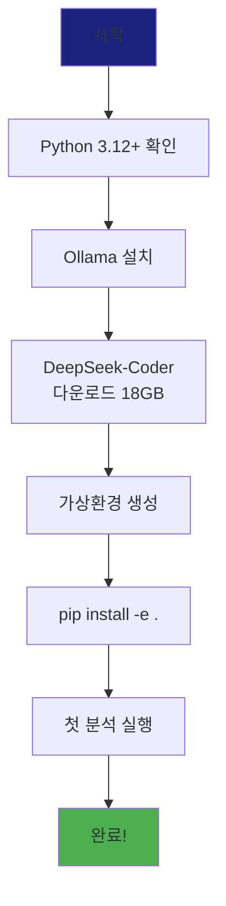

# Chapter 02: 설치 가이드

**예상 소요 시간**: 30분

---

## 🎯 학습 목표

이 챕터를 마치면 다음을 할 수 있습니다:
- ✅ Ollama 설치 및 모델 다운로드
- ✅ Python 환경 구성
- ✅ 프로젝트 의존성 설치
- ✅ 첫 번째 분석 성공적으로 실행

---

## 📋 사전 요구사항

### 필수

| 항목 | 요구사항 | 확인 방법 |
|------|----------|-----------|
| **Python** | 3.12 이상 | `python --version` |
| **Git** | 2.0 이상 | `git --version` |
| **디스크 공간** | 20GB 이상 | `df -h` |
| **RAM** | 8GB 이상 | - |

### 권장

| 항목 | 권장사항 | 이유 |
|------|----------|------|
| **GPU** | NVIDIA GPU | 추론 속도 10배+ 빠름 |
| **RAM** | 16GB 이상 | 33B 모델은 메모리 많이 사용 |
| **디스크** | SSD | 모델 로딩 속도 빠름 |

---

## Step 1: Python 환경 확인

### 1.1 Python 버전 확인

```bash
python --version
# 또는
python3 --version
```

**기대 출력**:
```
Python 3.12.0 (또는 그 이상)
```

**만약 3.12 미만이라면**:

```bash
# Ubuntu/Debian
sudo apt install python3.12

# macOS (Homebrew 사용)
brew install python@3.12

# Windows
# python.org에서 3.12+ 설치 프로그램 다운로드
```

### 1.2 pip 업그레이드

```bash
python -m pip install --upgrade pip
```

---

## Step 2: Ollama 설치

### 2.1 Ollama 다운로드 및 설치

**Linux & macOS**:

```bash
curl https://ollama.ai/install.sh | sh
```

**Windows**:
1. [Ollama 공식 사이트](https://ollama.ai/download) 방문
2. Windows 설치 프로그램 다운로드
3. 설치 실행

### 2.2 Ollama 설치 확인

```bash
ollama --version
```

**기대 출력**:
```
ollama version is 0.1.x
```

### 2.3 Ollama 서비스 시작

```bash
# Linux/macOS (백그라운드 실행)
ollama serve &

# Windows
# 설치하면 자동으로 서비스 시작됨
```

**확인**:
```bash
# 다른 터미널에서 실행
ollama list
```

**기대 출력**:
```
NAME                    ID              SIZE    MODIFIED
(처음에는 비어있음)
```

---

## Step 3: DeepSeek-Coder 모델 다운로드

### 3.1 모델 다운로드

**중요**: 이 단계는 **18GB 다운로드**이므로 시간이 걸립니다 (10-30분).

```bash
ollama pull deepseek-coder:33b-instruct
```

**출력 예시**:
```
pulling manifest
pulling 8934d96d3f08... 100% ▕████████████████▏ 18 GB
pulling 8c17c2ebb0ea... 100% ▕████████████████▏ 7.0 KB
pulling 590d74a5569b... 100% ▕████████████████▏ 6.0 KB
pulling 56bb8bd477a5... 100% ▕████████████████▏  96 B
pulling 6a27a0d70ff0... 100% ▕████████████████▏ 485 B
verifying sha256 digest
writing manifest
success
```

### 3.2 모델 다운로드 확인

```bash
ollama list
```

**기대 출력**:
```
NAME                            ID              SIZE    MODIFIED
deepseek-coder:33b-instruct     abc123def456    18 GB   2 minutes ago
```

### 3.3 모델 테스트

```bash
ollama run deepseek-coder:33b-instruct "What is a memory leak in C++?"
```

**기대**: LLM이 메모리 누수에 대한 답변을 생성하면 성공!

---

## Step 4: 프로젝트 설치

### 4.1 저장소 클론

```bash
# 저장소 클론 (실제 URL로 변경 필요)
git clone <repository-url>
cd llm-code-reviewer

# 또는 이미 클론한 경우
cd /path/to/llm-code-reviewer
```

### 4.2 가상환경 생성 (권장)

**가상환경을 사용하는 이유**:
- 프로젝트별 의존성 격리
- 시스템 Python 보호
- 버전 충돌 방지

```bash
# 가상환경 생성
python -m venv venv

# 가상환경 활성화
# Linux/macOS:
source venv/bin/activate

# Windows (PowerShell):
venv\Scripts\Activate.ps1

# Windows (CMD):
venv\Scripts\activate.bat
```

**활성화 확인**:
```bash
# 프롬프트 앞에 (venv)가 보여야 함
(venv) user@machine:~/llm-code-reviewer$
```

### 4.3 의존성 설치

```bash
# 개발 모드로 설치 (수정 사항이 즉시 반영됨)
pip install -e .
```

**출력 예시**:
```
Installing collected packages: ...
Successfully installed ollama-0.1.0 pydantic-2.0.0 ...
```

### 4.4 설치 확인

```bash
# Python에서 임포트 테스트
python -c "from framework.ollama_client import OllamaClient; print('✅ Import successful')"
```

**기대 출력**:
```
✅ Import successful
```

---

## Step 5: 첫 번째 분석 실행

### 5.1 테스트 파일 준비

간단한 버그가 있는 C++ 파일을 만들어봅시다:

```bash
cat > test_memory_leak.cpp << 'EOF'
#include <iostream>

int main() {
    int* ptr = new int(10);  // 메모리 할당
    std::cout << *ptr << std::endl;
    return 0;  // delete 없음! (메모리 누수)
}
EOF
```

### 5.2 분석 실행

```bash
python -m cli.main analyze file test_memory_leak.cpp
```

**기대 출력**:
```
Analyzing file: test_memory_leak.cpp
Model: deepseek-coder:33b-instruct

Found 1 issue(s):

● Line 4 [memory-safety] Memory leak - dynamically allocated pointer never deleted
  Pointer allocated with 'new' on line 4 but there is no corresponding 'delete' statement.
  This causes a memory leak on every execution.
```

**✅ 성공!** LLM이 메모리 누수를 정확히 탐지했습니다!

---

## Step 6: 설치 검증 체크리스트

모든 단계가 성공했는지 확인해봅시다:

### 6.1 자동 검증 스크립트

```bash
cat > verify_installation.sh << 'EOF'
#!/bin/bash

echo "=== LLM Code Reviewer 설치 검증 ==="
echo ""

# Python 버전 확인
echo "1. Python 버전 확인..."
python --version | grep -q "3.1[2-9]" && echo "  ✅ Python 3.12+" || echo "  ❌ Python 3.12+ 필요"

# Ollama 설치 확인
echo "2. Ollama 설치 확인..."
ollama --version > /dev/null 2>&1 && echo "  ✅ Ollama 설치됨" || echo "  ❌ Ollama 설치 필요"

# 모델 다운로드 확인
echo "3. DeepSeek-Coder 모델 확인..."
ollama list | grep -q "deepseek-coder:33b-instruct" && echo "  ✅ 모델 다운로드됨" || echo "  ❌ 모델 다운로드 필요"

# Python 패키지 확인
echo "4. Python 패키지 확인..."
python -c "from framework.ollama_client import OllamaClient" 2>/dev/null && echo "  ✅ 패키지 설치됨" || echo "  ❌ pip install -e . 실행 필요"

# CLI 명령어 확인
echo "5. CLI 명령어 확인..."
python -m cli.main --help > /dev/null 2>&1 && echo "  ✅ CLI 작동함" || echo "  ❌ CLI 오류"

echo ""
echo "=== 검증 완료 ==="
EOF

chmod +x verify_installation.sh
./verify_installation.sh
```

### 6.2 수동 검증 체크리스트

- [ ] Python 3.12+ 설치됨
- [ ] Ollama 설치됨 및 실행 중
- [ ] DeepSeek-Coder 33B 모델 다운로드됨
- [ ] 가상환경 생성 및 활성화됨
- [ ] `pip install -e .` 성공
- [ ] 임포트 테스트 성공
- [ ] 첫 번째 분석 실행 성공

**모두 체크되었나요?** 축하합니다! 🎉

---

## 문제 해결

### 문제 1: "ollama: command not found"

**원인**: Ollama가 설치되지 않았거나 PATH에 없음

**해결**:
```bash
# 재설치
curl https://ollama.ai/install.sh | sh

# PATH 확인
echo $PATH | grep -q ollama || echo "Ollama not in PATH"

# 수동으로 PATH 추가 (필요시)
export PATH=$PATH:/usr/local/bin
```

---

### 문제 2: "ModuleNotFoundError: No module named 'framework'"

**원인**: `pip install -e .` 실행 안 했거나 가상환경 활성화 안 됨

**해결**:
```bash
# 가상환경 활성화 확인
which python
# /path/to/venv/bin/python 이어야 함

# 재설치
pip install -e .
```

---

### 문제 3: 모델 다운로드 느림 또는 실패

**원인**: 네트워크 느림 또는 디스크 공간 부족

**해결**:
```bash
# 디스크 공간 확인
df -h

# 다운로드 재시도
ollama pull deepseek-coder:33b-instruct

# 더 작은 모델 시도 (테스트용)
ollama pull qwen2.5-coder:14b
```

---

### 문제 4: 메모리 부족 (Out of Memory)

**증상**:
```
Error: model requires more memory than available
```

**원인**: 33B 모델은 최소 16GB RAM 필요

**해결**:

**옵션 1**: 더 작은 모델 사용
```bash
# 14B 모델 (8GB RAM으로 실행 가능)
ollama pull qwen2.5-coder:14b

# 분석 시 모델 지정
python -m cli.main analyze file test.cpp --model qwen2.5-coder:14b
```

**옵션 2**: GPU 사용 (VRAM 활용)
```bash
# GPU 확인
nvidia-smi

# Ollama가 자동으로 GPU 감지
```

**옵션 3**: Swap 메모리 늘리기 (Linux)
```bash
# 16GB swap 생성
sudo fallocate -l 16G /swapfile
sudo chmod 600 /swapfile
sudo mkswap /swapfile
sudo swapon /swapfile
```

---

## 다음 단계

설치가 완료되었으니 이제 프로젝트를 사용해봅시다!

### 옵션 1: 바로 실습 시작
👉 [Chapter 05: 실습 가이드](05-usage-guide.md)로 건너뛰기

### 옵션 2: 아키텍처 먼저 이해
👉 [Chapter 03: 아키텍처 상세](03-architecture.md)로 이동

### 옵션 3: 프롬프팅 기법 학습
👉 [Chapter 04: 프롬프팅 기법](04-prompting-techniques.md)로 이동

---

## 💡 핵심 요약

### 설치 단계 요약



### 중요 명령어

```bash
# 1. Ollama 설치
curl https://ollama.ai/install.sh | sh

# 2. 모델 다운로드
ollama pull deepseek-coder:33b-instruct

# 3. 프로젝트 설치
git clone <repo-url>
cd llm-code-reviewer
python -m venv venv
source venv/bin/activate
pip install -e .

# 4. 분석 실행
python -m cli.main analyze file <your-file.cpp>
```

---

## 📚 참고 자료

- [Ollama 공식 문서](https://ollama.ai/docs)
- [DeepSeek-Coder 모델 정보](https://ollama.ai/library/deepseek-coder)
- [Python 가상환경 가이드](https://docs.python.org/3/tutorial/venv.html)

---

**다음**: [Chapter 03: 아키텍처 상세](03-architecture.md) 또는 [Chapter 05: 실습 가이드](05-usage-guide.md) →

**이전**: [Chapter 01: 프로젝트 소개](01-introduction.md) ←
