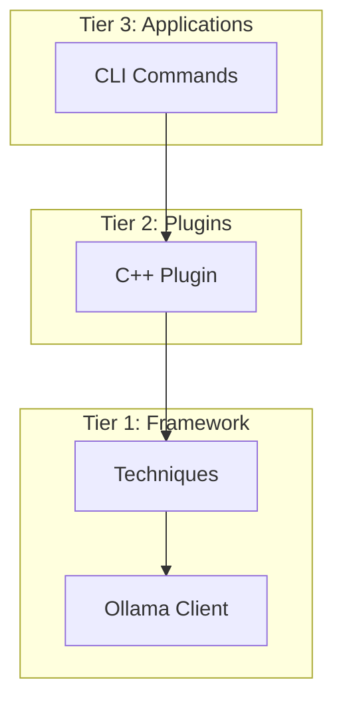

# Chapter 03: 아키텍처 상세

**예상 소요 시간**: 20분

---

## 🎯 학습 목표

- ✅ 3-Tier 아키텍처 이해
- ✅ 각 컴포넌트의 역할
- ✅ 데이터 흐름 파악

---

## 1. 3-Tier 아키텍처

**계층별 역할**:
- **Tier 3**: 사용자 인터페이스 (CLI, API)
- **Tier 2**: 도메인 지식 (C++, Python 등)
- **Tier 1**: 핵심 프롬프팅 로직

---

## 2. 주요 컴포넌트

### ProductionAnalyzer
**역할**: 분석 오케스트레이터
**위치**: `plugins/production_analyzer.py`

### CppPlugin
**역할**: C++ 도메인 지식
**위치**: `plugins/cpp_plugin.py`
- 5개 카테고리 정의
- 5개 few-shot 예시
- 파일 필터링

### Techniques
**역할**: 프롬프팅 기법 구현
**위치**: `framework/techniques/`
- `zero_shot.py`
- `few_shot.py`
- `chain_of_thought.py`
- `hybrid.py`

---

## 3. 데이터 흐름

1. User → CLI 명령어
2. CLI → ProductionAnalyzer
3. ProductionAnalyzer → Plugin (도메인 지식 가져오기)
4. ProductionAnalyzer → Technique (프롬프트 생성)
5. Technique → OllamaClient (LLM 호출)
6. OllamaClient → DeepSeek-Coder
7. 결과 역순으로 반환

상세 내용은 [docs/architecture/ARCHITECTURE.md](../architecture/ARCHITECTURE.md) 참고.

---

**다음**: [Chapter 04: 프롬프팅 기법](04-prompting-techniques.md) →
**이전**: [Chapter 02: 설치 가이드](02-installation.md) ←
