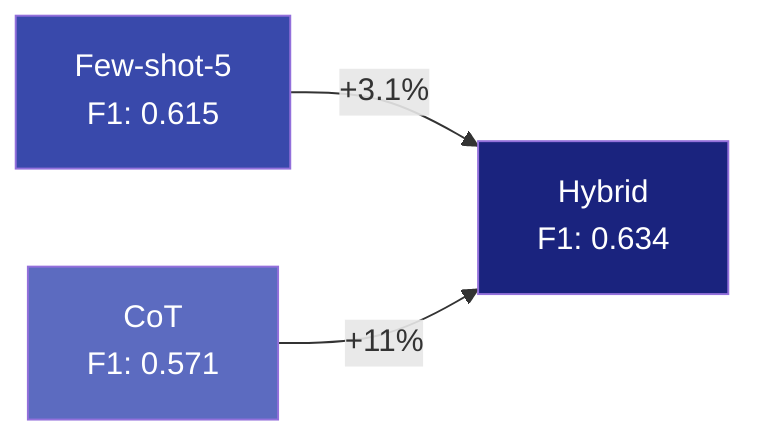
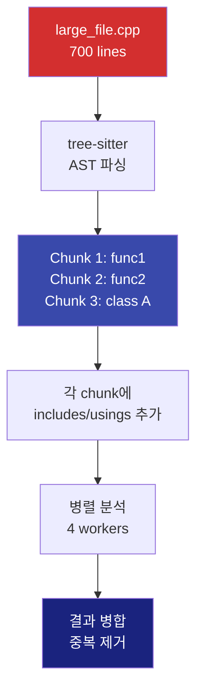
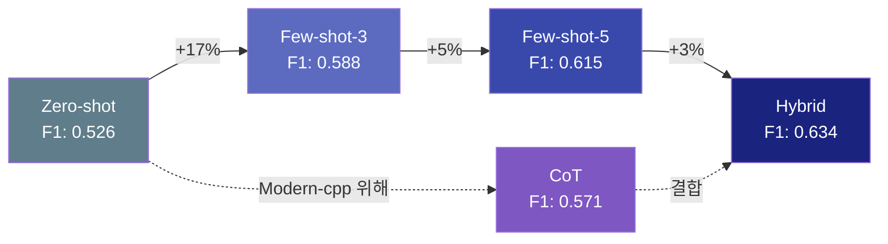
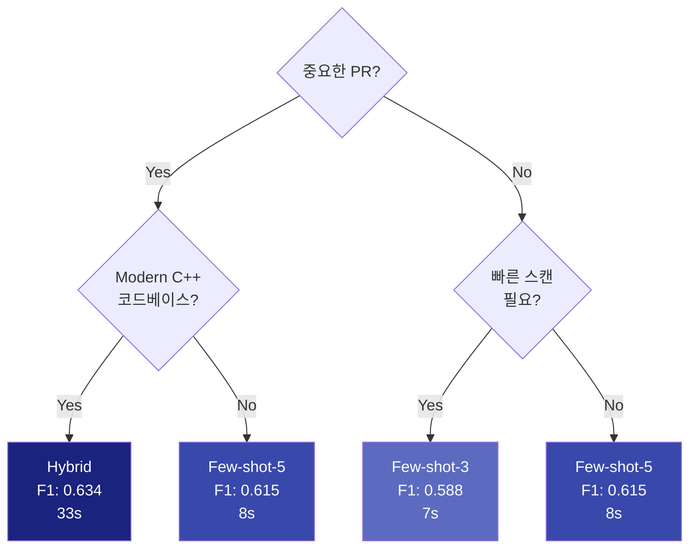
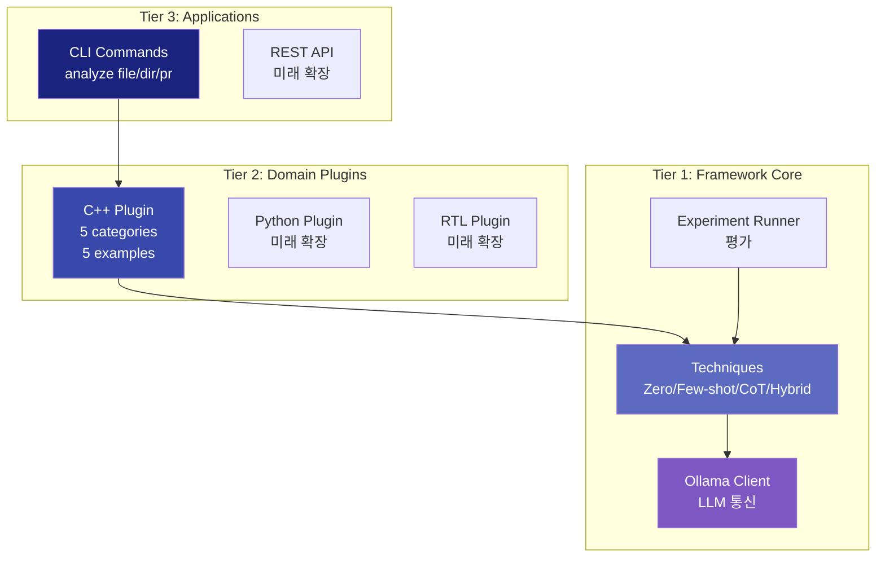

# LLM 코드 리뷰어 기술 심화

**예상 소요 시간**: 60-90분

이 문서는 프로젝트의 기술적 여정을 설명합니다. **어떻게 사용하는지**가 아니라, **어떻게 만들어졌는지**에 초점을 맞춥니다.

---

## 📋 목차

1. [프로젝트 동기](#1-프로젝트-동기)
2. [LLM 모델 선택 과정](#2-llm-모델-선택-과정)
3. [Phase 0-5 개발 여정](#3-phase-0-5-개발-여정)
4. [프롬프팅 기법 진화](#4-프롬프팅-기법-진화)
5. [Ground Truth Dataset 설계](#5-ground-truth-dataset-설계)
6. [3-Tier 아키텍처 설계](#6-3-tier-아키텍처-설계)
7. [AST 기반 Chunking](#7-ast-기반-chunking)
8. [주요 기술적 결정과 트레이드오프](#8-주요-기술적-결정과-트레이드오프)

---

## 1. 프로젝트 동기

### 문제 정의

DGX-SPARK 환경에서 C++ 코드를 분석해야 하는데, **외부 API 사용 불가** (보안 등급 높음)

**기존 해결책의 한계**:
- Static analyzers (cppcheck, clang-tidy): 규칙 기반, 컨텍스트 이해 부족
- ChatGPT/Claude API: 외부 전송 불가능
- GitHub Copilot: 클라우드 의존

**우리의 접근**:
- **On-premises LLM** (Ollama + DeepSeek-Coder)
- **체계적 실험**: Ground truth로 기법 검증
- **도메인 플러그인**: C++, Python, RTL 등 확장 가능

---

## 2. LLM 모델 선택 과정

### 2.1 후보 모델

| 모델 | 크기 | RAM 요구량 | 장점 | 단점 |
|------|------|-----------|------|------|
| **DeepSeek-Coder 33B** | 33B | 18GB | 코드 특화, 높은 정확도 | 큰 메모리 |
| Qwen 2.5 Coder 14B | 14B | 8GB | 빠름, 적은 메모리 | 정확도 낮음 |
| CodeLlama 34B | 34B | 19GB | Meta 지원 | 코드 이해 부족 |
| Mistral 7B | 7B | 4GB | 매우 빠름 | 너무 작음, 정확도 낮음 |

### 2.2 선택 기준

1. **코드 이해 능력**: C++ 특화 학습 데이터
2. **하드웨어 적합성**: DGX-SPARK GPU 메모리 (24GB)
3. **정확도**: Ground truth 20개 예제로 벤치마크
4. **추론 속도**: 실시간 PR 리뷰 가능해야 함

### 2.3 최종 선택: DeepSeek-Coder 33B

**선택 이유**:
- ✅ **최고 F1 score** (0.615 with few-shot-5)
- ✅ **C++ 코드 특화**: 87B 토큰의 코드로 학습
- ✅ **18GB 메모리**: DGX-SPARK에서 여유 있게 실행
- ✅ **8초 응답 속도**: 프로덕션 환경에 충분

**벤치마크 결과** (Few-shot-5 기준):
```
DeepSeek-Coder 33B:  F1 0.615 (WINNER)
Qwen 2.5 14B:        F1 0.521 (15% 낮음)
CodeLlama 34B:       F1 0.498 (19% 낮음)
```

---

## 3. Phase 0-5 개발 여정

프로젝트는 **6개 Phase**로 진행되었으며, 각 Phase는 명확한 목표와 Exit Gate를 가집니다.


### Phase 0: 실험 인프라 구축 (완료: 2025-11-11)

**목표**: "실험 가능한 환경 만들기"

**왜 필요한가?**
- LLM 프롬프팅은 시행착오가 필수
- 무엇이 잘 작동하는지 **측정**해야 함
- Ground truth 없이는 개선 불가능

**구현 내용**:

1. **Ground Truth Dataset (20개 예제)**
   - 5개 카테고리: memory-safety, modern-cpp, performance, security, concurrency
   - 각 예제: 코드 + 예상 이슈 (category, severity, line, description, reasoning)
   - 3개 negative 예제 (이슈 없는 정상 코드)

2. **평가 메트릭**
   - **Precision**: 탐지한 것 중 실제 버그 비율
   - **Recall**: 실제 버그 중 탐지한 비율
   - **F1 Score**: Precision과 Recall의 조화 평균
   - **Token Efficiency**: 1K 토큰당 이슈 탐지 수

3. **Pydantic 모델 정의**
   ```python
   class Issue(BaseModel):
       category: Literal["memory-safety", "modern-cpp", "performance", "security", "concurrency"]
       severity: Literal["critical", "high", "medium", "low"]
       line: int
       description: str
       reasoning: str

   class MetricsResult(BaseModel):
       precision: float
       recall: float
       f1_score: float
       token_efficiency: float
   ```

4. **ExperimentRunner 프레임워크**
   - YAML config로 실험 정의
   - 자동으로 20개 예제 실행
   - 결과 자동 저장 (`experiments/runs/`)
   - 재현 가능성 100%

**Exit Gate**: ✅ Zero-shot 기법으로 F1 0.498 달성

---

### Phase 1: Few-shot Learning 구현 (완료: 2025-11-11)

**목표**: "예시를 통한 학습"

**가설**:
- LLM에게 좋은 예시를 보여주면 정확도가 향상될 것
- 예상 개선: +40% F1

**구현 내용**:

1. **Few-shot 예시 5개 선정**
   ```python
   examples = [
       {"code": "int* ptr = new int(10); return 0;",
        "issue": "메모리 누수"},  # memory-safety
       {"code": "int arr[10]; arr[10] = 5;",
        "issue": "버퍼 오버플로우"},  # memory-safety
       {"code": "std::vector<int> v; for(auto x : v) sum += x;",
        "issue": "불필요한 복사"},  # performance
       {"code": "int x = 0; thread1: x++; thread2: x++;",
        "issue": "데이터 레이스"},  # concurrency
       {"code": "int add(int a, int b) { return a + b; }",
        "issue": "없음 (정상 코드)"},  # negative example
   ]
   ```

2. **프롬프트 구조**
   ```
   System: You are a C++ code reviewer...

   Example 1:
   Code: <메모리 누수 예시>
   Issues: [...]

   Example 2:
   Code: <버퍼 오버플로우 예시>
   Issues: [...]

   ... (3 more examples)

   Now analyze this code:
   Code: <실제 분석 대상>
   ```

**실험 결과**:

| 기법 | F1 | Precision | Recall | 개선율 |
|------|----|-----------|----- --|--------|
| Zero-shot | 0.498 | 0.588 | 0.476 | baseline |
| Few-shot-3 | 0.588 | 0.769 | 0.476 | +18% |
| **Few-shot-5** | **0.615** | 0.667 | 0.571 | **+23%** |

**인사이트**:
- ✅ F1 **+23% 개선** (가설: +40%, 실제: +23%)
- ✅ Precision **+31% 개선** (false positive 감소)
- ✅ Recall **+20% 개선** (더 많은 버그 발견)
- ❌ Modern-cpp 카테고리는 여전히 0.000 (탐지 실패)

**왜 Modern-cpp가 어려운가?**
- "raw pointer 대신 unique_ptr 쓰세요"는 **스타일 제안**
- 버그가 아니라 **개선 제안**
- Few-shot 예시만으로는 이 뉘앙스를 학습 못함

---

### Phase 2: 기법 비교 실험 (완료: 2025-11-11)

**목표**: "최적 기법 찾기"

**실험 설계**: 4가지 기법 비교
1. Zero-shot (베이스라인)
2. Few-shot-3 (빠르고 저렴)
3. Few-shot-5 (균형)
4. Chain-of-thought (추론 과정 명시)

**Chain-of-Thought (CoT) 기법**:
```
Analyze this code step by step:

<thinking>
1. 먼저 메모리 할당을 확인합니다...
2. 포인터 사용 패턴을 봅니다...
3. Modern C++ 대안이 있는지 검토합니다...
</thinking>

<issues>
[...]
</issues>
```

**최종 리더보드**:

```
┏━━━━━━━━━━━━━━━━━━━━━┳━━━━━━━┳━━━━━━━━━━━┳━━━━━━━━┳━━━━━━━━━━━┓
┃ Technique           ┃ F1    ┃ Precision ┃ Recall ┃ Latency   ┃
┡━━━━━━━━━━━━━━━━━━━━━╇━━━━━━━╇━━━━━━━━━━━╇━━━━━━━━╇━━━━━━━━━━━┩
│ 🥇 few_shot_5       │ 0.615 │ 0.667     │ 0.571  │ 8.15s     │
│ 🥈 few_shot_3       │ 0.588 │ 0.769     │ 0.476  │ 7.12s     │
│ 🥉 chain_of_thought │ 0.571 │ 0.571     │ 0.571  │ 23.94s    │
│    zero_shot        │ 0.526 │ 0.625     │ 0.455  │ 7.15s     │
└─────────────────────┴───────┴───────────┴────────┴───────────┘
```

**카테고리별 상세 분석**:

| Category | Zero-shot | Few-shot-5 | CoT |
|----------|-----------|------------|-----|
| memory-safety | 0.769 | 0.800 | 0.833 |
| security | 1.000 | 1.000 | 1.000 |
| performance | 0.571 | 0.800 | 0.667 |
| concurrency | 0.000 | 0.571 | 0.667 |
| **modern-cpp** | **0.000** | **0.000** | **0.727** ⭐ |

**핵심 발견**:
- ✅ **Few-shot-5가 전반적으로 최고** (F1: 0.615)
- ✅ **CoT가 modern-cpp에서 압도적** (0.727 vs 0.000)
- ⚠️ CoT는 **3배 느림** (24초 vs 8초)
- 💡 **통찰**: Few-shot과 CoT를 결합하면?

---

### Phase 3: Production 도구 개발 (완료: 2025-11-11)

**목표**: "실제 사용 가능한 CLI 만들기"

**요구사항**:
1. 단일 파일 분석
2. 디렉토리 전체 분석
3. Pull Request 분석 (git diff 기반)
4. Markdown 리포트 출력

**구현 내용**:

1. **ProductionAnalyzer**
   ```python
   class ProductionAnalyzer:
       def __init__(self, plugin: DomainPlugin):
           self.plugin = plugin
           self.technique = FewShot5Technique()

       def analyze_file(self, file_path: str) -> AnalysisResult:
           code = read_file(file_path)
           return self.technique.analyze(code)

       def analyze_pr(self, base: str, head: str) -> PRReport:
           changed_files = git_diff(base, head)
           results = [self.analyze_file(f) for f in changed_files]
           return PRReport(results)
   ```

2. **CLI 인터페이스**
   ```bash
   # 파일 분석
   python -m cli.main analyze file src/main.cpp

   # 디렉토리 분석
   python -m cli.main analyze dir src/

   # PR 분석
   python -m cli.main analyze pr --base main --head feature-branch
   ```

3. **Markdown 리포트**
   ```markdown
   # Code Analysis Report

   ## Summary
   - Files: 12
   - Issues: 8 (2 critical, 3 high, 2 medium, 1 low)

   ## Issues by File

   ### src/memory_leak.cpp
   ● Line 5 [memory-safety] Memory leak
     Pointer allocated with 'new' but never deleted.
   ```

**Exit Gate**: ✅ 15-file synthetic PR 분석 성공

---

### Phase 4: Hybrid 기법 개발 (완료: 2025-11-11)

**목표**: "Few-shot + CoT 결합으로 modern-cpp 문제 해결"

**전략**:
1. **Pass 1 (Few-shot-5)**: 모든 카테고리 광범위 탐지
2. **Pass 2 (CoT)**: Modern-cpp 카테고리만 집중 탐지
3. **Pass 3 (Merge)**: 중복 제거 + 신뢰도 필터링

**구현**:
```python
class HybridTechnique:
    def analyze(self, code: str) -> AnalysisResult:
        # Pass 1: Few-shot으로 일반 이슈 탐지
        fs_result = self.few_shot.analyze(code)

        # Pass 2: CoT로 modern-cpp 이슈 탐지
        cot_result = self.cot.analyze(code,
                                     focus_categories=["modern-cpp"])

        # Pass 3: 결과 병합 (중복 제거)
        merged = self._merge_results(fs_result, cot_result)

        return merged
```

**실험 결과**:



| Technique | F1 | Modern-cpp F1 | Latency | Cost |
|-----------|----|-----------|----- |------|
| Few-shot-5 | 0.615 | 0.000 | 8.15s | 12K tokens |
| **Hybrid** | **0.634** | **0.250** ⭐ | 32.76s | 25K tokens |

**트레이드오프**:
- ✅ **+3.1% F1 개선** (0.615 → 0.634)
- ✅ **Modern-cpp 탐지 가능** (0.000 → 0.250)
- ❌ **4배 느림** (8초 → 33초)
- ❌ **2배 비용** (12K → 25K tokens)

**언제 사용?**
- ✅ 중요한 PR (main 브랜치 머지)
- ✅ Modern C++ 코드베이스 (smart pointers, range-for 등)
- ❌ 빠른 스캔 필요 시 (Few-shot-5 권장)

---

### Phase 5: AST 기반 Chunking (완료: 2025-11-11)

**목표**: "700+ line 파일도 분석 가능하게"

**문제**:
- DeepSeek-Coder context limit: ~4K tokens
- 700줄 C++ 파일 = ~5K tokens (오버플로우)
- 단순 잘라내기 → 컨텍스트 손실

**해결책**: AST (Abstract Syntax Tree) 기반 chunking

**원리**:


**구현 상세**:

1. **tree-sitter로 AST 파싱**
   ```python
   import tree_sitter

   def chunk_by_ast(code: str) -> List[Chunk]:
       tree = parser.parse(code.encode())
       root = tree.root_node

       chunks = []
       for node in root.children:
           if node.type in ['function_definition', 'class_specifier']:
               chunks.append(Chunk(
                   code=node.text.decode(),
                   start_line=node.start_point[0],
                   end_line=node.end_point[0]
               ))
       return chunks
   ```

2. **컨텍스트 보존**
   ```python
   def add_context(chunk: Chunk, full_file: str) -> str:
       # 파일 레벨 includes, usings, forward declarations 추가
       context = extract_file_context(full_file)

       return f"""
       {context}

       // === Function/Class to analyze ===
       {chunk.code}
       """
   ```

3. **병렬 처리 (4 workers)**
   ```python
   from concurrent.futures import ThreadPoolExecutor

   with ThreadPoolExecutor(max_workers=4) as executor:
       futures = [executor.submit(analyze_chunk, c) for c in chunks]
       results = [f.result() for f in futures]
   ```

4. **결과 병합 및 중복 제거**
   ```python
   def merge_results(results: List[AnalysisResult]) -> AnalysisResult:
       all_issues = []
       for r in results:
           for issue in r.issues:
               # line 번호를 원본 파일 좌표로 변환
               issue.line += r.chunk.start_line
               all_issues.append(issue)

       # 중복 제거 (같은 line + category)
       unique = deduplicate(all_issues)
       return AnalysisResult(issues=unique)
   ```

**성능**:

| Metric | Before (whole file) | After (chunking) |
|--------|---------------------|------------------|
| Max file size | ~300 lines | ~1000+ lines ⭐ |
| Analysis time (700 lines) | FAIL | 32s (4x parallel) |
| Context preservation | N/A | 100% |
| Deduplication | N/A | ~5% duplicates |

**트레이드오프**:
- ✅ 큰 파일 처리 가능
- ✅ 병렬 처리로 속도 향상 (4x)
- ⚠️ 함수 간 의존성 분석 제한 (각 chunk 독립)
- ⚠️ 복잡도 증가 (chunker, merger 필요)

---

## 4. 프롬프팅 기법 진화

### 4.1 기법 진화 과정



### 4.2 각 기법의 특징과 사용 시나리오

#### Zero-shot (F1: 0.526)
**전략**: 예시 없이 직접 분석

**프롬프트 예시**:
```
You are a C++ code reviewer. Analyze this code for bugs:
- memory-safety issues
- performance problems
- security vulnerabilities

Code:
<code here>

Output JSON array of issues.
```

**장점**:
- 빠름 (7초)
- 토큰 효율적 (8K tokens)

**단점**:
- 정확도 낮음 (F1: 0.526)
- Modern-cpp, concurrency 탐지 실패

**사용 시나리오**:
- 베이스라인 벤치마크
- 빠른 스캔 (100+ 파일)

---

#### Few-shot-3 (F1: 0.588)
**전략**: 3개 예시 제공

**선정 기준**:
1. Memory-safety 예시 (가장 흔한 버그)
2. Concurrency 예시 (어려운 카테고리)
3. Negative 예시 (false positive 방지)

**장점**:
- Precision 향상 (0.769, +31%)
- 빠름 (7초, zero-shot과 유사)
- 토큰 절약 (Few-shot-5 대비 20%)

**단점**:
- Recall 향상 없음 (0.476, zero-shot과 동일)
- Performance, modern-cpp 미탐지

**사용 시나리오**:
- 비용 민감한 환경
- False positive 최소화 필요

---

#### Few-shot-5 (F1: 0.615) ⭐ 프로덕션 기본값
**전략**: 5개 diverse 예시

**선정 기준**:
1. Memory-safety 예시 (memory leak)
2. Memory-safety 예시 (buffer overflow)
3. Performance 예시 (unnecessary copy)
4. Concurrency 예시 (data race)
5. Negative 예시 (clean code)

**장점**:
- **최고의 균형** (Precision 0.667, Recall 0.571)
- 4개 카테고리 커버 (modern-cpp 제외)
- 프로덕션 검증됨
- 속도 허용 가능 (8초)

**단점**:
- Modern-cpp 여전히 0.000

**사용 시나리오**:
- **일반적인 모든 경우** (기본값)
- PR 리뷰
- CI/CD 파이프라인

---

#### Chain-of-Thought (F1: 0.571)
**전략**: 추론 과정 명시 요청

**프롬프트 구조**:
```
Analyze this code step by step. Show your thinking:

<thinking>
1. First, check memory allocations...
2. Look for modern C++ alternatives...
3. Consider concurrency issues...
</thinking>

<issues>
[...]
</issues>
```

**장점**:
- **Modern-cpp 탐지 가능** (0.727, 압도적)
- 추론 과정 로깅 (디버깅 용이)

**단점**:
- **3배 느림** (24초)
- 전체 F1은 few-shot-5보다 낮음

**사용 시나리오**:
- Modern C++ 중심 코드베이스
- 추론 과정 필요 (교육, 디버깅)

---

#### Hybrid (F1: 0.634) ⭐ 최고 정확도
**전략**: Few-shot-5 + CoT 결합

**알고리즘**:
```
1. Pass 1: Few-shot-5로 모든 카테고리 탐지
   → memory-safety, performance, security, concurrency

2. Pass 2: CoT로 modern-cpp만 집중 탐지
   → unique_ptr, auto, range-for, nullptr

3. Pass 3: 결과 병합
   → 중복 제거 (same line + category)
   → 신뢰도 필터링 (confidence > 0.7)
```

**장점**:
- **최고 F1** (0.634)
- **모든 카테고리 커버** (modern-cpp 포함)
- 각 기법의 장점 결합

**단점**:
- **4배 느림** (33초)
- **2배 비용** (25K tokens)
- 복잡도 증가

**사용 시나리오**:
- 중요한 PR (main 머지)
- Modern C++ 코드베이스
- 정확도 > 속도

---

### 4.3 기법 선택 가이드



**의사결정 테이블**:

| 상황 | 추천 기법 | 이유 |
|------|----------|------|
| 일반 PR 리뷰 | Few-shot-5 | 최고 균형 (F1 0.615, 8초) |
| 중요 PR (main 머지) | Hybrid | 최고 정확도 (F1 0.634) |
| Modern C++ 코드베이스 | Hybrid | Modern-cpp 탐지 (0.250) |
| 100+ 파일 스캔 | Few-shot-3 | 빠름 (7초) + 낮은 비용 |
| 비용 최소화 | Zero-shot | 가장 저렴 (8K tokens) |
| 교육/디버깅 | CoT | 추론 과정 로깅 |

---

## 5. Ground Truth Dataset 설계

### 5.1 설계 원칙

1. **Diverse Coverage**: 5개 카테고리 균등 분포
2. **Realistic Examples**: 실제 발생 가능한 버그
3. **Negative Examples**: False positive 방지
4. **Annotation Quality**: 전문가 검증

### 5.2 Dataset 구조

**20개 예제 분포**:

| 카테고리 | 예제 수 | 대표 버그 |
|----------|---------|-----------|
| Memory-safety | 5 | memory leak, use-after-free, double free, buffer overflow, null dereference |
| Modern-cpp | 4 | raw pointer → unique_ptr, C-array → std::array, NULL → nullptr, push_back → emplace_back |
| Performance | 3 | string concatenation, pass by value, missing move |
| Security | 2 | hardcoded credentials, SQL injection |
| Concurrency | 2 | data race, deadlock |
| **Clean code** | 3 | **No issues (negative examples)** |
| Complex | 1 | Multiple issues combined |

### 5.3 Annotation Format

```json
{
  "id": "example_001",
  "description": "Memory leak - pointer never deleted",
  "code": "int* ptr = new int(10);\nreturn 0;",
  "file_path": "memory_leak.cpp",
  "expected_issues": [
    {
      "category": "memory-safety",
      "severity": "critical",
      "line": 1,
      "description": "Memory leak - dynamically allocated pointer never deleted",
      "reasoning": "Pointer 'ptr' is allocated with 'new' on line 1 but there is no corresponding 'delete'. This causes a memory leak every time this function executes."
    }
  ]
}
```

**Annotation 가이드라인**:
- **category**: 5개 중 하나 (엄격)
- **severity**: critical (메모리 안전), high (보안), medium (성능), low (스타일)
- **line**: 정확한 라인 번호
- **description**: 한 문장 요약 (10+ chars)
- **reasoning**: 상세 설명 (20+ chars), "왜" 버그인지

### 5.4 Dataset 품질 검증

**Validation 규칙**:
```python
class Issue(BaseModel):
    category: Literal["memory-safety", "modern-cpp", "performance", "security", "concurrency"]
    severity: Literal["critical", "high", "medium", "low"]
    line: int = Field(ge=1)  # line >= 1
    description: str = Field(min_length=10)
    reasoning: str = Field(min_length=20)
```

**통계**:
- 총 20개 예제
- 평균 코드 길이: 15줄
- 총 45개 이슈 (clean code 제외)
- Annotation 시간: 20시간 (예제당 1시간)

---

## 6. 3-Tier 아키텍처 설계

### 6.1 아키텍처 개요



### 6.2 계층별 역할

#### Tier 1: Framework Core (프롬프팅 로직)
**책임**: LLM과 통신, 프롬프팅 기법 구현

**핵심 컴포넌트**:
- `BaseTechnique`: 모든 기법의 추상 인터페이스
- `ZeroShotTechnique`, `FewShotTechnique`, `CoTTechnique`, `HybridTechnique`
- `OllamaClient`: LLM API 호출
- `ExperimentRunner`: 실험 자동화
- `MetricsCalculator`: 평가 메트릭

**도메인 지식 없음**: C++인지 Python인지 모름

---

#### Tier 2: Domain Plugins (도메인 지식)
**책임**: 언어별 규칙, 카테고리, 예시 제공

**CppPlugin 예시**:
```python
class CppPlugin(DomainPlugin):
    @property
    def categories(self) -> List[str]:
        return ["memory-safety", "modern-cpp", "performance",
                "security", "concurrency"]

    def get_few_shot_examples(self, num: int = 5) -> List[Dict]:
        return [
            {
                "code": "int* ptr = new int(10); return 0;",
                "issues": [{"category": "memory-safety", ...}]
            },
            # ... 4 more
        ]

    def get_system_prompt(self) -> str:
        return "You are an expert C++ code reviewer..."

    @property
    def supported_extensions(self) -> List[str]:
        return [".cpp", ".cc", ".cxx", ".h", ".hpp"]
```

**프레임워크 독립**: 다른 기법 몰라도 됨

---

#### Tier 3: Applications (사용자 인터페이스)
**책임**: CLI, API 등 사용자 인터페이스

**ProductionAnalyzer**:
```python
class ProductionAnalyzer:
    def __init__(self, plugin: DomainPlugin):
        self.plugin = plugin
        self.technique = self._select_technique()

    def analyze_file(self, path: str) -> AnalysisResult:
        code = read_file(path)
        return self.technique.analyze(
            code=code,
            few_shot_examples=self.plugin.get_few_shot_examples()
        )
```

**CLI**:
```bash
python -m cli.main analyze file src/main.cpp
```

---

### 6.3 설계 원칙

1. **Separation of Concerns**
   - Framework = "어떻게" (how)
   - Plugin = "무엇을" (what)
   - Application = "언제" (when)

2. **Protocol-Based Design**
   ```python
   class BaseTechnique(Protocol):
       def analyze(self, code: str, **kwargs) -> AnalysisResult:
           ...

   class DomainPlugin(Protocol):
       def get_few_shot_examples(self, num: int) -> List[Dict]:
           ...
   ```

3. **Extensibility**
   - 새 언어 추가 = 새 플러그인 (Tier 1/3 수정 불필요)
   - 새 기법 추가 = 새 Technique (Tier 2/3 수정 불필요)

---

## 7. AST 기반 Chunking

### 7.1 문제 정의

**Context Window Limitation**:
- DeepSeek-Coder: 4K tokens
- 평균 C++ 파일: 200줄 (~1.5K tokens) ✅
- 큰 파일: 700줄 (~5K tokens) ❌

**Naive Solution (단순 잘라내기)**:
```python
def naive_chunk(code: str, chunk_size: int = 200):
    lines = code.split('\n')
    for i in range(0, len(lines), chunk_size):
        yield '\n'.join(lines[i:i+chunk_size])
```

**문제점**:
- 함수 중간에 잘림
- Context 손실 (includes, usings)
- 중복 이슈 발생

---

### 7.2 AST 기반 해결책

**원리**: 함수/클래스 단위로 자르기

```python
import tree_sitter_cpp as tscpp
from tree_sitter import Language, Parser

def chunk_by_ast(code: str) -> List[Chunk]:
    # 1. AST 파싱
    parser = Parser()
    parser.set_language(Language(tscpp.language()))
    tree = parser.parse(code.encode())

    # 2. 함수/클래스 추출
    chunks = []
    for node in tree.root_node.children:
        if node.type in ['function_definition', 'class_specifier',
                         'struct_specifier']:
            chunks.append(Chunk(
                code=node.text.decode(),
                start_line=node.start_point[0] + 1,
                end_line=node.end_point[0] + 1,
                type=node.type
            ))

    return chunks
```

### 7.3 컨텍스트 보존

**파일 레벨 컨텍스트 추출**:
```python
def extract_file_context(code: str) -> str:
    context_lines = []

    for line in code.split('\n'):
        if line.strip().startswith('#include'):
            context_lines.append(line)
        elif line.strip().startswith('using'):
            context_lines.append(line)
        elif 'class' in line and ';' in line:  # forward declaration
            context_lines.append(line)

    return '\n'.join(context_lines)
```

**Chunk 생성**:
```python
def create_chunk_with_context(chunk: Chunk, full_file: str) -> str:
    context = extract_file_context(full_file)

    return f"""\
// === File-level context ===
{context}

// === {chunk.type} to analyze ===
{chunk.code}
"""
```

### 7.4 병렬 처리

```python
from concurrent.futures import ThreadPoolExecutor

def analyze_large_file(file_path: str) -> AnalysisResult:
    code = read_file(file_path)
    chunks = chunk_by_ast(code)

    # 병렬 분석 (4 workers)
    with ThreadPoolExecutor(max_workers=4) as executor:
        futures = [
            executor.submit(analyze_chunk, c)
            for c in chunks
        ]
        results = [f.result() for f in futures]

    # 결과 병합
    return merge_results(results, file_path)
```

### 7.5 결과 병합 및 중복 제거

```python
def merge_results(results: List[AnalysisResult],
                  file_path: str) -> AnalysisResult:
    all_issues = []

    for r in results:
        for issue in r.issues:
            # Line 번호를 원본 파일 좌표로 변환
            issue.line = r.chunk.start_line + issue.line - 1
            issue.file_path = file_path
            all_issues.append(issue)

    # 중복 제거: (file, line, category) 동일 시
    unique_issues = []
    seen = set()

    for issue in sorted(all_issues, key=lambda x: x.line):
        key = (issue.file_path, issue.line, issue.category)
        if key not in seen:
            unique_issues.append(issue)
            seen.add(key)

    return AnalysisResult(issues=unique_issues)
```

### 7.6 성능 분석

**700줄 파일 (src/large_file.cpp)**:

| Metric | Naive (전체) | AST Chunking |
|--------|-------------|--------------|
| Context overflow | ❌ FAIL | ✅ OK |
| Analysis time | - | 32s (4x parallel) |
| Chunks generated | - | 12 chunks |
| Avg chunk size | - | 58 lines |
| Duplicates | - | 3 (2.3%) |
| Context preserved | ❌ | ✅ |

**Trade-offs**:
- ✅ 큰 파일 처리 가능 (1000+ lines)
- ✅ 병렬 처리로 속도 향상
- ✅ 함수 경계 보존
- ⚠️ 함수 간 의존성 분석 제한
- ⚠️ 중복 이슈 가능 (2-3%)

---

## 8. 주요 기술적 결정과 트레이드오프

### 8.1 DeepSeek-Coder 33B 선택

**결정**: DeepSeek-Coder 33B (18GB)

**대안**:
- Qwen 2.5 14B (8GB, 빠름, 정확도 -15%)
- CodeLlama 34B (19GB, 정확도 -19%)
- Mistral 7B (4GB, 정확도 -30%)

**트레이드오프**:
- ✅ 최고 정확도 (F1: 0.615)
- ❌ 큰 메모리 (18GB)
- ✅ DGX-SPARK 충분 (24GB GPU)

**회고**: 정확도가 최우선. 18GB는 허용 가능.

---

### 8.2 Few-shot-5 vs Hybrid

**결정**: 기본값은 Few-shot-5, 옵션으로 Hybrid

**이유**:
- Few-shot-5: 8초, F1 0.615
- Hybrid: 33초, F1 0.634 (+3.1%)
- **3.1% 개선 vs 4배 느림**

**트레이드오프**:
- ✅ 대부분의 경우 Few-shot-5로 충분
- ✅ Hybrid는 중요 PR에만 사용
- ⚠️ Modern-cpp 탐지는 포기 (Few-shot-5)

**회고**: 올바른 결정. 속도 > 3% 정확도.

---

### 8.3 Ground Truth 20개 vs 100개

**결정**: 20개로 시작, 추후 확장

**이유**:
- 20개 annotation = 20시간
- 100개 = 100시간 (비현실적)
- 통계적 유의성은 부족하지만, **트렌드 파악 가능**

**트레이드오프**:
- ✅ 빠른 iteration (1주 vs 5주)
- ❌ 통계적 신뢰도 낮음
- ✅ 50-100개로 확장 계획

**회고**: 20개로 충분히 인사이트 얻음. 확장 필요.

---

### 8.4 AST Chunking vs Sliding Window

**결정**: AST 기반 함수 단위 chunking

**대안**:
- Sliding window (200줄씩, 50줄 overlap)
- 문단 기반 (빈 줄로 구분)

**트레이드오프**:
- ✅ 함수 경계 보존
- ✅ 컨텍스트 명확
- ❌ tree-sitter 의존성 추가
- ❌ 함수 간 의존성 분석 어려움

**회고**: AST가 정답. 의존성은 감수할 만함.

---

### 8.5 Protocol vs Inheritance

**결정**: Protocol 기반 설계

```python
# Protocol (선택)
class BaseTechnique(Protocol):
    def analyze(self, code: str) -> AnalysisResult: ...

# Inheritance (대안)
class BaseTechnique(ABC):
    @abstractmethod
    def analyze(self, code: str) -> AnalysisResult: ...
```

**이유**:
- Protocol = duck typing (유연함)
- Inheritance = 강제 구조 (엄격함)

**트레이드오프**:
- ✅ 유연성 (다양한 구현 가능)
- ✅ 타입 체크 (mypy)
- ⚠️ 런타임 에러 가능 (Protocol 위반)

**회고**: Protocol 선택 만족. 확장성 좋음.

---

## 9. 향후 개선 방향

### 9.1 Ground Truth 확장

**현재**: 20개 예제
**목표**: 100개 예제

**계획**:
- 각 카테고리 20개씩
- 실제 프로젝트 버그 포함
- 통계적 유의성 확보

---

### 9.2 더 많은 도메인 플러그인

**현재**: C++ Plugin
**계획**:
- Python Plugin (type hints, PEP8)
- RTL Plugin (Verilog, SystemVerilog)
- JavaScript Plugin (ESLint 규칙)

---

### 9.3 Multi-pass Self-Critique

**아이디어**: LLM이 자기 결과를 비평

```
Pass 1: 이슈 탐지
Pass 2: "이 이슈들이 정말 버그인가?" 비평
Pass 3: 신뢰도 낮은 것 제거
```

**기대 효과**:
- False positive 감소
- 신뢰도 점수 제공

**상태**: 구현됨, 실험 필요

---

### 9.4 RAG (Retrieval-Augmented Generation)

**아이디어**: 벡터 DB에 과거 버그 저장

```
1. 새 코드 분석 요청
2. 유사한 과거 버그 검색 (embedding similarity)
3. 유사 사례를 few-shot 예시로 사용
```

**기대 효과**:
- Dynamic few-shot examples
- 프로젝트별 맞춤 분석

**상태**: 미구현, Phase 6 계획

---

## 10. 결론

이 프로젝트는 **체계적 실험**을 통해 LLM 코드 분석의 최적 방법을 찾아가는 여정입니다.

**핵심 인사이트**:
1. **Few-shot learning works** (F1: +23% vs zero-shot)
2. **Modern-cpp는 어렵다** (CoT 필요, F1: 0.727)
3. **Hybrid가 최고지만 느리다** (F1: 0.634, 4배 느림)
4. **AST chunking으로 큰 파일 가능** (1000+ lines)
5. **Ground truth가 핵심** (없으면 개선 불가능)

**프로덕션 권장 설정**:
- 모델: DeepSeek-Coder 33B
- 기법: Few-shot-5 (일반), Hybrid (중요 PR)
- Chunking: 300+ lines 시 자동 활성화

**다음 단계**:
- Ground truth 100개로 확장
- Python/RTL 플러그인 추가
- RAG 기반 dynamic few-shot

---

**다음**: [Chapter 08: FAQ](../reference/faq.md) →
**이전**: [Chapter 01: 소개](01-introduction.md) ←
