# LLM 기반 C++ 코드 리뷰어

**온프레미스 LLM 코드 분석 플랫폼 - 발표 자료**

DGX-SPARK + Ollama + DeepSeek-Coder 33B

---

## 📋 발표 목차

1. [프로젝트 배경 및 동기](#1-프로젝트-배경-및-동기)
2. [시스템 아키텍처](#2-시스템-아키텍처)
3. [오케스트레이션](#3-오케스트레이션)
4. [프롬프팅 전략](#4-프롬프팅-전략)
5. [AST 기반 청킹](#5-ast-기반-청킹)
6. [실험 및 검증](#6-실험-및-검증)
7. [향후 계획](#7-향후-계획)

---

## 📌 한눈에 보는 요약

### 핵심 흐름

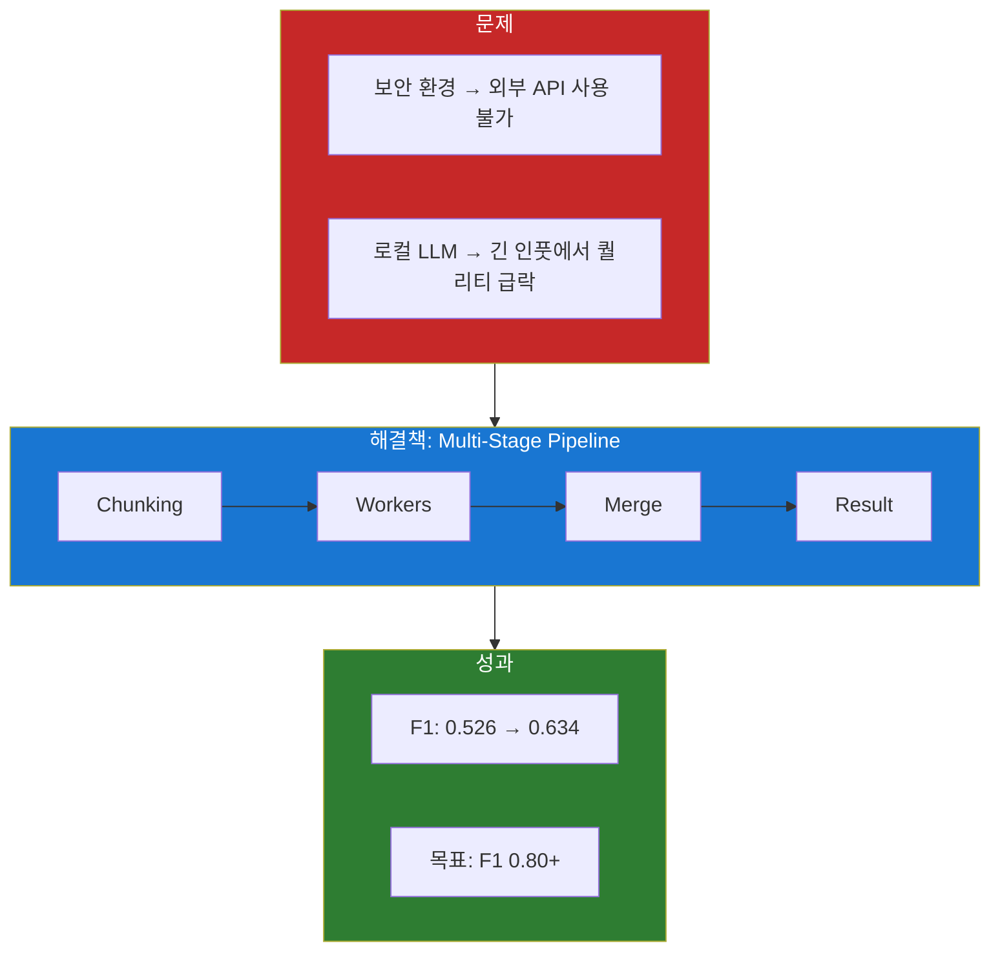

### 발표 구조

| Part | 섹션 | 질문 | 핵심 내용 | 시간 |
|------|------|------|----------|------|
| **1** | 1~2 | 왜? 무엇? | 배경 + 아키텍처 | 10분 |
| **2** | 3~5 | 어떻게? | 오케스트레이션 + 프롬프팅 + 청킹 | 15분 |
| **3** | 6~7 | 결과? 다음? | 실험 + 향후 계획 | 10분 |

### 핵심 수치

| 지표 | 현재 | 목표 |
|------|------|------|
| **F1 Score** | 0.634 | 0.80+ |
| **분석 속도** | 8초 (일반) | - |
| **병렬 효과** | 4x 향상 | - |

---

## 1. 프로젝트 배경 및 동기

이 프로젝트는 **"보안이 중요한 환경에서 어떻게 LLM 기반 코드 리뷰를 할 수 있을까?"**라는 질문에서 시작되었습니다.

---

### 1.1 문제 상황

**현실의 딜레마**: 최신 AI 도구들은 강력하지만, 보안이 중요한 환경에서는 사용이 제한됩니다.

| 도구 | 문제점 |
|------|--------|
| ChatGPT, Claude API | 코드가 외부 서버로 전송 → 보안 정책 위반 |
| GitHub Copilot | 클라우드 기반 → 내부 네트워크에서 사용 불가 |
| 정적 분석기 (clang-tidy) | 규칙 기반만 가능 → 컨텍스트 이해 부족 |

**핵심 과제**: 외부 API 없이, 내부 네트워크에서만 LLM 기반 코드 분석을 수행해야 함

---

### 1.2 해결 방안: 온프레미스 LLM

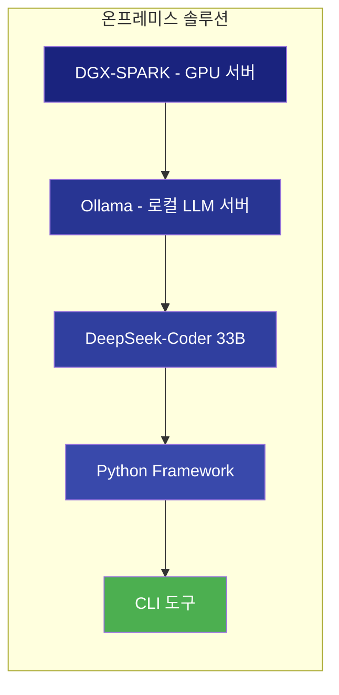

위 다이어그램은 **온프레미스 솔루션 스택**을 보여줍니다:
- **DGX-SPARK**: NVIDIA GPU 서버 (128GB RAM, 24GB VRAM)
- **Ollama**: 로컬 LLM 서빙 (`localhost:11434`)
- **DeepSeek-Coder 33B**: 코드 특화 오픈소스 모델 (~20GB)
- **Python Framework**: 프롬프팅 기법 + 실험 인프라

---

### 1.3 로컬 LLM의 현실적 한계

> **⚠️ 핵심 문제**: 로컬 LLM은 **인풋이 조금만 길어져도 출력 퀄리티가 급격히 저하**됩니다.
> 이것이 이 프로젝트에서 청킹과 파이프라인 설계가 중요한 이유입니다.

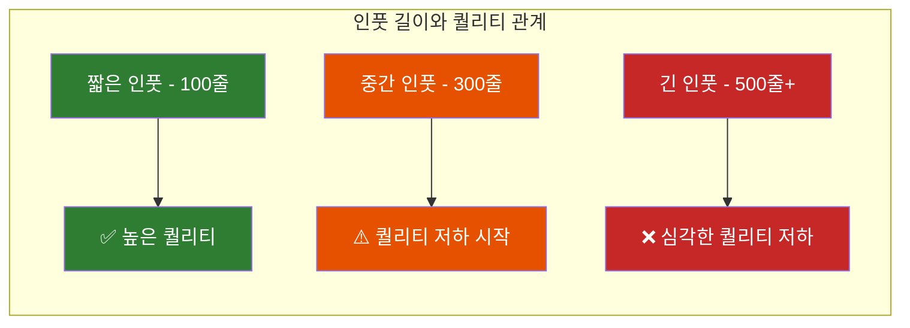

위 다이어그램은 **인풋 길이에 따른 퀄리티 변화**를 보여줍니다. 300줄을 넘어가면 퀄리티가 급격히 떨어집니다.

---

#### 퀄리티 저하 실제 예시

**✅ 짧은 인풋 (50줄) - 정확한 분석**

```cpp
// 입력 코드
void process(int* data) {
    *data = 42;  // line 3: null check 없음
}
```

```json
// LLM 출력 (정확함)
{
  "issues": [{
    "line": 3,
    "category": "memory-safety",
    "description": "Null pointer dereference: 'data' is dereferenced without null check"
  }]
}
```

**❌ 긴 인풋 (500줄+) - 퀄리티 저하**

```cpp
// 입력: 500줄짜리 파일
// ... 앞부분 300줄 ...
void process(int* data) {
    *data = 42;  // line 312: 동일한 버그
}
// ... 뒷부분 200줄 ...
```

```json
// LLM 출력 (문제 있음)
{
  "issues": [
    {
      "line": 287,           // ❌ 잘못된 라인 번호
      "category": "memory-safety",
      "description": "Potential null pointer"  // ⚠️ 설명 불충분
    },
    {
      "line": 450,
      "category": "performance",
      "description": "Consider using std::vector"  // ❌ 할루시네이션 (존재하지 않는 이슈)
    }
    // ❌ line 312의 실제 버그는 놓침
  ]
}
```

**퀄리티 저하 패턴 요약**:

| 증상 | 짧은 인풋 | 긴 인풋 |
|------|----------|---------|
| **라인 번호** | 정확 | 틀리거나 근처 라인 |
| **버그 탐지** | 대부분 찾음 | 핵심 버그 놓침 |
| **할루시네이션** | 거의 없음 | 존재하지 않는 이슈 보고 |
| **설명 품질** | 구체적 | 모호하고 짧음 |
| **JSON 형식** | 정상 | 가끔 파싱 실패 |

---

| 한계 | 영향 | 극복 전략 |
|------|------|----------|
| **긴 인풋 = 낮은 퀄리티** | 핵심 버그 놓침, 할루시네이션 | **AST 청킹 + 작은 단위 분석** |
| **분산 분석의 한계** | chunk 경계 이슈 놓침 | **Aggregator LLM으로 종합** |
| **느린 응답 속도** | 파일당 8-30초 | 병렬 처리 |
| **불안정한 출력** | JSON 파싱 실패 | 재시도 + 검증 로직 |

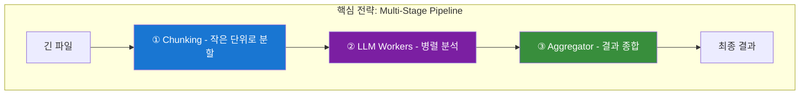

위 다이어그램은 **Multi-Stage Pipeline 전략**을 보여줍니다:
1. **Chunking**: 긴 파일을 작은 단위로 분할
2. **LLM Workers**: 각 chunk를 병렬로 분석
3. **Aggregator**: 분산된 결과를 종합하여 최종 결과 생성

---

## 2. 시스템 아키텍처

### 2.1 3-Tier 아키텍처 개요

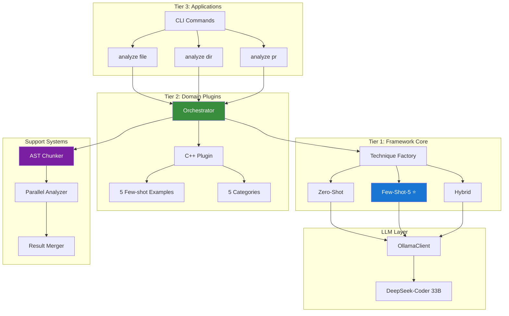

위 다이어그램은 **3-Tier 아키텍처**를 보여줍니다:
- **Tier 3 (Applications)**: 사용자 인터페이스 (CLI)
- **Tier 2 (Domain Plugins)**: 언어별 지식 + **Orchestrator**
- **Tier 1 (Framework Core)**: 프롬프팅 전략
- **Support Systems**: 대용량 파일 처리 (청킹, 병렬, 병합)

**핵심 포인트**: Orchestrator가 모든 흐름을 제어하며, 파일 크기에 따라 직접 분석 vs 청킹 분석을 결정합니다.

---

### 2.2 기술 스택

| 계층 | 역할 | 기술 |
|------|------|------|
| 하드웨어 | GPU 연산 | DGX-SPARK (24GB VRAM) |
| LLM 서빙 | 모델 실행 | Ollama + DeepSeek-Coder 33B |
| 프레임워크 | 프롬프팅 | Python 3.12 + Pydantic |
| AST 파싱 | 청킹 | tree-sitter-cpp |
| 병렬 처리 | 속도 향상 | ThreadPoolExecutor |

---

## 3. 오케스트레이션

**Orchestrator**는 시스템의 **심장부**입니다. 로컬 LLM의 한계를 극복하기 위한 **Multi-Stage Pipeline**을 관리합니다.

---

### 3.1 이상적인 파이프라인 설계

로컬 LLM의 "긴 인풋 = 낮은 퀄리티" 문제를 해결하기 위해 **3단계 파이프라인**이 필요합니다.

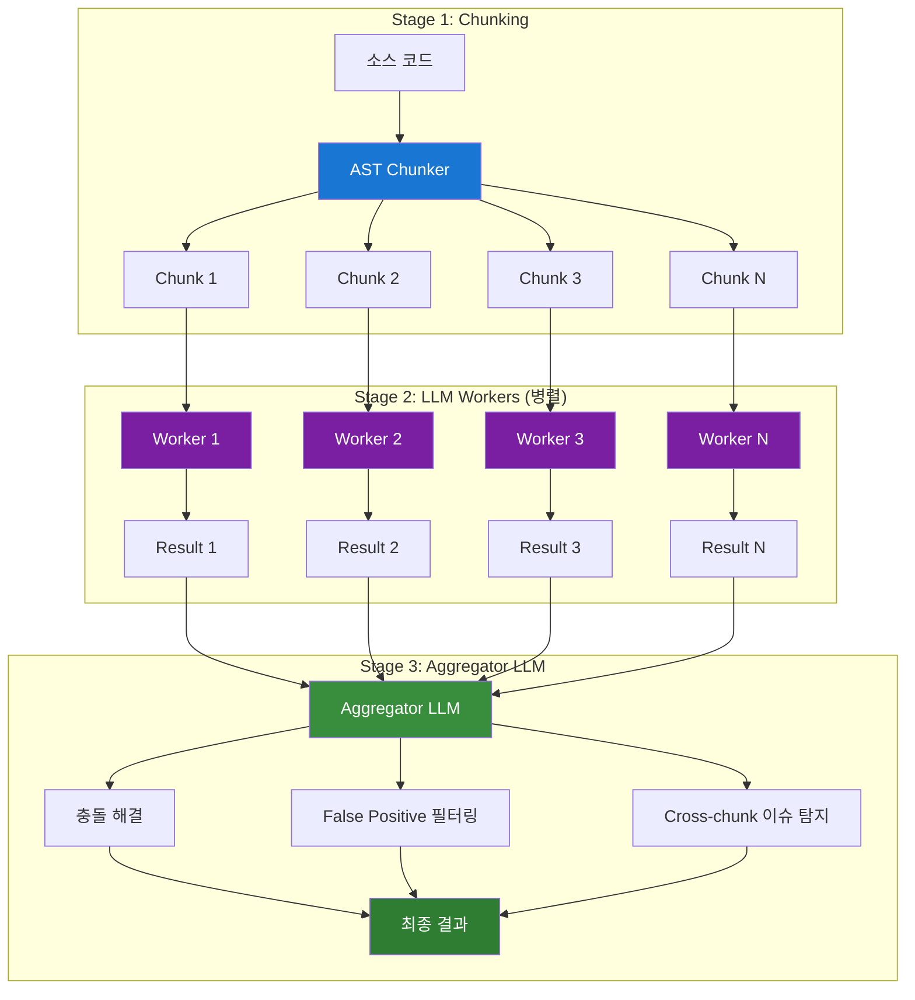

위 다이어그램은 **이상적인 3단계 파이프라인**을 보여줍니다:
1. **Stage 1 (Chunking)**: 긴 파일을 작은 단위로 분할
2. **Stage 2 (LLM Workers)**: 각 chunk를 병렬로 분석 → 짧은 인풋으로 높은 퀄리티 유지
3. **Stage 3 (Aggregator LLM)**: 분산된 결과를 **LLM이 종합**하여 최종 결과 생성

**Aggregator LLM의 역할**:

- **충돌 해결**: Worker들이 같은 이슈를 다르게 판단한 경우 결정
- **False Positive 필터링**: 전체 컨텍스트에서 볼 때 오탐인 이슈 제거
- **Cross-chunk 이슈 탐지**: chunk 경계에서 놓친 이슈 발견

---

### 3.2 현재 구현 vs 향후 설계

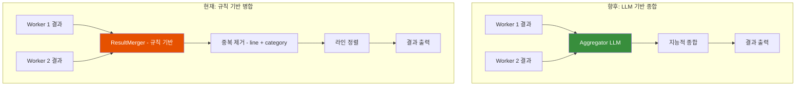

| 구분 | 현재 (규칙 기반) | 향후 (LLM 기반) |
|------|-----------------|----------------|
| **병합 방식** | line + category로 중복 제거 | LLM이 지능적으로 종합 |
| **충돌 해결** | 더 긴 reasoning 선택 | LLM이 맥락 고려하여 결정 |
| **Cross-chunk 이슈** | ❌ 탐지 불가 | ✅ Aggregator가 탐지 |
| **False Positive** | ❌ 필터링 없음 | ✅ 전체 컨텍스트에서 필터링 |
| **속도** | 빠름 (규칙) | 느림 (LLM 1회 추가 호출) |

---

#### Aggregator LLM이란?

**Aggregator LLM**은 여러 Worker의 분석 결과를 **하나의 LLM이 종합**하는 방식입니다.

**왜 필요한가?**
- 각 Worker는 **자기 chunk만** 봅니다 (전체 파일을 모름)
- 규칙 기반 병합은 "같은 라인, 같은 카테고리면 중복"이라는 **단순 규칙**만 적용
- **맥락을 이해하는 판단**이 불가능

**구현 방식** (향후):
```
[Aggregator 프롬프트 예시]

당신은 코드 리뷰 결과를 종합하는 전문가입니다.
아래는 같은 파일의 서로 다른 부분을 분석한 결과입니다.

## Worker 1 결과 (lines 1-100):
- Line 45: memory-safety - "malloc without free"

## Worker 2 결과 (lines 80-180):
- Line 120: memory-safety - "free without null check"
- Line 95: performance - "unnecessary copy"

## Worker 3 결과 (lines 160-260):
- Line 180: memory-safety - "double free possible"

다음을 수행하세요:
1. 중복된 이슈가 있으면 하나로 통합
2. chunk 경계에서 놓친 이슈가 있는지 확인 (예: Worker 1의 malloc이 Worker 2에서 free되는가?)
3. 전체 맥락에서 오탐(False Positive)인 이슈 제거
4. 최종 이슈 목록 출력
```

---

#### Cross-chunk 이슈란?

**Cross-chunk 이슈**는 코드가 **여러 chunk에 걸쳐** 있어서 개별 Worker가 탐지하지 못하는 버그입니다.

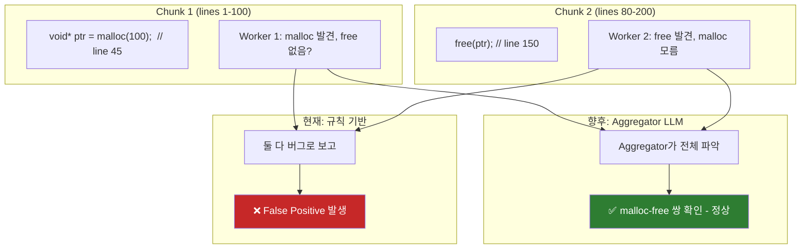

**구체적 예시**:
| 상황 | 현재 (규칙) | 향후 (Aggregator) |
|------|------------|------------------|
| Chunk 1에서 `malloc`, Chunk 2에서 `free` | 각각 "leak", "dangling" 보고 (오탐) | 쌍으로 인식 → 정상 판정 |
| Chunk 1에서 `lock`, Chunk 2에서 `unlock` 없음 | Chunk 1만 보고 "lock ok" | 전체 보고 "deadlock 가능성" 탐지 |
| 같은 이슈를 Worker 1, 2가 다르게 설명 | 둘 다 보고 (중복) | 하나로 통합, 더 나은 설명 선택 |

---

### 3.3 현재 구현 상태

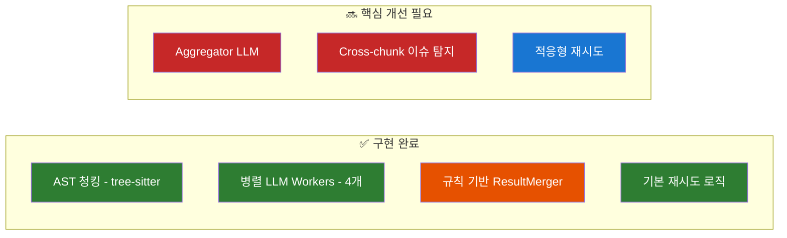

**현재 한계**:
- ResultMerger가 **규칙 기반**이라 지능적 판단 불가
- Chunk 경계에서 발생하는 이슈를 **놓칠 수 있음**
- 전체 파일 맥락에서 False Positive를 **걸러내지 못함**

---

## 4. 프롬프팅 전략

LLM의 성능은 **어떻게 질문하느냐**에 크게 좌우됩니다. 5가지 프롬프팅 기법을 실험하여 최적 전략을 찾았습니다.

---

### 4.1 기법별 성능 비교

| 기법 | F1 Score | Latency | 특징 |
|------|----------|---------|------|
| **Zero-shot** | 0.526 | 7.15s | 예시 없이 직접 질문 |
| **Few-shot-3** | 0.588 | 7.12s | 3개 예시 제공 |
| **Few-shot-5** | 0.615 | 8.15s | **프로덕션 권장** ⭐ |
| **Chain-of-Thought** | 0.571 | 23.94s | 단계별 추론 요청 |
| **Hybrid** | 0.634 | 32.76s | **최고 정확도** |

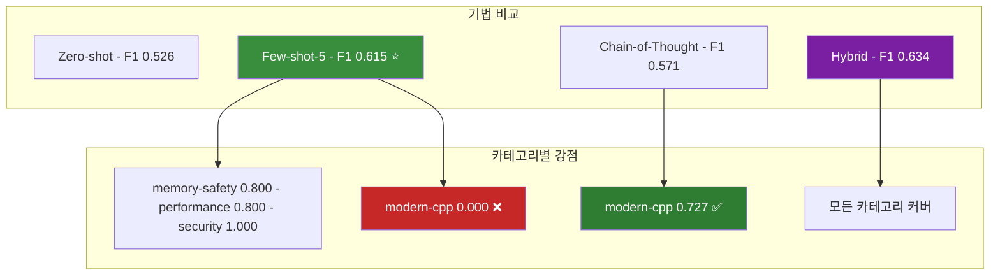

위 다이어그램은 **각 기법의 강점과 약점**을 보여줍니다:
- **Few-shot-5**: 대부분 카테고리에서 우수하나 modern-cpp 탐지 실패
- **Chain-of-Thought**: modern-cpp에서 압도적 (0.727 vs 0.000)
- **Hybrid**: 두 기법 결합으로 모든 카테고리 커버

---

### 4.2 Hybrid 기법 상세

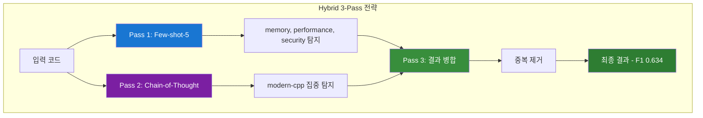

**트레이드오프**: 4배 느리지만 최고 정확도 → 중요한 PR에만 사용 권장

---

## 5. AST 기반 청킹

로컬 LLM은 **컨텍스트 길이가 제한**됩니다 (DeepSeek: ~4096 토큰). 700줄 C++ 파일은 약 5000 토큰으로 한계를 초과합니다.

---

### 5.1 문제와 해결 접근법

| 방법 | 장점 | 단점 |
|------|------|------|
| **단순 줄 분할** | 구현 쉬움 | 함수 중간에 잘림, 문맥 손실 |
| **AST 청킹** (현재) | 의미 단위 보존 | tree-sitter 필요 |
| **Semantic 청킹** (향후) | 완전한 문맥 | clangd 필요, 느림 |

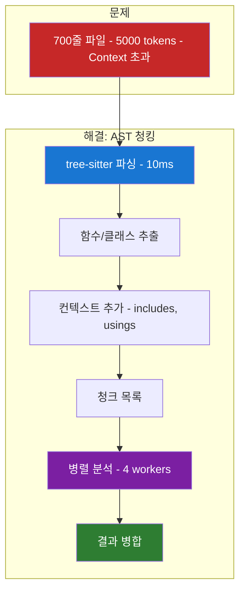

위 다이어그램은 **AST 청킹 프로세스**를 보여줍니다:
1. **tree-sitter 파싱**: 10ms로 매우 빠름
2. **함수/클래스 추출**: 의미 단위로 분할
3. **컨텍스트 추가**: 모든 청크에 includes, usings 포함
4. **병렬 분석**: 4개 워커로 동시 처리
5. **결과 병합**: 중복 제거 + 라인 번호 조정

---

### 5.2 현재 구현: tree-sitter 기반

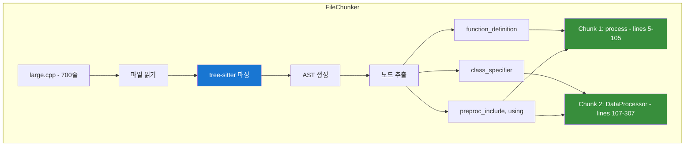

**성능**:
- 파싱 속도: **10ms** (clangd는 1-2초)
- 의존성: 없음 (compile_commands.json 불필요)
- 정확도: Syntax 레벨 (Semantic 정보 없음)

---

### 5.3 병렬 분석 및 결과 병합

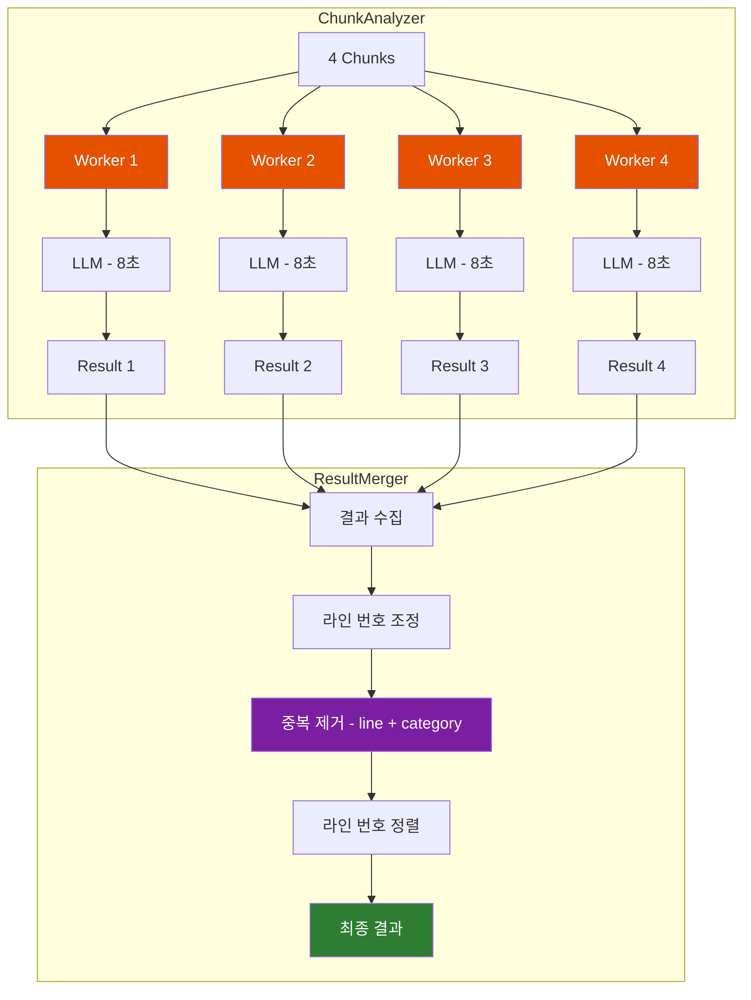

**성능 향상**:
- 순차 처리: 4 chunks × 8초 = **32초**
- 병렬 처리 (4 workers): **~10초** (3.2배 빠름)

---

## 6. 실험 및 검증

모든 기법은 **Ground Truth 데이터셋**으로 객관적으로 평가했습니다.

---

### 6.1 실험 인프라

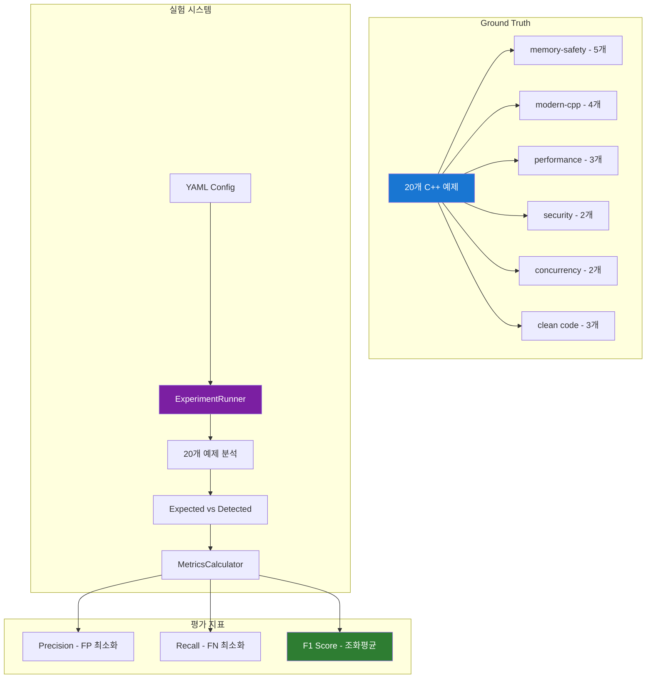

---

### 6.2 기법별 실험 결과

| 기법 | Precision | Recall | F1 Score | Latency |
|------|-----------|--------|----------|---------|
| Zero-shot | 0.625 | 0.455 | 0.526 | 7.15s |
| Few-shot-3 | 0.625 | 0.556 | 0.588 | 7.12s |
| **Few-shot-5** | **0.667** | **0.571** | **0.615** | 8.15s |
| Chain-of-Thought | 0.571 | 0.571 | 0.571 | 23.94s |
| **Hybrid** | **0.684** | **0.591** | **0.634** | 32.76s |

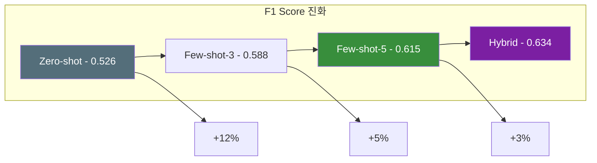

---

### 6.3 카테고리별 분석

| 카테고리 | Few-shot-5 | Chain-of-Thought | 비고 |
|----------|------------|------------------|------|
| memory-safety | 0.800 | 0.833 | 둘 다 우수 |
| performance | 0.800 | 0.500 | Few-shot 우위 |
| security | 1.000 | 0.667 | Few-shot 우위 |
| concurrency | 0.571 | 0.400 | Few-shot 우위 |
| **modern-cpp** | **0.000** | **0.727** | CoT 압도적 |

**핵심 발견**: modern-cpp 카테고리는 **단계별 추론(CoT)**이 필수

---

## 7. 향후 계획

이 프로젝트는 **아직 완료되지 않았습니다**. 향후 다양한 개선이 가능합니다.

---

### 7.1 전체 로드맵

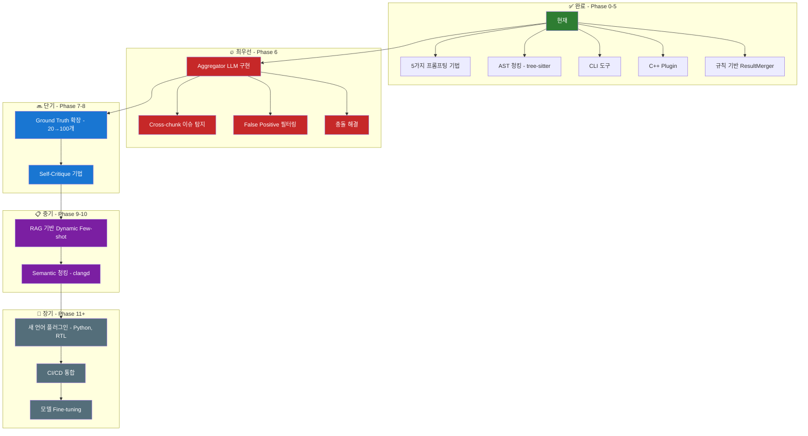

**최우선 과제: Aggregator LLM**

현재 가장 큰 한계는 **규칙 기반 ResultMerger**입니다. Aggregator LLM을 구현하면:
- **Cross-chunk 이슈**: chunk 경계에서 놓친 버그 탐지
- **False Positive 필터링**: 전체 파일 맥락에서 오탐 제거
- **충돌 해결**: Worker들의 상충되는 판단을 지능적으로 결정

---

### 7.2 오케스트레이션 개선

| 개선 항목 | 현재 | 향후 | 예상 효과 |
|----------|------|------|----------|
| **결과 병합** | 규칙 기반 ResultMerger | **Aggregator LLM** | **정확도 +25%** |
| Cross-chunk | 탐지 불가 | Aggregator가 탐지 | False Negative -30% |
| 기법 선택 | 고정 (Few-shot-5) | 적응형 | 정확도 +10% |
| 에러 처리 | 단순 재시도 | 적응형 재시도 | 안정성 +50% |
| 캐싱 | 없음 | 결과 캐싱 | 속도 10x (반복 분석) |

---

### 7.3 청킹 개선

| 개선 항목 | 현재 | 향후 | 예상 효과 |
|----------|------|------|----------|
| 파서 | tree-sitter (Syntax) | clangd (Semantic) | 컨텍스트 +30% |
| 청크 크기 | 고정 (200줄) | 적응형 | 효율성 +20% |
| 컨텍스트 | includes만 | 관련 함수 시그니처 | 정확도 +15% |
| 그룹핑 | 없음 | 호출 관계 기반 | False Negative -20% |

---

### 7.4 프롬프팅 개선

| 개선 항목 | 현재 | 향후 | 예상 효과 |
|----------|------|------|----------|
| Few-shot | 고정 5개 | Dynamic (RAG) | 정확도 +15% |
| 검증 | 없음 | Self-Critique | Precision +20% |
| 출력 | JSON only | 구조화된 추론 | 설명 품질 향상 |

---

### 7.5 이상적인 파이프라인 설계

> 현재 구현은 **기본 뼈대**입니다. 아래는 6가지 기술을 적용한 **이상적인 파이프라인**입니다.

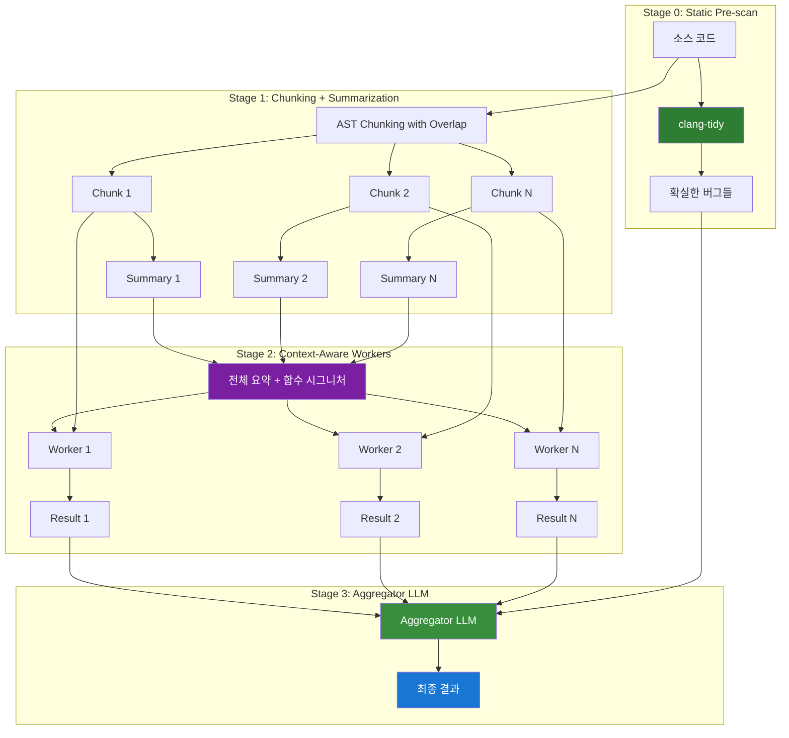

**현재 vs 이상적 비교**:

| Stage | 이상적 구조 | 현재 구현 | Gap |
|-------|-----------|----------|-----|
| 0 | clang-tidy Pre-scan | ❌ 없음 | 추가 필요 |
| 1 | 겹침 청킹 + 요약 | 기본 청킹만 | 겹침/요약 추가 |
| 2 | 맥락 포함 Workers | 맥락 없음 | 시그니처 추가 |
| 3 | Aggregator LLM | 규칙 병합 | LLM으로 대체 |

---

### 7.6 향후 적용 기술 요약

| 순위 | 기술 | 문제 해결 | 효과 |
|------|------|----------|------|
| 1 | **Aggregator LLM** | Worker 결과를 LLM이 종합 | 정확도 +25% |
| 2 | **Sliding Window Overlap** | chunk 겹침으로 경계 이슈 탐지 | 경계 이슈 80%↓ |
| 3 | **Function Signature Context** | 다른 함수 시그니처 제공 | 맥락 +30% |
| 4 | **Hierarchical Summarization** | chunk 요약 공유 | Cross-chunk 50%↓ |
| 5 | **clang-tidy Hybrid** | 정적 분석 + LLM 결합 | 속도 30%↑ |
| 6 | **Two-Phase Analysis** | 의심 영역만 정밀 분석 | 토큰 50%↓ |

> 📎 각 기술의 상세 설명은 **PRESENTATION_APPENDIX.md** 참조

---

### 7.7 기대 효과 요약

| 영역 | 현재 | 목표 | 개선율 |
|------|------|------|--------|
| **F1 Score** | 0.634 | 0.80+ | +26% |
| **Cross-chunk 탐지** | 0% | 80%+ | +∞ |
| **False Positive** | ~30% | ~10% | -67% |
| **Ground Truth** | 20개 | 100개 | 5x |
| **지원 언어** | 1개 | 4개 | 4x |

**Aggregator LLM 도입 시 예상 개선**:
- Cross-chunk 이슈 탐지로 **Recall 대폭 향상**
- 전체 파일 맥락 분석으로 **False Positive 감소**
- 총 LLM 호출 증가 (N chunks + 1 aggregator) → 속도 다소 저하 (trade-off)

---

## 📊 발표 마무리

### 1분 요약

> **"이 프로젝트는 보안 환경에서 LLM 코드 리뷰를 가능하게 합니다.**
>
> **문제**: 외부 API 사용 불가 + 로컬 LLM은 긴 인풋에서 퀄리티 급락
>
> **해결**: AST 청킹 → 병렬 LLM Workers → 결과 병합
>
> **성과**: F1 0.526 → 0.634 (20%↑)
>
> **향후**: Aggregator LLM 등 6가지 기술로 F1 0.80+ 목표"

### 핵심 수치

| 지표 | 현재 | 목표 |
|------|------|------|
| F1 Score | 0.634 | 0.80+ |
| 분석 속도 | 8초 | - |
| 병렬 효과 | 4x | - |

### 향후 핵심 과제

1. **Aggregator LLM** - Worker 결과를 LLM이 종합
2. **Sliding Window** - 겹침 청킹으로 경계 이슈 탐지
3. **clang-tidy Hybrid** - 정적 분석과 LLM 결합

