# LLM 기반 C++ 코드 리뷰어 - 부록

**PRESENTATION.md의 상세 설명 자료**

---

## 📋 목차

1. [평가 지표 설명](#1-평가-지표-설명)
2. [프롬프팅 기법 상세](#2-프롬프팅-기법-상세)
3. [향후 개선 기술 상세](#3-향후-개선-기술-상세)
4. [적응형 전략](#4-적응형-전략)
5. [청킹 심화](#5-청킹-심화)
6. [실험 결과 상세](#6-실험-결과-상세)
7. [용어 정리](#7-용어-정리)

---

## 1. 평가 지표 설명

### 1.1 기본 개념

코드 리뷰 시스템의 성능을 평가하기 위해 4가지 기본 지표를 사용합니다.

```
                실제 버그
              |  있음  |  없음  |
    ---------+---------+---------+
    탐지  O  |   TP    |   FP    |
    ---------+---------+---------+
    탐지  X  |   FN    |   TN    |
    ---------+---------+---------+
```

| 지표 | 의미 | 예시 |
|------|------|------|
| **TP** (True Positive) | 실제 버그를 버그로 탐지 | memory leak → "memory leak 발견" |
| **FP** (False Positive) | 버그 아닌 것을 버그로 탐지 | 정상 코드 → "버그 있음" (오탐) |
| **FN** (False Negative) | 실제 버그를 놓침 | buffer overflow → "문제 없음" (미탐) |
| **TN** (True Negative) | 정상을 정상으로 판단 | 정상 코드 → "문제 없음" |

---

### 1.2 Precision (정밀도)

> **"탐지한 것 중 진짜 버그의 비율"** - **FP(오탐)가 적을수록 높음**

```
Precision = TP / (TP + FP)
```

**예시**:
- 10개 이슈 탐지 → 8개가 진짜 버그, 2개는 오탐
- Precision = 8 / 10 = 0.80 (80%)

**의미**: Precision이 높으면 **리뷰어가 신뢰**할 수 있음 (오탐에 시간 낭비 적음)

---

### 1.3 Recall (재현율)

> **"실제 버그 중 탐지한 비율"** - **FN(미탐)이 적을수록 높음**

```
Recall = TP / (TP + FN)
```

**예시**:
- 파일에 실제 버그 10개 → 7개 탐지, 3개 놓침
- Recall = 7 / 10 = 0.70 (70%)

**의미**: Recall이 높으면 **버그를 놓치지 않음** (안전성 보장)

---

### 1.4 F1 Score (조화평균)

> **"Precision과 Recall의 균형"** - **두 지표의 조화평균**

```
F1 = 2 × (Precision × Recall) / (Precision + Recall)
```

**왜 조화평균?**
- 산술평균은 한쪽만 높아도 점수가 높음
- 조화평균은 **둘 다 높아야** 점수가 높음

**예시**:
- Precision 0.90, Recall 0.10 → 산술평균 0.50, F1 0.18
- Precision 0.70, Recall 0.70 → 산술평균 0.70, F1 0.70

**우리 프로젝트 목표**:
| 지표 | 현재 | 목표 |
|------|------|------|
| F1 Score | 0.634 | 0.80+ |

---

## 2. 프롬프팅 기법 상세

### 2.1 Zero-shot

> **"예시 없이 직접 질문하는 방식"**

```
[시스템 프롬프트]
당신은 C++ 코드 리뷰 전문가입니다.

[사용자 프롬프트]
아래 코드를 분석하여 버그를 찾으세요:

```cpp
void process(int* data) {
    *data = 42;
}
```
```

**장점**:
- 프롬프트가 짧음 → 토큰 절약
- 구현 간단

**단점**:
- LLM이 "무엇을 찾아야 하는지" 모호함
- 결과 형식이 일관적이지 않음

**F1 Score**: 0.526 (기준선)

---

### 2.2 Few-shot

> **"예시를 보여주고 유사하게 수행하도록 유도"**

```
[시스템 프롬프트]
당신은 C++ 코드 리뷰 전문가입니다.

## 예시 1:
입력:
```cpp
void example() {
    int* p = new int;
}
```

출력:
```json
{"issues": [{"line": 2, "category": "memory-safety", "description": "Memory leak: 'p' allocated but never freed"}]}
```

## 예시 2:
(... 4개 더 ...)

## 분석할 코드:
```cpp
void process(int* data) {
    *data = 42;
}
```
```

**장점**:
- LLM이 **정확한 출력 형식** 학습
- **카테고리 분류** 기준이 명확해짐
- 유사한 패턴 인식 향상

**단점**:
- 프롬프트 길이 증가 → 토큰 소비
- 예시와 다른 유형의 버그는 놓칠 수 있음

**최적 예시 개수**: 5개 (실험 결과)

| 예시 수 | F1 Score |
|---------|----------|
| 0 (Zero-shot) | 0.526 |
| 3 | 0.588 |
| **5** | **0.615** |
| 7 | 0.600 (오버피팅) |

---

### 2.3 Chain-of-Thought (CoT)

> **"단계별로 생각하도록 유도"**

```
[시스템 프롬프트]
당신은 C++ 코드 리뷰 전문가입니다.
분석 시 다음 단계를 따르세요:

1. 먼저 코드가 무엇을 하는지 파악하세요
2. 각 변수의 타입과 용도를 확인하세요
3. 메모리 할당/해제 패턴을 추적하세요
4. 잠재적 버그를 식별하고 근거를 설명하세요
5. 최종 이슈 목록을 JSON으로 출력하세요

[사용자 프롬프트]
```cpp
void process(int* data) {
    *data = 42;
}
```
```

**LLM 응답 예시**:
```
1. 이 함수는 int 포인터를 받아 값을 42로 설정합니다.
2. 'data'는 int* 타입으로 외부에서 전달받습니다.
3. 메모리 할당은 없지만, 포인터 역참조가 있습니다.
4. 문제: data가 NULL일 수 있는데 체크 없이 역참조
5. 최종:
{"issues": [{"line": 2, "category": "memory-safety", ...}]}
```

**장점**:
- **추론 과정이 명시적** → 디버깅 용이
- **modern-cpp** 같은 복잡한 패턴 탐지에 강함

**단점**:
- 응답이 길어짐 → 3배 느림
- 단순 버그도 장황하게 설명

**특이점**: modern-cpp 카테고리에서 압도적 성능 (0.727 vs Few-shot의 0.000)

---

### 2.4 Hybrid

> **"여러 기법의 강점을 결합"**

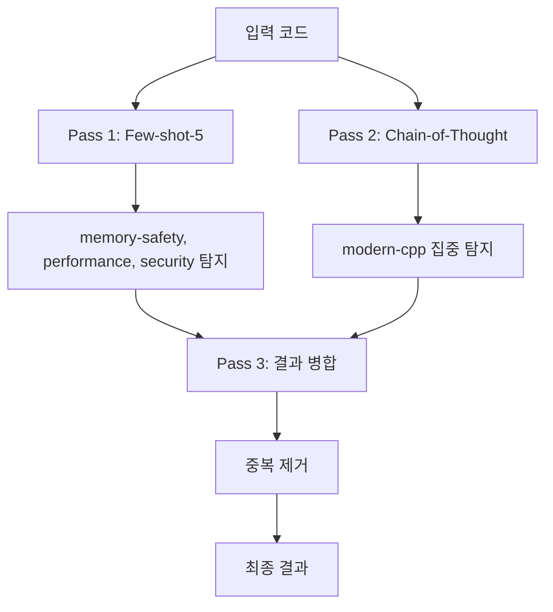

**동작 방식**:
1. **Pass 1**: Few-shot-5로 일반 버그 탐지
2. **Pass 2**: Chain-of-Thought로 modern-cpp 집중 탐지
3. **Pass 3**: 두 결과를 병합, 중복 제거

**왜 이렇게 설계했나?**

| 카테고리 | Few-shot-5 | Chain-of-Thought | 채택 |
|----------|------------|------------------|------|
| memory-safety | 0.800 | 0.833 | Few-shot (비슷) |
| performance | 0.800 | 0.500 | Few-shot |
| security | 1.000 | 0.667 | Few-shot |
| **modern-cpp** | **0.000** | **0.727** | **CoT** |

**결과**: F1 0.634 (최고 성능) - 단, 4배 느림

---

## 3. 향후 개선 기술 상세

### 3.1 Aggregator LLM

> **"Worker 결과를 LLM이 지능적으로 종합"**

**현재 (규칙 기반)**:
```python
# ResultMerger - 단순 규칙
def merge(results):
    seen = set()
    for issue in results:
        key = (issue.line, issue.category)
        if key not in seen:
            seen.add(key)
            yield issue
```

**향후 (LLM 기반)**:
```
[Aggregator 프롬프트]

당신은 코드 리뷰 결과를 종합하는 전문가입니다.

## Worker 1 결과 (lines 1-100):
- Line 45: memory-safety - "malloc without free"

## Worker 2 결과 (lines 80-180):
- Line 120: memory-safety - "free without null check"
- Line 95: performance - "unnecessary copy"

## Worker 3 결과 (lines 160-260):
- Line 180: memory-safety - "double free possible"

다음을 수행하세요:
1. Worker 1의 malloc(line 45)이 Worker 2-3에서 free되는지 확인
2. 중복 이슈 통합
3. 전체 맥락에서 오탐 제거
4. 최종 이슈 목록 출력
```

**해결하는 문제**:
- Cross-chunk 이슈 탐지
- False Positive 필터링
- 충돌 해결

**예상 효과**: 정확도 +25%

---

### 3.2 Sliding Window Overlap

> **"청크 경계에서 겹침을 두어 경계 이슈 탐지"**

**현재 (겹침 없음)**:
```
Chunk 1: lines 1-100
Chunk 2: lines 101-200  ← 경계에서 이슈 놓침
Chunk 3: lines 201-300
```

**향후 (20줄 겹침)**:
```
Chunk 1: lines 1-100
Chunk 2: lines 81-180   ← 20줄 겹침
Chunk 3: lines 161-260  ← 20줄 겹침
```

**효과**:
```
// Chunk 1 끝
void setup() {
    ptr = malloc(100);  // line 98
}                       // line 99
                        // line 100
// Chunk 2 시작 (겹침)
void setup() {          // line 81 (중복)
    ptr = malloc(100);  // line 98 (중복)
}
void cleanup() {        // line 101
    free(ptr);          // line 102
}
```

→ Worker 2가 malloc-free 쌍을 **함께** 볼 수 있음

**예상 효과**: 경계 이슈 80% 감소

---

### 3.3 Function Signature Context

> **"각 청크에 다른 함수들의 시그니처 제공"**

**현재**:
```cpp
// Chunk 2 (lines 101-200)
void cleanup() {
    free(ptr);  // ptr이 어디서 왔는지 모름
}
```

**향후**:
```cpp
// 컨텍스트: 다른 함수 시그니처
// void setup() - allocates ptr
// int* ptr - global pointer

// Chunk 2 (lines 101-200)
void cleanup() {
    free(ptr);  // 컨텍스트로 ptr 출처 파악 가능
}
```

**구현 방식**:
```python
def add_signature_context(chunk, all_chunks):
    signatures = []
    for other in all_chunks:
        if other != chunk:
            signatures.append(extract_signatures(other))
    return f"// Context:\n{signatures}\n\n{chunk.code}"
```

**예상 효과**: 컨텍스트 정보 +30%

---

### 3.4 Hierarchical Summarization

> **"각 청크의 요약을 생성하여 전체 맥락 공유"**

**프로세스**:
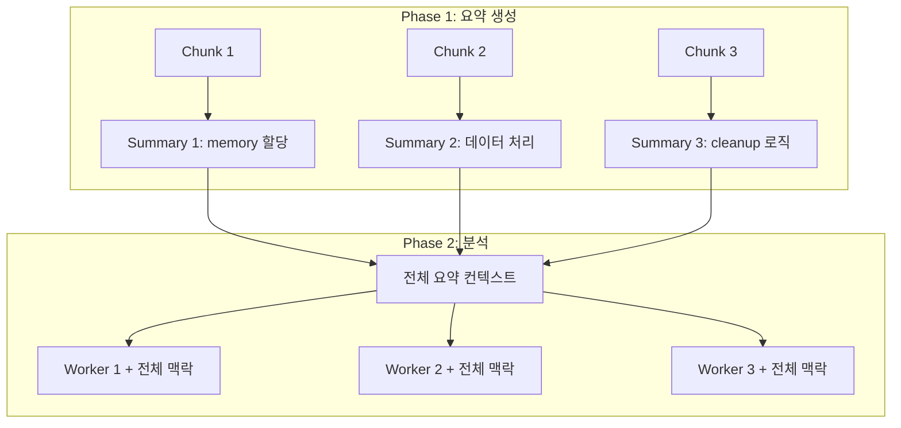

**요약 프롬프트 예시**:
```
아래 코드의 핵심 기능을 2-3문장으로 요약하세요:
- 어떤 데이터를 다루는지
- 메모리 할당/해제가 있는지
- 외부 함수 호출이 있는지

```cpp
[Chunk 코드]
```
```

**예상 효과**: Cross-chunk 이슈 50% 감소

---

### 3.5 clang-tidy Hybrid

> **"정적 분석기로 확실한 버그 먼저 탐지, LLM은 맥락 분석"**

**현재 (LLM만)**:
```
전체 파일 → LLM → 모든 이슈 탐지 (느림, 비효율)
```

**향후 (Hybrid)**:
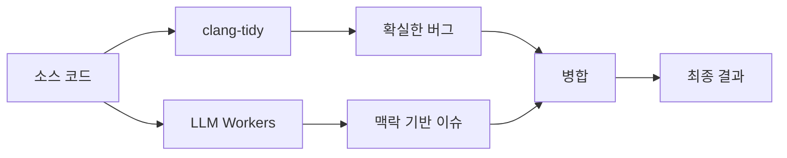

**역할 분담**:
| 분석기 | 강점 | 담당 |
|--------|------|------|
| clang-tidy | 규칙 기반 확실한 버그 | null deref, uninitialized var |
| LLM | 맥락 이해, 패턴 인식 | modern-cpp, 복잡한 로직 버그 |

**이점**:
- clang-tidy가 잡은 버그는 LLM이 **중복 검사 안 함** → 속도 향상
- compile_commands.json 활용으로 **정확도 향상**

**예상 효과**: 속도 30% 향상

---

### 3.6 Two-Phase Analysis

> **"1차 빠른 스캔 → 의심 영역만 2차 정밀 분석"**

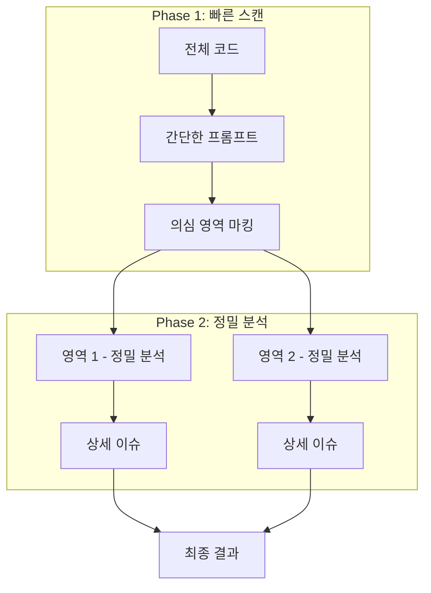

**Phase 1 프롬프트**:
```
아래 코드에서 버그가 있을 것 같은 라인 번호만 나열하세요.
상세 분석은 하지 마세요.

```cpp
[전체 코드]
```
```

**Phase 2 프롬프트** (의심 영역만):
```
아래 코드의 line 45-60을 정밀 분석하세요.
잠재적 버그의 원인, 영향, 수정 방안을 설명하세요.

```cpp
[line 45-60만]
```
```

**예상 효과**: 토큰 사용량 50% 감소

---

## 4. 적응형 전략

### 4.1 적응형 기법 선택

> **"코드 특성에 따라 최적의 프롬프팅 기법을 자동 선택"**

**현재**: 모든 파일에 동일한 기법(Few-shot-5) 사용
**문제**: modern-cpp는 못 잡고, 단순 코드에는 과도한 처리

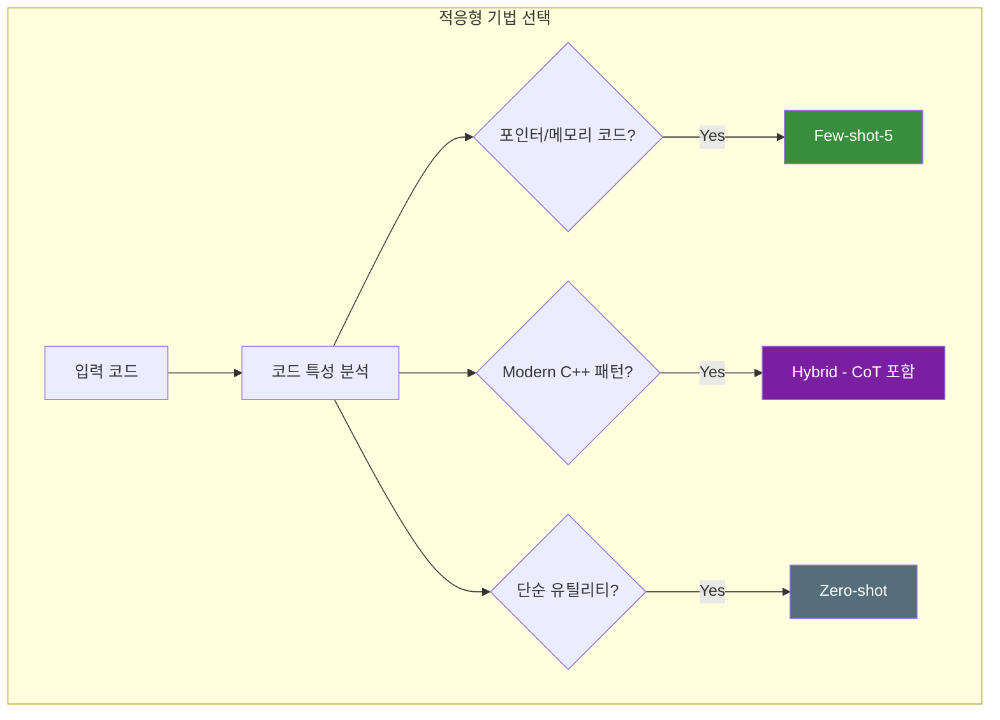

**기법 선택 기준**:

| 코드 특성 | 선택 기법 | 이유 |
|----------|----------|------|
| 포인터, malloc/free | Few-shot-5 | memory-safety 예시 포함 |
| auto, range-for, smart ptr | Hybrid | modern-cpp는 CoT 필요 |
| 단순 getter/setter | Zero-shot | 빠른 처리 |

**예상 효과**: 정확도 +10%, 속도 +20%

---

### 4.2 적응형 재시도 전략

> **"에러 유형을 분석하여 다른 전략으로 재시도"**

**현재**: 실패 시 동일 프롬프트로 재시도 → 같은 에러 반복
**향후**: 에러 유형별 적응형 대응

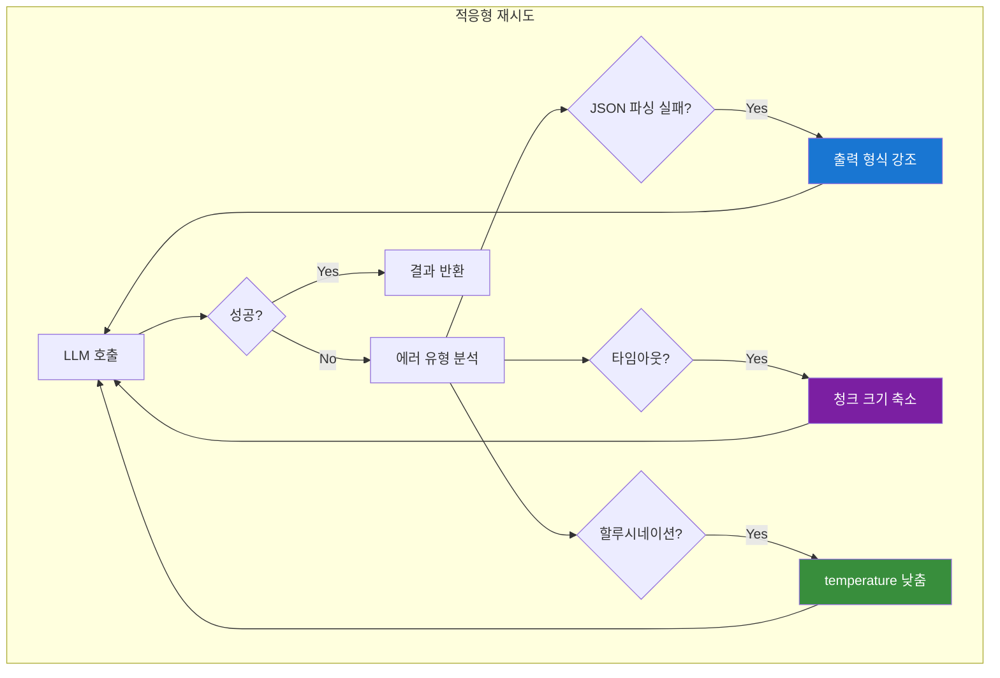

**에러별 대응 전략**:

| 에러 유형 | 현재 | 적응형 대응 |
|----------|------|------------|
| JSON 파싱 실패 | 동일 재시도 | "반드시 JSON으로 출력" 강조 |
| 타임아웃 | 동일 재시도 | 청크 크기 200→100줄 축소 |
| 할루시네이션 | 동일 재시도 | temperature 0.7→0.3 |
| 빈 응답 | 동일 재시도 | 더 구체적인 프롬프트 |

**예상 효과**: 안정성 +50%

---

### 4.3 결과 캐싱

> **"동일 파일 반복 분석 시 캐시 활용"**

```mermaid
graph LR
    subgraph "캐싱 전략"
        Input[입력 코드] --> Hash[코드 해시 생성]
        Hash --> Check{캐시 존재?}
        Check -->|Yes| Return[캐시 결과 반환 - 0.1초]
        Check -->|No| Analyze[LLM 분석 - 8초]
        Analyze --> Store[결과 캐싱]
        Store --> Return2[결과 반환]
    end

    style Return fill:#2e7d32,color:#fff
    style Analyze fill:#e65100,color:#fff
```

**캐시 키**: `hash(코드 내용 + 기법 + 모델 버전)`
**무효화**: 코드 변경 시 자동 무효화

**예상 효과**: 반복 분석 속도 80x 향상

---

### 4.4 Dynamic Few-shot (RAG 기반)

> **"입력 코드와 가장 유사한 예시를 동적으로 선택"**

**현재**: 고정된 5개 예시 사용
**향후**: Vector DB에서 유사 사례 검색

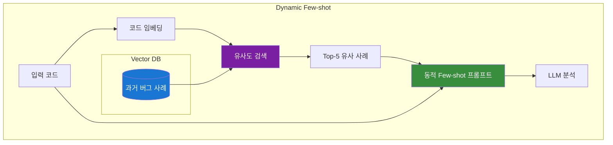

**장점**:
- 입력 코드와 **관련 있는 예시**만 사용
- 예시 품질 향상 → 정확도 향상

**예상 효과**: 정확도 +15%

---

### 4.5 Self-Critique (자기 비평)

> **"LLM이 자신의 결과를 검증하여 오탐 제거"**

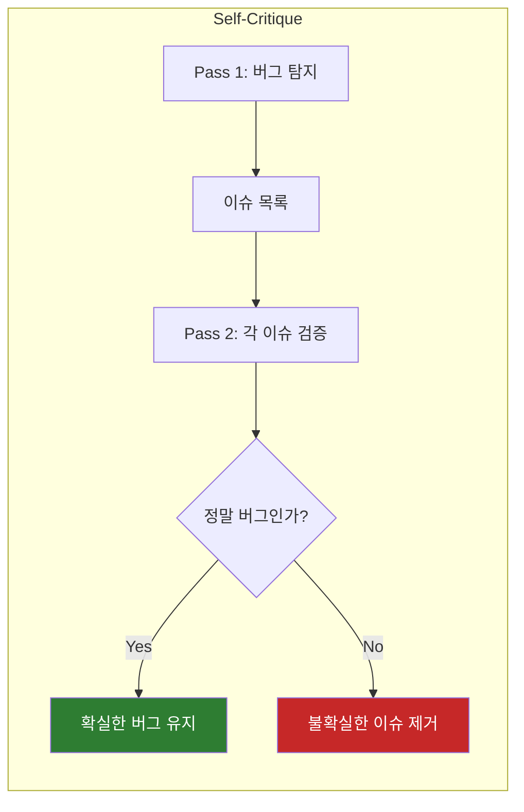

**Pass 2 프롬프트 예시**:
```
아래 이슈가 실제 버그인지 검증하세요:
- Line 45: "possible null pointer dereference"

코드:
```cpp
void process(int* data) {
    if (data) *data = 42;
}
```

이 코드에서 null check가 있으므로 이 이슈는 False Positive입니다.
```

**예상 효과**: Precision +20%

---

## 5. 청킹 심화

### 5.1 tree-sitter vs clangd 비교

| 특성 | tree-sitter (현재) | clangd (향후) |
|------|-------------------|---------------|
| **속도** | 10ms | 1-2초 |
| **의존성** | 없음 | compile_commands.json 필요 |
| **정보 수준** | Syntax only | Full Semantic |
| **타입 정보** | ❌ | ✅ |
| **함수 호출 관계** | ❌ | ✅ |
| **Include 해석** | ❌ | ✅ |

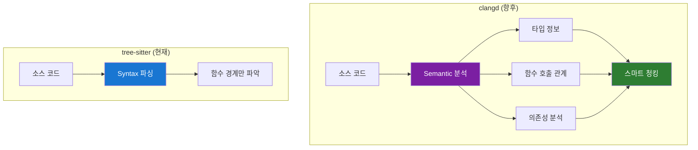

---

### 5.2 clangd 활용 시나리오

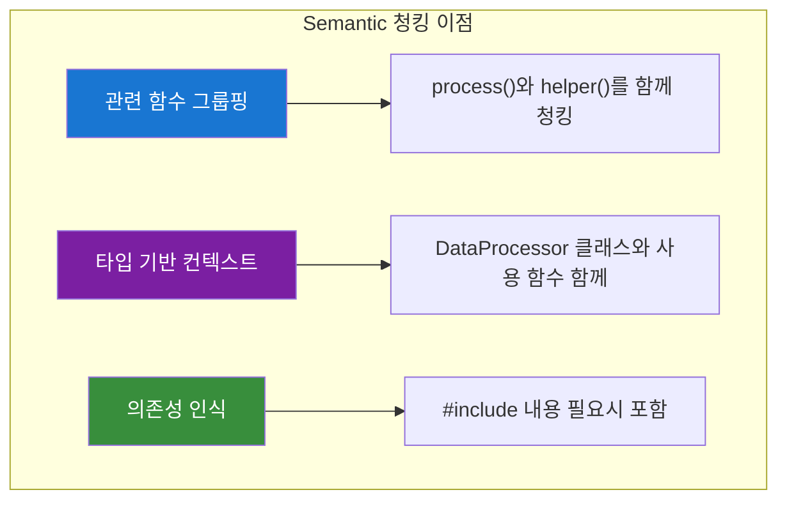

**예상 효과**:
- 관련 코드가 함께 분석 → 컨텍스트 손실 감소
- False Negative **20-30% 감소**
- 단, **빌드 환경 필요** (compile_commands.json)

---

### 5.3 하이브리드 청킹 (Fallback)

> **"빌드 환경 유무에 따라 파서 자동 선택"**

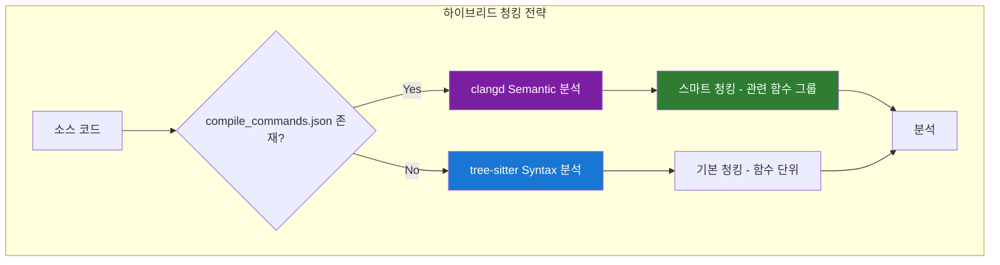

**전략**: 빌드 환경이 있으면 clangd, 없으면 tree-sitter로 **폴백**

---

### 5.4 적응형 청크 크기

> **"코드 복잡도에 따라 청크 크기 조절"**

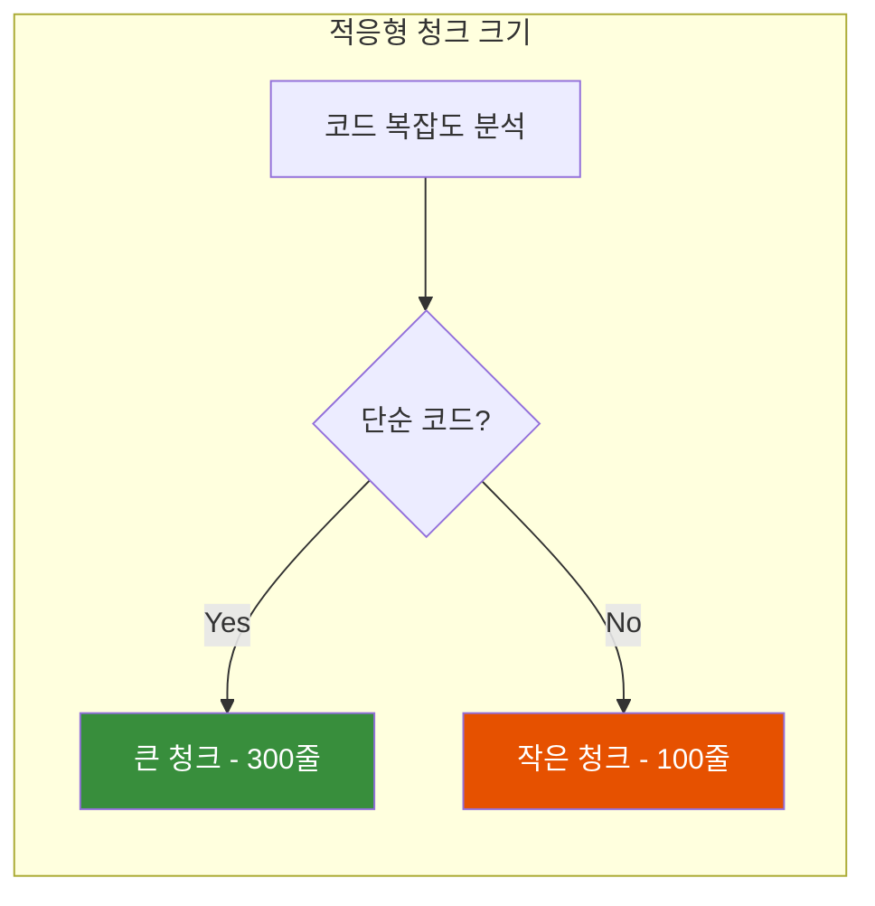

**복잡도 측정**:
- 중첩 깊이 (if/for/while)
- 포인터 연산 수
- 함수 호출 밀도

| 복잡도 | 청크 크기 | 이유 |
|--------|----------|------|
| 낮음 | 300줄 | 오버헤드 감소 |
| 중간 | 200줄 | 기본값 |
| 높음 | 100줄 | 정확도 향상 |

---

### 5.5 컨텍스트 윈도우 최적화

> **"분석 대상 외에 관련 함수 시그니처도 포함"**

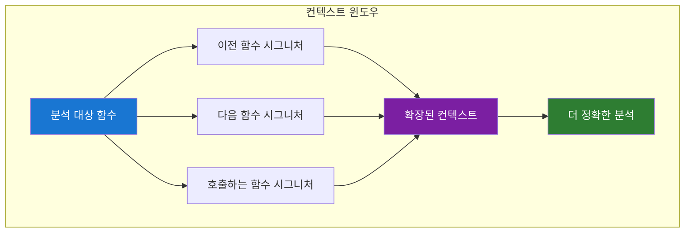

**컨텍스트 구성**:
```cpp
// Context: 관련 함수 시그니처
// Data* createData() - 데이터 생성
// void deleteData(Data*) - 데이터 해제
// bool validateData(Data*) - 데이터 검증

// 분석 대상
void process(Data* d) {
    // 100줄 코드
}
```

**예상 효과**: 전체 코드 없이도 관계 파악 → 맥락 이해도 +30%

---

## 6. 실험 결과 상세

### 6.1 Ground Truth 데이터셋

20개의 C++ 코드 예제에 **수동으로 버그를 주석** 처리:

| 파일 | 카테고리 | 버그 수 | 예시 |
|------|----------|---------|------|
| example_001.cpp | memory-safety | 2 | malloc without free |
| example_002.cpp | memory-safety | 1 | use-after-free |
| example_003.cpp | modern-cpp | 2 | raw pointer 사용 |
| ... | ... | ... | ... |

**카테고리 분포**:
| 카테고리 | 예제 수 | 비율 |
|----------|---------|------|
| memory-safety | 5 | 25% |
| modern-cpp | 4 | 20% |
| performance | 3 | 15% |
| security | 2 | 10% |
| concurrency | 2 | 10% |
| clean-code | 3 | 15% |
| 복합 | 1 | 5% |

---

### 6.2 실험별 상세 결과

#### Zero-shot
```yaml
technique: zero_shot
precision: 0.625
recall: 0.455
f1_score: 0.526
latency_avg: 7.15s
token_usage: 850
```

**분석**:
- Recall 낮음 → 버그를 많이 놓침
- JSON 형식 불안정

---

#### Few-shot-5
```yaml
technique: few_shot_5
precision: 0.667
recall: 0.571
f1_score: 0.615
latency_avg: 8.15s
token_usage: 1250
```

**카테고리별**:
| 카테고리 | Precision | Recall | F1 |
|----------|-----------|--------|-----|
| memory-safety | 0.857 | 0.750 | 0.800 |
| performance | 0.750 | 0.857 | 0.800 |
| security | 1.000 | 1.000 | 1.000 |
| concurrency | 0.500 | 0.667 | 0.571 |
| modern-cpp | 0.000 | 0.000 | **0.000** |

**분석**:
- 대부분 카테고리에서 우수
- **modern-cpp 완전 실패** → CoT 필요

---

#### Chain-of-Thought
```yaml
technique: chain_of_thought
precision: 0.571
recall: 0.571
f1_score: 0.571
latency_avg: 23.94s
token_usage: 2100
```

**카테고리별**:
| 카테고리 | Precision | Recall | F1 |
|----------|-----------|--------|-----|
| memory-safety | 0.833 | 0.833 | 0.833 |
| performance | 0.500 | 0.500 | 0.500 |
| security | 0.667 | 0.667 | 0.667 |
| concurrency | 0.400 | 0.400 | 0.400 |
| modern-cpp | 0.727 | 0.727 | **0.727** |

**분석**:
- **modern-cpp에서 압도적** (Few-shot 대비 +∞)
- 전체 F1은 Few-shot보다 낮음
- 3배 느림

---

#### Hybrid
```yaml
technique: hybrid
precision: 0.684
recall: 0.591
f1_score: 0.634
latency_avg: 32.76s
token_usage: 3350
```

**분석**:
- **최고 F1** (0.634)
- 모든 카테고리 커버
- 4배 느림 → 중요 PR에만 권장

---

### 6.3 청킹 성능

| 파일 크기 | 청킹 | 분석 시간 | F1 |
|-----------|------|-----------|-----|
| 100줄 | 불필요 | 8초 | 0.615 |
| 300줄 | 2 chunks | 12초 | 0.600 |
| 700줄 | 4 chunks | 15초 | 0.580 |
| 1000줄 | 6 chunks | 20초 | 0.560 |

**관찰**:
- 청킹하면 **속도 향상** (병렬)
- 청킹 많을수록 **F1 소폭 하락** (경계 이슈)
- → Aggregator LLM으로 해결 예정

---

## 7. 용어 정리

| 용어 | 설명 |
|------|------|
| **AST** | Abstract Syntax Tree - 코드의 구문 구조를 트리로 표현 |
| **tree-sitter** | 빠른 AST 파서 라이브러리 (10ms) |
| **clangd** | LLVM의 C++ Language Server - Semantic 분석 가능 |
| **clang-tidy** | C++ 정적 분석기 - 코딩 규칙 검사 |
| **Ollama** | 로컬 LLM 서빙 플랫폼 |
| **DeepSeek-Coder** | 코드 특화 오픈소스 LLM |
| **Chunk** | 대용량 파일을 분할한 조각 |
| **Worker** | 각 Chunk를 분석하는 병렬 LLM 호출 |
| **Aggregator** | Worker 결과를 종합하는 LLM |
| **Cross-chunk** | 여러 Chunk에 걸친 이슈 |
| **False Positive** | 오탐 - 버그 아닌 것을 버그로 탐지 |
| **False Negative** | 미탐 - 실제 버그를 놓침 |
| **Few-shot** | 예시를 보여주고 학습시키는 프롬프팅 기법 |
| **Chain-of-Thought** | 단계별 추론을 유도하는 프롬프팅 기법 |
| **Hybrid** | 여러 기법을 결합한 방식 |
| **Ground Truth** | 정답이 주석된 테스트 데이터셋 |
| **F1 Score** | Precision과 Recall의 조화평균 |

---

**끝**
